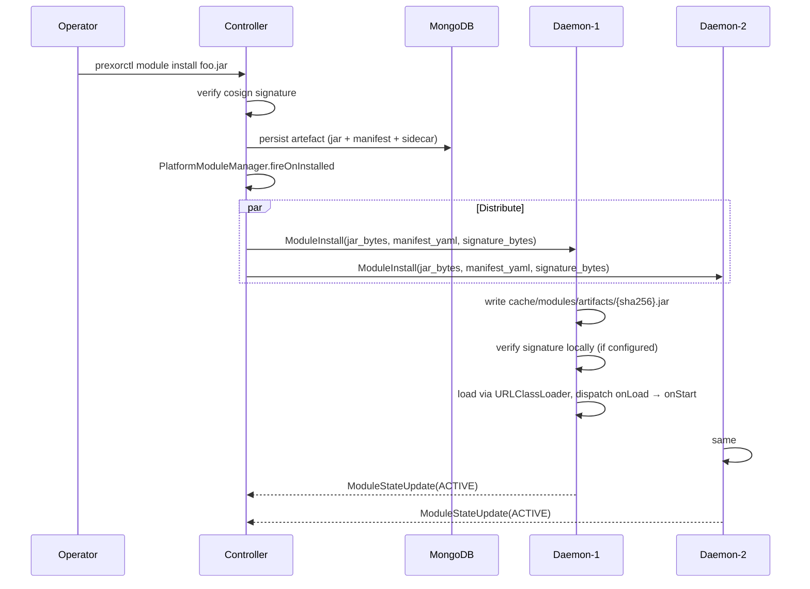
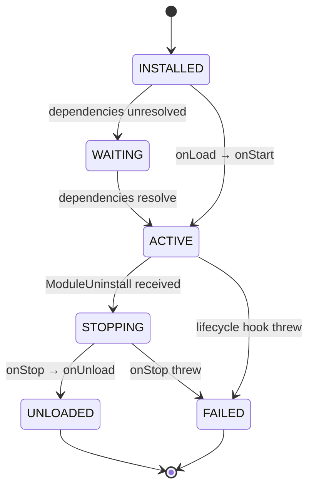

Until v1, the only place you could load custom JVM code into a running
PrexorCloud cluster was the controller. Platform modules
(`PlatformModule`) were the answer to "I want to add a REST route, a
capability, a MongoDB collection, or a dashboard page." That covered
the majority of extension shapes we had seen — but it left a real gap.
A platform module cannot mutate JVM args before a Minecraft instance
starts, cannot react to instance exit on the host the exit happened on,
cannot expose a node-local capability to other code on the same daemon.
Anything that needed to run *near the workload* had to be done by
forking the daemon.

v1 closes that gap. Layer 7 of the API overhaul shipped daemon-side
modules: a new `DaemonModule` interface in `cloud-api`, a controller-
side `ModuleDistributor` that fans installs out to every connected
daemon over gRPC, a `DaemonEventForwarder` that bridges controller
events to daemon-local subscribers without polling, and four instance-
lifecycle hooks that make node-local logic possible without forking.
This post is the engineering walk-through. The
[concept page](/concepts/modules/daemon/) is the contract; this is the
design context.

## What this post covers

- The Layer 6 limit: why the platform-module-only model wasn't enough.
- The `DaemonModule` interface and its instance-lifecycle hooks.
- The control plane: `ModuleDistributor` plus the gRPC frames that
  carry it.
- The lifecycle FSM on the daemon and the classloader rules.
- The event bridge: subscribe-registration, no firehose.
- A worked example: per-group JVM flag injection.
- Trade-offs vs. platform modules — when to pick which.

The reference implementation lives across `cloud-api`,
`cloud-controller`, `cloud-daemon`, and `cloud-cloud-modules:runtime`.

## The Layer 6 limit

Pre-v1, a module author had exactly one host: the controller. The
manifest listed a single entrypoint, the lifecycle manager loaded it
into the controller JVM, and the only way to influence host-local
behaviour was through indirect mechanisms — REST routes the operator
manually called, capability handles other modules consumed, or audit
log entries someone read after the fact.

That works for a lot of features. The
[`stats-aggregator` reference module](https://github.com/prexorjustin/prexorcloud/tree/main/java/cloud-modules/stats-aggregator)
is a platform module — REST routes, MongoDB-backed storage,
capability registration, frontend manifest — and it does not need to
touch the daemon. But four shapes of work fell outside it:

- **JVM tuning per group.** Adding `-Xlog:gc*` to the lobby's launch
  command, enabling `-XX:+HeapDumpOnOutOfMemoryError` for a crash-prone
  `bedwars` group, injecting a profiling agent before a specific
  instance starts. The composition plan was not the right place — those
  are operator-facing config — and the daemon hard-coded the launch
  command shape.
- **Sidecar attachment.** Starting a process on the host that watches a
  Minecraft instance, when it boots, and tearing it down when the
  instance exits. The daemon was the only thing that knew the
  instance's PID; modules could not get at it.
- **Node-local observation.** Reading the host's `/proc` for a
  PrexorCloud instance, exporting per-host metrics, or capturing
  process exit signatures the daemon's exit-code classifier did not
  recognise. The daemon owned the host context; nothing else did.
- **Per-host capability exposure.** A module that wanted to expose a
  capability whose implementation depended on the host (a disk-IO
  tracker, a GPU presence flag) had to either ship a controller-side
  shim that round-tripped over gRPC or fork the daemon.

Each of those was a real request. Forking the daemon was the only
answer. We did not want that to be the answer at v1.

## Introducing DaemonModule

The `DaemonModule` interface is defined in `cloud-api`, alongside the
existing `PlatformModule`. It is symmetric on the lifecycle hooks and
adds the four instance-lifecycle methods that platform modules cannot
have:

```java
public interface DaemonModule {
    void onLoad(ModuleContext ctx);
    void onStart(ModuleContext ctx);
    void onStop(ModuleContext ctx);
    void onUnload(ModuleContext ctx);
    default void onUpgrade(ModuleContext ctx) {}

    // Instance lifecycle hooks
    default void onInstanceStarting(InstanceSpec spec) {}
    default void onInstanceStarted(InstanceHandle handle) {}
    default void onInstanceStopping(InstanceHandle handle) {}
    default void onInstanceStopped(InstanceHandle handle, ExitInfo exit) {}

    default Set<CapabilityBinding<?>> capabilityHandles() { return Set.of(); }
}
```

The four lifecycle hooks (`onLoad`, `onStart`, `onStop`, `onUnload`)
follow the same
[lifecycle FSM](/concepts/modules/lifecycle/) as platform modules.
The instance hooks are unique to daemons:

| Hook | When | What you get |
|---|---|---|
| `onInstanceStarting` | Right before `ProcessBuilder.start()` | Mutable `InstanceSpec` — add to `jvmArgs()` and `env()` |
| `onInstanceStarted` | After the JVM is up | Read-only `InstanceHandle(instanceId, group, port, pid, startedAt, state)` |
| `onInstanceStopping` | Before `process.stop()` | Same `InstanceHandle` |
| `onInstanceStopped` | After process exit | `InstanceHandle` plus `ExitInfo(exitCode, durationMs, crashed, crashSummary)` |

The `InstanceSpec` passed to `onInstanceStarting` is *mutable*. The
daemon reads back the `jvmArgs` and `env` mutations into a fresh
`ResolvedStartSpec` before launch. A daemon module that adds
`-XX:+HeapDumpOnOutOfMemoryError` for one specific group does so
transparently — the
[composition plan](/concepts/deployments/) is unchanged, the controller
does not need to know, and another controller failing over does not
need to replicate the mutation. The mutation is *local to the host*,
which is the entire point.

A misbehaving module cannot abort instance lifecycle. Every dispatch
into a daemon module is wrapped in try / catch plus an SLF4J warn so
the daemon continues even if your module throws. We made that
non-negotiable: a buggy module must not stop instances from starting.

## The control plane: ModuleDistributor and gRPC

Daemon modules ride the same install pipeline as platform modules.
There is one CLI entry point:

```bash
prexorctl module install my-module.jar
```

The controller stores the jar in MongoDB-backed module artefacts,
verifies its signature against the configured trust root, and
transitions the module through the same lifecycle FSM as a platform
module. After a successful install, the `ModuleDistributor` fans the
jar bytes plus manifest YAML out to *every* connected daemon over the
bidirectional gRPC stream. Daemons whose received manifest does not
list `daemon` as a host ignore the install locally — the controller
does not pre-filter per daemon. That is a deliberate choice; it keeps
the controller's distributor logic dumb and pushes the
host-applicability check to the host that will (or will not) run the
module.



Three things to note:

- **Content-addressed cache.** The daemon's `DaemonModuleStore` writes
  the jar to `cache/modules/artifacts/{sha256}.jar`. Re-pushes are
  idempotent; same content, same sha256, no rewrite. If a daemon
  reconnects after a brief outage and the controller re-distributes,
  the daemon recognises the artefact and skips the load if it is
  already running.
- **Late-joiner handshake.** A daemon that connects later receives the
  full set of daemon-host modules via `syncDaemon(nodeId)` on
  handshake. Operators do not have to chase down newly-bootstrapped
  hosts — the controller pushes everything matching the `daemon` host
  flag at handshake time.
- **Signature verification at the daemon, too.** When the daemon has
  an optional signature verifier configured, it writes the inbound jar
  plus signature sidecar to a temp directory as siblings (the on-disk
  shape `TrustRootVerifier` and `CosignBundleVerifier` expect) and
  runs `verify()` before commit. The verifier package
  (`cloud-security/signing`) is shared between controller and daemon —
  see [Security](/concepts/security/) for the configuration surface.

The new gRPC frames are additive. `ControllerMessage` gained
`ModuleInstall (12)`, `ModuleUninstall (13)`, and `ModuleEvent (14)`.
`DaemonMessage` gained `ModuleStateUpdate (14)`, `EventSubscribe (15)`,
and `EventUnsubscribe (16)`. The
[java/cloud-protocol/contracts/proto-contracts.sha256](https://github.com/prexorjustin/prexorcloud/blob/main/java/cloud-protocol/contracts/proto-contracts.sha256)
hash reflects the new wire shape; the `PROTOCOL_VERSION` constant did
not bump because every change is an additive oneof variant.

## Lifecycle hooks on the daemon

The daemon-side lifecycle FSM is the same as the controller's:



Every state transition is reported back to the controller as a
`ModuleStateUpdate` frame. The controller persists the last-known
state per node; the dashboard's module page reflects per-node state in
real time via the SSE event bus.

The daemon-side lifecycle is driven by a `DaemonModuleAdapter` that
wraps the `DaemonModule` so the lifted `ModuleLifecycleManager` (in
`cloud-cloud-modules:runtime`, shared with the controller) can drive it as
though it were a `PlatformModule`. The adapter is a pure translation
layer — `onRegisterRoutes` is a no-op because the daemon has no
Javalin instance, and the rest of the methods route directly to the
underlying `DaemonModule` calls.

The classloader rules are non-negotiable. Each daemon module loads in
its own `URLClassLoader` whose parent is a `FilteringParentClassLoader`
that exposes only:

- `java.*`, `javax.*`, `jdk.*`, `sun.*` — the JDK.
- `org.slf4j.*` — the logging facade. Module authors get SLF4J at the
  top of their files and nothing else.
- `me.prexorjustin.prexorcloud.api.*` — the public `cloud-api`
  surface.

Anything else, including controller-internal types, daemon-internal
types, and other modules' classes, is invisible. Modules link to each
other only through the
[capability registry](/concepts/modules/capabilities/) — a named, typed
contract whose handle is resolved at runtime and which never leaks the
provider's classloader to the consumer.

This is the same rule the controller enforces. It is what lets you
upgrade, disable, or unload a daemon module without breaking the rest
of the system. On `ModuleUninstall`, the manager calls `onStop` then
`onUnload`, closes the classloader through try-with-resources around
the `LoadedRuntime.closeable`, and the GC reclaims the module's
classes.

## The event bridge

A daemon module subscribes to controller events the same way platform
modules do:

```java
@Override
public void onStart(ModuleContext ctx) {
    ctx.events().subscribe(GroupCreatedEvent.class, this::onGroupCreated);
}
```

Underneath, the daemon's `EventBus` is **subscribe-registered**. On
the first local subscribe to a class, the daemon sends `EventSubscribe`
to the controller. On the last unsubscribe (refcount per class), it
sends `EventUnsubscribe`. The controller's `DaemonEventForwarder` only
forwards events the daemon has asked for; there is no firehose.
Forwarded events are JSON-serialised via `ObjectMappers.standard()` and
sent over the existing gRPC stream as `ModuleEvent` frames.

Two operational properties matter here:

- **Reconnection is graceful.** On a brief stream loss, the daemon
  resubscribes locally to nothing — its in-process subscriptions are
  intact. When the stream reconnects, `DaemonEventBus.onReconnect()`
  re-sends the full set of currently-subscribed event types so the
  controller does not drift out of sync. The mechanism is a
  `ReconnectManager.addReconnectListener(Runnable)` extension point
  the daemon module subsystem hooks at boot.
- **Latency is bounded.** The integration test
  `DaemonModuleEventStreamTest` asserts ≤ 1.5 s wall-clock latency
  from controller publish to daemon dispatch. The target is ≤ 250 ms;
  the 1.5 s cap is harness boot and GC noise budget on shared CI. In
  steady-state on real hardware the dispatch is well under 250 ms.

The forwarder cleans up on disconnect. `DaemonServiceImpl.cleanup()`
calls `forwarder.onDisconnect(nodeId)` so the controller's `EventBus`
does not retain references to dead session observers — that bug
shipped in pre-v1 code and is fixed in v1.

## What ModuleContext exposes on the daemon

`ModuleContext` is the same interface as on the controller, but four
methods behave differently:

```java
ModuleHost host();                          // returns DAEMON
EventBus events();                          // controller-bridged
Logger logger();                            // SLF4J
TaskScheduler scheduler();                  // daemon-owned

Optional<ModuleDataStore> findMongoStorage();    // always Optional.empty()
Optional<ModuleRedisStorage> findRedisStorage(); // always Optional.empty()
ModuleDataStore requireMongoStorage();           // throws ISE
ModuleRedisStorage requireRedisStorage();        // throws ISE

CapabilityRegistry capabilities();          // node-local
```

**Daemons do not have storage.** This is a load-bearing constraint.
The persistent state of the cluster lives on the controller; the
daemon is stateless by design, which is what makes daemon
reconciliation on reconnect simple — the controller re-pushes
composition plans and the daemon applies them. If a daemon module
needs to remember something across instance starts, the
[concept page](/concepts/modules/daemon/) lists three honest options:

1. Bundle the module as a platform module too (declare both hosts in
   the manifest) and have the platform side persist; the daemon side
   reads capability handles.
2. Persist on a per-instance basis — the daemon owns the per-instance
   filesystem, write a file there.
3. Use the controller-bridged `EventBus` to publish to the controller,
   which routes to the matching platform module.

There is no daemon-side REST surface. `onRegisterRoutes` is a no-op on
daemon modules; the daemon does not run a Javalin instance. If you
want a REST surface for a feature your daemon module implements, the
answer is the paired-platform-module pattern in option 1.

## Node-local capabilities

The daemon's capability registry is **node-local**. Capabilities
registered on one host's daemon are visible only to other modules on
that same daemon — there is no cross-node visibility in v1.

```java
@Override
public Set<CapabilityBinding<?>> capabilityHandles() {
    return Set.of(
        CapabilityBinding.of("node.disk.io.tracker",
                             DiskIoTracker.class,
                             this::tracker)
    );
}
```

This is right when one daemon module exposes a node-local capability
another daemon module on the same host needs — a process-tracer module
exposing read-only stats to a sidecar-injector module, a GPU-presence
flag for a workload mutator. Cross-node visibility is deferred to v2,
and the constraint is documented in two places: the
[daemon module concept page](/concepts/modules/daemon/) and the
[capability registry concept page](/concepts/modules/capabilities/).

## Worked example: per-group JVM flag injection

The shortest motivating use case. A daemon module that adds GC
logging to the lobby and heap-dump-on-OOM to bedwars, applied on every
host without per-host config:

```java
public final class JvmFlagsModule implements DaemonModule {
    private static final Logger log = LoggerFactory.getLogger(JvmFlagsModule.class);

    private Map<String, List<String>> flagsByGroup = Map.of();

    @Override
    public void onLoad(ModuleContext ctx) {
        // load from a config file shipped with the module jar, or from
        // a controller-side platform module via a capability handle.
        flagsByGroup = Map.of(
            "lobby",   List.of("-Xlog:gc*:file=lobby-gc.log"),
            "bedwars", List.of("-XX:+HeapDumpOnOutOfMemoryError")
        );
    }

    @Override
    public void onInstanceStarting(InstanceSpec spec) {
        var extra = flagsByGroup.get(spec.group());
        if (extra != null) {
            spec.jvmArgs().addAll(extra);
            log.info("injected {} jvmArgs for {}", extra.size(), spec.instanceId());
        }
    }
}
```

The manifest:

```yaml
manifestVersion: 1
id: jvm-flags
version: 0.1.0
hosts: [daemon]
backend:
  daemon:
    entrypoint: com.example.JvmFlagsModule
```

That module ships from one operator command — `prexorctl module install
jvm-flags-0.1.0.jar` — applies on every host the controller knows
about, and stays consistent across reconnects without any per-host
configuration. A new host joining the cluster receives the module via
`syncDaemon(nodeId)` on handshake and starts applying the flags
immediately.

If you want the same module to fetch its config from a platform-side
module instead of bundling a config file, the answer is the
paired-host pattern: the same jar declares `hosts: [controller,
daemon]` with two entrypoints, the controller side owns the MongoDB
collection and the REST CRUD surface, and the daemon side reads the
config through a capability handle resolved against the controller's
capability registry. The `stats-aggregator` reference module does the
analogous thing on the controller side and the
[concept page](/concepts/modules/) explains the manifest
shape.

## Trade-offs vs. platform modules

When to write a platform module, when to write a daemon module, and
when to write both:

| Want | Module type |
|---|---|
| REST routes | Platform |
| MongoDB storage | Platform |
| Valkey storage | Platform |
| SSE-driven dashboard page | Platform |
| Mutate JVM args / env before launch | Daemon |
| React to instance start / stop on the host | Daemon |
| Per-host capability (disk IO, GPU) | Daemon |
| Persistent config + per-host application | Both — `hosts: [controller, daemon]` |
| Subscribe to a controller event from the host | Daemon (with the bridge) |
| Cross-node visibility for a capability | Not in v1 |

The deliberate trade-offs:

- **No daemon-side persistence.** This is the constraint that makes
  daemons replaceable. A daemon is stateless modulo its on-disk
  artefact cache and its in-flight processes; the controller can
  re-push everything else. Adding daemon-side persistence would mean
  adding daemon-side backup, daemon-side migration, and daemon-side
  consistency rules. We did not want that to be the v1 model.
- **No cross-node capability visibility.** A capability registered on
  daemon A is invisible to daemon B. The right model for cross-node
  visibility — a controller-mediated registry with consistency
  semantics, lease ownership, and a propagation latency budget — is a
  v2 conversation. v1 sticks to the easy and useful case.
- **No daemon-side REST.** Putting a Javalin server in every daemon
  would expose a second public surface on every host and double the
  auth surface area. The
  [security page](/concepts/security/) inventory is six public routes
  on the controller; we are not adding more on every daemon.

When in doubt, the rule of thumb is: if the work needs a process
running on the host the workload is on, it is a daemon module. If the
work needs durable state or an operator-facing surface, it is a
platform module. If it needs both, ship one jar with two entrypoints
and the manifest's `hosts: [controller, daemon]`.

## Where to go next

- [Daemon Modules concept page](/concepts/modules/daemon/) — the
  contract reference, including the full list of `ModuleContext`
  methods and the daemon-side signing config.
- [Module System orientation](/concepts/modules/) — platform
  vs. daemon, capabilities, manifest shape, signing.
- [Module Lifecycle](/concepts/modules/lifecycle/) — the FSM, the
  classloader rules, what cleanup runs on unload.
- [Capabilities](/concepts/modules/capabilities/) — registering and
  resolving capability handles, dynamic-handle behaviour on rebind.
