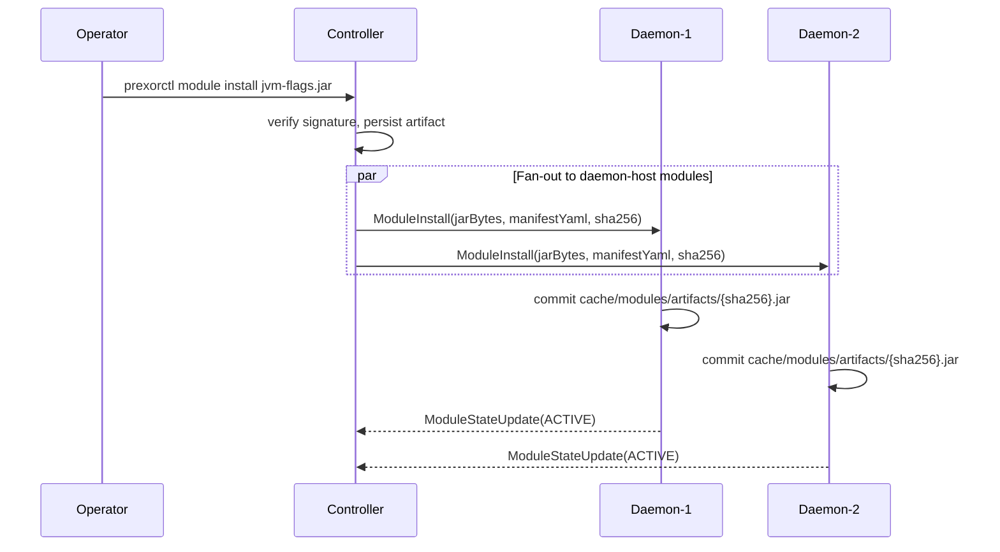
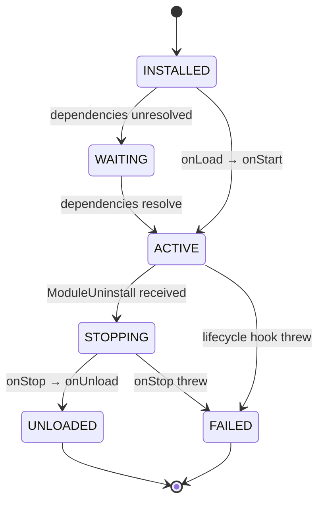

Until v1, the only place to load custom JVM code into a running
PrexorCloud cluster was the Controller. A platform Module
(`PlatformModule`) is the answer to "I want a REST route, a capability,
a MongoDB collection, or a dashboard page." That covers most extension
shapes — but it left a gap. A platform Module cannot mutate JVM args
before an Instance starts, cannot react to a process exit on the host
where it happened, and cannot expose a node-local capability to other
code on the same Daemon. Anything that has to run *next to the workload*
meant forking the Daemon.

v1 closes that gap with daemon modules: a `DaemonModule` interface in
`cloud-api`, a Controller-side `ModuleDistributor` that fans installs
out to every connected Daemon over gRPC, a controller-bridged event bus,
and four instance-lifecycle hooks. This is the engineering
walk-through. The [concept page](/concepts/modules/daemon/) is the
contract; this is the design context behind it.

The reference implementation lives across `cloud-api`,
`cloud-controller`, `cloud-daemon`, and the shared lifecycle runtime in
`cloud-modules:runtime`.

## What this post covers

- The platform-only limit: why one host was not enough.
- The `DaemonModule` interface and its instance-lifecycle hooks.
- The control plane: `ModuleDistributor` plus the gRPC frames.
- The lifecycle FSM on the Daemon and the classloader rules.
- The Capability API and the built-in `prexor.instance.files`.
- The event bridge: subscribe-registration, no firehose.
- A worked example, and the trade-offs vs. platform Modules.

## The platform-only limit

Pre-v1, a Module author had exactly one host: the Controller. The
manifest named one entrypoint, the lifecycle manager loaded it into the
Controller JVM, and the only way to influence host-local behavior was
indirect — a REST route the operator called, a capability another Module
consumed, or an audit-log entry someone read after the fact.

That works for plenty of features. The
[`stats-aggregator` reference Module](https://github.com/prexorjustin/prexorcloud/tree/main/java/cloud-modules/stats-aggregator)
is a platform Module — REST routes, MongoDB-backed storage, capability
registration, a frontend manifest — and it never touches the Daemon. But
four shapes of work fell outside it:

- **JVM tuning per Group.** Adding `-Xlog:gc*` to the lobby's launch,
  enabling `-XX:+HeapDumpOnOutOfMemoryError` for a crash-prone `bedwars`
  Group, injecting a profiler before a specific Instance starts. The
  composition plan was the wrong place — that is operator-facing
  config — and the Daemon hard-coded the launch command shape.
- **Sidecar attachment.** Starting a process on the host that watches an
  Instance when it boots and tears down when it exits. Only the Daemon
  knew the Instance's PID.
- **Node-local observation.** Reading the host's `/proc` for an
  Instance, exporting per-host metrics, or capturing exit signatures the
  Daemon's classifier did not recognize.
- **Per-host capability exposure.** A capability whose implementation
  depends on the host — a disk-IO tracker, a GPU-presence flag — had no
  home short of a Controller-side shim round-tripping over gRPC.

Each was a real request, and forking the Daemon was the only answer. We
did not want that to be the answer at v1.

## The DaemonModule interface

`DaemonModule` is defined in `cloud-api` alongside `PlatformModule`.
Every method is a `default` no-op that declares `throws Exception`, so
you override only the hooks you need:

```java
public interface DaemonModule {
    default void onLoad(ModuleContext context) throws Exception {}
    default void onStart(ModuleContext context) throws Exception {}
    default void onStop(ModuleContext context) throws Exception {}
    default void onUnload(ModuleContext context) throws Exception {}
    default void onUpgrade(ModuleContext context) throws Exception {}

    // Instance-lifecycle hooks
    default void onInstanceStarting(InstanceSpec spec) throws Exception {}
    default void onInstanceStarted(InstanceHandle handle) throws Exception {}
    default void onInstanceStopping(InstanceHandle handle) throws Exception {}
    default void onInstanceStopped(InstanceHandle handle, ExitInfo exit) throws Exception {}

    default List<CapabilityHandle<?>> capabilityHandles() { return List.of(); }
}
```

The lifecycle hooks (`onLoad` → `onStart` → `onStop` / `onUnload` /
`onUpgrade`) follow the same
[lifecycle FSM](/concepts/modules/lifecycle/) as platform Modules. The
instance hooks are unique to Daemons:

| Hook | When | Argument |
|---|---|---|
| `onInstanceStarting` | Before the process is built and spawned | mutable `InstanceSpec` |
| `onInstanceStarted` | After the process is spawned and a PID exists | read-only `InstanceHandle` |
| `onInstanceStopping` | Before the Daemon stops the process | read-only `InstanceHandle` |
| `onInstanceStopped` | After the process has exited | `InstanceHandle` plus `ExitInfo` |

Every active Module receives every hook for every Instance on the node.
There is no per-Group filtering at the framework level — branch on
`spec.group()` or `handle.group()` yourself.

### Mutating the launch

The `InstanceSpec` handed to `onInstanceStarting` is mutable, but only
in two fields:

```java
public final class InstanceSpec {
    String instanceId();
    String group();
    int port();
    int memoryMb();
    List<String> jvmArgs();    // mutable — add or remove entries
    Map<String,String> env();  // mutable — add or replace entries
    String platform();
    String platformVersion();
    String jarFile();
    String planHash();
}
```

After dispatch, `ProcessManager` copies the post-mutation `jvmArgs` and
`env` into a fresh `ResolvedStartSpec` and launches from that. The
[composition plan](/concepts/groups-instances-templates/) the Controller
sent is unchanged — the mutation is local to this host, for this launch.
That is the entire point: another Controller failing over does not need
to replicate it, and the operator-facing config stays clean.

`onInstanceStopped` also receives an `ExitInfo`:

```java
record ExitInfo(int exitCode, long durationMs, boolean crashed, String crashSummary) {}
```

One honest caveat: in the current `ProcessManager` wiring, `exitCode`
comes through as `0` and `crashSummary` as `null`. The load-bearing
fields today are `crashed` (the Daemon's crash detection) and
`durationMs` (the Instance's uptime). Treat the other two as reserved.

### A misbehaving Module cannot wedge the host

The `DaemonModule` Javadoc says throwing from `onInstanceStarting`
"aborts the start." The actual dispatcher, `DaemonModuleHost`, wraps
every instance-hook call in try/catch plus an SLF4J warn, so a throwing
Module is logged and skipped and the Instance still launches. We made
that non-negotiable: a buggy Module must not stop Instances from
starting. Do not depend on an exception to block a start — mutate
`InstanceSpec` instead.

## The control plane: ModuleDistributor and gRPC

Daemon modules ride the same install pipeline as platform Modules. There
is one entry point:

```bash
prexorctl module install jvm-flags-1.0.0.jar
```

The Controller stores the jar in MongoDB-backed Module artifacts,
verifies its signature against the configured trust root, and drives it
through the lifecycle FSM. After a successful install,
`ModuleDistributor` fans the jar bytes plus manifest out to *every*
connected Daemon. Only Modules whose manifest lists `daemon`
(`ModuleDistributor.isDaemonHost`) are pushed; a Daemon whose manifest
does not name it ignores the install locally. A send failure to one
Daemon is logged and skipped — every other Daemon still receives the
message.



Three things to note:

- **Content-addressed cache.** The Daemon's `DaemonModuleStore` writes
  the jar to `cache/modules/artifacts/{sha256}.jar`. `commit()`
  recomputes the SHA-256 and rejects a mismatch against the Controller's
  claimed hash, catching transport corruption. Re-pushing the same
  `(moduleId, sha256)` is idempotent; after each commit the store
  garbage-collects any artifact the index no longer references.
- **Late-joiner catch-up.** A Daemon that connects later does not need
  chasing. After a successful handshake the Controller calls
  `ModuleDistributor.syncDaemon(nodeId)`, re-pushing every stored
  daemon-host Module to that one session.
- **Signature verification at the Daemon too.** When a verifier is
  configured, `DaemonModuleManager` writes the inbound jar and its
  sidecar to a temp directory as siblings — the on-disk shape
  `TrustRootVerifier` and `CosignBundleVerifier` expect — and runs
  `verify()` before commit. A failed verification reports the Module
  `FAILED`; the jar is never activated. See [Security](/concepts/security/).

The new gRPC frames are additive. `ControllerMessage` gained
`ModuleInstall`, `ModuleUninstall`, and `ModuleEvent`; `DaemonMessage`
gained `ModuleStateUpdate`, `EventSubscribe`, and `EventUnsubscribe`.
Because every change is an additive oneof variant, the
`PROTOCOL_VERSION` constant did not bump; the
[`proto-contracts.sha256`](https://github.com/prexorjustin/prexorcloud/blob/main/java/cloud-protocol/contracts/proto-contracts.sha256)
hash reflects the new wire shape.

## Lifecycle and classloader rules on the Daemon

The daemon-side lifecycle FSM is the same as the Controller's:



Every transition is reported back as a `ModuleStateUpdate`; the
Controller persists the last-known state per node and the dashboard
reflects per-node state live over SSE.

A `DaemonModuleAdapter` wraps your `DaemonModule` so the shared
`ModuleLifecycleManager` (in `cloud-modules:runtime`, the same code the
Controller runs) can drive the lifecycle hooks as though it were a
`PlatformModule`. The instance hooks do not go through that adapter —
`DaemonModuleHost` holds the live `DaemonModule` reference and dispatches
them directly when the process layer fires.

The classloader rules are not negotiable. Each Module opens in its own
`URLClassLoader` whose parent is a filtering loader that resolves only:

```
java.  javax.  jdk.  sun.  org.slf4j.  me.prexorjustin.prexorcloud.api.
```

The JDK, SLF4J, and the public `cloud-api` surface cross the boundary;
Daemon internals, Controller internals, and other Modules' classes do
not. Everything else ships inside the Module jar. On uninstall the
manager runs `onStop` then `onUnload` and closes the classloader, so the
GC can reclaim the Module's classes. This is what lets you upgrade,
disable, or unload one Module without disturbing the rest.

## The Capability API

Because Modules cannot see each other's classes, they link through one
mechanism only: a **capability** — a named, typed contract whose
interface lives in `cloud-api`. A provider exports a handle; a consumer
resolves against the interface. The handle the consumer holds is a
dynamic proxy, so a provider can be upgraded under a live consumer
without restarting it. The full model is on
[Capabilities](/concepts/modules/capabilities/).

On the Daemon the registry is **node-local**: capabilities a Module
registers on one host are visible only to other Modules on that same
Daemon. Cross-node sharing is out of scope for v1. You export one with
`capabilityHandles()`:

```java
@Override
public List<CapabilityHandle<?>> capabilityHandles() {
    return List.of(
        CapabilityHandle.of("node.disk.io.tracker", DiskIoTracker.class, this.tracker));
}
```

`CapabilityHandle.of(id, type, value)` validates `value instanceof type`
at construction, so a provider cannot export a handle no consumer can
legally cast.

### The built-in: prexor.instance.files

Not every capability ships as a Module. The Controller registers
`prexor.instance.files` (type `InstanceFileAccess`, in `cloud-api`)
itself, under the reserved provider id `@controller`. It gives any Module
a read-only view into a running Instance's working directory *without
opening its own Daemon gRPC channel* — the Controller already holds the
channel, so the capability reuses it:

```java
InstanceFileAccess files =
    context.requireCapability(InstanceFileAccess.CAPABILITY_ID, InstanceFileAccess.class);

InstanceFileAccess.InstanceFileTree tree = files.walk(nodeId, group, instanceId);
InstanceFileAccess.InstanceFileBytes bytes =
    files.read(nodeId, group, instanceId, "config/server.properties", 4096);
if (bytes.ok()) {
    process(bytes.content());   // UTF-8 text
}
```

The bounds are deliberate and worth knowing before you build on it.
`walk` is capped Daemon-side at 5 000 entries and 24 directory levels.
`read` returns the first `maxBytes` bytes — pass `<= 0` for the Daemon
default of **64 KiB** — encoded as UTF-8, so treat the result as text.
That makes it a config-scope tool: region files, NBT, and world chunks
round-trip lossily and are out of scope. Errors never throw; an
unreachable Daemon or a missing Instance comes back as a populated
`error` tag (`DAEMON_UNREACHABLE`, `INSTANCE_NOT_FOUND`, `TIMEOUT`).

## The event bridge

A daemon Module subscribes to cluster events the same way every consumer
does, through `ctx.events()`:

```java
@Override
public void onStart(ModuleContext ctx) {
    ctx.events().subscribe(GroupCreatedEvent.class, this::onGroupCreated);
}
```

Underneath, the Daemon's `DaemonEventBus` is **subscribe-registered** —
there is no firehose. On the first local subscriber for an event class
the Daemon sends an `EventSubscribe` (carrying the fully-qualified class
name) to the Controller; on the last unsubscribe it sends an
`EventUnsubscribe`. The Controller's `DaemonEventForwarder` attaches
exactly one bus subscription per `(nodeId, eventType)` pair and forwards
only what the Daemon asked for, detaching everything on disconnect.

Two operational properties matter:

- **Reconnection is graceful.** A Module's in-process subscriptions
  survive a stream blip. When the stream reconnects,
  `DaemonEventBus.onReconnect()` re-sends `EventSubscribe` for the full
  current set, so the Controller rebuilds its per-Daemon map and does not
  drift.
- **Delivery is isolated.** A forwarded event arrives as a `ModuleEvent`
  envelope (event type = FQCN, payload = JSON via
  `ObjectMappers.standard()`); the Daemon resolves the class by name and
  runs each local handler on its own virtual thread. A throwing handler
  is logged, not propagated.

If the class is missing on the Controller's classpath, it returns an
`ErrorReport` (`EVENT_TYPE_UNKNOWN`) and skips that one type — the rest
of the batch still subscribes. See [Events](/concepts/events/) for the
taxonomy.

## What ModuleContext does not give the Daemon

`ModuleContext` is the same interface on both hosts, but on the Daemon
several methods deliberately do nothing:

- `findMongoStorage()` and `findRedisStorage()` always return
  `Optional.empty()`; `requireMongoStorage()` / `requireRedisStorage()`
  always throw. **Daemons carry no persistent store.**
- There is no daemon-side REST. The Daemon runs no Javalin, and route
  registration is a no-op for daemon Modules.

Statelessness is the constraint that keeps Daemons replaceable — the
Controller re-pushes composition plans and Modules on reconnect, so a
Daemon never has to be backed up or migrated. If a daemon Module must
remember something across Instance starts, pick one of three honest
options: ship a paired controller-side Module
(`hosts: [controller, daemon]`) and persist there; write per-Instance
state into the Instance's own working directory; or publish to the
controller-bridged event bus and let a controller-side subscriber
persist it.

## Worked example: per-group JVM flag injection

The shortest motivating case — a Module that adds GC logging to `lobby`
and heap-dump-on-OOM to `bedwars`, on every host, with no per-host
config:

```java
public final class JvmFlagsModule implements DaemonModule {
    private static final Logger log = LoggerFactory.getLogger(JvmFlagsModule.class);

    private Map<String, List<String>> flagsByGroup = Map.of();

    @Override
    public void onLoad(ModuleContext ctx) {
        flagsByGroup = Map.of(
            "lobby",   List.of("-Xlog:gc*:file=lobby-gc.log"),
            "bedwars", List.of("-XX:+HeapDumpOnOutOfMemoryError"));
    }

    @Override
    public void onInstanceStarting(InstanceSpec spec) {
        var extra = flagsByGroup.get(spec.group());
        if (extra != null) {
            spec.jvmArgs().addAll(extra);
            log.info("injected {} jvmArgs for {}", extra.size(), spec.instanceId());
        }
    }
}
```

The manifest at `META-INF/prexor/module.yaml`:

```yaml
manifestVersion: 1
id: jvm-flags
version: 1.0.0
hosts: [daemon]
backend:
  daemon:
    entrypoint: com.example.JvmFlagsModule
```

Install once. The Module fans out to every connected Daemon, applies on
each node's launches, and re-converges on any Daemon that reconnects
later. A new host joining the cluster receives it on handshake and starts
applying the flags immediately.

To fetch the flag map from a controller-side Module instead of bundling
it, declare `hosts: [controller, daemon]` with two entrypoints: the
controller side owns the MongoDB collection and a REST CRUD surface, and
the daemon side reads the config through a capability handle. The two
halves share no heap state; they communicate through capabilities and
forwarded events.

## Trade-offs vs. platform modules

When to write which:

| Want | Module type |
|---|---|
| REST routes | Platform |
| MongoDB or Valkey storage | Platform |
| SSE-driven dashboard page | Platform |
| Mutate JVM args / env before launch | Daemon |
| React to instance start / stop on the host | Daemon |
| Per-host capability (disk IO, GPU) | Daemon |
| Subscribe to a controller event from the host | Daemon (over the bridge) |
| Persistent config plus per-host application | Both — `hosts: [controller, daemon]` |
| Cross-node visibility for a capability | Not in v1 |

The deliberate trade-offs behind that table:

- **No daemon-side persistence.** This is what makes Daemons
  replaceable. A Daemon is stateless modulo its artifact cache and its
  in-flight processes; the Controller re-pushes everything else. Adding
  daemon persistence would mean adding daemon backup, migration, and
  consistency rules.
- **No cross-node capability visibility.** A capability on Daemon A is
  invisible to Daemon B. The right model — a Controller-mediated registry
  with consistency semantics, lease ownership, and a propagation budget —
  is a v2 conversation. v1 sticks to the easy, useful case.
- **No daemon-side REST.** A Javalin server in every Daemon would expose
  a second public surface and double the auth surface on every host. The
  Daemon stays a closed gRPC client.

The rule of thumb: if the work needs a process on the host the workload
runs on, it is a daemon Module. If it needs durable state or an
operator-facing surface, it is a platform Module. If it needs both, ship
one jar with two entrypoints.

## Where to go next

- [Daemon modules](/concepts/modules/daemon/) — the contract reference,
  including the full `ModuleContext` table and the signing config.
- [Module system](/concepts/modules/) — platform vs. daemon, manifest
  shape, signing.
- [Capabilities](/concepts/modules/capabilities/) — providers,
  consumers, dynamic handles, and `prexor.instance.files`.
- [Lifecycle](/concepts/modules/lifecycle/) — the FSM and the classloader
  rules in full.
- [Events](/concepts/events/) — the taxonomy carried over the bridge.
</content>
