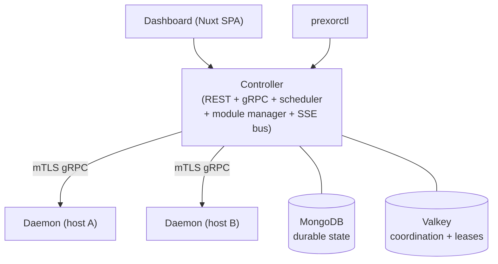
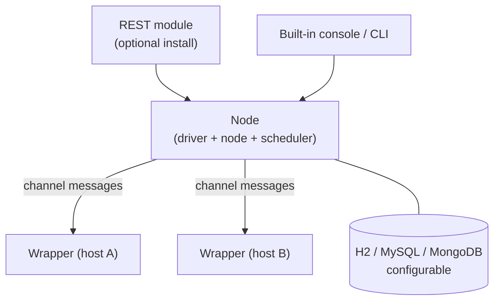

PrexorCloud and [CloudNet 4](https://github.com/CloudNetService/CloudNet) both
orchestrate Minecraft networks across multiple hosts, and at a 30-second
glance they overlap heavily — groups, templates, multi-platform support,
modules. Where they differ is operating posture. CloudNet 4 has years of
production miles behind it and a large community of operators familiar with
its module ecosystem. PrexorCloud is younger, was designed from day one
around mTLS, signed modules, lease-scoped HA, and a SSE-driven dashboard,
and ships a curated set of first-party modules rather than a sprawling
catalog. If you need the depth of a community module catalog and a track
record measured in years, CloudNet 4 is the safer pick. If you want a
production-grade security posture, signed-bundle install, and active-active
controllers as v1 features, PrexorCloud is built for that.

## Feature matrix

| Capability | PrexorCloud | CloudNet 4 | Notes |
|---|---|---|---|
| **License** | Apache 2.0 | Apache 2.0 ([source](https://github.com/CloudNetService/CloudNet)) | Both are permissively licensed OSS. |
| **Governance** | Single maintainer / small team | CloudNetService organisation, multiple maintainers ([source](https://github.com/CloudNetService)) | CloudNet has a longer-running community. |
| **Stable release** | v1.0 (2026) | 4.0.0 series, multiple RCs and stable releases since 2022 ([releases](https://github.com/CloudNetService/CloudNet/releases)) | CloudNet has more production miles. |
| **Server platforms** | Paper, Spigot, Purpur, Folia, Fabric, NeoForge | Paper, Bukkit, Sponge, Fabric, Nukkit, Minestom ([source](https://github.com/CloudNetService/CloudNet)) | Both cover a wide matrix; CloudNet adds Sponge, Minestom, and native Bedrock servers (Nukkit). |
| **Proxy platforms** | Velocity, BungeeCord, Waterfall | Velocity, BungeeCord, WaterDogPE ([source](https://github.com/CloudNetService/CloudNet)) | CloudNet adds the Bedrock-side WaterDogPE proxy. |
| **Bedrock support** | Yes — Geyser (`GEYSER` platform) with edition-aware routing (`bedrockLobbyGroup` / `bedrockFallbackGroups`) | Yes (Nukkit, WaterDogPE) | PrexorCloud bridges Bedrock through Geyser onto Java backends; CloudNet supports native Bedrock servers. |
| **Static groups** | Yes | Yes (`tasks`, `groups`) | Equivalent concept. |
| **Dynamic / auto-scaling groups** | Yes — weighted-scoring scheduler with per-group `min`, `max`, scaling rules, cooldowns | Yes — task-based dynamic services with `minServiceCount` / `maxServiceCount` | Different scaling models; both target the same outcome. |
| **Layered templates** | Yes — chain (`base → base-paper → group → user`) with SHA-256 versioned snapshots | Yes — template storage with multiple template targets per group ([REST module](https://github.com/CloudNetService/module-rest)) | PrexorCloud emphasises versioned snapshots and rollback. |
| **In-browser file editor** | Yes | Via third-party web UI ([example](https://github.com/docimin/cloudnet-webinterface)) | CloudNet 4's official web UI is community-maintained. |
| **Crash classification + loop detection** | Yes — exit-code analysis, console tail capture, auto-pause on crash loop | Yes — service crash logs are persisted | PrexorCloud's classifier feeds an explicit loop-detection state machine. |
| **Real-time event stream** | Server-Sent Events, 36 typed events, replay via `Last-Event-ID` | Internal channel-message system; no documented SSE/WebSocket in the REST module ([REST module](https://github.com/CloudNetService/module-rest)) | Different transports for similar use cases. |
| **REST API** | Hand-curated OpenAPI 3.1 spec, served by the controller | Provided by an installable REST module with OpenAPI ([source](https://github.com/CloudNetService/module-rest)) | CloudNet's REST is opt-in via module install. |
| **Operator auth** | JWT + bcrypt, optional email password reset, 48 RBAC permissions | JWT-based or ticket auth in `web-jwt-auth` / `web-ticket-auth` ([source](https://github.com/CloudNetService/module-rest)) | Both support JWT; PrexorCloud has built-in lockout + revocation. |
| **Daemon/wrapper auth** | mTLS with controller-issued certs and per-node revocation | Wrapper-node auth via shared connection key | PrexorCloud uses certificate-based mutual TLS by default. |
| **Plugin auth (server-side)** | Per-instance plugin tokens (`ptk_*`), short TTL, sequence-window replay protection | Wrapper-injected service identity | PrexorCloud isolates each instance behind its own credential. |
| **Module signing** | Cosign sign-blob bundles + offline Rekor SET, fail-closed in production | Modules are not signed by default | PrexorCloud requires signed bundles in production by default. |
| **Active-active HA** | Yes — lease-scoped work + fencing tokens via Valkey | "There can be only one controller running at a time" ([source](https://docs.simplecloud.app/concepts/controller/) — note: this quote is from SimpleCloud, but CloudNet 4 also documents single-node-controller architecture) | PrexorCloud documents active-active in v1; CloudNet 4 is single-controller. |
| **Persistence** | MongoDB (durable) + Valkey (coordination) | Embedded H2 by default, optional MySQL/MongoDB | Different storage trade-offs. |
| **Dashboard** | First-party Nuxt 4 SPA, SSE-driven | No first-party web UI in core; community-maintained projects ([example](https://github.com/docimin/cloudnet-webinterface)) | PrexorCloud ships an official dashboard. |
| **CLI** | `prexorctl` (Go, single static binary) with cosign-verified releases | Built-in console + CLI inside the node process | Different CLI shapes; both first-party. |
| **Module system (controller-side)** | `PlatformModule` SPI, capability registry, REST routes, frontend manifest, Cosign-signed | Module SPI with driver, node, wrapper, bridge artifacts on Maven Central ([source](https://github.com/CloudNetService/CloudNet)) | Both support modules; different signing posture. |
| **Module system (daemon-side)** | Daemon modules with instance-lifecycle hooks (`onInstanceStarting/Started/Stopping/Stopped`) | Wrapper-side modules via wrapper-jvm artifact | Both expose host-local extension points. |
| **Plugin SDK (in-server)** | `@CloudPlugin` annotation, multi-platform via `cloud-plugins-server-paper/spigot/folia`, `cloud-plugins-proxy-velocity/bungee` | `cloudnet-bridge` plus per-platform wrappers | Different SDK shape; same goal. |
| **Network composition / lobby fallback** | First-class — proxy plugin walks lobby + fallback chain on connect and on kick | Built-in via bridge module fallback configuration | Both ship lobby-fallback. |
| **Rolling deployments** | Built-in — `maxUnavailable`, plan-hash, pause/resume/rollback | Manual via group templating + restart, no documented first-class rolling-deploy primitive in core | PrexorCloud's deployment is a top-level resource. |
| **Backup / restore** | First-class — `prexorctl backup`, manifest-based restore, dry-run validator | Operator-managed via filesystem and database backups | PrexorCloud ships a tested restore tool. |
| **Disaster-recovery drill** | Nightly automated DR drill in CI ([`drDrill`](/operations/disaster-drill/)) | Operator-managed | PrexorCloud encodes DR as a CI gate. |
| **Observability** | Prometheus `/metrics`, structured JSON logs, audit log in MongoDB | Logs + service metrics through modules | Both are operator-friendly; PrexorCloud commits to stable label names. |
| **Container per instance** | No — `ProcessBuilder` per JVM (see ADR 7) | No by default; supports JVM wrappers | Same trade-off. |
| **Kubernetes / Helm** | Out of scope, Compose-first | Not first-class in core | Both prioritise non-K8s deployment. |
| **Community size** | Newer project, smaller community | ~440 GitHub stars, 30+ releases ([source](https://github.com/CloudNetService/CloudNet)) | CloudNet's community is larger and more established. |

## Architecture comparison

PrexorCloud:

CloudNet 4 (as documented in the [project README](https://github.com/CloudNetService/CloudNet) and the [REST module](https://github.com/CloudNetService/module-rest)):

The two architectures are structurally similar — a central decision-maker
plus per-host process supervisors — but the transport, the authentication
posture, and the coordination layer differ.

## Where PrexorCloud is stronger

- **Mutual TLS by default for daemon traffic.** Daemons authenticate with
  certificates issued by the controller's internal CA. There is no shared
  secret; per-node revocation is one REST call. See
  [auth model](/concepts/security/).
- **Cosign-signed module bundles, fail-closed in production.** v1 ships
  with `modules.signing.required: true` as the production default and
  supports offline Rekor SET enforcement so the controller does not need
  internet access to verify provenance. See
  [module system](/concepts/modules/platform/).
- **Active-active controller HA.** Multiple controllers run against the
  same MongoDB + Valkey, coordinate via lease + fencing token, and
  recover from controller loss without a leader-election pause. See
  [HA setup](/operations/ha-setup/).
- **Built-in rolling deployments.** Pause / resume / rollback, plan-hash
  identity, crash-loop auto-pause are first-class primitives, not a
  module.
- **Disaster-recovery drill in CI.** A nightly job in
  `.github/workflows/nightly.yml` runs the full backup → wipe → restore
  cycle end-to-end against a real Mongo + Valkey. See
  [disaster drill](/operations/disaster-drill/).
- **First-party dashboard.** Real-time SSE updates, 36 typed event
  types, console streaming, file editor, all maintained alongside the
  controller. See [Concepts → Events](/concepts/events/).
- **Daemon-side modules with instance-lifecycle hooks.** A
  `DaemonModule` can mutate `jvmArgs` and `env` before the JVM starts
  and react to `onInstanceStarting/Started/Stopping/Stopped` per host.

## Where CloudNet 4 is stronger

- **Track record.** CloudNet has been shipping since the v3 days and v4
  has been through many release candidates. The community of operators
  who already know its idioms is much larger ([releases](https://github.com/CloudNetService/CloudNet/releases)).
- **Wider platform matrix.** PrexorCloud v1 covers Paper, Spigot,
  Purpur, Folia, Fabric, and NeoForge on the server side, Velocity,
  BungeeCord, and Waterfall on the proxy side, and bridges Bedrock
  through Geyser onto Java backends. CloudNet still reaches further:
  Sponge, Minestom, native Bedrock servers (Nukkit), and the WaterDogPE
  Bedrock proxy are all supported in core
  ([source](https://github.com/CloudNetService/CloudNet)). If you need a
  native Bedrock server or Sponge/Minestom, CloudNet is the fit.
- **Module ecosystem maturity.** Years of community modules exist for
  CloudNet — signs, NPCs, prefixes, hub commands, sync, and more.
  PrexorCloud has a curated first-party set
  (`stats-aggregator`, `player-journey`, `webhook-alerts`, `tablist`,
  `protocol-tap`) and a published SDK; growing the third-party catalogue
  is a v2 conversation.
- **Maven Central distribution.** CloudNet's `eu.cloudnetservice.cloudnet`
  artifacts are on Maven Central, which makes module / plugin development
  immediately discoverable. PrexorCloud publishes its module SDK as part
  of the release artifacts but is not on Maven Central at v1.
- **Storage flexibility.** CloudNet supports H2, MySQL, and MongoDB
  out of the box. PrexorCloud is MongoDB-only by design (see
  ADR 3) — that suits operators
  who want one well-documented store but rules out Postgres or H2.
- **Lower friction for very small networks.** A single embedded H2 file
  is enough to run CloudNet 4 in a single-host setup. PrexorCloud
  always wants a real MongoDB (and a Valkey if you want HA).

## Migration

If you operate CloudNet 4 today and want to evaluate PrexorCloud,
follow the [Migrate from CloudNet 4](/recipes/migrate-from-cloudnet/)
recipe. It includes a concept-mapping table (`task` → `group`,
`template` → template chain, wrapper → daemon, module → platform
module), a template-conversion checklist, and a plugin-port checklist
for the differences between the CloudNet bridge and PrexorCloud's
`@CloudPlugin` annotation.

## TL;DR

| | PrexorCloud | CloudNet 4 |
|---|---|---|
| Best fit | Operators who want signed modules, mTLS, active-active HA, and rolling deployments built in at v1 | Operators who want an established platform with the widest MC platform matrix and a large community module catalogue |
| Maturity | v1.0 (2026) | Multi-year track record |
| Default security posture | mTLS + cosign + fail-closed | JWT (REST module) + shared keys |
| HA model | Active-active, lease-scoped | Single controller |
| First-party dashboard | Yes | No (community-maintained) |
| Bedrock support | Via Geyser (bridged to Java) | Yes (native Nukkit + WaterDogPE) |
