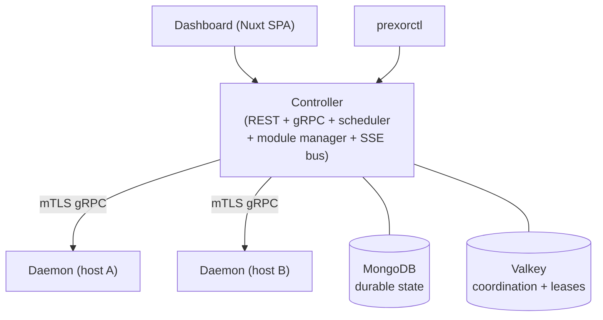
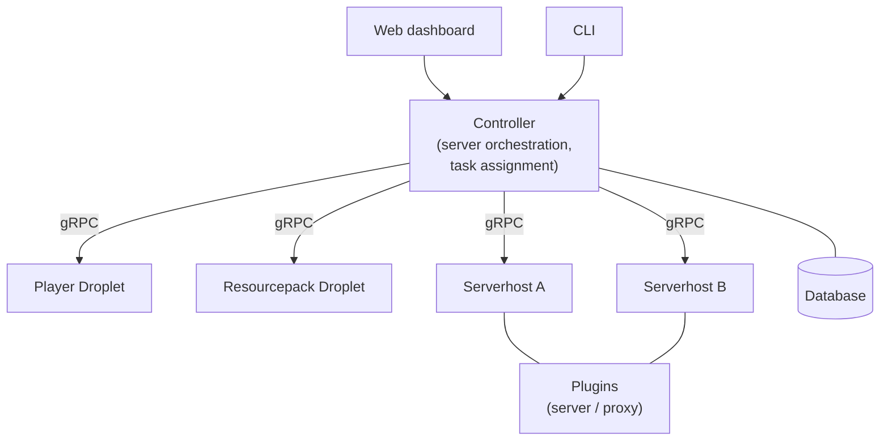

PrexorCloud and [SimpleCloud V2](https://docs.simplecloud.app/) target the
same audience — operators who want a self-hosted Minecraft network
orchestrator with templates, groups, and live management — but they make
different architectural bets. SimpleCloud V2 leans into a microservices
shape: a slim controller, droplets per concern, gRPC-typed APIs, MIT
licence, Kotlin-first SDK. PrexorCloud collapses that into one Java
controller plus one daemon per host, with mTLS, signed modules, and
lease-scoped active-active HA as v1 features. If a microservices boundary
between concerns matters to you and you prefer Kotlin, SimpleCloud V2 is a
strong fit. If you want fewer moving parts, signed-bundle install, and
active-active controllers without composing droplets, PrexorCloud is built
for that.

## Feature matrix

| Capability | PrexorCloud | SimpleCloud V2 | Notes |
|---|---|---|---|
| **License** | Apache 2.0 | MIT ([source](https://github.com/theSimpleCloud/SimpleCloud)) | Both permissive. |
| **Governance** | Single maintainer / small team | `simplecloudapp` / `theSimpleCloud` orgs ([source](https://github.com/simplecloudapp)) | Both small-team OSS. |
| **Stable release** | v1.0 (2026) | V2 (current) | Both actively developed. |
| **Primary language** | Java 25 (controller, daemon) | Kotlin (controller, droplets) ([source](https://github.com/theSimpleCloud/SimpleCloud)) | Different SDK ergonomics. |
| **Server platforms** | Paper, Spigot, Purpur, Folia, Fabric, NeoForge | Paper ([source](https://docs.simplecloud.app/manual/overview/)) | PrexorCloud also covers Folia and the Fabric/NeoForge mod loaders. |
| **Proxy platforms** | Velocity, BungeeCord, Waterfall | Velocity, Bungee ([source](https://docs.simplecloud.app/manual/overview/)) | Equivalent, plus Waterfall. |
| **Architecture style** | Monolithic controller + per-host daemon | Microservices: controller + droplets ([source](https://docs.simplecloud.app/droplet)) | Fundamental shape difference. |
| **gRPC API for operators** | gRPC is daemon-only; operator surface is REST | gRPC-first; "API is built on Protocol Buffers and gRPC" ([source](https://docs.simplecloud.app/api)) | Different SDK transport. |
| **REST API** | Hand-curated OpenAPI 3.1, served by the controller | Available ([source](https://docs.simplecloud.app/api)) | Both expose REST. |
| **CLI** | `prexorctl` (Go, single static binary) with cosign-verified releases | First-party CLI ([source](https://docs.simplecloud.app/manual/overview/)) | Both first-party. |
| **Dashboard** | Nuxt 4 SPA, SSE-driven | Web dashboard ([source](https://docs.simplecloud.app/manual/overview/)) | Both ship a first-party dashboard. |
| **Static groups** | Yes | Yes (server groups) | Equivalent concept. |
| **Dynamic / auto-scaling groups** | Yes — weighted-scoring scheduler with per-group `min`, `max`, scaling rules, cooldowns | Yes — dynamic scaling supported ([source](https://docs.simplecloud.app/manual/overview/)) | Different scheduling internals. |
| **Layered templates** | Yes — chain (`base → base-paper → group → user`) with SHA-256 versioned snapshots | Yes — templates supported ([source](https://docs.simplecloud.app/manual/overview/)) | PrexorCloud emphasises versioned snapshots. |
| **Crash classification** | Yes — exit-code analysis, console tail capture, auto-pause on crash loop | "Cloud-independent crash handling" — running servers continue if controller fails ([source](https://docs.simplecloud.app/concepts/controller/)) | Different framing — SimpleCloud emphasises decoupled survival, PrexorCloud emphasises classification + auto-pause. |
| **Real-time event stream** | Server-Sent Events, 36 typed events, replay via `Last-Event-ID` | gRPC streaming for typed events ([source](https://docs.simplecloud.app/api)) | Different transport for similar use case. |
| **Operator auth** | JWT + bcrypt, optional email password reset, 48 RBAC permissions | Authentication mechanisms documented ([source](https://docs.simplecloud.app/manual/overview/)) | Both authenticate operators; PrexorCloud documents RBAC count + lockout policy. |
| **Daemon/host auth** | mTLS with controller-issued certs and per-node revocation | mTLS for encrypted communication ([source](https://docs.simplecloud.app/manual/overview/)) | Both use mTLS. |
| **Plugin auth** | Per-instance plugin tokens (`ptk_*`), short TTL, sequence-window replay protection | Plugin token system ([source](https://docs.simplecloud.app/manual/overview/)) | Both isolate plugin credentials. |
| **Module signing** | Cosign sign-blob bundles + offline Rekor SET, fail-closed in production | Not documented as a first-party requirement | PrexorCloud requires signed bundles in production by default. |
| **Active-active HA** | Yes — lease-scoped work + fencing tokens via Valkey | "Only one controller can run simultaneously" ([source](https://docs.simplecloud.app/concepts/controller/)) | SimpleCloud V2 documents single-controller as a current limitation. |
| **Persistence** | MongoDB (durable) + Valkey (coordination) | Database-backed, controller "synchronizes the database" on restart ([source](https://docs.simplecloud.app/concepts/controller/)) | Specific store choices differ. |
| **Module / plugin model** | `PlatformModule` SPI plus `@CloudPlugin` standalone jars; modules can ship in-server extensions | Plugins-as-droplets — "v2 modules have been converted into plugins" ([source](https://github.com/theSimpleCloud/SimpleCloud)) | Different extension boundaries. |
| **Daemon-side modules** | Yes — `DaemonModule` with instance-lifecycle hooks | Droplets serve a similar purpose at the architecture level ([source](https://docs.simplecloud.app/droplet)) | Different shape; both expose host-local extension. |
| **Network composition / lobby fallback** | First-class — proxy plugin walks lobby + fallback chain on connect and on kick | Provided via proxy plugin ecosystem (Server Connection plugin) ([source](https://docs.simplecloud.app/plugin)) | Both support fallback chains. |
| **Rolling deployments** | Built-in — `maxUnavailable`, plan-hash, pause/resume/rollback | Not documented as a first-class primitive | PrexorCloud's deployment is a top-level resource. |
| **Backup / restore** | First-class — `prexorctl backup`, manifest-based restore, dry-run validator | Operator-managed | PrexorCloud ships a tested restore tool. |
| **Disaster-recovery drill** | Nightly automated DR drill in CI | Operator-managed | PrexorCloud encodes DR as a CI gate. |
| **Observability** | Prometheus `/metrics`, structured JSON logs, MongoDB-backed audit log | Logs and metrics through droplets / plugins | Both are operator-friendly. |
| **Container per instance** | No — `ProcessBuilder` per JVM (see ADR 7) | Docker support documented as in-progress ([source](https://docs.simplecloud.app/concepts/controller/)) | PrexorCloud will not adopt per-instance containers in v1. |
| **Kubernetes / Helm** | Out of scope, Compose-first | Not first-class in core | Both prioritise non-K8s deployment. |
| **SDK languages** | Java (modules), Java + multi-platform (plugins), Go (CLI), TypeScript (dashboard SDK) | Java, Kotlin, Go ([source](https://docs.simplecloud.app/api)) | SimpleCloud's SDK story leans on Kotlin idioms. |
| **Bedrock support** | Yes — Geyser (`GEYSER` platform) with edition-aware routing | No (Paper / Velocity / Bungee documented) | PrexorCloud bridges Bedrock through Geyser onto Java backends. |

## Architecture comparison

PrexorCloud:

SimpleCloud V2 (as documented in [the controller concept page](https://docs.simplecloud.app/concepts/controller/)
and [the droplets index](https://docs.simplecloud.app/droplet)):

The shape is the visible difference. PrexorCloud puts the scheduler,
event bus, REST API, and module manager in one JVM, with one daemon per
host. SimpleCloud V2 splits responsibilities into droplets connected by
gRPC. Both architectures are reasonable; they make different bets about
operational surface area.

## Where PrexorCloud is stronger

- **Active-active controller HA at v1.** Multiple controllers run
  against the same MongoDB + Valkey and coordinate via lease + fencing
  tokens. SimpleCloud V2's documentation states "there can be only one
  controller running at a time"
  ([source](https://docs.simplecloud.app/concepts/controller/)), with
  multi-controller support listed as future work. See
  [HA setup](/operations/ha-setup/).
- **Cosign-signed module bundles, fail-closed in production.** v1
  defaults to `modules.signing.required: true` and supports offline
  Rekor SET so the controller does not need internet access to verify
  provenance.
- **Built-in rolling deployments.** Pause / resume / rollback,
  plan-hash identity, crash-loop auto-pause are first-class primitives.
- **First-party backup, restore, and DR drill.** `prexorctl backup` and
  `prexorctl restore` are part of v1, and a nightly CI job exercises
  the full backup → wipe → restore cycle.
- **One-host setup is one daemon, not several droplets.** PrexorCloud
  collapses player tracking, resourcepack delivery (when shipped via a
  module), and event fan-out into the controller process. Operators who
  do not want to compose multiple service units find this simpler to
  reason about.
- **Java-first across the stack.** If your team already maintains Paper
  plugins, PrexorCloud's `cloud-api`, `@CloudPlugin`, and module SDK
  will feel familiar with no Kotlin context switch.

## Where SimpleCloud V2 is stronger

- **Microservices boundaries.** If you genuinely want player state,
  resourcepack delivery, and orchestration in separate processes —
  e.g. so they can be deployed, scaled, or replaced independently —
  SimpleCloud's droplet model maps cleanly. PrexorCloud's monolithic
  controller is a different choice
  ([droplets](https://docs.simplecloud.app/droplet)).
- **Kotlin-first SDK ergonomics.** SimpleCloud's API is "primarily
  written in Kotlin," and the cross-language Go / Java / Kotlin SDK
  story is well-documented
  ([source](https://docs.simplecloud.app/api)).
  PrexorCloud's SDK is Java-first; Kotlin works as a JVM consumer but
  is not a first-class authoring surface.
- **gRPC-first operator API.** SimpleCloud's "API is built on Protocol
  Buffers and gRPC" with strong typing across SDKs
  ([source](https://docs.simplecloud.app/api)). PrexorCloud reserves
  gRPC for the controller-daemon channel and exposes a hand-curated
  OpenAPI 3.1 surface to operators.
- **Crash decoupling at the controller level.** "If the controller
  fails, running servers continue operating in their containers or
  screens"
  ([source](https://docs.simplecloud.app/concepts/controller/)).
  PrexorCloud daemons also keep instances alive across a controller
  outage, but SimpleCloud frames it as an explicit design property.
- **MIT licence for downstream packagers.** SimpleCloud is MIT-licensed
  ([source](https://github.com/theSimpleCloud/SimpleCloud)). PrexorCloud
  is Apache 2.0 — both are permissive, but MIT is shorter and stricter
  patent-grant aware operators sometimes prefer it.

## Migration

If you operate SimpleCloud V2 today and want to evaluate PrexorCloud,
follow the [Migrate from SimpleCloud V2](/recipes/migrate-from-simplecloud/)
recipe. It maps droplet-based concepts to PrexorCloud equivalents
(controller + capability registry replaces the player droplet + plugins;
templates replace per-host group config), and lists which SimpleCloud
plugins have direct PrexorCloud first-party module equivalents and
which need a custom port.

## TL;DR

| | PrexorCloud | SimpleCloud V2 |
|---|---|---|
| Best fit | Operators who want one controller + one daemon per host, mTLS, signed modules, and active-active HA at v1 | Operators who want a microservices shape with droplets per concern and a Kotlin / gRPC-first SDK |
| Architecture | Monolithic controller + daemon per host | Controller + droplets + serverhosts |
| Default operator API | REST (OpenAPI 3.1) | gRPC + REST |
| HA model | Active-active, lease-scoped | Single controller (multi-controller documented as future work) |
| Module signing | Cosign + Rekor SET, fail-closed | Not documented as a default requirement |
| Primary SDK language | Java | Kotlin |
