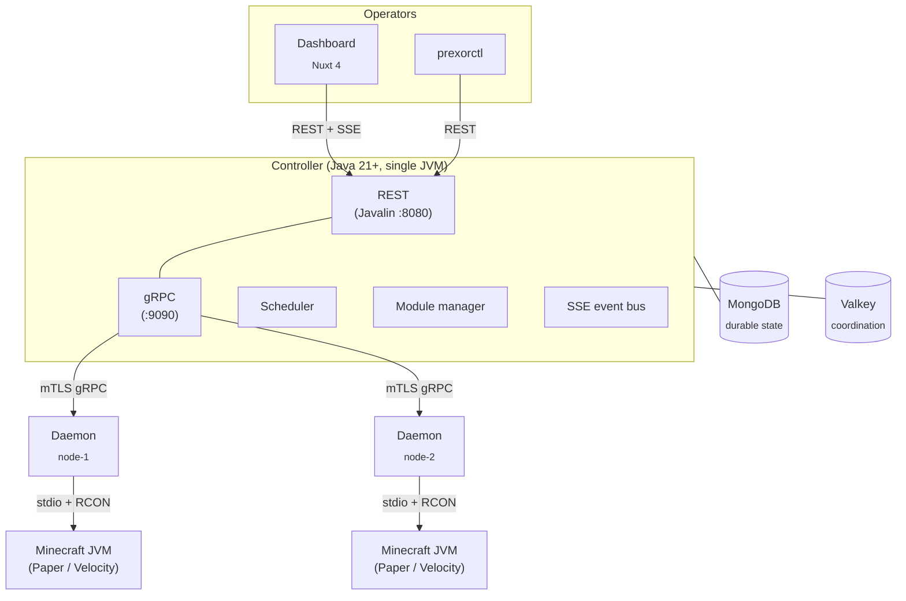
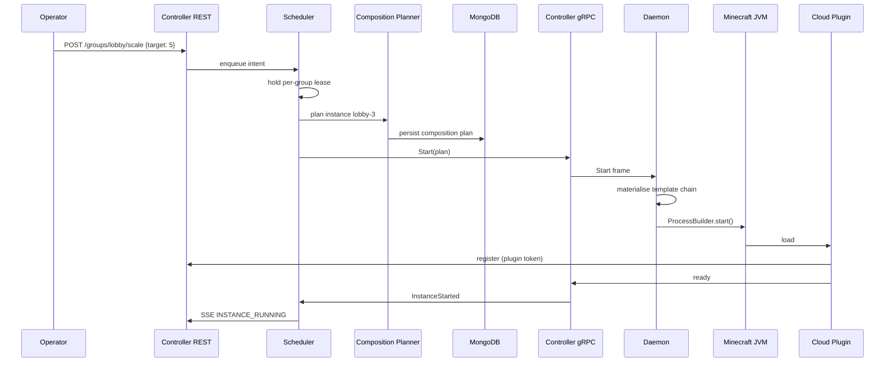

PrexorCloud is three processes plus two backing stores. The controller owns
authoritative state and decides; the daemon owns the host and applies; the
plugin runs inside the Minecraft JVM and reports. This page is the same
picture as the [orientation](/getting-started/what-is-prexorcloud/), one
level deeper — controller subsystems, gRPC frame types, classloader rules,
and where each piece of state actually lives.

## What you'll learn

- The processes and stores that make up a cluster, and what each one owns.
- How the controller is wired internally — REST, gRPC, scheduler, module
  manager, SSE bus, persistence — and why there is no DI framework.
- How daemons receive composition plans and apply them deterministically.
- The active-active HA model and the lease/fencing rules that keep it safe.

## The processes and the stores

Three processes:

- **Controller.** One JVM. Authoritative state, REST + gRPC servers,
  scheduler, module lifecycle, SSE event bus. Wired by hand at
  `PrexorCloudBootstrap` — no DI framework, no reflection at boot.
- **Daemon.** One per host. Connects to the controller over mTLS gRPC.
  Receives composition plans and applies them. Never invents state.
- **Plugin.** Code that ships *inside* a Minecraft server or proxy JVM,
  alongside the cloud-installed jar. Reports player join / transfer /
  disconnect, exposes RCON, implements proxy-side
  [Network Composition](/concepts/groups-instances-templates/) routing.

Two backing stores:

- **MongoDB** holds durable state — groups, templates, modules, audit log,
  user accounts, composition plans, deployments.
- **Valkey** (or any Redis-protocol-compatible store) holds coordination
  state — leases, fencing tokens, JWT revocation, SSE replay buffers,
  rate-limit windows. Required in `production` profile, optional in
  `development`. See [Cluster Model](/concepts/cluster-model/).

## Inside the controller

The controller is a single JVM with five tightly-cooperating subsystems.
There is no service mesh, no message broker, no microservice split. One
process, one classloader hierarchy, one bootstrap sequence.

### Subsystems

| Subsystem | Responsibility |
|---|---|
| REST API (Javalin 7, `:8080`) | The only operator-facing surface. Dashboard, `prexorctl`, and external automation all go through it. |
| gRPC server (`:9090`) | Daemon-facing surface. mTLS-authenticated bidi streams; one per connected daemon. |
| Scheduler | Decides where instances run, when they are reaped, when scaling fires, when deployments advance. Runs per-group on a lease. |
| Module manager | Loads platform modules from MongoDB-stored bundles, drives the lifecycle FSM, owns the capability registry, isolates per-module classloaders. |
| SSE event bus | Pushes state changes to dashboards and modules. Per-event-type subscriptions in process; cross-controller fanout via Valkey pub/sub. |

### Wiring

Construction lives in `PrexorCloudBootstrap`. Everything is constructor-
injected. There is no annotation-based DI and no reflective component
discovery. The reasons are pinned in the project's decisions
record:
boot order is auditable, the type system catches missing wiring at compile
time, and the only thing that ever runs at startup is what the bootstrap
explicitly constructs.

The build is a multi-project Gradle layout. Modules every component
compiles against:

| Module | Process | Role |
|---|---|---|
| `cloud-api` | — | Public types every module compiles against. `PlatformModule`, `DaemonModule`, `ModuleContext`, `CapabilityHandle<T>`, MC-domain records. |
| `cloud-protocol` | — | Generated gRPC and protobuf types shared between controller and daemon. |
| `cloud-security` | — | JWT, certificate authority, mTLS context, password hashing, cosign signature verification. |
| `cloud-common` | — | YAML config loader, logging setup, version detection, shared HTTP client and ObjectMapper factories. |
| `cloud-cloud-modules:runtime` | — | Host-agnostic module runtime: lifecycle FSM, capability registry, route registry, manifest parser. |
| `cloud-controller` | controller JVM | REST, gRPC server, scheduler, persistence. |
| `cloud-daemon` | daemon JVM | Process supervision, template materialisation, plan application. |

## Inside the daemon

One daemon per host. The daemon's contract with the controller is
deliberately narrow: receive a [composition
plan](/concepts/deployments/), apply it, report back. The daemon does not
decide what should run.

Per-host responsibilities:

- **Process supervision.** `ProcessBuilder` per Minecraft instance, stdio
  capture, RCON when applicable, exit-code classification.
- **Template materialisation.** Assembles the layered template chain
  (`base → base-{platform} → {group} → user`) into the instance directory.
- **Plan application.** Applies controller-issued composition plans
  deterministically. Plan hashes are checked before launch.
- **Crash classification.** Captures console tail and exit code, reports
  to the controller via gRPC `CrashReport`.
- **Heartbeat.** Keeps the gRPC stream alive; the controller treats stream
  loss as node-offline and starts the [drain
  workflow](/concepts/scheduling-and-scaling/).

Daemons do not run Minecraft processes inside containers or cgroups in v1.
Process isolation is delegated to the host OS — see the decisions
record
for the rationale.

## The data flow: launching an instance

End-to-end, with the subsystems labelled:

Failure cases are symmetric. Plans are hash-keyed and persisted in
MongoDB; if the controller dies between persistence and dispatch, another
controller acquires the per-group lease, finds the plan, and dispatches.

## Active-active HA, lease-scoped

Multiple controllers can run simultaneously against the same MongoDB and
Valkey. Any healthy controller serves REST and gRPC. There is no single
standby waiting for a leader to fail.

Mutation paths are gated by **scoped leases** with **monotonic fencing
tokens**:

| Scope | Key | What it protects |
|---|---|---|
| Group | `prexor:v1:lease:group:<name>` | Scheduling work for a group (placement, scaling, drains) |
| Platform module mutation | `prexor:v1:lease:platform-module` | Install / upgrade / uninstall, storage deletion |
| Workflow resumption | `prexor:v1:lease:workflow:<scope>` | Persisted start-retry, drain, healing, recoverable-start workflows |
| Node ownership | `prexor:v1:node:<id>` | Commands for a connected node go through the controller that owns its gRPC session |

Every lease acquisition returns a monotonic fencing token. Before a
mutation writes, the controller checks the token is still current. Two
controllers cannot issue conflicting writes against the same scope, even
under clock skew, because only one holds a current token at a time.

When a controller stops or loses its lease, another acquires the same
scope after expiry and resumes from durable state in MongoDB and Valkey.
Standby promotion is exercised in the test harness at four points: drain,
deployment, placement-time, and in-flight module mutation.

:::note[Coordination is required for HA]
Without a Redis-protocol-compatible store, controllers behave as
single-writer deployments. Run Valkey in production. See [Cluster
Model](/concepts/cluster-model/) for the runtime profiles.
:::

## Module classloader isolation

Each platform module loads in its own `URLClassLoader` whose parent is the
controller's classloader. Modules see `cloud-api` types through the parent
and their own classes through their own loader. **Cross-module classloader
exposure is forbidden**; modules link only through capability handles.

On unload, the manager closes the classloader through try-with-resources
around `LoadedRuntime.closeable`. A `ModuleClassLoaderTracker` wraps each
loaded classloader in a `PhantomReference` against a `ReferenceQueue` and
emits four metrics for leak detection — see
[Observability](/operations/monitoring/) and
[Lifecycle](/concepts/modules/lifecycle/).

Two registries that hold module-supplied references are explicitly cleaned
on unload: the **capability registry** (caches `Class<?> → Proxy` mappings
that would otherwise pin classes) and the **module frontend manager**
(deletes the on-disk asset directory). Everything else is GC-collectable.

## SSE event bus

The controller exposes a single SSE stream at
`GET /api/v1/events/stream`. Twenty-two event types currently flow through
it: group, instance, node, player, deployment, module, capability,
network, choreography, journey. Each event carries a monotonic sequence
number. Clients reconnect with `Last-Event-ID` and replay missed events
from the per-client buffer.

In production the replay buffer lives in Valkey and survives controller
restart; in development it lives in process memory and is cleared on
restart. Authentication uses a 30-second SSE ticket exchanged from a JWT
on `POST /api/v1/events/ticket` — `EventSource` cannot set headers, so
ticket-as-query-string is the only safe option.

See [Events](/concepts/events/) for the consumer-facing model and
[Security](/concepts/security/) for the ticket exchange.

## Next up

- [Cluster Model](/concepts/cluster-model/) — runtime profiles, single
  vs HA, what each backing store owns.
- [Groups, Instances, Templates](/concepts/groups-instances-templates/) —
  the three workload nouns in detail.
- [Module System](/concepts/modules/) — platform and daemon modules,
  capability registry, lifecycle FSM.
- [Security](/concepts/security/) — mTLS for daemons, JWT for operators,
  plugin tokens for in-server code.
