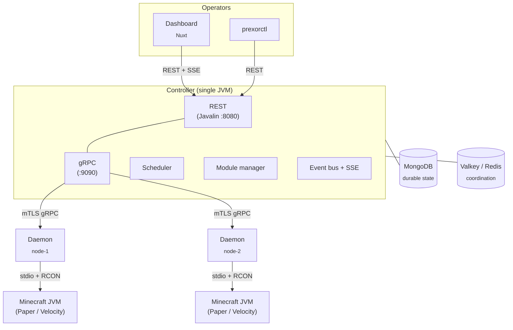
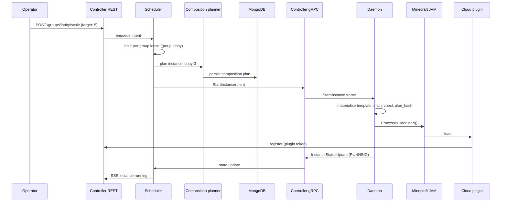

PrexorCloud is three processes plus two backing stores. The Controller owns
authoritative state and decides. The Daemon owns the host and applies. The
Plugin runs inside the Minecraft JVM and reports. This page is the orientation
diagram one level deeper: Controller subsystems, gRPC frame types, the
Mongo collections and Redis keys that hold state, and the lease rules that keep
multiple controllers safe.

## What you'll learn

- The processes and stores that make up a cluster, and what each one owns.
- How the Controller is wired internally — REST, gRPC, scheduler, module
  manager, event bus, persistence — and why there is no DI framework.
- The gRPC frames the Controller and Daemon exchange.
- Where every kind of state lives: which Mongo collection, which Redis key.
- The active-active HA model and the lease/fencing rules behind it.

## The processes and the stores



Three processes:

- **Controller.** One JVM. Authoritative state, REST and gRPC servers,
  scheduler, module lifecycle, event bus. Wired by hand in
  `PrexorCloudBootstrap` — no DI framework, no reflective component discovery
  at boot.
- **Daemon.** One per host. Connects to the Controller over mTLS gRPC.
  Receives composition plans, applies them, reports back. Never invents state.
- **Plugin.** Code that ships inside a Minecraft server or proxy JVM,
  alongside the cloud-installed jar. Reports player join / transfer /
  disconnect, exposes RCON, implements proxy-side
  [Network](/concepts/groups-instances-templates/) routing.

Two backing stores:

- **MongoDB** holds durable state — groups, templates, modules, audit log,
  user accounts, composition plans, deployments, crashes.
- **Valkey** (or any Redis-protocol store) holds coordination state — leases,
  fencing tokens, JWT revocation, SSE replay buffers, rate-limit windows,
  shared runtime snapshots. Required in production; optional for
  single-controller development. See [Cluster model](/concepts/cluster-model/).

Connection defaults, from the `ControllerConfig` records:

| Config key | Default | What it sets |
|---|---|---|
| `http.host` / `http.port` | `0.0.0.0` / `8080` | REST + dashboard + SSE listener |
| `grpc.host` / `grpc.port` | `0.0.0.0` / `9090` | Daemon-facing mTLS gRPC listener |
| `raft.host` / `raft.port` | `0.0.0.0` / `9190` | Cluster control-plane (Ratis Raft) transport |
| `database.uri` | `mongodb://localhost:27017` | MongoDB connection string |
| `database.database` | `prexorcloud` | Database name |
| `redis.uri` | unset (Redis disabled) | Coordination store; `redis://localhost:6379` when defaulted |
| `heartbeat.intervalMs` | `30000` | Controller→Daemon ping interval |
| `heartbeat.missedThreshold` | `3` | Missed pongs before a node is unreachable |
| `scheduler.evaluationIntervalSeconds` | `15` | Scheduler tick |
| `scheduler.nodeTimeoutSeconds` | `90` | Stream-loss grace before drain |

The Daemon config (`DaemonConfig`) defaults `nodeId` to `node-1` and
auto-detects its advertise address from the gRPC peer when
`advertiseAddress` is blank.

## Inside the Controller

The Controller is a single JVM with cooperating subsystems. There is no
service mesh, no message broker, no microservice split. One process, one
classloader hierarchy, one bootstrap sequence.

### Subsystems

| Subsystem | Responsibility |
|---|---|
| REST API (Javalin 7, `:8080`) | The only operator-facing surface. Dashboard, `prexorctl`, and external automation all go through it. |
| gRPC server (`:9090`) | Daemon-facing surface. mTLS-authenticated bidirectional streams; one per connected daemon. |
| Scheduler | Decides where instances run, when they reap, when scaling fires, when deployments advance. Runs per-group under a lease. |
| Module manager | Loads platform modules from Mongo-stored bundles, drives the lifecycle FSM, owns the capability registry, isolates per-module classloaders. |
| Event bus | In-process pub/sub (`EventBus`). Pushes state changes to dashboard SSE consumers and modules; cross-controller fan-out via Redis pub/sub (`RedisEventBridge`). |
| Cluster control plane | Embedded Ratis Raft. Owns cluster identity and cluster-singleton leases for deployment reconciliation and audit pruning. |

### Wiring

Construction lives in `PrexorCloudBootstrap.start()`. Everything is
constructor-injected through grouped service records — `CoreServices`,
`SecurityServices`, `AuthServices`, `TemplateServices`, `NetworkServices`,
`CrashServices`, `ObservabilityServices` — assembled into one
`PrexorController` registry. There is no annotation-based DI and no reflective
component discovery. Boot order is auditable, the type system catches missing
wiring at compile time, and the only thing that runs at startup is what the
bootstrap explicitly constructs.

The boot sequence, in order:

1. `initStorage()` — connect MongoDB, initialize collections, run the
   v1.0→v1.1 cluster-identity migration.
2. Start the cluster control plane (Day-0 bootstrap, restart, or join via a
   `pending-join-token` file).
3. `initRuntimeServices()` — Redis-backed (`RedisRuntimeServices`) or
   in-process (`InMemoryRuntimeServices`) when no `redis.uri` is set.
4. `initCore` → `initSecurity` → `initAuth` → `initTemplates` →
   `initCrashDetection` → `initNetworks` → `initModuleManagers` →
   `initObservability`.
5. Build the `PrexorController`, boot platform modules, wire the Redis event
   bridge, start the scheduler, gRPC server, REST server.
6. Register shutdown hooks (drained in registration order on SIGTERM).

The build is a multi-project Gradle layout. The modules every component
compiles against:

| Module | Process | Role |
|---|---|---|
| `cloud-api` | — | Public types every module compiles against: `PlatformModule`, `DaemonModule`, `ModuleContext`, `CapabilityHandle<T>`, Minecraft-domain records. |
| `cloud-protocol` | — | Generated gRPC and protobuf types shared between Controller and Daemon. |
| `cloud-security` | — | JWT, certificate authority, mTLS context, password hashing, cosign signature verification. |
| `cloud-common` | — | YAML config loader, logging setup, version detection, shared HTTP client and `ObjectMapper` factories. |
| `cloud-modules:runtime` | — | Host-agnostic module runtime: lifecycle FSM, capability registry, route registry, manifest parser. |
| `cloud-controller` | Controller JVM | REST, gRPC server, scheduler, persistence. |
| `cloud-daemon` | Daemon JVM | Process supervision, template materialization, plan application. |

## Inside the Daemon

One Daemon per host. Its contract with the Controller is deliberately narrow:
receive a [composition plan](/concepts/deployments/), apply it, report back. The
Daemon does not decide what should run.

Per-host responsibilities (package `daemon.process`, `daemon.template`):

- **Process supervision.** `ProcessManager` runs a `ServerProcess` per
  instance with `ProcessBuilder`, captures stdio (`ConsoleCapture`), classifies
  exit codes, and kills cleanly (`ProcessKiller`).
- **Template materialization.** Assembles the layered template chain into the
  instance directory: `TemplateUnpacker`, `ConfigMerger`, `ServerConfigPatcher`,
  `VariableSubstitution`. Downloaded artifacts and bootstrap caches are reused
  across instances (`ArtifactCache`, `JarCache`, `PaperBootstrapCache`,
  `TemplateCache`).
- **Plan application.** Applies the Controller-issued `CompositionPlan`
  deterministically. The `plan_hash` is checked before launch.
- **Crash classification.** Captures the console tail and exit code, reports
  to the Controller as a `CrashReport` frame.
- **Heartbeat.** Responds to `Ping` with `Pong`. The Controller treats stream
  loss as node-offline and starts the
  [drain workflow](/concepts/scheduling-and-scaling/).
- **Instance file access.** Serves structure-only file trees
  (`InstanceFileTreeWalker`) and bounded file reads (`InstanceFileReader`) in
  reply to `WalkInstanceFiles` / `ReadInstanceFile`.

Daemons do not run Minecraft inside containers or cgroups. The `RuntimeIsolation`
frame carries CPU and disk reservation hints, but process isolation is
delegated to the host OS.

## REST and gRPC: the two surfaces

The Controller exposes exactly two network surfaces. They never overlap.

**REST (`:8080`, Javalin).** The only operator-facing API. The dashboard,
`prexorctl`, and external automation all call it. Authenticated by JWT bearer
tokens. The full surface is the [REST reference](/reference/rest-api/) — it is
generated from the route handlers under `controller/rest`. Server-Sent Events
stream live state changes over the same listener.

**gRPC (`:9090`, mTLS).** The only daemon-facing surface. Four services,
defined in `cloud-protocol/src/main/proto/prexorcloud`:

| Service | RPC | Purpose |
|---|---|---|
| `DaemonService` | `Connect(stream DaemonMessage) → stream ControllerMessage` | The long-lived bidirectional session: status, console, crashes, instance commands, template sync, module distribution. |
| `BootstrapService` | `ExchangeJoinToken` | A new daemon redeems its join token for a signed client certificate. |
| `AdminService` | `CreateJoinToken`, `RevokeJoinToken`, `ListJoinTokens` | Operator management of daemon join tokens. |
| `ClusterMembership` | `RequestJoin` | A controller joins the Raft cluster. |

Every gRPC call passes the `MtlsEnforcementInterceptor` (validates the client
certificate against the CA and the revocation store) and the
`SubnetGuardInterceptor` (checks the peer IP against `network.allowedSubnets`,
default `0.0.0.0/0` and `::/0`). The wire protocol is version-checked: the
Daemon sends `protocol_version` in its `Handshake`, compared against
`ProtocolConstants.PROTOCOL_VERSION` (`"1.0"`).

### The daemon session frames

`DaemonService.Connect` is one bidirectional stream. Both directions are a
single `oneof` envelope.

Daemon → Controller (`DaemonMessage`):

| Frame | Meaning |
|---|---|
| `Handshake` | First frame: node id, version, CPU/memory, labels, host info, running instances, `protocol_version`. |
| `NodeStatus` | Periodic host metrics: CPU, memory, disk, instance count, used ports. |
| `InstanceStatusUpdate` | Per-instance state, port, player count, uptime. |
| `ConsoleOutput` | One console line from an instance. |
| `CrashReport` | Exit code, log tail, uptime for a crashed instance. |
| `Pong` | Echoes a `Ping` sequence. |
| `TemplateRequest` / `CacheStatus` | Template sync and pre-warm cache reporting. |
| `ErrorReport` | Partial-failure report. |
| `StartInstanceAck` / `StopInstanceAck` / `ShutdownNodeAck` | Delivery confirmations. |
| `DaemonLogRecord` | A Logback event mirrored from the daemon JVM. |
| `ModuleStateUpdate` | Daemon-side platform-module state. |
| `EventSubscribe` / `EventUnsubscribe` | Register interest in controller-bus event types. |
| `InstanceFileTree` / `InstanceFileContent` | Replies to file-access requests. |

Controller → Daemon (`ControllerMessage`):

| Frame | Meaning |
|---|---|
| `HandshakeAck` | Accept the session. |
| `StartInstance` | Launch an instance (carries the full `CompositionPlan`). |
| `StopInstance` | Graceful stop or `force` SIGKILL. |
| `SendCommand` | Write a command to an instance's stdin. |
| `Ping` | Liveness probe; expects a `Pong`. |
| `TemplateData` / `TemplateUpToDate` | Template archive push or no-op. |
| `ShutdownNode` | Ask the daemon to drain and exit. |
| `PreWarmCache` / `RequestCacheStatus` | Warm JAR/bootstrap caches before scheduling. |
| `ModuleInstall` / `ModuleUninstall` / `ModuleEvent` | Daemon-host platform-module distribution and event forwarding. |
| `WalkInstanceFiles` / `ReadInstanceFile` | Request a file tree or a single file's bytes. |

Each `ControllerMessage` also carries a `traceparent` for distributed tracing —
an additive scalar, so it needs no protocol-version bump.

### The composition plan

`StartInstance` carries a `CompositionPlan` — the Controller's fully resolved
recipe for one instance. The Daemon applies it without further decisions.

```protobuf
message CompositionPlan {
  string plan_hash = 1;                  // checked before launch
  RuntimeArtifact runtime = 2;           // server jar, download URL, sha256, platform, version
  repeated TemplateRef templates = 3;    // name + hash, applied in order
  repeated ExtensionArtifact extensions = 4; // module-supplied jars/mods with install paths
  repeated ConfigPatch config_patches = 5;   // file/key/value overrides
  RuntimeIsolation isolation = 6;        // cpu_reservation, disk_reservation_mb
}
```

## The data flow: launching an instance

End-to-end, with subsystems labelled:



Failure cases are symmetric. Plans are hash-keyed and persisted in the
`instance_composition_plans` collection. If the Controller dies between
persistence and dispatch, another controller acquires the per-group lease,
finds the plan, and dispatches.

## Where state lives

Every piece of state has one home. Durable, authoritative state is in MongoDB.
Coordination and ephemeral runtime snapshots are in Redis/Valkey.

### MongoDB collections

Created by `MongoStateStore.initialize()` and the per-domain stores:

| Collection | Holds |
|---|---|
| `templates` | Template definitions and versions |
| `groups` | Group definitions |
| `networks` | Network composition definitions |
| `catalog` | Server/proxy platform download catalog |
| `deployments` | Rolling-deployment records |
| `instance_composition_plans` | Persisted composition plans (hash-keyed) |
| `crashes` | Crash reports |
| `audit_log` | Audit events (pruned per `scheduler.auditRetentionDays`, default 90) |
| `nodes` | Node registry |
| `users` / `roles` | Accounts and RBAC roles |
| `user_preferences` | Per-user dashboard preferences |
| `workflow_transfers` / `workflow_drains` / `workflow_healing` / `workflow_start_retries` | Durable workflow state for crash-safe resumption |
| `console_lines` | Capped console buffer |
| `shares` | Crash/diagnostic share records |
| `counters` | Monotonic counters |

> `cluster_meta` is legacy. The v1.0→v1.1 migration drops it; Raft is now the
> source of truth for cluster identity.

### Redis / Valkey key families

All keys are namespaced `prexor:v1:` (`RedisKeys`). The families that matter for
coordination:

| Family | Key prefix | TTL |
|---|---|---|
| Lease | `prexor:v1:lease:` | Lease TTL (usually scheduler interval × 2) |
| Lease fencing token | `prexor:v1:lease-token:` | No TTL — persistent monotonic counter |
| Node owner | `prexor:v1:nodeowner:` | Heartbeat interval × missed threshold |
| Node / instance / player runtime | `prexor:v1:node:` / `instance:` / `player:` | No TTL; deleted when the entity goes away |
| Plugin token | `prexor:v1:plugintoken:` | 15 minutes default |
| JWT revoked | `prexor:v1:jwt:revoked:` | Remaining JWT lifetime |
| Node cert revoked | `prexor:v1:nodecert:revoked:` | Remaining certificate validity |
| Rate limit | `prexor:v1:ratelimit:` | 60 seconds |
| Scaling cooldown | `prexor:v1:cooldown:` | Group cooldown duration |
| SSE sequence / replay / ticket | `prexor:v1:sse:` | Tickets 30s; sequence/replay none |
| Login failures / lock | `prexor:v1:login:` | Failure + lockout windows (15 min default) |
| Password reset | `prexor:v1:pwreset:` | Token TTL (30 min default) |

Cross-controller events use Redis pub/sub channels `prexor:v1:events:node`,
`events:instance`, `events:player`, `events:group`, `events:command`,
`events:reply`.

When `redis.uri` is unset, `InMemoryRuntimeServices` substitutes in-process
fallbacks for every coordination feature. That is fine for single-controller
development and rejected by config validation for production — silent
in-process fallbacks are exactly the dev/prod skew that ships bugs.

## Active-active HA, lease-scoped

Multiple controllers run simultaneously against the same MongoDB and Valkey.
Any healthy controller serves REST and gRPC. There is no standby waiting for a
leader to fail.

Mutation paths are gated by **scoped leases** with **monotonic fencing tokens**:

| Scope | Lease resource | What it protects |
|---|---|---|
| Group | `group:<name>` → `prexor:v1:lease:group:<name>` | Scheduling for a group: placement, scaling, drains, workflow resumption |
| Platform-module mutation | Single platform-module lease | Install / upgrade / uninstall; storage deletion |
| Deployment reconciliation | Cluster-singleton lease (Raft) | One controller iterates `IN_PROGRESS` deployments per tick |
| Audit pruning | Cluster-singleton lease (Raft) | One controller prunes the audit log per tick |
| Node ownership | `prexor:v1:nodeowner:<id>` | Commands for a connected node route through the controller that owns its gRPC session |

Every lease acquisition allocates a monotonic fencing token from
`prexor:v1:lease-token:<resource>`. Before a mutation writes, the controller
checks the token is still current. Two controllers cannot issue conflicting
writes against the same scope, even under clock skew, because only one holds a
current token at a time. A second controller attempting a platform-module
mutation it does not own is rejected: "platform module mutation is already owned
by another controller; retry once the lease is free."

Redis leases gate scheduling and node ownership; the Raft control plane gates
cluster-singleton loops (deployment reconcile, audit prune). See
[Cluster model](/concepts/cluster-model/) for the membership and quorum rules.

## Plugins and modules

Two extension surfaces, distinct from the three core processes:

- **Plugins** run inside the Minecraft JVM. Server plugins target Paper,
  Spigot, Folia, Fabric, and NeoForge; proxy plugins target Velocity,
  BungeeCord, and Geyser (under `java/cloud-plugins/{server,proxy}`).
- **Modules** are Controller-side extensions built against `cloud-api` and the
  `cloud-modules:runtime` lifecycle. First-party modules under
  `java/cloud-modules` include `stats-aggregator`, `player-journey`,
  `webhook-alerts`, `discord-bridge`, `tablist`, `backup-orchestrator`, and
  `protocol-tap`. Modules load from Mongo-stored bundles, run in isolated
  classloaders, and reach the platform through `CapabilityHandle<T>`.

See [Modules](/concepts/modules/) and [Plugins](/concepts/plugins/) for the
extension contracts.
