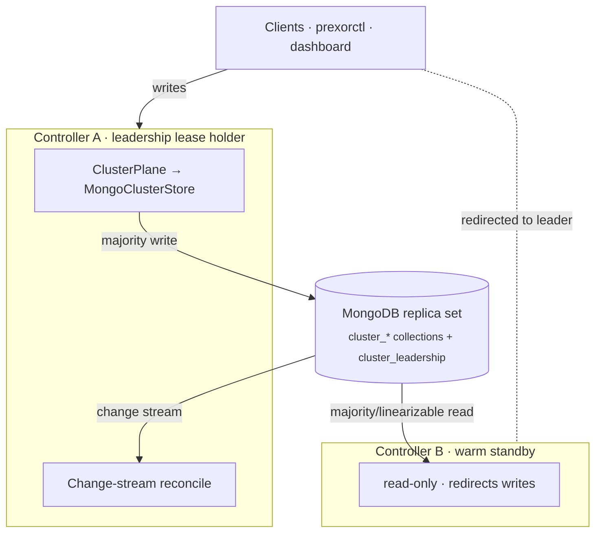

PrexorCloud runs the Controller's cluster control plane on **MongoDB**. There is no
embedded consensus engine: the controllers coordinate purely through a shared replica
set. Exactly one controller is the active writer (the **leader**) at any moment, elected
by a fenced lease document; the others are read-only warm standbys. Cluster identity, the
config history, the member list, single-use join tokens, and the cluster CA all live in
Mongo collections.

This page is the mental model. Read it once, refer back when you add a Controller, debug
the leader, or reason about what comes back after a restart.

## What you'll learn

- What lives in the Mongo cluster store and what does not.
- How the leadership lease elects one writer and fences a stale one with an epoch.
- How writes commit, how reads work, and which writes are conflict-checked.
- How a controller joins by registering in Mongo — no consensus handshake.
- What survives a Controller restart, and the REST surface for inspecting the cluster.

## One writer, one store

MongoDB is the single source of truth for cluster control state **and** for who is allowed
to mutate it. The design rests on two Mongo guarantees that a replica set provides:

- **A fenced lease.** A single `cluster_leadership` document holds the current leader and a
  monotonically increasing `epoch`. The lease is acquired and renewed with an atomic
  `findOneAndUpdate` under majority write / linearizable read. Whoever holds an unexpired
  lease is the one writer; everyone else redirects to it.
- **Change streams.** The leader reacts to cluster-state changes through a resumable Mongo
  change stream, layered over a periodic reconcile floor — so the system stays correct even
  if the stream lags or drops.

The rationale — why Mongo rather than a second consensus cluster, and why a single writer
rather than active-active over a shared lease — is recorded in
[ADR 34 (single-writer, Mongo-authoritative control plane)](https://github.com/prexorjustin/prexorcloud/blob/main/docs/engineering/decisions.md).

Live operational state — running Instances, connected Daemons, players, console buffers,
rate limits — is **not** cluster control state and is not described here. It is rebuilt from
MongoDB plus gRPC reconciliation when Daemons reconnect.

## The Mongo cluster store

`MongoClusterStore` is the source of truth for cluster control state; `ClusterPlane`
(backed by `MongoClusterPlane`) is the typed read + write façade over it. The leader calls
the writes; any controller can serve the reads. The state lives in these collections:

| Collection | Holds |
|---|---|
| `cluster_identity` | `clusterId`, the base64 join-token seed secret, `createdAt`, schema version |
| `cluster_config` | Append-only history of cluster-shared config versions + the active version pointer |
| `cluster_members` | One member document per Controller (advertised REST + gRPC addresses, join + last-seen times) |
| `cluster_join_tokens` | Single-use cluster join tokens keyed by `jti` |
| `cluster_files` | Binary blobs — notably the cluster CA cert and key |

Leadership itself lives in a sixth document, `cluster_leadership` (`holder`, `epoch`,
`renewedAt`). It is not part of `ClusterPlane`: it is the lease the
`MongoLeaderElector` manages.

### Cluster identity

Identity is the `cluster_identity` singleton: a `clusterId` (a UUID), a base64 seed secret,
a creation timestamp, and a schema version.

- On first-ever boot the Controller stamps a fresh `clusterId` (or adopts `cluster.id` from
  `controller.yml` if you set it) plus a random 32-byte seed secret.
- The seed secret is the HMAC key that signs join tokens. It never appears in any REST
  response or audit log.
- On restart the Controller cross-checks `controller.yml`'s `cluster.id` against the
  `clusterId` in Mongo. A mismatch refuses to boot:

  ```
  Configured cluster.id=<yaml> but the Mongo cluster store holds cluster.id=<store>.
  Either point this controller at the right cluster, or remove cluster.id from
  controller.yml to adopt the store's existing id.
  ```

Because Mongo is durable and replicated, an **empty** cluster store under a configured
`cluster.id` is not a virgin boot — it is the signature of a catastrophic store wipe. The
Controller re-stamps identity, regenerates the CA + seed + config history, and records a
`cluster.recovery.unsafe-reset` audit event. You then re-issue join tokens — see the
[cluster recovery runbook](https://github.com/prexorjustin/prexorcloud/blob/main/docs/runbooks/recover-cluster.md).

## The leadership lease

The `cluster_leadership` lease is the heart of the design. It does two jobs: it elects a
single writer, and its `epoch` is the fencing token that keeps a deposed leader from doing
damage.

- **Election.** Each controller's `MongoLeaderElector` races to acquire the lease with an
  atomic conditional update. The winner is the leader; it runs the scheduler/reconciler and
  owns every Daemon gRPC stream. A fresh acquisition bumps `epoch`; a renewal does not.
- **Fencing.** Every state-changing write and every command the leader sends a Daemon carries
  the leader's `epoch`. A Daemon rejects any command whose epoch is below the highest it has
  seen (`STALE_EPOCH`). So a leader that was deposed — but has not yet noticed — cannot drive
  Daemons with stale commands.
- **Self-fencing.** Leadership is bounded by `renewedAt + ttl`. If the leader cannot renew —
  Mongo unreachable, a long GC pause, a partition *from Mongo* even while its Daemon streams
  are still up — it steps itself down within `ttl − safetyMargin` rather than act on a lease
  it can no longer prove it holds. A successor elects via the surviving Mongo quorum.

There are **no** separate named leases. "Am I the leader?" is the only lease question, so
cluster-singleton work — the audit-log pruner, the deployment-reconciliation gate, the DR
drill runner, the scheduler tick — simply runs only when `isLeader()` is true. Ownership is
leadership: the controller that owns a Daemon's stream is the leader, full stop.

## Writes, reads, and conflicts

### Only the leader writes

Cluster-state mutations go through `ClusterPlane` on the leader: `setClusterMeta`,
`proposeConfigPatch`, `rollbackConfig`, `addMember`, `removeMember`, `issueJoinToken`,
`redeemJoinToken`, `revokeJoinToken`, `rotateSeed`, `writeClusterFile`, `deleteClusterFile`.
Each is a majority-acked Mongo write. Client traffic routes to the leader, so a config write
fires its live-reload locally; followers pick the change up on takeover or restart.



### Reads

Read methods (`listMembers`, `getClusterMeta`, `getActiveConfigVersion`, `listConfigVersions`,
…) return from the Mongo store under the client-default majority read concern; the lease
itself uses a linearizable read. The dashboard and `prexorctl` read from any controller.

### Conflict-checked writes

Some writes are guarded and reject with a typed code. `ClusterPlane` raises a
`ClusterWriteConflict` carrying that code, and REST surfaces it as `409`:

| Code | Raised by | Meaning |
|---|---|---|
| `VERSION_NOT_NEXT` | `proposeConfigPatch` | The proposed version is not `max + 1`, or its `parentVersion` is not the current active version — a concurrent writer won the race |
| `VERSION_UNKNOWN` | `rollbackConfig` | Rollback target version does not exist |
| `TOKEN_NOT_REDEEMABLE` | `redeemJoinToken` | The join token is unknown, already redeemed, revoked, or expired |

Cluster identity carries an anti-fork guard of its own: a write that tries to stamp a
*different* `clusterId` over an existing one fails rather than fork the cluster. When the
Mongo store itself is unreachable, REST mutation routes return `503 CLUSTER_STORE_UNAVAILABLE`.

## Membership

A member document is one Controller. It carries:

| Field | Meaning |
|---|---|
| `nodeId` | The Controller's UUID |
| `restAddr` / `gRPCAddr` | Advertised REST and gRPC bind addresses for tooling and Daemons |
| `label` | Human label |
| `joinedAt` / `lastSeen` | Timestamps |

The leader resolves a Daemon redirect target from this list: it maps the lease holder's
`nodeId` to that member's `gRPCAddr`, so a Daemon that handshakes onto a standby is steered
to the leader.

### Joining a cluster

Joining is a **registration in Mongo**, not a peer-group handshake. There is no
controller-to-controller RPC and no consensus group to join, which is exactly what removed
the old mTLS join bootstrap.

1. The operator mints a single-use join token on an existing Controller
   (`POST /api/v1/cluster/join-tokens`). The token is HMAC-signed with the cluster seed
   secret and carries an expiry.
2. The joiner — which shares the same replica set — validates the token directly against
   `cluster_identity` (HMAC, `clusterId`, expiry) and atomically single-use-redeems it in
   `cluster_join_tokens`.
3. It reads the cluster CA from `cluster_files`, mints its own leaf certificate, persists
   the TLS material locally, and upserts its own `cluster_members` document.

The redeem is atomic and single-use: a retry that gets past a redeemed token fails fast with
`TOKEN_NOT_REDEEMABLE`. A half-failed join is recoverable — the next attempt re-purges the
local material and re-runs.

### Leaving a cluster

`POST /api/v1/cluster/leave` removes this Controller's member document and then triggers its
shutdown latch (delayed ~1s so the HTTP response and audit write flush first). A controller
that left is fenced from auto-rejoining on restart: it must be handed a fresh join token, so
a stale node cannot silently re-register into the writer-eligible set.

`DELETE /api/v1/cluster/members/{nodeId}` force-ejects a member; it returns
`404 MEMBER_NOT_FOUND` for an unknown `nodeId`.

## What survives a restart

Cluster control state is durable in MongoDB — there is no on-disk Raft log or snapshot to
replay. Everything in the store comes back simply because it was never local to the process:

| State | Survives Controller restart? | How |
|---|---|---|
| Cluster identity | Yes | Durable in `cluster_identity` |
| Config version history + active version | Yes | Durable in `cluster_config` |
| Members | Yes | Durable in `cluster_members` |
| Join tokens (incl. redeemed/revoked state) | Yes | Durable in `cluster_join_tokens` |
| Cluster CA cert + key | Yes | Durable in `cluster_files`; restarts and joiners load it from there (no on-disk CA keystore beyond the local leaf) |
| Leadership | Re-elected | The `cluster_leadership` lease expires and a controller re-acquires it |

The cluster store answers "what is this cluster, who is in it, and who is the leader." It
does not hold what is running right now — that is reconciled from MongoDB and the Daemons on
reconnect.

## Inspecting the cluster

Every cluster route requires a permission:

- **Read** (`/api/v1/cluster`, `/members`, `/config`, `/config/versions`) — `cluster.view`
  (`CLUSTER_VIEW`).
- **Membership mutation** (eject, leave) — `cluster.manage` (`CLUSTER_MANAGE`).
- **Config write** (propose patch, rollback) — `cluster.config.write` (`CLUSTER_CONFIG_WRITE`).
- **Join tokens and seed rotation** (mint, list, revoke, rotate) — `cluster.manage`. Even
  listing tokens needs `cluster.manage`, since a token list is sensitive.

| Method | Path | Purpose |
|---|---|---|
| `GET` | `/api/v1/cluster` | Cluster id, created-at, schema version, member count, active config version |
| `GET` | `/api/v1/cluster/members` | Member list (sorted by `nodeId`) |
| `DELETE` | `/api/v1/cluster/members/{nodeId}` | Force-eject a member |
| `POST` | `/api/v1/cluster/leave` | Graceful self-removal |
| `GET` | `/api/v1/cluster/config` | Currently active config patch (masked) |
| `GET` | `/api/v1/cluster/config/versions` | Config version metadata list |
| `GET` | `/api/v1/cluster/config/versions/{version}` | One version (masked) |
| `POST` | `/api/v1/cluster/config` | Propose a new config patch |
| `POST` | `/api/v1/cluster/config/rollback` | Roll the active version back to an earlier one |
| `POST` | `/api/v1/cluster/join-tokens` | Mint a single-use join token |
| `GET` | `/api/v1/cluster/join-tokens` | List outstanding tokens (jti + metadata; never the secret) |
| `DELETE` | `/api/v1/cluster/join-tokens/{jti}` | Revoke a token |
| `POST` | `/api/v1/cluster/seed/rotate` | Rotate the join-token seed secret |

To find the current **leader**, read the `cluster_leadership` document in Mongo (`holder`,
`epoch`) or scrape `prexorcloud.leadership.is_leader` (which is `1` on the leader) from a
controller's Prometheus endpoint.

## Config cheat sheet

```yaml
cluster:
  id: ~                  # optional; pins this Controller to one cluster
database:
  uri: mongodb://...     # MUST be a replica set (rs.initiate once) — the control plane
                         # needs change streams, majority/linearizable reads, and the lease
```

:::tip[MongoDB must run as a replica set]
A single-member replica set is sufficient — start `mongod` with `--replSet` and run
`rs.initiate()` once. The Controller fails fast at boot against a bare standalone, because
the leadership lease, change streams, and majority/linearizable reads all need replica-set
mode. Growing to a 3-member set for Mongo HA is reconfiguration only, with zero code change.
:::

## Related

- [ADR 34 — single-writer, Mongo-authoritative control plane](https://github.com/prexorjustin/prexorcloud/blob/main/docs/engineering/decisions.md) — why MongoDB rather than a second consensus cluster, and the trade-offs of a single active writer.
- [Cluster recovery runbook](https://github.com/prexorjustin/prexorcloud/blob/main/docs/runbooks/recover-cluster.md) — store-loss recovery and the catastrophic-reset path.
