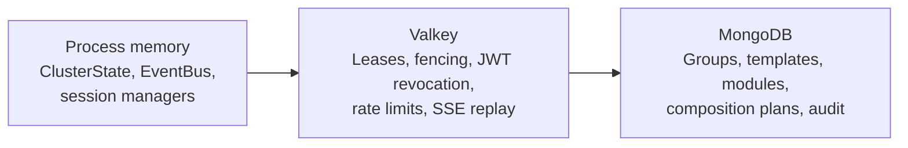

A PrexorCloud cluster is a controller (or a set of controllers) plus one
daemon per host plus a MongoDB and a Valkey. The interesting questions are
not which processes exist — that's the [architecture
diagram](/concepts/architecture/) — but **where each piece of state lives
and what survives a restart**. This page is the authoritative answer.

## What you'll learn

- The two runtime profiles (`production`, `development`) and what each one
  guarantees.
- The three memory tiers — process memory, Valkey, MongoDB — and the rule
  for deciding which tier owns a piece of state.
- How active-active HA works, what is leased, and how fencing prevents
  split-brain writes.
- What survives a controller restart, a Valkey loss, and a MongoDB loss.

## Runtime profiles

The controller boots in one of two profiles, selected by
`controller.yml: runtime.profile`:

| Profile | Coordination store | Single-controller correctness | Multi-controller HA |
|---|---|---|---|
| `production` (default) | Required | Yes | Yes |
| `development` | Optional | Yes | No |

The selection is made once at `PrexorCloudBootstrap`. There is no silent
fallback. The aggregate `RuntimeServices` hides the difference from
consumer code — the only branch consumers ever make is
`runtimeServices.coordinationEnabled()`.

`production` is the only profile under which the controller will fail to
boot if its declared coordination store is unreachable. A
`ConfigValidator` rejects a `production` config without a configured
coordination URL.

### What production gives you that development does not

| Feature | Development | Production |
|---|---|---|
| Single-controller correctness | yes | yes |
| Multi-controller HA (lease-scoped work, fencing, standby promotion) | no | yes |
| SSE replay across controller restart | in-process buffer; lost on restart | Valkey-backed; survives |
| Persisted SSE / console session tickets | no | yes |
| Persisted REST + workload rate-limit windows | no | yes |
| Per-module Valkey storage when *requested* | no-op handle | real handle |
| Per-module Valkey storage when *required* | activation fails | activation succeeds |
| Cluster event fanout | local `EventBus` only | Valkey pub/sub fanout |
| Workflow handoff across controllers (drain, deployment, healing, rolling-restart, recoverable start) | local only | full handoff |

What development still preserves correctly (in-memory equivalents
satisfying the same interface):

- JWT revocation — in-memory map, lost on restart but consistent within a run.
- Login-attempt counter and account lockout — in-memory.
- Console flood-suppression window — in-memory.
- Per-node certificate revocation — in-memory.

Use `production` for anything beyond local iteration on a feature. The
[reference Compose stack](/getting-started/installation/) ships Valkey out
of the box.

## The three memory tiers

Every piece of state in a running cluster lives in exactly one of three
tiers. Knowing which tier owns a piece of state is the difference between
"this survives a controller crash" and "this evaporates on restart."

### MongoDB (durable)

Everything that must survive a full restart of every controller, every
daemon, and every coordination-store node. **If MongoDB is gone, the
cluster is gone.**

| Collection | Purpose |
|---|---|
| `users` | Local user accounts, password hashes, role, MC link, avatar. |
| `roles` | Roles plus permission lists. Seeded on first boot. |
| `groups` | Group configuration. |
| `templates` | Template metadata; files live on disk under `templates/`. |
| `catalog` | Available platform jars and their sha256 + download URL. |
| `deployments` | Active and historical rolling-restart records. |
| `instance_composition_plans` | Per-instance plans, hash-keyed, replayed on daemon reconnect. |
| `workflow_intents` | Durable workflow intent: pending starts, drains, healings. |
| `module_packages` | Platform module package metadata, manifest, signature ref. |
| `mod_<id>_*` | Per-module document storage; collection prefix isolates modules. |
| `audit` | Audit log of state-changing API operations. |
| `crashes` | Crash records with classification, exit code, console tail. |
| `networks` | Network Composition records. |
| `player_journey` | Append-only per-player event log. |

### Valkey (coordination)

Everything ephemeral but cluster-shared. Leases, fencing tokens, replay
buffers, rate-limit windows, JWT revocation. **If Valkey is gone,
in-flight workflows pause and SSE replay windows shrink, but no operator-
meaningful data is lost** — recovery is automatic when Valkey returns.

All keys are prefixed `prexor:v1:`. The version suffix is reserved for
forward compatibility.

| Family | Prefix | TTL | Purpose |
|---|---|---|---|
| Lease ownership | `prexor:v1:lease:` | scheduler-configured | Active-active mutation gating |
| Lease fencing tokens | `prexor:v1:lease-token:` | none | Monotonic per-scope counters |
| Plugin tokens | `prexor:v1:plugintoken:` | 15 min default | Per-instance bearer tokens |
| JWT revocation | `prexor:v1:jwt:revoked:` | remaining JWT life | Logout, password change, explicit revoke |
| Rate limits | `prexor:v1:ratelimit:` | 60s sliding window | Per-IP and per-user counters |
| SSE tickets | `prexor:v1:sse:ticket:` | 30s | Short-lived auth tickets exchanged from a JWT |
| SSE replay buffer | `prexor:v1:sse:sequence` / `replay` | bounded by trim | Per-stream sequence and replay window |
| Login attempts / locks | `prexor:v1:login:fail:` / `:lock:` | window / lockout | Account lockout state |
| Per-module storage | `prexor:v1:platform:<moduleId>:` | module-managed | Module-owned key space |

The full schema is exposed at `GET /api/v1/system/redis/schema`
(requires `system.settings`).

### Process memory (transient)

Authoritative live model. **Lost on controller restart, then rebuilt** from
MongoDB plus gRPC reconciliation.

| Component | Holds | Rebuilt how |
|---|---|---|
| `ClusterState` | Live nodes, instances, players, group memberships, plugin tokens issued this run | Mongo (groups, templates, plans, crashes) plus daemon reconnect |
| `EventBus` | In-process pub-sub handler list | N/A — per-process |
| `NodeSessionManager` | Per-node gRPC stream handles | Daemons reconnect on restart |
| `ConsoleBuffer` | Recent console lines per instance, ring-buffered | Lost; daemons re-stream new output |
| `CrashLoopDetector` | Sliding window of recent crashes per group | Rebuilt from `crashes` collection |
| `CapabilityRegistry` | Resolved capability handles plus dynamic-handle proxy cache | Re-registered as modules load |

### The decision rule

When you add a new piece of state, walk this checklist:

1. Does it have to survive a full restart of every controller? → MongoDB.
2. Is it ephemeral but cluster-shared (TTL-driven, lease-shaped, rate-limited)? → Valkey.
3. Is it derivable from MongoDB plus live gRPC reconciliation in under five seconds? → process memory.
4. None of the above? Walk through the design with someone who knows
   `ClusterState`. You probably want a different abstraction.

There is exactly one rule that overrides the checklist: **never split a
single piece of conceptual state across two stores.** A workflow intent
lives in MongoDB or in Valkey, not half-and-half.

## Active-active HA

Controller HA is **active-active with lease-scoped work**. Multiple
controllers run simultaneously against the same MongoDB and Valkey. Any
healthy controller serves REST and gRPC. Mutation paths must hold the
relevant lease and carry the current fencing token.

There is no single standby waiting for a leader to fail.

### What is leased

| Scope | Key | Purpose |
|---|---|---|
| Group | `prexor:v1:lease:group:<name>` | Group-scoped scheduling work (placement, scaling, drains) |
| Platform module mutation | `prexor:v1:lease:platform-module` | Install / upgrade / uninstall, storage deletion |
| Workflow resumption | `prexor:v1:lease:workflow:<scope>` | Persisted workflows resume only on the lease owner |
| Node ownership | `prexor:v1:node:<id>` | Commands route through the controller that owns the daemon's gRPC session |

### Fencing

Every lease acquisition returns a monotonic fencing token. Before a
controller mutates state under a lease (reserves placement, dispatches a
start, mutates module state, resumes a workflow), it checks that its token
is still current. If a different controller has since taken the lease,
the old controller stops mutating.

This is the write-safety mechanism. Clock skew can move lease *expiry*
timing around but cannot cause two controllers to issue conflicting writes
against the same scope.

### Failover

When a controller stops or loses its lease, another controller acquires
the same scoped lease after expiry and resumes from durable state. The
new owner reconciles live node and session state, persisted workflow
state, and runtime records before issuing additional mutations.

:::tip[Backup vs HA]
HA does not replace backups. Lose Mongo and the entire cluster's durable
state goes with it. The
[backup runbook](https://github.com/prexorjustin/prexorcloud/blob/main/docs/runbooks/backup.md)
plus the
[restore runbook](https://github.com/prexorjustin/prexorcloud/blob/main/docs/runbooks/restore.md)
are the recovery story for the durable tier.
:::

## What survives what

| Failure | Lost | Recovery |
|---|---|---|
| Controller restart (single) | `ClusterState`, in-process buffers | Auto-rebuild from Mongo + gRPC; in-flight starts resume from persisted plans |
| Controller restart (HA) | Owned leases briefly | Another controller picks them up after expiry |
| Valkey outage | In-flight retries pause; SSE replay window shrinks | Auto-resume on Valkey return; nothing operator-meaningful lost |
| MongoDB outage | Controller fails readiness; mutations rejected | Restore from backup or fail over to a Mongo replica |
| Daemon host down | Instances on that host CRASHED; group repopulates elsewhere | Re-bootstrap the daemon with a join token |
| Coordination store loss in `production` | Single-writer fallback is not auto-enabled; controllers refuse new mutations | Restore Valkey or accept downtime |

Disaster-recovery RPO and RTO targets:

| Tier | RPO | RTO |
|---|---|---|
| MongoDB | ≤ 1 hour | 30 minutes |
| Valkey | best-effort | 5 minutes (start cold) |
| Filesystem (templates, modules) | ≤ 24 hours | 30 minutes |
| Daemon hosts | n/a (re-bootstrap) | 15 minutes per host |

A nightly DR drill in CI exercises the full Mongo backup → wipe → restore
loop. See Operations / Disaster
Recovery.

## Next up

- [Architecture](/concepts/architecture/) — controller subsystems, gRPC
  shape, classloader rules.
- [Scheduling and Scaling](/concepts/scheduling-and-scaling/) — how
  per-group leases drive placement and scaling.
- [Deployments](/concepts/deployments/) — rolling restarts, plan-hash
  idempotency, pause and resume.
- [Security](/concepts/security/) — mTLS, JWT, RBAC, cosign.
