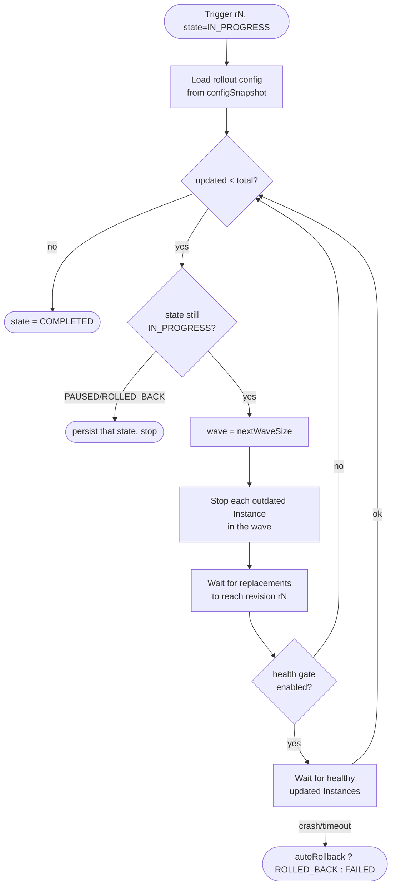
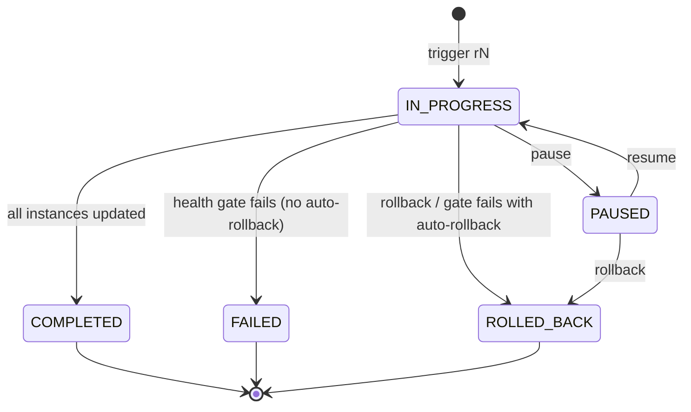

A deployment is how you propagate a Group's current configuration —
template chain, platform build, Module composition — to its running
Instances without taking the Group down. The Scheduler's normal loop
keeps the right *number* of Instances running; it does not restart
existing Instances when the template changes. The deployment subsystem
does: it walks the Group's Instances, replacing outdated ones in
controlled batches until every Instance is on the new revision.

## What you'll learn

- What a deployment is and what fires when you trigger one.
- The rolling-restart algorithm: batches, canary, the health gate.
- How revisions — not plan hashes — decide which Instances are outdated.
- The `IN_PROGRESS` / `PAUSED` / `COMPLETED` / `ROLLED_BACK` / `FAILED`
  state machine and how pause, resume, and rollback drive it.
- How an in-flight rollout survives Controller failover.

## What a deployment is

A deployment is a tracked, revision-numbered rolling restart of one
Group. Each deployment is a `DeploymentRecord` persisted in MongoDB:

| Field | Meaning |
| --- | --- |
| `id` | Auto-assigned numeric record ID. |
| `groupName` | Target Group. |
| `revision` | Monotonic per-Group revision (`r1`, `r2`, …). New deployments take `maxRevision + 1`. |
| `trigger` | What started it. Manual triggers record `"manual"`. |
| `strategy` | Rollout strategy string; defaults to the Group's `updateStrategy` (default `ROLLING`). |
| `state` | One of `IN_PROGRESS`, `PAUSED`, `COMPLETED`, `ROLLED_BACK`, `FAILED`. |
| `templateSnapshot` | JSON map of `templateName → SHA-256 hash` captured at trigger time. |
| `configSnapshot` | JSON blob holding the rollout knobs (batch size, canary, gates, timeouts). |
| `totalInstances` | Count of `RUNNING` Instances in the Group when triggered. |
| `updatedInstances` | Progress counter — how many have been replaced. |
| `createdAt` / `completedAt` | ISO-8601 timestamps. |
| `rollbackOf` | Set when this record is a rollback of another. |

The record is the deployment. There is no separate workflow engine: the
`DeploymentReconciler` reads the record, drives the rollout, and writes
progress and the terminal state back to the same record.

Trigger a deployment with `prexorctl deploy`:

```bash
# Roll the lobby Group forward to its current template chain + composition,
# one Instance at a time (group default).
prexorctl deploy lobby

# Skip the confirmation prompt.
prexorctl deploy lobby --yes
```

A deployment propagates the Group's **current** config. It is not a
"deploy this specific version" command — you change the Group's
templates or composition first (for example with `prexorctl template`
or a Network Composition edit), then `prexorctl deploy <group>` rolls
the change out to running Instances.

## What a revision means

Every `RUNNING` Instance carries a `deploymentRevision`. An Instance is
**outdated** for deployment `rN` when its `deploymentRevision < N`.

The mechanism that makes a rollout converge is simple:

1. Triggering a deployment creates record `rN` in state `IN_PROGRESS`.
2. The reconciler stops the next outdated Instance.
3. The Scheduler's normal placement loop sees the Group is short an
   Instance and launches a replacement. The placement coordinator reads
   the Group's `IN_PROGRESS` deployment and stamps the new Instance with
   that revision (`getInProgressDeployment(group).map(DeploymentRecord::revision)`,
   else `0`).
4. The replacement comes up with `deploymentRevision == N` — it is no
   longer outdated.

So the new template/composition is applied by *relaunch*: a fresh
Instance always builds from the Group's current config. The deployment
revision is the bookkeeping that tells the reconciler which Instances
still need replacing and stamps replacements so they count as done.

This is why there is no "plan hash" idempotency token at the deployment
layer. Convergence is driven by the integer revision on each Instance,
not by comparing composition-plan hashes. Duplicate-rollout protection
comes from two other places (see [Idempotency and failover](#idempotency-and-failover)).

## The rolling-restart algorithm

The reconciler advances the rollout in **waves**. Each wave stops a
batch of outdated Instances, waits for their replacements to come up,
and — if the health gate is on — waits for those replacements to be
healthy before starting the next wave.



### Wave size: batch and canary

There is no `maxUnavailable`. Wave size is computed by
`DeploymentRolloutConfig.nextWaveSize`:

- **First wave, canary set** — if `updatedInstances == 0` and
  `canaryInstances > 0`, the first wave is `min(remaining, canaryInstances)`.
  This rolls a small canary before the rest.
- **Every other wave** — `min(remaining, batchSize)`.

| Config key | CLI flag | Default | Effect |
| --- | --- | --- | --- |
| `batchSize` | `--batch-size` | `1` | Outdated Instances stopped per wave. Clamped to `>= 1`. |
| `canaryInstances` | `--canary-instances` | `0` | Size of the first wave. `0` disables canary. Clamped to `0..total`. |
| `canaryPercent` | `--canary-percent` | — | Alternative to `canaryInstances`; `ceil(total * pct/100)`, min 1 when `pct > 0`. Mutually exclusive with `canaryInstances`. |

`batchSize` defaults to `1` — classic one-at-a-time rolling restart.
Raising it trades availability for rollout speed. The default `0` canary
means the rollout runs uniform batches with no special first wave.

```bash
# Roll 3 at a time after a single-Instance canary.
prexorctl deploy lobby --canary-instances 1 --batch-size 3

# Canary as a percentage of the running fleet instead.
prexorctl deploy lobby --canary-percent 10 --batch-size 5
```

### Stopping and replacement

For each Instance in the wave the reconciler:

1. Selects the next `RUNNING` Instance whose `deploymentRevision < rN`.
2. Calls the stop action (`stopInstanceAction.stop(id, force=false)`),
   a graceful stop. If the stop cannot be issued right now (for example
   the owning node has no live session), the reconciler logs and returns,
   leaving the deployment `IN_PROGRESS` to retry on the next pass.
3. Increments `updatedInstances` and persists progress.

The Scheduler launches the replacement through its normal placement
loop; the deployment does not place Instances itself.

### Waiting for replacements

After a wave's stops, `waitForReplacement` polls (100 ms) until the
count of updated Instances reaches the expected total, or a deadline of
`evaluationIntervalSeconds * 2` passes (default `15 * 2 = 30s`). If the
deadline passes with no replacement, the reconciler logs a warning and
**continues anyway** — it does not fail the deployment on a slow
replacement.

"Updated" here means: `deploymentRevision >= rN` and state is not
`STOPPED` and not `CRASHED`.

### The health gate

The health gate is off by default. When `healthGateEnabled` is true,
each wave additionally calls `waitForHealthyUpdatedInstances` before
advancing:

| Config key | CLI flag | Default | Effect |
| --- | --- | --- | --- |
| `healthGateEnabled` | `--health-gate` | `false` | Require updated Instances to be healthy before the next wave. |
| `promotionTimeoutSeconds` | `--promotion-timeout` | `0` | Health-gate wait deadline. `0` falls back to `evaluationIntervalSeconds * 2`. |
| `minHealthySeconds` | `--min-healthy` | `0` | Minimum uptime before an updated Instance counts as healthy. `0` = healthy as soon as `RUNNING`. |
| `autoRollbackOnFailure` | `--auto-rollback` | `false` | On gate failure, end the deployment `ROLLED_BACK` instead of `FAILED`. |

The gate wait succeeds when enough updated Instances are healthy:

- Healthy = state `RUNNING`. With `minHealthySeconds > 0`, also
  `uptimeMs >= minHealthySeconds` (stable, not just up).
- The wait **fails immediately** if any updated Instance is `CRASHED`.
- The wait fails on timeout if not enough updated Instances are healthy
  within `promotionTimeoutSeconds`.

On gate failure the deployment leaves the loop with a terminal state:
`ROLLED_BACK` if `autoRollbackOnFailure` is set, otherwise `FAILED`.

```bash
# Canary 2, gate on, each Instance must be up 60s before the next wave,
# fail the rollout if a replacement crashes or doesn't stabilize in 5 min.
prexorctl deploy lobby \
  --canary-instances 2 \
  --batch-size 4 \
  --health-gate \
  --min-healthy 60 \
  --promotion-timeout 300
```

Note: `autoRollbackOnFailure` marks the record `ROLLED_BACK`. It does
**not** automatically relaunch Instances onto the previous config —
restoring template/composition state is operator-driven (see
[Rollback](#rollback)).

## The state machine



The reconciler re-reads the live record state at the top of every wave.
If it finds `PAUSED` or `ROLLED_BACK`, it stops driving and persists that
state. `COMPLETED` is set when `updatedInstances >= totalInstances`.

### Pause and resume

Pause stops the rollout where it is. It does not roll anything back and
does not touch Instances already updated or still on the old revision.

```bash
prexorctl deploy pause lobby 7      # group, revision
prexorctl deploy resume lobby 7
```

Mechanically:

- `pause` sets the record state to `PAUSED`. The running reconciler
  notices at its next wave boundary (or during a wait, via the step
  guard) and stops.
- `resume` sets the state back to `IN_PROGRESS` and starts a fresh
  reconcile thread (`controller.scheduler().rollingRestart(deployment)`)
  that picks up from the current `updatedInstances` count.

There is no auto-pause on consecutive failures and no configurable
failure threshold. The health gate either advances the wave or ends the
deployment in a terminal state; it does not park it in `PAUSED`. Pause is
an operator action.

### Rollback

```bash
prexorctl deploy rollback lobby 7
```

`rollback` sets the deployment's state to `ROLLED_BACK`. That stops the
reconciler at the next boundary. It does **not** automatically relaunch
Instances onto the previous template/composition — as the CLI help
states, "restoring template/module state is operator-driven." To return
to the old configuration you revert the Group's templates/composition and
trigger a new deployment forward to that reverted state.

There is no automatic rollback except the health-gate
`autoRollbackOnFailure` path, which also only marks the record
`ROLLED_BACK`. The design keeps the operator in the loop: a flapping
canary should not blow away a fleet on its own.

## Idempotency and failover

Deployment records live in MongoDB, so a rollout survives Controller
restart and failover. Two guards keep concurrent or restarted
Controllers from racing on the same rollout:

- **In-process dedup.** The Scheduler keeps an `activeDeployments` set
  keyed by `group:revision`. A second `rollingRestart` for the same key
  is skipped while one is running.
- **Distributed lease.** Before reconciling, the Scheduler acquires a
  per-Group lease (`group:<name>`). If another Controller holds it, this
  Controller skips and retries on the next tick. The reconciler also
  re-checks the lease via a step guard between waves and during waits, so
  it stops cleanly if it loses ownership mid-rollout.

On startup and periodically, `reconcilePersistedDeployments` scans
MongoDB for records in state `IN_PROGRESS` (`getDeploymentsByState("IN_PROGRESS", 50)`)
and resumes each on a virtual thread. In a cluster this scan runs under
the Raft-backed `deployment-reconciler` lease (5-minute TTL) so only one
Controller drives it. An in-flight rollout therefore continues after the
Controller that started it dies — a survivor picks the record back up and
keeps replacing outdated Instances from where the counters left off.

Because progress is derived from live Instance revisions, recovery is
self-correcting: even if `updatedInstances` is stale, the reconciler
recomputes it by counting Instances at `deploymentRevision >= rN` before
resuming.

## Inspecting deployments

```bash
# History for a group (paginated).
prexorctl deploy list lobby
prexorctl deploy list lobby --page 2 --page-size 25

# One deployment, including resolved rollout config.
prexorctl deploy show lobby 7
```

`deploy show` prints the resolved rollout block — batch size, canary
instances, health gate, auto-rollback, promotion timeout, min-healthy —
parsed back out of the stored `configSnapshot`.

### REST API

The CLI is a thin wrapper over the Deployments REST routes under a Group:

| Method + path | Permission | Purpose |
| --- | --- | --- |
| `GET /api/v1/groups/{name}/deployments` | `GROUPS_VIEW` | List history (paginated; `page`, `pageSize`, max page size 100). |
| `GET /api/v1/groups/{name}/deployments/{rev}` | `GROUPS_VIEW` | One deployment record. |
| `POST /api/v1/groups/{name}/deploy` | `GROUPS_UPDATE` | Trigger; returns `202` with the new record. |
| `POST /api/v1/groups/{name}/deployments/{rev}/pause` | `GROUPS_UPDATE` | Set `PAUSED`. |
| `POST /api/v1/groups/{name}/deployments/{rev}/resume` | `GROUPS_UPDATE` | Set `IN_PROGRESS` + restart reconcile. |
| `POST /api/v1/groups/{name}/deployments/{rev}/rollback` | `GROUPS_UPDATE` | Set `ROLLED_BACK`. |

The trigger body is optional JSON. Any omitted field falls back to the
Group default (strategy) or the rollout default. Validation runs at the
route:

```json
{
  "strategy": "rolling",
  "batchSize": 4,
  "canaryInstances": 2,
  "healthGateEnabled": true,
  "autoRollbackOnFailure": false,
  "promotionTimeoutSeconds": 300,
  "minHealthySeconds": 60
}
```

Rejected combinations (`400 BAD_REQUEST`):

- `batchSize <= 0`
- `canaryInstances < 0`
- `canaryPercent` outside `0..100`
- both `canaryInstances` and `canaryPercent` set
- `promotionTimeoutSeconds <= 0`
- `minHealthySeconds < 0`

## Worked example

Roll `lobby` (10 running Instances) to a new template chain with a
1-Instance canary, batches of 3, and a 30-second stability gate.

```bash
# 1. Update the Group's template chain (or composition) first.
prexorctl template push lobby-base:v18
# (associate it with the group via your normal template/composition flow)

# 2. Trigger the rollout.
prexorctl deploy lobby \
  --canary-instances 1 \
  --batch-size 3 \
  --health-gate \
  --min-healthy 30 \
  --promotion-timeout 120
```

What happens:

1. Record `rN` is created `IN_PROGRESS`, `totalInstances=10`.
2. **Wave 1 (canary):** 1 outdated Instance is stopped; placement
   relaunches it at revision `rN`. The gate waits up to 120 s for it to
   be `RUNNING` for at least 30 s.
3. **Waves 2–4:** 3 Instances per wave, each gated the same way
   (3 + 3 + 3 = 9, total 10).
4. If every gate passes, `updatedInstances` reaches 10 and the record
   flips to `COMPLETED`.

If a canary replacement crashes, the gate fails immediately. With
`--health-gate` and no `--auto-rollback`, the record ends `FAILED` and
the remaining Instances stay on the old revision — you investigate, fix
the template, and deploy forward again. Pause mid-rollout to hold the
fleet while you look:

```bash
prexorctl deploy pause lobby <rev>
# ...investigate...
prexorctl deploy resume lobby <rev>
```

## Related

- [Scheduling and scaling](/concepts/scheduling-and-scaling/) — the
  placement loop that launches replacements and stamps revisions.
- [Groups, Instances, Templates](/concepts/groups-instances-templates/) —
  what a deployment propagates and where templates and composition live.
- [Cluster model](/concepts/cluster-model/) — leases, failover, and which
  Controller drives reconciliation.
