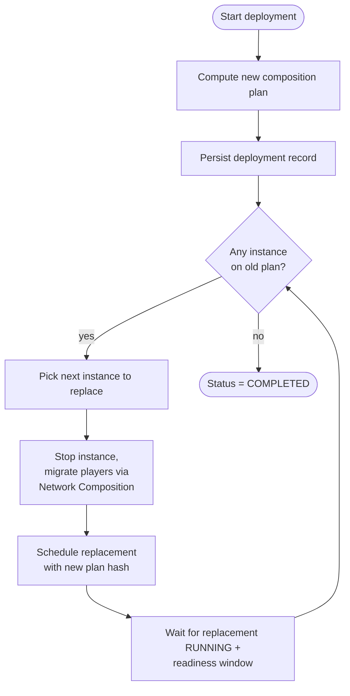

A deployment is how you change a group's effective configuration in
production: a new template version, a new platform jar, an updated
module-supplied workload extension. The scheduler's normal
"rebuild instances on the next start" loop is too coarse — you need
controlled, observable, reversible change. That's the deployment
subsystem.

## What you'll learn

- What a deployment is and what fires when you start one.
- The rolling-restart algorithm: `maxUnavailable`, replacement
  ordering, ready-checks.
- Why composition plans are hash-keyed and what that means for
  idempotency.
- Pause, resume, and rollback — how operator interventions work mid-
  deployment.
- How deployments survive controller failover.

## What a deployment is

A **deployment** is a tracked rolling restart of a group's instances
toward a new desired configuration. Each deployment has:

- An ID (`dep-2026-05-08-17-42`).
- A target group (`lobby`).
- A target configuration delta (template version, runtime jar, env
  changes).
- A status (`PENDING`, `IN_PROGRESS`, `PAUSED`, `COMPLETED`,
  `ROLLED_BACK`, `FAILED`).
- A persisted record in MongoDB (`deployments` collection).

```bash
# Roll lobby forward to the latest version of the lobby template
prexorctl deployment start lobby --template lobby:v18

# Roll forward and wait until completion
prexorctl deployment start lobby --template lobby:v18 --wait
```

The deployment record drives the [scheduler](/concepts/scheduling-and-scaling/)
to replace instances one at a time (or in parallel up to
`maxUnavailable`) until every instance is on the new config.

## The rolling-restart algorithm



### `maxUnavailable`

Controls how many instances can be down at once during the rollout. The
default is 1 — instances replace one at a time, classic conservative
rolling restart. Higher values trade availability for rollout speed.

```yaml
deployments:
  defaults:
    maxUnavailable: 1
    readinessWindowSeconds: 30
    failureThreshold: 2          # consecutive failed replacements before pausing
```

`maxUnavailable` is per-group; it can be overridden per-deployment via
`prexorctl deployment start lobby --max-unavailable 2`.

### Ordering

The scheduler picks instances to replace in a deterministic order:

1. Instances on the oldest config first (in case the deployment is
   stacking on a previous incomplete one).
2. Instances on the most-loaded nodes first (so we re-spread as we go).
3. Instances on the highest-numbered IDs first (so `lobby-9` rolls
   before `lobby-2`).

This is conservative — the goal is to leave the network in a
predictable, observable state at every step.

### Replacement and the readiness window

For each instance:

1. The scheduler emits `INSTANCE_STOPPING` and instructs the daemon to
   stop gracefully.
2. The proxy plugins observe the SSE event and migrate connected
   players to fallback instances via the [Network
   Composition](/concepts/groups-instances-templates/) chain.
3. Once the daemon reports `STOPPED`, a new composition plan is
   persisted and dispatched to a daemon (typically the same node
   subject to scheduling rules).
4. The replacement instance walks the lifecycle FSM:
   `SCHEDULED → PREPARING → STARTING → RUNNING`.
5. The deployment **waits a readiness window** (`readinessWindowSeconds`,
   default 30s) after `RUNNING`. If the instance does not crash inside
   the window, the replacement is considered successful.
6. The next instance is picked.

If a replacement crashes inside the readiness window, the deployment's
failure counter increments. After `failureThreshold` consecutive
failures, the deployment auto-pauses (see below).

## Plan-hash idempotency

Every composition plan carries a `planHash` covering the template
chain hashes, runtime jar reference, workload extensions, env, and
plugin token. The hash is the deployment's idempotency token.

The implications:

- **Replays are safe.** If the controller dispatches a `Start` and dies
  before recording the ack, another controller can dispatch the same
  plan again. The daemon checks the `planHash` against any plan it has
  already applied for this instance and refuses double-starts.
- **Drift is loud.** If a daemon's locally-cached template hash does
  not match what the plan claims, the start fails fast — the operator
  sees "stale template on node-3" rather than a silently-bad instance.
- **Deployments are diffs.** A new template version produces a new
  plan hash, the deployment knows which instances are still on the old
  hash, and the rollout proceeds against that diff.

The plan store (`instance_composition_plans` collection) keeps every
plan ever generated; operators can introspect what plan a given
instance is supposed to be running via
`GET /api/v1/instances/{id}/plan`.

## Pause and resume

Operators can pause a deployment mid-rollout. Use cases:

- A replacement crashed and you want to investigate before rolling more.
- Auto-pause fired (failure threshold hit) and you want to inspect.
- A conflicting incident happened and you want the deployment held.

```bash
prexorctl deployment pause dep-2026-05-08-17-42
prexorctl deployment resume dep-2026-05-08-17-42
```

A paused deployment:

- Stops picking new instances to replace.
- Does *not* roll back instances already on the new config.
- Does *not* affect instances still on the old config — they keep
  running.
- Persists the pause reason in the deployment record.

`DEPLOYMENT_PAUSED` and `DEPLOYMENT_RESUMED` events fire on the SSE bus
so the dashboard reflects state immediately.

### Auto-pause

The deployment auto-pauses on:

- `failureThreshold` consecutive replacement failures within the
  readiness window.
- A capability dependency disappearing mid-rollout (e.g. a module
  being uninstalled).
- An operator-issued `prexorctl deployment pause`.

Auto-pauses always carry a reason in the record so post-mortem is easy.

## Rollback

Rolling back is a deployment in the other direction:

```bash
prexorctl deployment rollback dep-2026-05-08-17-42
```

Mechanically, rollback creates a *new* deployment that targets the
*previous* config and rolls every instance currently on the new config
back to the old. The original deployment record is closed with
`ROLLED_BACK`.

There is no automatic rollback. We intentionally make operators decide
to roll back — auto-rollback systems either roll back too eagerly
(blowing away a successful canary because of a flap) or too lazily.
`failureThreshold + auto-pause + operator-rollback` is the pattern that
gives operators control without surprises.

## Deployments survive failover

Deployments are persisted **workflows**. The deployment record lives in
MongoDB; the in-flight rollout state (which instances replaced, which
remain) is reconstructable from the live `ClusterState` plus the
persisted record.

The active-active HA model gates deployments on the **per-group lease**:

- Only the controller holding `prexor:v1:lease:group:<name>` may pick
  the next instance to replace.
- If that controller dies mid-rollout, another controller acquires the
  lease after expiry, reads the deployment record, reconciles state,
  and continues from where the previous owner stopped.
- Plan-hash idempotency makes mid-replacement failover safe: if the
  old controller dispatched a `Start` that the new controller's
  reconciliation can't tell whether the daemon received, dispatching it
  again is harmless.

Standby promotion on deployments is exercised at the four `RecoveryTest`
points: drain, deployment, placement-time, and in-flight module
mutation. The harness shows that a controller restart mid-failover
resumes without duplicate replacements.

See [Cluster Model](/concepts/cluster-model/) for the lease and fencing
model.

## What survives failure cases

| Failure | Behaviour |
|---|---|
| Replacement crashes inside readiness window | Failure counter increments; auto-pause after `failureThreshold` |
| Replacement crashes after readiness window passed | Treated as a normal crash; deployment continues; [crash-loop detector](/concepts/scheduling-and-scaling/) may pause the group separately |
| Daemon disconnects mid-replacement | Replacement instance is `CRASHED` on reconnect (or replan if it never appeared); deployment treats it as a failed replacement |
| Controller dies mid-replacement | Another controller picks up the deployment after lease expiry |
| MongoDB outage | Deployment progress freezes (no further dispatches); resumes on Mongo recovery |
| Valkey outage in production | Lease ownership cannot be re-acquired; deployment freezes; resumes on Valkey recovery |

## Watching a deployment

```bash
# Show deployment progress
prexorctl deployment status dep-2026-05-08-17-42

# Stream events for the deployment
prexorctl events --filter "DEPLOYMENT_*,INSTANCE_*" --group lobby
```

The dashboard's deployments page shows the full timeline — events fired,
instances replaced, time per replacement, current status — pulled from
the deployment record plus the SSE event stream.

## Tuning knobs

| Knob | Default | What it changes |
|---|---|---|
| `deployments.defaults.maxUnavailable` | 1 | Instances down at once during rollout |
| `deployments.defaults.readinessWindowSeconds` | 30 | How long after `RUNNING` to wait before counting a replacement successful |
| `deployments.defaults.failureThreshold` | 2 | Consecutive failures that trigger auto-pause |
| `deployments.maxConcurrentPerCluster` | unlimited | If set, caps how many deployments run concurrently across all groups |

Per-deployment overrides via `prexorctl deployment start <group> --max-unavailable N --readiness-seconds N`.

## What deployments don't do

- **Cross-group orchestration.** A deployment targets one group at a
  time. If you want "roll lobby first, then bedwars," chain two
  deployments via the CLI or the REST API.
- **Blue-green.** v1 only does rolling restart. Blue-green requires a
  per-group secondary and routing toggles we haven't built. The
  proxy-side [Network Composition](/concepts/groups-instances-templates/)
  could carry it; v2 conversation.
- **Canary by traffic split.** Same — proxy plugins do not currently
  weight routing. v2 conversation.

## Next up

- [Scheduling and Scaling](/concepts/scheduling-and-scaling/) — how the
  per-group lease drives deployment ownership.
- [Groups, Instances, Templates](/concepts/groups-instances-templates/) —
  what the deployment is rolling toward.
- [Cluster Model](/concepts/cluster-model/) — failover semantics, lease
  expiry, fencing.
- [Events](/concepts/events/) — `DEPLOYMENT_*` and `INSTANCE_*` events
  on the SSE bus.
