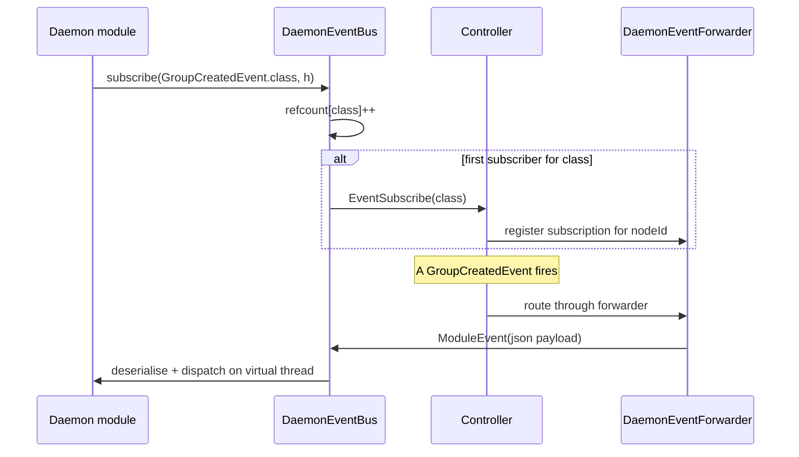

The controller is the live narrator of the cluster. Twenty-two event
types flow through one bus and one SSE stream — group, instance, node,
player, deployment, module, capability, network, choreography, journey.
This page is the consumer-side model: what the bus is, what it
guarantees, who consumes it, and how daemon-side subscribers register.

## What you'll learn

- The single `EventBus` contract that platform modules, daemon modules,
  and the controller all share.
- How SSE consumers connect, authenticate, and replay missed events.
- The 22 event types in the catalogue.
- How daemon-side subscribers register interest over the gRPC stream.
- What is *not* on the bus, and why.

## One bus, one contract

In v1.x there were two `EventBus` types — a plugin-side one in
`cloud-api` and a controller-internal one. The Layer 3 + 4 overhaul
collapsed those into a single `api.event.EventBus` contract that the
controller's bus implements. Modules, plugins, and daemon-side code all
compile against the same interface.

```java
public interface EventBus {
    <T extends CloudEvent> EventSubscription subscribe(
        Class<T> type, EventHandler<T> handler);
    <T extends CloudEvent> EventSubscription subscribeByType(
        String typeName, EventHandler<T> handler);
    void publish(CloudEvent event);
}
```

The handler interface:

```java
public interface EventHandler<T extends CloudEvent> {
    void onEvent(T event);
}
```

`subscribe` returns an `EventSubscription` for handle-based unsubscribe.
Long-lived subscribers keep the handle and call `subscription.unsubscribe()`
on shutdown; short-lived ones close it on a Closeable hook.

## Who publishes what

Events come from three sources:

| Source | Publishes | Example types |
|---|---|---|
| Controller core | All cluster-state changes | `INSTANCE_STARTED`, `NODE_DRAINED`, `MODULE_ACTIVATED` |
| Modules (controller-side) | Module-defined events through `ctx.events().publish(...)` | `LeaderboardRecomputed`, `WebhookDispatched` |
| Plugins (server-side, via REST) | Player events, RCON acks | `PLAYER_JOIN`, `PLAYER_TRANSFER` |

The controller does not let modules or plugins arbitrarily publish
controller-internal events — there is a domain boundary. Modules can
publish *their own* `CustomCloudEvent` subclasses; they cannot fake an
`InstanceStartedEvent`.

## SSE: the operator-facing surface

The controller exposes a single SSE stream at
`GET /api/v1/events/stream`. Every event the bus sees flows out through
it.

### Connecting

```bash
# 1. Exchange a JWT for a 30-second SSE ticket
TICKET=$(curl -s -X POST -H "Authorization: Bearer $JWT" \
    "$CONTROLLER/api/v1/events/ticket" | jq -r .ticket)

# 2. Stream
curl -N "$CONTROLLER/api/v1/events/stream?ticket=$TICKET"
```

Why a ticket: `EventSource` (the browser's SSE client) cannot set
`Authorization` headers. The dashboard exchanges its long-lived JWT for
a short-lived ticket on a JWT-authenticated POST and connects with the
ticket as a query parameter. The same pattern applies to
`/services/{id}/console`, `/system/logs/stream`, and
`/nodes/{id}/logs/stream`. See [Security](/concepts/security/).

### Sequence and replay

Each event carries a monotonic sequence number. Clients reconnect with
`Last-Event-ID: <seq>` and the server replays missed events from the
per-client buffer.

In `production` profile the replay buffer lives in Valkey and survives
controller restart; in `development` it lives in process memory and is
cleared on restart. See [Cluster Model](/concepts/cluster-model/).

The replay window is bounded — old events fall off, dashboards that
disconnect for hours rather than minutes will skip the gap. The full
state model is always reachable via REST; SSE is the *delta channel*.

### The dashboard side

The dashboard does the same exchange internally via `useSseEventBus()`:

```ts
const { events, connect, disconnect } = useSseEventBus({
  filter: ['INSTANCE_*', 'NODE_*'],
});
onMounted(connect);
onUnmounted(disconnect);
```

Filters are applied client-side; the server still sends the firehose to
each subscriber. (We may revisit this if the firehose becomes
expensive.)

## The 22 event types

| Category | Types |
|---|---|
| Group | `GROUP_CREATED`, `GROUP_UPDATED`, `GROUP_DELETED`, `GROUP_PAUSED` |
| Instance | `INSTANCE_SCHEDULED`, `INSTANCE_STARTED`, `INSTANCE_STOPPING`, `INSTANCE_STOPPED`, `INSTANCE_CRASHED` |
| Node | `NODE_CONNECTED`, `NODE_DISCONNECTED`, `NODE_DRAINED` |
| Player | `PLAYER_JOIN`, `PLAYER_LEAVE`, `PLAYER_TRANSFER`, `PlayerJourneyEvent` |
| Deployment | `DEPLOYMENT_STARTED`, `DEPLOYMENT_PAUSED`, `DEPLOYMENT_RESUMED`, `DEPLOYMENT_COMPLETED`, `DEPLOYMENT_ROLLED_BACK` |
| Module | `MODULE_INSTALLED`, `MODULE_ACTIVATED`, `MODULE_DEACTIVATED`, `MODULE_UNINSTALLED` |
| Capability | `CAPABILITY_REGISTERED`, `CAPABILITY_DEREGISTERED`, `CAPABILITY_PROVIDER_CHANGED` |
| Network | `NETWORK_UPDATED` |
| Choreography | `CHOREOGRAPHY_OVERLAY_ACTIVATED`, `CHOREOGRAPHY_OVERLAY_DEACTIVATED` |

The full enumeration lives under `cloud-api/.../api/event/`. Every type
implements `CloudEvent` so it flows through the bus and the SSE stream
unchanged.

## Daemon-side subscribers

Daemon modules subscribe to events the same way platform modules do:

```java
@Override
public void onStart(ModuleContext ctx) {
    ctx.events().subscribe(GroupCreatedEvent.class, this::onGroupCreated);
}
```

The daemon's `EventBus` implementation is **subscribe-registered** — it
does not receive the firehose. The flow:



Per-class refcounts gate the cross-stream `EventSubscribe` /
`EventUnsubscribe` traffic — only the first local subscriber to a class
sends `EventSubscribe`, only the last unsubscribe sends
`EventUnsubscribe`. The controller's `DaemonEventForwarder` keeps a
`Map<nodeId, Map<eventType, EventSubscription>>` and only fans out
events the daemon has asked for.

On daemon reconnect after a brief gRPC stream loss, the daemon re-sends
the full set of currently-subscribed event types via the
`ReconnectManager.addReconnectListener` hook. The controller does not
drift out of sync.

Latency target for daemon dispatch is ≤ 250ms; the integration test
caps acceptance at 1.5s to absorb harness boot and GC noise on shared
CI runners.

See [Daemon Modules](/concepts/modules/daemon/) for the full daemon-
side contract.

## Cross-controller fanout

In `production` (HA) the EventBus is bridged across controllers via
Valkey pub/sub. A module loaded on controller A that subscribes to
`InstanceCrashedEvent` receives crashes the scheduler running on
controller B publishes. The bridge lives in `RedisEventBridge`.

In `development` (no Valkey), the bridge is absent. Each controller
process has its own EventBus.

## What is *not* on the bus

Some signals are deliberately not events:

- **Heartbeats.** The gRPC stream itself is the heartbeat — emitting a
  `HEARTBEAT` event would be redundant noise.
- **Log lines.** Logs go through Logback and the controller-log SSE
  channel. The EventBus is for state transitions, not output.
- **Per-line console.** Console output streams through its own SSE
  endpoint with its own ticket auth. Same reason.
- **Metrics.** Prometheus is the observable for metrics. See
  [Observability](/operations/monitoring/).

The rule: **events are state transitions, not data flow.** A new HTTP
request is not an event. A login is. An instance changing state is.

## A consumer-side worked example

Subscribe to crashes, send a webhook on each:

```java
public final class CrashWebhookModule implements PlatformModule {
    private CapabilityHandle<NotifierService> notifier;

    @Override
    public void onStart(ModuleContext ctx) {
        notifier = ctx.capabilities().resolve("prexor.notifier",
                                              NotifierService.class);
        ctx.events().subscribe(InstanceCrashedEvent.class, this::onCrash);
        ctx.events().subscribe(GroupPausedEvent.class, this::onGroupPaused);
    }

    private void onCrash(InstanceCrashedEvent e) {
        var n = notifier.get();
        if (n == null) return;
        n.notify("ops",
            "Instance " + e.instanceId()
            + " crashed (" + e.classification() + ")");
    }

    private void onGroupPaused(GroupPausedEvent e) {
        var n = notifier.get();
        if (n == null) return;
        n.notify("ops",
            "Group " + e.groupName() + " auto-paused: " + e.reason());
    }
}
```

Subscriptions are scoped to module lifecycle. `onStop` clears them
automatically.

## Next up

- [Architecture](/concepts/architecture/) — how the SSE bus fits into
  the controller's subsystems.
- [Daemon Modules](/concepts/modules/daemon/) — full subscribe-
  registration mechanics.
- [Capabilities](/concepts/modules/capabilities/) — capability lifecycle
  events.
- [Observability](/operations/monitoring/) — metrics, logs, and
  events as the three signals.
