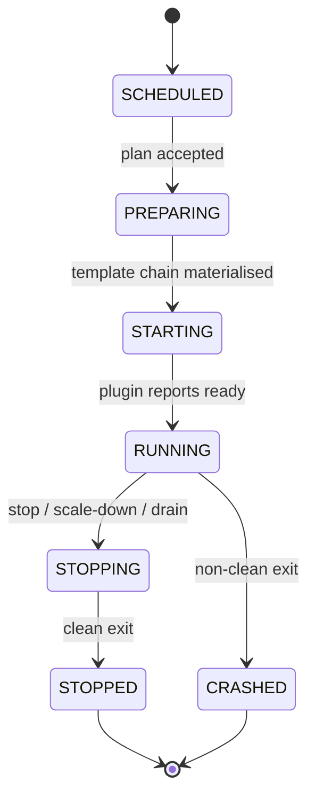

A Minecraft network is built out of three repeating shapes: **groups** (the
config that drives scheduling), **instances** (the running JVMs), and
**templates** (the layered file bundles that produce them). Get these three
right and the rest of the system falls out: scaling is a group property,
deployments are template swaps, drains move instances between nodes,
crashes are instance events. This page is the deep dive on the three.

## What you'll learn

- What a group is, what its scaling modes mean, and how groups depend on
  each other.
- The instance lifecycle FSM and the per-instance composition plan.
- How template chains layer files deterministically and why every layer
  is hashed.
- Where Network Composition fits — the routing record proxy plugins
  consume to land players in the right group.

## Groups

A **group** is a logical collection of instances that share configuration:
platform, version, templates, scaling rules, port range, env, resource
hints. It is the unit of scaling, deployment, and template management.

```yaml
name: lobby
platform: paper
version: 1.21.4
templates:
  - base
  - base-paper
  - lobby
scaling:
  mode: DYNAMIC
  min: 2
  max: 10
  target: 0.7        # 70% player load triggers scale-up
  cooldownSeconds: 60
ports:
  range: 25600-25699
dependsOn:
  - proxy
labels:
  region: eu-west
```

### Scaling modes

| Mode | Behaviour |
|---|---|
| `STATIC` | Maintain exactly `min` instances. Scaling beyond that requires editing the group. |
| `DYNAMIC` | Auto-scale between `min` and `max` based on player-load thresholds with cooldowns. |
| `MANUAL` | The scheduler does not add or remove instances. Operators do it explicitly via `prexorctl group scale`. |

`DYNAMIC` is the default for production lobbies. `STATIC` is right when a
group has deterministic IDs (the proxy group, a hub, a creative-mode
overworld) and `MANUAL` is for one-off staging environments.

### Dependencies

Groups carry an optional `dependsOn` list. If `bedwars` depends on
`lobby`, the scheduler topologically sorts groups (Kahn's algorithm) so
lobbies come up before the games that fall back to them. Cyclic
dependencies are rejected at config-load time.

### Affinity and anti-affinity

Group placement constraints reference node labels:

| Constraint | Effect |
|---|---|
| `affinity: { region: eu-west }` | Only nodes labelled `region=eu-west` are eligible. |
| `antiAffinity: { gpu: true }` | Nodes labelled `gpu=true` are excluded. |

The scheduler's `WeightedNodeSelector` combines affinity matches, current
load, free ports, and anti-spread (avoid stacking instances of the same
group on one node) into a placement score per candidate.

See [Scheduling and Scaling](/concepts/scheduling-and-scaling/) for the
full placement algorithm.

## Instances

An **instance** is one running Minecraft server or proxy process — a Paper
JVM, a Velocity JVM, a Folia JVM. Each instance has:

- A unique ID (`lobby-3`, `bedwars-7`).
- A node (where it runs), a port (allocated from the group's range), and
  a per-instance plugin token.
- A state in the lifecycle FSM.

### The lifecycle FSM



| State | Owner | Meaning |
|---|---|---|
| `SCHEDULED` | controller | Placement decided, plan persisted, daemon not yet acked |
| `PREPARING` | daemon | Template chain materialising, runtime jar staging |
| `STARTING` | daemon | JVM spawned, plugin loading |
| `RUNNING` | controller | Plugin registered, instance accepting players |
| `STOPPING` | daemon | Shutdown initiated, players migrating |
| `STOPPED` | controller | Clean exit recorded |
| `CRASHED` | controller | Non-clean exit; classified by the daemon |

Crashes are classified into OOM, SIGKILL, clean, or unknown. The daemon
captures the console tail and reports a `CrashReport` over gRPC. The
controller's [crash-loop
detector](/concepts/scheduling-and-scaling/) watches for "≥ N crashes in
window W" and pauses the group automatically until you investigate.

### Composition plans

When the scheduler decides an instance should exist, it generates a
**composition plan** and persists it to MongoDB before dispatching the
start. A plan is the daemon's complete instruction set:

```text
{
  instanceId:        "lobby-3",
  group:             "lobby",
  templateChain:     [<hash-base>, <hash-base-paper>, <hash-lobby>],
  runtimeJar:        { sha256: <hex>, url: "..." },
  workloadExtensions: [{ moduleId: "stats-aggregator", jar: <hash> }, ...],
  envPatches:        { CLOUD_INSTANCE_ID: "lobby-3", ... },
  pluginToken:       "ptk_...",
  planHash:          <sha256 of all of the above>
}
```

Plans are hash-keyed and idempotent. If the controller dies between
persistence and dispatch, another controller acquires the per-group
[lease](/concepts/cluster-model/), finds the persisted plan, and
dispatches. The daemon will not double-start an instance whose `planHash`
matches one it has already applied.

## Templates

A **template** is a versioned set of files (configs, plugins, worlds) plus
JVM args. Templates compose in a chain: every instance start is built
from

```
base → base-{platform} → {group} → user-templates...
```

merged in order. Each layer overlays files; later layers win.

### Why layers

This is how config stays DRY:

- `base` carries everything every instance gets — health probes,
  controller-RCON config, the cloud plugin jar.
- `base-paper` adds Paper-specific JVM tuning, `paper-global.yml`, the
  `paper.yml` defaults the operator wants for every Paper instance.
- `lobby` (named for its group) adds lobby plugins, the lobby world, the
  lobby `bukkit.yml`.
- `eu-events` (a user template) adds region-specific event handlers.

You change `base-paper` once and every Paper instance everywhere picks it
up on the next deployment. You don't fork the world to tweak one config.

### File semantics

Files in later layers replace files in earlier layers by path. Directory
trees union. Special-case files like `server.properties` are merged
key-by-key by the daemon; everything else is byte-replace.

Variable substitution applies as the daemon writes files: `{PORT}`,
`{INSTANCE_ID}`, `{GROUP}` are replaced with the resolved values. This is
how `server.properties` ends up with the right port without per-instance
templates.

### Hashing

Every template layer is hashed when the controller stores it. The
composition plan carries the full chain of hashes. The daemon checks
each hash before applying. A hash mismatch (operator forgot to upload an
updated template to one node, or a template was tampered with on disk)
fails the start fast — the daemon refuses to materialise a stale layer.

This is also why deployments are template swaps: change the `lobby`
template, the next composition plan carries new hashes, every new instance
gets the new files. Existing instances roll over via a [rolling
restart](/concepts/deployments/).

### Authoring templates

```bash
# Create a template from a directory of files
prexorctl template create lobby ./templates/lobby/

# List versions
prexorctl template versions lobby

# Roll a group forward to a specific template version
prexorctl deployment start lobby --template lobby:v17
```

Templates are stored as MongoDB metadata plus on-disk files under
`templates/<name>/<version>/`. The daemon downloads templates lazily on
first reference.

## Network Composition

A **Network Composition** is a first-class controller record describing
which proxy fronts which lobby and what the fallback chain is. It is not
a property of any one group — it ties multiple groups together.

```java
record NetworkComposition(
    String name,
    String proxyGroup,
    String lobbyGroup,
    List<String> fallbackGroups,
    String kickMessage
) { }
```

Stored in MongoDB (`networks` collection), exposed via REST CRUD at
`/api/v1/networks`, seeded on first install from `controller.yml:
networks:`. Proxy plugins fetch it from the read-only
`/api/proxy/networks` endpoint with their plugin token, cache it
in-process, and route accordingly:

- **On player connect:** walk `[lobbyGroup] ++ fallbackGroups` for an
  available instance.
- **On kick:** walk the same chain (excluding the kicking group) to find
  a recovery target.
- **On exhausted chain:** disconnect with the network's `kickMessage`.

The proxy plugins are deliberately dumb. They cache one HTTP response and
route by it. There is no plugin-side state to drift, no `velocity.toml`
to keep in sync. Operators change topology by editing the network record;
every proxy instance re-routes within milliseconds.

```yaml
# controller.yml seed
networks:
  - name: main
    proxyGroup: proxy
    lobbyGroup: lobby
    fallbackGroups: [lobby-overflow]
    kickMessage: "<red>The lobby is full. Try again in a few minutes."
```

## How the three connect

A worked example, end-to-end:

1. Operator updates the `lobby` template to v18 (new plugin jar).
2. `prexorctl deployment start lobby --template lobby:v18` enqueues a
   rolling restart.
3. Scheduler holds the per-group lease, drains instances one at a time.
4. For each replacement, a new composition plan is generated with the
   v18 template hash. Plan is persisted to MongoDB.
5. Daemon receives the plan, materialises the chain
   `base → base-paper → lobby:v18`, layers the Paper jar, spawns the JVM.
6. Plugin loads, registers, hits `RUNNING`.
7. Proxy plugins (which cache the Network Composition) keep landing
   players on lobbies via the same chain — they don't care that one
   instance was replaced.
8. Old instance is reaped after the replacement is healthy.

That whole arc is operator-introspectable, replayable from the audit log,
and required zero proxy-plugin YAML edits.

## Next up

- [Scheduling and Scaling](/concepts/scheduling-and-scaling/) — how the
  scheduler picks nodes, when it scales, how cooldowns work.
- [Deployments](/concepts/deployments/) — rolling restarts, pause and
  resume, plan-hash idempotency.
- [Module System](/concepts/modules/) — how modules ship workload
  extensions that flow into composition plans.
- Network Composition reference —
  the source-of-truth doc for the routing record.
