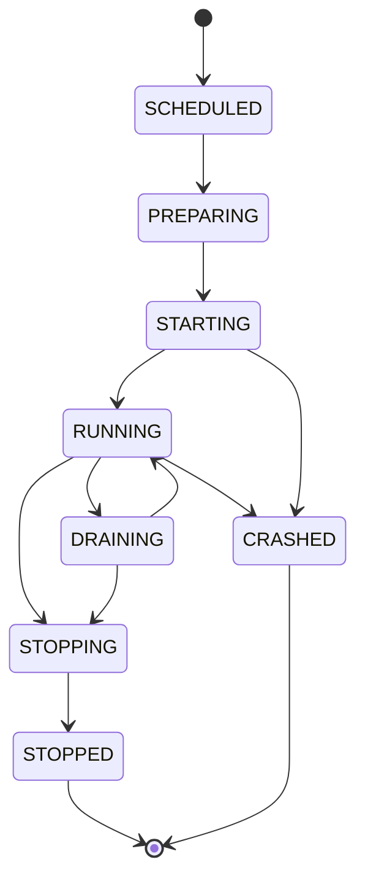

PrexorCloud builds a Minecraft network from three nouns:

- **Group** — the configuration that drives scheduling, scaling, and placement.
- **Instance** — one running server or proxy process, with a state in a lifecycle FSM.
- **Template** — a SHA-256-versioned bundle of files, composed in a fixed chain into every Instance.

Get these three right and the rest follows: scaling is a Group property, deployments are Template hash swaps, and crashes are Instance state events. This page is the reference for all three.

## What you'll learn

- Every field of a Group and its defaults, the three scaling modes, dependencies, and placement constraints.
- The Instance lifecycle states, the transitions the Controller accepts, and how crashes are detected.
- The composition plan a Group produces per Instance, and the `planHash` that makes dispatch idempotent.
- How Template layers compose `base → base-{platform} → {group} → user...`, how each layer is hashed, and how variable substitution and config patches finish the files.

## Groups

A Group is a logical set of instances that share one configuration: platform, version, templates, scaling rules, port range, environment, and resource hints. It is the unit of scaling, deployment, and template management. Groups are stored in MongoDB and edited through `prexorctl group` or the REST API at `/api/v1/groups`.

### Group fields

The Group config is the `GroupConfig` record. The table below lists the fields exposed in the public JSON/OpenAPI contract, grouped by concern, with the default the Controller applies when the field is absent or non-positive.

| Field | Type | Default | Meaning |
|---|---|---|---|
| `name` | string | `""` | Group identity. Also the name of the group's own Template layer. |
| `parent` | string | — | Optional parent group for config inheritance. |
| `platform` | string | `PAPER` | Server/proxy platform; uppercased on load (`PAPER`, `VELOCITY`, `FOLIA`, `FABRIC`, `NEOFORGE`, `GEYSER`, …). |
| `platformVersion` | string | `""` | Platform build/version resolved against the catalog. |
| `jarFile` | string | `server.jar` | Runtime jar filename inside the instance dir. |
| `templates` | string[] | `[]` | User Template layers, applied in order after the group layer. |
| `scalingMode` | string | `DYNAMIC` | `STATIC`, `DYNAMIC`, or `MANUAL`; uppercased on load. |
| `minInstances` | int | `0` | Floor on instance count. |
| `maxInstances` | int | `10` | Ceiling on instance count. |
| `maxPlayers` | int | `100` | Per-instance player cap; feeds `max-players` / `show-max-players`. |
| `scaleUpThreshold` | double | `0.8` | Player-load fraction that triggers scale-up under `DYNAMIC`. |
| `scaleDownAfterSeconds` | int | `300` | Idle seconds before a scale-down is considered. |
| `scaleCooldownSeconds` | int | `60` | Minimum seconds between scaling actions. |
| `portRangeStart` | int | `30000` | First port the scheduler allocates from. |
| `portRangeEnd` | int | `30100` | Last port (inclusive) in the range. |
| `startupTimeoutSeconds` | int | `120` | How long the Controller waits for an instance to reach `RUNNING`. |
| `shutdownGraceSeconds` | int | `30` | SIGTERM grace before the daemon escalates to SIGKILL. |
| `maxLifetimeSeconds` | int | `0` | Recycle an instance after this uptime; `0` disables. |
| `static` | bool | `false` | Persistent, named instances with stable IDs and protected paths. |
| `staticInstanceNames` | string[] | `[]` | Fixed instance names for a static group. |
| `protectedPaths` | string[] | `[]` | Paths the daemon preserves across template re-apply on static instances. |
| `fallbackGroup` | string | — | Group players fall back to on kick/exhaustion. |
| `defaultGroup` | bool | `false` | Marks the default landing group. |
| `dependsOn` | string[] | `[]` | Groups that must start first; topologically ordered. |
| `startupWeight` | int | `0` | Ordering hint among same-tier groups at startup. |
| `maintenance` | bool | `false` | When on, the group is held in maintenance. |
| `maintenanceMessage` | string | `""` | Message shown while in maintenance. |
| `maintenanceBypass` | string[] | `[]` | Players allowed in during maintenance. |
| `updateStrategy` | string | `ROLLING` | Deployment strategy for template/version changes. |
| `nodeAffinity` | string[] | `[]` | Node labels an instance must match to be placed. |
| `nodeAntiAffinity` | string[] | `[]` | Node labels that exclude a node from placement. |
| `spreadConstraint` | string | `""` | Anti-stacking constraint key for spreading instances. |
| `priority` | int | `0` | Scheduling priority among competing groups. |
| `memoryMb` | int | `1024` | Heap/container memory per instance. |
| `cpuReservation` | double | `0` | CPU reservation hint passed to the daemon. |
| `diskReservationMb` | long | `0` | Disk reservation hint passed to the daemon. |
| `jvmArgs` | string[] | `[]` | Extra JVM args prepended to the launch command. |
| `env` | map | `{}` | Environment variables added to the instance process. |
| `motds` | string[] | `[]` | MOTD pool; the first entry is patched into config. |
| `motdMode` | string | `STATIC` | How MOTDs are selected. |
| `motdIntervalSeconds` | int | `30` | Rotation interval for non-static MOTD modes. |
| `attachedModules` | string[] | `[]` | Modules whose extensions are force-attached to this group. |
| `enabledModules` | string[] | `[]` | Module allowlist for default-enabled extensions. |
| `disabledModules` | string[] | `[]` | Modules whose extensions are excluded. |
| `attachedExtensions` | string[] | `[]` | Individual extensions force-attached. |
| `enabledExtensions` | string[] | `[]` | Extension allowlist for default-enabled extensions. |
| `disabledExtensions` | string[] | `[]` | Individual extensions excluded. |
| `configPatches` | map of map | `{}` | Per-file key/value patches applied to instance configs. |
| `bedrockProxyGroup` | string | `""` | For a `GEYSER` group, the proxy group whose live instance becomes Geyser's remote. |

A few constructor invariants worth knowing: `platform` and `scalingMode` are uppercased; `cpuReservation` and `diskReservationMb` are clamped to `≥ 0`; and `configPatches` is deep-copied to an immutable map.

### Scaling modes

The scheduler reads `scalingMode` to decide whether it may add or remove instances.

| Mode | Behavior |
|---|---|
| `STATIC` | Maintain exactly `minInstances`. `ScalingEvaluator` returns `0` deltas; the scheduler keeps the count pinned. A `static: true` group behaves the same way. |
| `DYNAMIC` | Auto-scale between `minInstances` and `maxInstances`. Scale-up fires when player load crosses `scaleUpThreshold`; scale-down waits `scaleDownAfterSeconds` of idle, and both respect `scaleCooldownSeconds`. This is the default. |
| `MANUAL` | The scheduler neither scales up nor down. You add instances explicitly with `prexorctl instance start <group>` and remove them with `prexorctl instance stop <id>`. |

`DYNAMIC` suits lobbies and game groups whose load varies. `STATIC` suits groups with deterministic, named instances (a proxy group, a hub). `MANUAL` suits staging or one-off groups you drive by hand.

See [Scheduling and scaling](/concepts/scheduling-and-scaling/) for the full placement and scaling algorithm.

### Dependencies and startup order

`dependsOn` lists groups that must come up first. The scheduler topologically sorts groups so a group's dependencies start before it — a `bedwars` group that depends on `lobby` won't start before lobbies exist for it to fall back to. `startupWeight` orders groups within the same dependency tier.

### Placement constraints

Placement references node labels:

| Field | Effect |
|---|---|
| `nodeAffinity: [region=eu-west]` | Only nodes carrying every listed label are eligible. |
| `nodeAntiAffinity: [gpu=true]` | Nodes carrying any listed label are excluded. |
| `spreadConstraint` | Anti-stacking key; the scheduler avoids piling instances of the group onto one node. |
| `priority` | Higher-priority groups win contended placement. |

### Managing groups

```bash
# Create a Paper group with two template layers and a dynamic scaling window
prexorctl group create \
  --name lobby \
  --platform paper \
  --platform-version 1.21.4 \
  --template base-extras --template lobby-world \
  --scaling-mode DYNAMIC \
  --min 2 --max 10 \
  --memory 2048 \
  --port-start 30000 --port-end 30099

# Inspect a group
prexorctl group info lobby

# Update scaling without recreating
prexorctl group update lobby --min 3 --max 20

# Toggle maintenance
prexorctl group maintenance lobby on

# Delete (stops every running instance in the group)
prexorctl group delete lobby
```

`group create` and `group update` map to `POST /api/v1/groups` and `PATCH /api/v1/groups/{name}`. The `--template` flag is repeatable and order-significant: the listed names become the user layers appended after the group's own layer.

## Instances

An Instance is one running Minecraft server or proxy process — a Paper JVM, a Velocity JVM, a Folia JVM. Each Instance carries:

- A unique ID (`lobby-3`).
- A node (where it runs) and a port (allocated from the group's range).
- A composition plan and its `planHash`.
- A state in the lifecycle FSM.

### Lifecycle states

`InstanceState` has eight states. They fall into three classes: transitional, active, and terminal.



| State | Class | Owner | Meaning |
|---|---|---|---|
| `SCHEDULED` | transitional | Controller | Placement decided, plan persisted, daemon not yet acked. |
| `PREPARING` | transitional | daemon | Template chain unpacking, variables substituting, runtime staging. |
| `STARTING` | transitional | daemon | JVM spawned, plugin loading. |
| `RUNNING` | active | Controller | Plugin registered; instance accepting players. |
| `DRAINING` | active | Controller | Still serving its players, but accepting no new ones; used by rolling deployments and drains. |
| `STOPPING` | transitional | daemon | Shutdown initiated (SIGTERM, then SIGKILL after the grace window). |
| `STOPPED` | terminal | Controller | Clean exit recorded. |
| `CRASHED` | terminal | Controller | Non-clean exit recorded. |

`InstanceState` exposes three helpers: `isActive()` (`RUNNING` or `DRAINING`), `isTerminal()` (`STOPPED` or `CRASHED`), and `isTransitional()` (everything else).

### Accepted transitions

The Controller validates every state change through `InstanceTransitionValidator`. A transition to the same state is always allowed. The accepted forward set per state:

| From | Allowed next states |
|---|---|
| `SCHEDULED` | `PREPARING`, `STARTING`, `RUNNING`, `STOPPING`, `STOPPED`, `CRASHED` |
| `PREPARING` | `SCHEDULED`, `STARTING`, `RUNNING`, `STOPPING`, `STOPPED`, `CRASHED` |
| `STARTING` | `SCHEDULED`, `RUNNING`, `STOPPING`, `STOPPED`, `CRASHED` |
| `RUNNING` | `DRAINING`, `STOPPING`, `STOPPED`, `CRASHED` |
| `DRAINING` | `RUNNING`, `STOPPING`, `STOPPED`, `CRASHED` |
| `STOPPING` | `STOPPED`, `CRASHED` |
| `STOPPED` | — (terminal) |
| `CRASHED` | — (terminal) |

Early states can jump ahead (e.g. `SCHEDULED → RUNNING`) so the Controller stays consistent when it observes a daemon that has already raced past an intermediate state.

### Crash detection

The daemon decides crash versus clean exit on process exit:

```text
crashed = (state != STOPPING) && (exitCode != 0)
```

- If the Controller asked for the stop (`state == STOPPING`), it's always a clean stop → `STOPPED`.
- If the process exits on its own with code `0` (a `/stop` command, say), it's a clean self-shutdown → `STOPPED`.
- Any other non-zero exit → `CRASHED`, and the daemon sends a `CrashReport` over gRPC.

The `CrashReport` carries `instance_id`, `group`, `exit_code`, `log_tail` (the captured console tail), and `uptime_ms`. There is no separate OOM/SIGKILL classification enum on the wire — the exit code and log tail are the diagnostic surface.

### Managing instances

```bash
# Schedule one new instance in a group (POST /api/v1/groups/{group}/start)
prexorctl instance start lobby

# List, inspect, drive
prexorctl instance list
prexorctl instance info lobby-3
prexorctl instance exec lobby-3 say hello        # POST .../command
prexorctl instance console lobby-3               # attach to live console

# Graceful stop (SIGTERM + grace), or force-stop (immediate)
prexorctl instance stop lobby-3
prexorctl instance stop lobby-3 --force
```

`instance start` always schedules one instance and returns the scheduled count. `stop` hits `/api/v1/services/{id}/stop`; `--force` hits `/api/v1/services/{id}/force-stop`.

## Composition plans

When the scheduler decides an instance should exist, `InstanceCompositionPlanner.plan(...)` resolves a complete, self-contained instruction set for the daemon: the `InstanceCompositionPlan`. The plan is persisted before dispatch.

A plan resolves:

| Field | Source |
|---|---|
| `instanceId`, `groupName`, `nodeId`, `port` | scheduler placement decision |
| `memoryMb`, `isolation` (cpu/disk), `jvmArgs` | group resource fields |
| `env` | group `env` plus an injected `CLOUD_CONTROLLER_URL` |
| `staticInstance`, `protectedPaths` | group static config |
| `templates` | the resolved Template chain, each as `{name, hash, source}` |
| `runtime` | jar, download URL + `sha256`, platform, version, category, config format |
| `extensions` | module-contributed platform extensions, each with `artifact`, `downloadUrl`, `sha256`, `installPath` |
| `configPatches` | auto patches (port, max-players, MOTD) merged with the group's `configPatches`, sorted by file then key |
| `planHash` | SHA-256 over all of the above |
| `createdAt` | resolution timestamp |

### The plan hash

`planHash` is a SHA-256 digest. The planner serializes each plan component to JSON with a deterministic mapper — properties sorted alphabetically, map entries sorted by key — and feeds the bytes to the digest. Config patches are folded in afterward, one at a time, so two plans with the same inputs produce the same hash regardless of map iteration order.

That determinism is what makes dispatch idempotent. If the Controller dies between persisting a plan and dispatching it, another Controller acquires the per-group [lease](/concepts/cluster-model/), finds the persisted plan, and dispatches the same `planHash`. The daemon will not double-start an instance whose `planHash` it has already applied.

### Extension resolution edge cases

`resolveExtensions` enforces module/extension policy at plan time and **fails the plan** (throws) when policy is contradictory or references unknown targets:

- A group that both attaches and disables, or both enables and disables, the same module or extension.
- A group that disables an `ALWAYS`-activation extension, or disables a module that contributes one.
- A group that references a module or extension that is unknown or incompatible with the resolved runtime target.

Extensions are resolved against the group's platform and version; if either is blank, no extensions are attached.

## Templates

A Template is a versioned directory of files — configs, plugin jars, world data, anything the instance dir needs. Templates are pure file packages on disk under `templates/<name>/files/`, with metadata in MongoDB. There is no per-template YAML config.

### The composition chain

Every instance start composes Templates in a fixed order. `resolveTemplates` adds them in this sequence, deduplicating by name:

```text
base → base-{platform} → {group} → {user templates...}
```

| Layer | `source` tag | What it carries |
|---|---|---|
| `base` | `base` | Files every instance gets, regardless of platform. |
| `base-{platform}` | `platform-base` | Platform defaults: e.g. `base-paper`, `base-velocity`. Default config files and the bundled cloud plugin/extension. |
| `{group}` | `group` | The Template named for the group itself (`lobby`, `proxy`). |
| user templates | `user` | Each name in the group's `templates` list, in order. |

The daemon applies these by **unpacking each layer's archive into the instance dir in order**. Later layers overwrite files from earlier layers by path; directory trees union. For static instances with `protectedPaths`, the unpacker preserves operator-owned files instead of overwriting them.

A layer named in the chain but absent from the Template store is logged and skipped — it does not fail the plan.

### Base template generation

`BaseTemplateGenerator` keeps the base layers populated:

- `base` is created on Controller startup as an empty root layer.
- `base-{platform}` is created lazily the first time a group references a platform, and is a no-op if it already exists.

When it creates a platform layer it:

1. Copies platform default config files from the `defaults/platform` classpath tree (using `manifest.txt` to enumerate them). Proxy platforms get their full config (`velocity.toml`, BungeeCord `config.yml`); game servers get `server.properties` (with placeholders) and `eula.txt`. Paper/Spigot-specific configs are not shipped as stubs — the daemon's bootstrap cache generates them and `ServerConfigPatcher` patches them.
2. For Velocity and Paper formats, writes the shared `forwarding.secret` (the modern-forwarding handshake needs it on both proxy and server sides).
3. Installs the bundled plugin/extension jar for the format:

| Format | Bundled jar | Install dir |
|---|---|---|
| `paper` | `PrexorCloudPaperPlugin.jar` | `plugins/` |
| `spigot` | `PrexorCloudSpigotPlugin.jar` | `plugins/` |
| `velocity` | `PrexorCloudVelocityPlugin.jar` | `plugins/` |
| `bungeecord` | `PrexorCloudBungeecordPlugin.jar` | `plugins/` |
| `geyser` | `PrexorCloudGeyserExtension.jar` | `extensions/` |

Forks share their parent's config format (purpur → paper, waterfall → bungeecord).

### Variable substitution

After unpacking the chain, the daemon rewrites placeholders in text files (extensions `.properties`, `.yml`, `.yaml`, `.toml`, `.json`, `.cfg`, `.conf`, `.txt`). The syntax is `%VARIABLE%`:

| Placeholder | Value |
|---|---|
| `%PORT%` | the allocated port |
| `%INSTANCE_ID%` / `%INSTANCE_NAME%` | the instance ID |
| `%GROUP%` | the group name |
| `%NODE_ID%` | the node the instance runs on |
| `%MEMORY%` | `memoryMb` |
| `%MAX_PLAYERS%` | the group's `maxPlayers` (falls back to `100` if unset) |

This is how a shipped `server.properties` ends up with the right `server-port=%PORT%` without per-instance templates.

### Config patches

After substitution, the daemon applies structured config patches via `ServerConfigPatcher`. The planner builds these in two parts and merges them (group patches win on key collisions):

1. **Auto patches** keyed by config format:
   - `paper` / `spigot` → `server.properties`: `server-port`, `max-players`, and `motd` (when set).
   - `velocity` → `velocity.toml`: `bind`, `show-max-players`, `motd`.
   - `bungeecord` → `config.yml`: `host`, `max_players`, `motd`.
   - `geyser` → `config.yml`: dynamic `remote.address` / `remote.port` resolved from a live instance of the group's `bedrockProxyGroup` (kept at config default if none is running).
2. **Group `configPatches`** — your explicit per-file key/value overrides.

The MOTD comes from the group's `motds` (first entry) or defaults to `PrexorCloud - {group}/{instanceId}`.

So the full daemon-side instance preparation is: **unpack templates → substitute `%VARIABLE%` → apply config patches → start the JVM.**

## SHA-256 versioning

Every Template layer is content-addressed by a SHA-256 hash over its files. `TemplateManager.computeHash` walks `templates/<name>/files/`, sorts file paths for determinism, and digests each file's relative path plus its bytes. An empty `files/` directory hashes to the empty string.

### How a version is recorded

The hash drives versioning automatically:

- On startup, `scanAndHash` hashes every Template directory. A changed hash records a new version; a new directory is registered.
- After API writes and on any external filesystem change (manual edit, `rsync`, FTP), the Template is rehashed. A background `WatchService` on `templates/` fires `rehash`, which recomputes the hash and — if it changed — saves the new `TemplateConfig`, records a version, writes a snapshot, and publishes a `TemplateUpdatedEvent`.
- Each version is snapshotted to `templates/<name>/snapshots/<hash>.tar.gz`. Snapshots are created from a stable temp copy to avoid size-mismatch races while jars are still being written.

Template names are validated: max 32 characters, matching `[a-z0-9_][a-z0-9_-]*`.

### Why the hash matters

The composition plan carries the chain of layer hashes (`ResolvedTemplate.hash`). The daemon fetches each layer by `{name, hash}` from its `TemplateCache`. A layer that can't be fetched for the requested hash fails the start with `TEMPLATE_APPLY_FAILED` rather than materializing a stale or wrong layer. This is what makes a template change a versioned, all-or-nothing deployment input — not a silent in-place file swap.

### Working with versions

```bash
# List templates with their current hash and size
prexorctl template list

# Show the version history of one template
prexorctl template versions lobby

# Roll a template back to its previous version
prexorctl template rollback lobby
```

`template versions` maps to `GET /api/v1/templates/{name}/versions`; `template rollback` maps to `POST /api/v1/templates/{name}/rollback`. The REST surface also covers in-place file management under `/api/v1/templates/{name}/files/...` (list, content, upload, extract, rename, mkdir, delete) and per-version snapshot inspection at `/api/v1/templates/{name}/versions/{hash}`. The Controller refuses to delete the snapshot for the hash a Template is currently on.

## How the three connect

A worked example, end to end:

1. You edit the `lobby` template (drop in a new plugin jar under `templates/lobby/files/plugins/`).
2. The Controller's filesystem watcher fires `rehash`. The hash changes; a new version and snapshot are recorded and a `TemplateUpdatedEvent` is published.
3. A rolling deployment drains instances one at a time (see [Deployments](/concepts/deployments/)).
4. For each replacement, `InstanceCompositionPlanner.plan` resolves a new `InstanceCompositionPlan`. The `lobby` layer now carries the new hash, so `planHash` changes. The plan is persisted to MongoDB.
5. The daemon receives the plan, fetches each layer by `{name, hash}`, unpacks `base → base-paper → lobby` into the instance dir, substitutes `%PORT%`/`%INSTANCE_ID%`/…, applies config patches, and spawns the JVM.
6. The plugin loads and registers; the instance reaches `RUNNING`.
7. The old instance, drained first, stops cleanly to `STOPPED` once its replacement is healthy.

The whole arc is plan-hash idempotent, replayable across a Controller failover, and required no per-instance template edits.

## Next

- [Scheduling and scaling](/concepts/scheduling-and-scaling/) — node selection, scale-up/down thresholds, cooldowns.
- [Deployments](/concepts/deployments/) — rolling restarts, drains, and `planHash` idempotency.
- [Cluster model](/concepts/cluster-model/) — per-group leases and Controller failover.
- [Plugins](/concepts/plugins/) — the in-MC integrations bundled into base platform templates.
