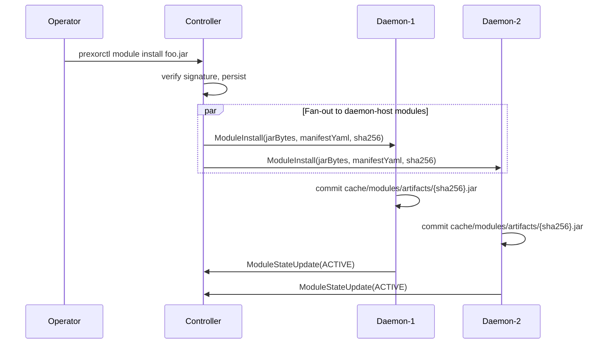

A daemon module runs inside the Daemon process on every node that hosts PrexorCloud
workloads. It is the model for per-instance extension: inject a JVM flag before an
Instance starts, observe process exit on the host, or export a node-local capability
other daemon modules on the same host consume.

This page is the contract: how a module jar reaches each Daemon, the `DaemonModule`
entrypoint and its instance hooks, what `ModuleContext` exposes on the Daemon, the
node-local capability registry, and the controller-bridged event bus.

## What you'll learn

- How one module install fans out to every connected Daemon.
- The `DaemonModule` entrypoint, its lifecycle hooks, and its instance-lifecycle hooks.
- What `ModuleContext` returns on the Daemon — and what it deliberately does not.
- The node-local capability registry.
- How a daemon module subscribes to Controller events over the gRPC bridge.

## How a daemon module reaches the host

Daemon modules ride the same install path as controller-side modules:

```bash
prexorctl module install my-module.jar
```

The argument can be a local `.jar` (with an auto-detected `<jar>.cosign.bundle` or
`<jar>.sig` sidecar, or `--signature <path>`), a `.tar`/`.tar.gz`/`.tgz` bundle holding
one jar and one sidecar, or a registry spec like `my-module@1.2.0`. The CLI uploads to
`POST /api/v1/modules/platform/upload`; on success it prints:

```
✓ Module "my-module" installed (no signature attached)
```

A module declares which process it runs in through `hosts` in its manifest. Daemon
modules declare `daemon`:

```yaml
manifestVersion: 1
id: my-module
version: 1.0.0
hosts: [daemon]
backend:
  daemon:
    entrypoint: com.example.MyDaemonModule
```

The manifest lives at `META-INF/prexor/module.yaml` inside the jar. When `hosts` is
omitted the parser defaults to `[CONTROLLER]`, so a daemon module must list `daemon`
explicitly. A module that needs both sides declares `hosts: [controller, daemon]` and
fills in both `backend.controller.entrypoint` and `backend.daemon.entrypoint`.

After the Controller verifies and persists the jar, `ModuleDistributor` fans it out.
Only modules whose manifest lists `DAEMON` are pushed (`ModuleDistributor.isDaemonHost`):

- On install/upgrade/uninstall, the Controller sends a `ModuleInstall` (or
  `ModuleUninstall`) envelope to **every** connected Daemon session.
- A send failure to one Daemon is logged and skipped — every other Daemon still
  receives the message; the wedged session is reaped by the heartbeat path.



A Daemon that connects later catches up on its own. After a successful handshake the
Controller calls `ModuleDistributor.syncDaemon(nodeId)`, which re-pushes every stored
daemon-host module to that one session. Operators do not chase down newly-booted hosts.

### On-disk layout

The Daemon's `DaemonModuleStore` is content-addressed, rooted at `cache/modules`:

| Path | Holds |
|---|---|
| `cache/modules/artifacts/{sha256}.jar` | the module jar, keyed by content hash |
| `cache/modules/artifacts/{sha256}.sig` | a `sig` sidecar, when present |
| `cache/modules/artifacts/{sha256}.cosign.bundle` | a `cosign-bundle` sidecar, when present |
| `cache/modules/modules-index.json` | one entry per installed module id |

`commit()` recomputes the SHA-256 of the received bytes and rejects a mismatch against
the Controller's claimed hash (`module sha256 mismatch for '<id>'`) to catch transport
corruption. Re-pushing the same `(moduleId, sha256)` is idempotent — the artifact file
already exists, so it is not rewritten. After each commit the store garbage-collects any
artifact no longer referenced by the index, plus stray `.tmp` files.

### Signature verification

When a signature verifier is configured on the Daemon (see
[Security](/concepts/security/)), `DaemonModuleManager` writes the inbound jar plus its
sidecar to a temp directory as siblings — the on-disk shape `TrustRootVerifier` and
`CosignBundleVerifier` expect — and runs `verify()` **before** committing. With the
no-op verifier (the default) no temp files are written. A failed verification reports the
module `FAILED` and the jar is never activated.

### Classloader isolation

Each module jar opens in its own `URLClassLoader` whose parent is a filtering loader.
Only these package prefixes resolve to the Daemon's own classpath:

```
java.  javax.  jdk.  sun.  org.slf4j.  me.prexorjustin.prexorcloud.api.
```

Everything else must ship inside the module jar. The cloud-api types (`DaemonModule`,
`InstanceSpec`, `ModuleContext`, …) and SLF4J cross the boundary; Daemon internals do
not. Uninstall closes the classloader.

## The entrypoint

A daemon module implements `DaemonModule`. Every method is a `default` no-op, so you
override only the hooks you need. All hooks declare `throws Exception`.

```java
public interface DaemonModule {
    default void onLoad(ModuleContext context) throws Exception {}
    default void onStart(ModuleContext context) throws Exception {}
    default void onStop(ModuleContext context) throws Exception {}
    default void onUnload(ModuleContext context) throws Exception {}
    default void onUpgrade(ModuleContext context) throws Exception {}

    // Instance-lifecycle hooks
    default void onInstanceStarting(InstanceSpec spec) throws Exception {}
    default void onInstanceStarted(InstanceHandle handle) throws Exception {}
    default void onInstanceStopping(InstanceHandle handle) throws Exception {}
    default void onInstanceStopped(InstanceHandle handle, ExitInfo exit) throws Exception {}

    default List<CapabilityHandle<?>> capabilityHandles() { return List.of(); }
}
```

The Controller-side `PlatformModule` only knows its own contract, so a
`DaemonModuleAdapter` wraps your `DaemonModule` and drives the lifecycle hooks
(`onLoad` → `onStart` → `onStop`/`onUnload`/`onUpgrade`) through the same
[lifecycle FSM](/concepts/modules/lifecycle/). The instance hooks are **not** routed
through that adapter — `DaemonModuleHost` holds the live `DaemonModule` reference and
dispatches them directly when the process layer fires.

On activation the Daemon calls `capabilityHandles()` and registers the returned handles
with the node-local capability registry, then registers the module with
`DaemonModuleHost` so it starts receiving instance hooks. Both unwind on uninstall.

## Instance-lifecycle hooks

The instance hooks fire from `ProcessManager` around the spawn and exit of each Instance
on this node. They are unique to daemon modules.

| Hook | When | Argument |
|---|---|---|
| `onInstanceStarting` | Before the process is built and spawned | mutable `InstanceSpec` |
| `onInstanceStarted` | After the process is spawned and a PID exists | read-only `InstanceHandle` |
| `onInstanceStopping` | Before the Daemon stops the process (graceful or forced) | read-only `InstanceHandle` |
| `onInstanceStopped` | After the process has exited (clean or crashed) | `InstanceHandle` + `ExitInfo` |

Every active module receives every hook for every Instance on the node. There is no
per-group filtering at the framework level — branch on `spec.group()` /
`handle.group()` yourself.

### Mutating the launch: `InstanceSpec`

`InstanceSpec` is a mutable pre-launch view handed to `onInstanceStarting`:

```java
public final class InstanceSpec {
    String instanceId();
    String group();
    int port();
    int memoryMb();
    List<String> jvmArgs();   // mutable — add or remove entries
    Map<String,String> env(); // mutable — add or replace entries
    String platform();
    String platformVersion();
    String jarFile();
    String planHash();
}
```

Only `jvmArgs()` and `env()` are mutable. The other fields are read-only — this is a
one-shot pre-launch hook, not a planning DSL. After dispatch, `ProcessManager` copies
the post-mutation `jvmArgs` and `env` back into a fresh `ResolvedStartSpec` and launches
from that. The [composition plan](/concepts/groups-instances-templates/) the Controller
sent is unchanged; your mutation is applied locally, on this node, for this launch.

### Reading a running Instance: `InstanceHandle`

`InstanceHandle` is read-only and handed to the started/stopping/stopped hooks:

```java
record InstanceHandle(
    String instanceId, String group, int port, long pid, Instant startedAt, String state) {}
```

`state` mirrors the Daemon's local lifecycle state for information only; the
authoritative cluster state lives on the Controller.

### Exit detail: `ExitInfo`

`onInstanceStopped` also receives an `ExitInfo`:

```java
record ExitInfo(int exitCode, long durationMs, boolean crashed, String crashSummary) {}
```

`crashed` reflects the Daemon's crash detection. In the current `ProcessManager` wiring,
`exitCode` is reported as `0` and `crashSummary` as `null` — `durationMs` carries the
Instance's uptime (`0` if the process was already gone). Treat `crashed` and
`durationMs` as the load-bearing fields today.

### A misbehaving module cannot wedge the host

The `DaemonModule` Javadoc says throwing from `onInstanceStarting` "aborts the start,"
but the actual dispatcher, `DaemonModuleHost`, wraps **every** instance-hook call in
try/catch plus an SLF4J warn. A module that throws is logged and skipped; the Instance
continues to launch, stop, or be observed. Do not rely on an exception to block a start —
it will not.

## ModuleContext on the Daemon

`ModuleContext` is the same interface controller-side modules receive, implemented on the
Daemon by `DaemonModuleContext` with `host()` returning `DAEMON`. Several methods behave
differently here.

| Method | On the Daemon |
|---|---|
| `host()` | returns `ModuleHost.DAEMON` |
| `manifest()` / `jarPath()` | this module's manifest and on-disk jar path |
| `previousVersion()` / `isUpgrade()` | previous version string on upgrade; `""` and `false` on fresh install |
| `findCapability(id, type)` | resolves a capability declared `requires`; empty when unbound |
| `requireCapability(id, type)` | as above, throws `IllegalStateException` when unbound |
| `events()` | the controller-bridged `EventBus` (see below) |
| `logger()` | SLF4J logger namespaced `module:<id>` |
| `scheduler()` | Daemon-owned `TaskScheduler`; tasks cancelled on module stop |
| `httpClient()` | shared outbound `HttpClient` |
| `json()` | standard Jackson `ObjectMapper` |
| `findMongoStorage()` | always `Optional.empty()` |
| `requireMongoStorage()` | always throws `IllegalStateException("daemon modules have no Mongo storage")` |
| `findRedisStorage()` | always `Optional.empty()` |
| `requireRedisStorage()` | always throws `IllegalStateException("daemon modules have no Redis storage")` |

Daemons carry no persistent store. The cluster's durable state lives on the Controller;
the Daemon is stateless by design and carries neither a Mongo nor a Lettuce client. There
is also no daemon-side REST: the Daemon runs no Javalin, and route registration is wired
to a no-op for daemon modules.

If a daemon module needs to remember something across instance starts, pick one of:

1. Ship a paired controller-side module (`hosts: [controller, daemon]`), persist on the
   Controller, and have the Daemon side read it through a capability or a forwarded event.
2. Write per-Instance state to the Instance's own working directory, which the Daemon
   owns.
3. Publish to the controller-bridged `EventBus` and let a controller-side subscriber
   persist it.

## Node-local capability registry

A daemon module exports capabilities through `capabilityHandles()`:

```java
@Override
public List<CapabilityHandle<?>> capabilityHandles() {
    return List.of(
        CapabilityHandle.of("node.disk.io.tracker", DiskIoTracker.class, this.tracker)
    );
}
```

`CapabilityHandle.of(id, type, value)` validates that `value instanceof type` at
construction, so a provider cannot export a handle no consumer can legally cast.

The registry is **node-local**. The `DaemonCapabilityRegistry` exposes a snapshot of
`CapabilityBinding(capabilityId, version, moduleId)` tuples and a bind/unbind/replace
`Listener` — but only modules running on the **same Daemon** see each other's bindings.
Cross-node capability sharing is out of scope for v1; v2 may broaden it to a cluster-wide
view through the Controller bridge.

Use this when one daemon module on a host exposes a capability another daemon module on
the same host consumes — for example, a process-tracer exporting read-only stats to a
sidecar injector.

## Subscribing to Controller events

A daemon module subscribes to cluster events the same way every consumer does, through
`ctx.events()`:

```java
@Override
public void onStart(ModuleContext ctx) {
    ctx.events().subscribe(GroupCreatedEvent.class, this::onGroupCreated);

    // fluent form with a filter
    ctx.events().on(PlayerConnectedEvent.class)
        .filter(e -> e.group().equals("lobby"))
        .subscribe(e -> ctx.logger().info("{} joined lobby", e.name()));
}
```

The Daemon's `EventBus` (`DaemonEventBus`) bridges to the Controller with a
subscribe-registration model — there is no firehose:

- On the **first** local subscriber for an event class, the Daemon sends an
  `EventSubscribe` (carrying the fully-qualified class name) to the Controller.
- On the **last** unsubscribe for that class, it sends an `EventUnsubscribe`.
- The Controller's `DaemonEventForwarder` attaches exactly one bus subscription per
  `(nodeId, eventType)` pair and forwards only events a Daemon asked for. It detaches all
  of a node's subscriptions on disconnect.

On reconnect after a stream blip, `DaemonEventBus.onReconnect()` re-sends `EventSubscribe`
for the full set of currently-subscribed classes so the Controller rebuilds its
per-daemon subscription map and does not drift out of sync.

Delivery path for a forwarded event:

1. The Controller serializes the event to JSON via `ObjectMappers.standard()` and sends
   a `ModuleEvent` envelope (`eventType` = FQCN, `payloadJson` = bytes) over the Daemon's
   gRPC stream.
2. The Daemon's message dispatcher calls `publishFromController(eventType, payloadJson)`,
   which resolves the class by name and deserializes.
3. Local handlers run on **virtual threads** (`Thread.startVirtualThread`), one per
   handler; a throwing handler is logged, not propagated.

Both sides resolve the event class by name via `Class.forName`. If the FQCN is not on the
Controller's classpath, the Controller returns an `ErrorReport`
(`EVENT_TYPE_UNKNOWN`, or `EVENT_TYPE_NOT_CLOUD_EVENT` when the class does not implement
`CloudEvent`) and skips that one type; the rest of the batch still subscribes. If the
class is missing on the Daemon's classpath, the inbound event is logged and dropped.

See [Events](/concepts/events/) for the event taxonomy.

## Worked example: per-group JVM flag injection

This module injects a GC log flag for `lobby` Instances and a heap-dump flag for
`bedwars` Instances, on every host, with no per-host configuration.

```java
public final class JvmFlagsModule implements DaemonModule {
    private static final Logger log = LoggerFactory.getLogger(JvmFlagsModule.class);

    private Map<String, List<String>> flagsByGroup = Map.of();

    @Override
    public void onLoad(ModuleContext ctx) {
        flagsByGroup = Map.of(
            "lobby",   List.of("-Xlog:gc*:file=lobby-gc.log"),
            "bedwars", List.of("-XX:+HeapDumpOnOutOfMemoryError")
        );
    }

    @Override
    public void onInstanceStarting(InstanceSpec spec) {
        var extra = flagsByGroup.get(spec.group());
        if (extra != null) {
            spec.jvmArgs().addAll(extra);
            log.info("injected {} jvmArgs for {}", extra.size(), spec.instanceId());
        }
    }
}
```

`META-INF/prexor/module.yaml`:

```yaml
manifestVersion: 1
id: jvm-flags
version: 1.0.0
hosts: [daemon]
backend:
  daemon:
    entrypoint: com.example.JvmFlagsModule
```

Install once. The module fans out to every connected Daemon, applies on each node's
launches, and re-converges on any Daemon that reconnects later.

## What daemon modules cannot do

| Want | Reach for |
|---|---|
| Mongo or Redis storage | A paired controller-side module that persists; the Daemon side resolves a capability or reads a forwarded event. |
| REST routes | The Controller. The Daemon runs no HTTP server; route registration is a no-op on daemon modules. |
| Cross-node capability visibility | Deferred to v2. A node-local capability is visible only on its own Daemon. |
| Abort an instance start by throwing | Not supported — `DaemonModuleHost` swallows hook exceptions. Mutate `InstanceSpec` instead; do not depend on throwing. |
| Talk to another Daemon directly | Publish an event; the Controller fans it out to subscribed Daemons. |

## Next up

- [Platform modules](/concepts/modules/platform/) — the Controller-side contract; pair it
  with this page when you need persistence or REST.
- [Capabilities](/concepts/modules/capabilities/) — node-local vs controller-side
  capability registries.
- [Lifecycle](/concepts/modules/lifecycle/) — the state machine and classloader rules.
- [Events](/concepts/events/) — the event taxonomy carried over the bridge.
- [Security](/concepts/security/) — daemon-side signature verification.
