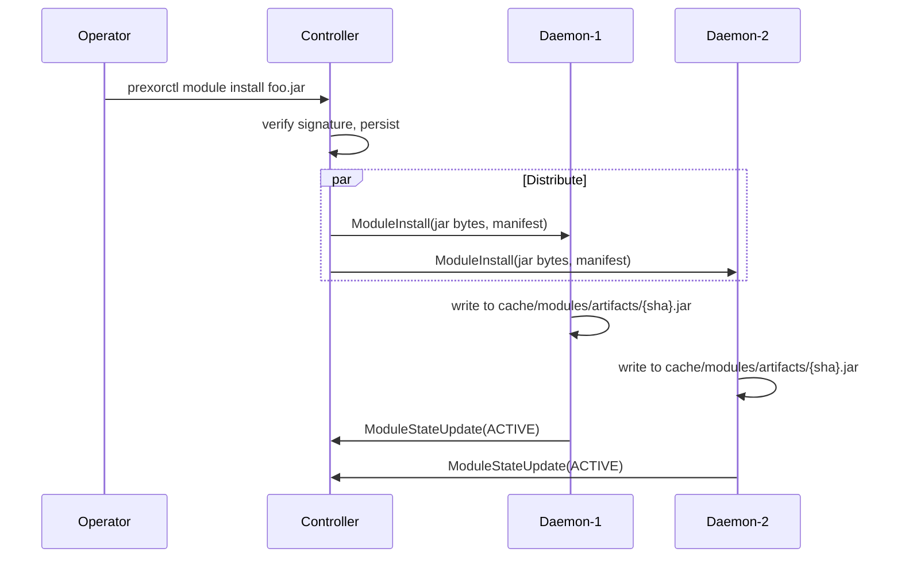

A **daemon module** is a module that loads in the daemon JVM, on every
host that runs PrexorCloud workloads. It is the model for *per-instance*
extension: hooking into instance startup to inject a JVM flag, attaching
a sidecar to specific groups, observing process exit on the host, or
exposing a node-local capability the host's running workloads consume.
This page is the contract.

## What you'll learn

- How a single module jar gets fanned out to every connected daemon.
- The `DaemonModule` contract and its instance-lifecycle hooks.
- What `ModuleContext` exposes on the daemon — and what it does not.
- The node-local capability registry and the controller-bridged
  `EventBus`.

## How daemon modules get to the host

Daemon modules ride the same install pipeline as platform modules:

```bash
prexorctl module install my-module.jar
```

The controller stores the jar in MongoDB-backed module artifacts and
verifies its signature. After a successful install, the
`ModuleDistributor` fans the jar bytes plus manifest YAML out to *every*
connected daemon over the bidi gRPC stream. Daemons whose received
manifest does not list `daemon` as a host ignore the install locally —
the controller does not pre-filter per-daemon.

A daemon that connects later receives the full set of daemon-host
modules via `syncDaemon(nodeId)` on handshake. Operators do not have to
chase down newly-bootstrapped hosts.



The daemon's `DaemonModuleStore` is content-addressed
(`cache/modules/artifacts/{sha256}.jar`). Re-pushes are idempotent —
same content, same sha256, no re-write.

When a daemon has an optional signature verifier configured, it writes
the inbound jar plus sidecar to a temp directory as siblings (the
on-disk shape `TrustRootVerifier` and `CosignBundleVerifier` expect) and
runs `verify()` before commit. See [Security](/concepts/security/) for
the daemon-side signing config.

## The contract

Daemon modules implement `DaemonModule`:

```java
public interface DaemonModule {
    void onLoad(ModuleContext ctx);
    void onStart(ModuleContext ctx);
    void onStop(ModuleContext ctx);
    void onUnload(ModuleContext ctx);
    default void onUpgrade(ModuleContext ctx) {}

    // Instance lifecycle hooks
    default void onInstanceStarting(InstanceSpec spec) {}
    default void onInstanceStarted(InstanceHandle handle) {}
    default void onInstanceStopping(InstanceHandle handle) {}
    default void onInstanceStopped(InstanceHandle handle, ExitInfo exit) {}

    default Set<CapabilityBinding<?>> capabilityHandles() { return Set.of(); }
}
```

The lifecycle hooks (`onLoad`, `onStart`, `onStop`, `onUnload`,
`onUpgrade`) are symmetric to platform modules and follow the same
[lifecycle FSM](/concepts/modules/lifecycle/).

The instance hooks are unique to daemon modules:

| Hook | When | What you get |
|---|---|---|
| `onInstanceStarting` | Right before `ProcessBuilder.start()` | Mutable `InstanceSpec` — add to `jvmArgs()` and `env()` |
| `onInstanceStarted` | After the JVM is up | Read-only `InstanceHandle(instanceId, group, port, pid, startedAt, state)` |
| `onInstanceStopping` | Before `process.stop()` | Same `InstanceHandle` |
| `onInstanceStopped` | After process exit | `InstanceHandle` plus `ExitInfo(exitCode, durationMs, crashed, crashSummary)` |

The mutable `InstanceSpec` is read back by the daemon into a fresh
`ResolvedStartSpec` before launch. A daemon module that adds
`-XX:+HeapDumpOnOutOfMemoryError` to `jvmArgs` for one specific group
does so transparently — the [composition
plan](/concepts/groups-instances-templates/) is unchanged.

A misbehaving module cannot abort instance lifecycle: every call is
wrapped in try/catch plus SLF4J warn so the daemon continues even if
your module throws.

## ModuleContext on the daemon

`ModuleContext` is the same type used by platform modules, but several
methods behave differently on the daemon:

```java
ModuleHost host();                        // returns DAEMON
EventBus events();                        // controller-bridged
Logger logger();                          // SLF4J
TaskScheduler scheduler();                // daemon-owned
HttpClient httpClient();                  // shared
ObjectMapper json();                      // shared

Optional<ModuleDataStore> findMongoStorage();   // always Optional.empty()
Optional<ModuleRedisStorage> findRedisStorage(); // always Optional.empty()
ModuleDataStore requireMongoStorage();           // throws ISE
ModuleRedisStorage requireRedisStorage();        // throws ISE

CapabilityRegistry capabilities();        // node-local
```

**Daemons do not have storage.** The persistent state of the cluster
lives on the controller; the daemon is stateless by design. If your
daemon module needs to remember something across instance starts, the
honest answer is one of:

1. Bundle it as a platform module too (declare both hosts in your
   manifest) and have the platform side persist; the daemon side reads
   capability handles.
2. Persist it on a per-instance basis — the daemon owns the per-instance
   filesystem, write a file there.
3. Use the controller-bridged `EventBus` to publish to the controller,
   which routes it to the matching platform module.

There is no daemon-side REST surface — `onRegisterRoutes` is a no-op on
daemon modules. The daemon does not run a Javalin instance.

## Node-local capability registry

The capability registry on the daemon is **node-local**. Capabilities
registered on one host's daemon are visible only to other modules on
that same daemon — there is no cross-node visibility in v1.

```java
@Override
public Set<CapabilityBinding<?>> capabilityHandles() {
    return Set.of(
        CapabilityBinding.of("node.disk.io.tracker",
                             DiskIoTracker.class,
                             this::tracker)
    );
}
```

Use this when one daemon module exposes a node-local capability another
daemon module on the same host needs (e.g. a process-tracer module
exposing read-only stats to a sidecar-injector module). Cross-node
visibility is deferred to v2.

## Subscribing to controller events

Daemon modules subscribe to events the same way platform modules do:

```java
@Override
public void onStart(ModuleContext ctx) {
    ctx.events().subscribe(GroupCreatedEvent.class, this::onGroupCreated);
}
```

The daemon's `EventBus` is **subscribe-registered**: on first local
subscribe to a class, the daemon sends `EventSubscribe` to the
controller; on last unsubscribe, it sends `EventUnsubscribe`. The
controller's `DaemonEventForwarder` only forwards events the daemon has
asked for. There is no firehose.

On reconnect after a brief stream loss, the daemon re-sends the full set
of currently-subscribed event types so the controller does not drift out
of sync.

Forwarded events are JSON-serialised over the gRPC stream, deserialised
on the daemon, and dispatched to local subscribers on virtual threads.
Latency target is ≤ 250ms; the integration test caps acceptance at
1.5s to absorb harness boot and GC noise.

See [Events](/concepts/events/) for the event taxonomy.

## A worked example: per-group JVM flag injection

```java
public final class JvmFlagsModule implements DaemonModule {
    private static final Logger log = LoggerFactory.getLogger(JvmFlagsModule.class);

    private Map<String, List<String>> flagsByGroup = Map.of();

    @Override
    public void onLoad(ModuleContext ctx) {
        // load from a config file shipped with the module jar
        flagsByGroup = Map.of(
            "lobby",   List.of("-Xlog:gc*:file=lobby-gc.log"),
            "bedwars", List.of("-XX:+HeapDumpOnOutOfMemoryError")
        );
    }

    @Override
    public void onInstanceStarting(InstanceSpec spec) {
        var extra = flagsByGroup.get(spec.group());
        if (extra != null) {
            spec.jvmArgs().addAll(extra);
            log.info("injected {} jvmArgs for {}", extra.size(), spec.instanceId());
        }
    }
}
```

`module.yaml`:

```yaml
manifestVersion: 1
id: jvm-flags
version: 0.1.0
hosts: [daemon]
backend:
  daemon:
    entrypoint: com.example.JvmFlagsModule
```

That module ships from one operator command, applies on every host, and
stays consistent across reconnects without any per-host configuration.

## What daemon modules cannot do

| Want | Answer |
|---|---|
| MongoDB storage | Build a paired platform module that persists; daemon side resolves a capability. |
| REST routes | Not on the daemon — see paired platform module. |
| Cross-node visibility | Deferred to v2. Today, a node-local capability is local to that daemon. |
| Mutate other instances on the host | Stick to your `InstanceSpec` / `InstanceHandle` — touching another instance's filesystem is a daemon-internals concern, not a module concern. |
| Talk to other daemons | Use the controller as a relay (publish an event, controller fans out). |

## Next up

- [Platform Modules](/concepts/modules/platform/) — the controller-side
  contract; pair with this when you need persistence or REST.
- [Capabilities](/concepts/modules/capabilities/) — node-local vs
  controller-side capability registries.
- [Lifecycle](/concepts/modules/lifecycle/) — the FSM, the daemon-side
  classloader rules, what happens on `ModuleUninstall`.
- [Module SDK reference](/reference/module-sdk/daemon-module/) — the
  full daemon-side Java surface.
