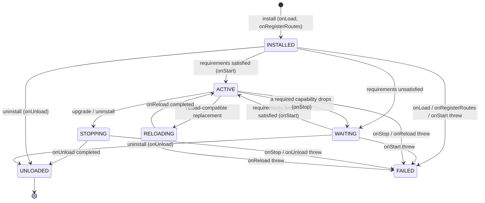

A Module does not just "exist" on the Controller. It walks a state machine driven by `ModuleLifecycleManager`. This page is that machine in detail: the states, the legal transitions, which lifecycle hook runs at each one, what the isolating classloader does, and what happens when a hook throws.

The same `ModuleLifecycleManager` runs on the Controller (for `PlatformModule`) and on each Daemon (for `DaemonModule`). The states and transition rules are identical; the differences are noted under [Daemon-side lifecycle](#daemon-side-lifecycle).

## What you'll learn

- The seven states and the transitions between them.
- Which lifecycle hook runs at each transition, in order.
- How capability requirements gate `INSTALLED/WAITING → ACTIVE` and force `ACTIVE → WAITING`.
- How install, upgrade, and the reload fast-path differ.
- What the classloader isolates, and how leaks after unload are detected.
- How a thrown hook lands the Module in `FAILED`.

## The state machine

The states are the `ModuleLifecycleManager.ModuleState` enum:

| State | Meaning |
|---|---|
| `INSTALLED` | Entrypoint instantiated, `onLoad` ran, routes registered. Not yet started. |
| `WAITING` | At least one required capability is unbound or version-mismatched. Not running. |
| `ACTIVE` | All required capabilities satisfied, `onStart` completed, capability handles bound. |
| `RELOADING` | Transient state during the in-place reload fast-path. |
| `STOPPING` | `onStop` is running ahead of a deactivate, upgrade, or uninstall. |
| `UNLOADED` | `onUnload` ran, routes cleared, classloader handed to the close path. Terminal. |
| `FAILED` | A lifecycle hook threw, or a capability conflict was detected. The exception message is stored as `lastError`. |



`reconcile(moduleId)` is the engine that flips `INSTALLED/WAITING ↔ ACTIVE` based on whether requirements are satisfied. The Controller calls it in a loop (`reconcileUntilStable()`) after every install, upgrade, uninstall, and on boot, so a binding change for one Module can cascade to others that were waiting on it.

## Lifecycle hooks

A `PlatformModule` (and `DaemonModule`) implements these hooks. All are `default`-empty, so a Module overrides only the ones it needs. Every hook except `onRegisterRoutes` may throw `Exception`; a throw moves the Module to `FAILED`.

| Hook | Runs on | Purpose |
|---|---|---|
| `onLoad(ctx)` | install, upgrade, reload | One-time setup after the entrypoint is constructed. |
| `onRegisterRoutes(registrar)` | install, upgrade, reload | Register REST routes. Platform-only. |
| `onStart(ctx)` | `→ ACTIVE` | Start work. Runs only once requirements are satisfied. |
| `onStop(ctx)` | `ACTIVE → WAITING/STOPPING` | Stop work, drain, release. |
| `onUnload(ctx)` | uninstall, upgrade (old) | Final release before the classloader closes. |
| `onUpgrade(ctx)` | upgrade (new), between `onLoad` and `onStart` | Migrate per-Module storage. `ctx.previousVersion()` returns the old version. |
| `onReload(ctx)` | reload fast-path | Hand off live state from the outgoing entrypoint in place. |
| `healthCheck()` | periodic, while `ACTIVE` | Liveness probe. See [Health](#health). |
| `capabilityHandles()` | on bind | Returns the `CapabilityHandle<?>` list this Module provides. |

The `ModuleContext` handed to each hook carries the manifest, jar path, the previous version (on upgrade/reload), the resolved required-capability handles, and per-Module storage. The production context also exposes the live event bus and task scheduler; tests get a `NoopModuleContext`.

## Install: `[*] → INSTALLED → ACTIVE`

```bash
prexorctl module install my-module-1.0.0.jar
```

`install` accepts a local jar, a `.tar` bundle, or a registry coordinate `id[@version]`. `prexorctl module upload <file.jar>` is the lower-level upload-only path.

The Controller pipeline (`PlatformModuleManager.install`):

1. **Mutation lease.** The whole install runs under the `platform-modules:mutate` distributed lease. A second Controller attempting a concurrent mutation gets `IllegalStateException("platform module mutation is already owned by another controller")`.
2. **Prepare + signature.** The jar is content-addressed (`prepare`) and the manifest parsed. `PlatformModuleSignatureVerifier.verify` runs. A missing or invalid signature fails the REST upload with `422 SIGNATURE_VERIFICATION_FAILED`. See [Security](/concepts/security/).
3. **Cycle check.** `capabilityRegistry.validateNoCycles` rejects a capability dependency cycle (`IllegalStateException("capability dependency cycle detected: a -> b -> a")`) and a capability provided by two Modules (`provided by multiple modules`). The candidate manifest is checked against the existing set, so an install that would create a cycle is refused before commit.
4. **Commit + open runtime.** The jar is committed to the content-addressed store and `runtimeFactory.open` creates the isolating classloader and instantiates the entrypoint.
5. **Lifecycle install.** `lifecycleManager.install` runs `onLoad`, clears any stale routes for this id, then `onRegisterRoutes`. State becomes `INSTALLED`.
6. **Reconcile.** `reconcile` checks requirements. If satisfied, `onStart` runs and the state becomes `ACTIVE`; the provided capability handles bind on the `CapabilityRegistry`. If not, the state becomes `WAITING`.

A successful install also runs `reconcileUntilStable()` so any other `WAITING` Module whose dependency this one just provided is re-checked and can reach `ACTIVE` in the same pass.

For Modules whose manifest declares the `daemon` host, the distributor hook fans the jar out to every connected Daemon over the gRPC stream after the Controller-side transition completes.

### `INSTALLED → WAITING`

If `requirementsSatisfied(manifest)` is false at reconcile time, the Module stays installed but inert in `WAITING`. The `unresolvedRequirements` list on the package record names each missing or mismatched capability and the reason — `missing provider` or `version mismatch: active provider <id>@<version>`. Operators see this in the dashboard and via `GET /api/v1/modules/platform`.

When a provider later activates, the next `reconcileUntilStable()` pass re-evaluates the waiter and promotes it to `ACTIVE`.

### `INSTALLED/WAITING → ACTIVE`

`onStart(ctx)` runs. On return, the Controller binds the Module's `capabilityHandles()` on the `CapabilityRegistry`:

- A handle for a capability already provided by a **different** Module throws `IllegalStateException("capability '<id>' is already provided by module '<other>'")`, which lands the install in failure.
- Consumers resolve a capability through a `DynamicCapabilityHandle`, a delegating proxy. When a provider deactivates, its delegate slot is set to `null` and cached proxies are dropped, so a consumer calling into a gone provider gets `IllegalStateException("required capability is not available: <id>")` rather than a stale reference.

## Active runtime

### `ACTIVE → WAITING` (a dependency drops)

If a required capability is no longer satisfied at reconcile time (its provider was uninstalled or replaced with an incompatible version), `reconcile` drives `ACTIVE → STOPPING`, runs `onStop`, and settles in `WAITING`. The Module is not failed — it is waiting for the dependency to come back. When it does, the next reconcile restarts it via `onStart`.

### Health

While a Module is `ACTIVE`, `pollHealth()` invokes its `healthCheck()` and keys the result by Module id. The active set is snapshotted under the lifecycle lock, then each `healthCheck()` runs **outside** the lock so a slow or hung probe cannot stall installs or reconciles.

- A check that returns `null` or is not overridden reports `UNKNOWN`.
- A check that throws is reported as `unhealthy` with `healthCheck threw: <ExceptionClass>` — it does not change the Module's lifecycle state.

```bash
prexorctl module list
```

Read one Module's probe directly via `GET /api/v1/modules/platform/{moduleId}/health`.

## Upgrade: replace an installed Module

```bash
prexorctl module upgrade my-module
```

Installing a different version of an already-installed Module (via `install` or `upgrade`, REST `POST /api/v1/modules/platform/{moduleId}/upgrade`) triggers `lifecycleManager.upgrade`. The manifest id must match the target; a mismatch throws `IllegalArgumentException("replacement manifest id ... does not match target module ...")`.

The sequence:

1. If the old Module is `ACTIVE`: state `→ STOPPING`, then `onStop` on the old entrypoint.
2. `onUnload` on the old entrypoint.
3. The old Module's routes are cleared. Route handlers are classes in the outgoing classloader; clearing before re-register prevents a stale route from pointing into a soon-to-be-collected classloader.
4. The new entrypoint is installed: `onLoad`, then **`onUpgrade`** (`ctx.previousVersion()` is the old version — migrate per-Module storage here), then `onRegisterRoutes`.
5. `reconcile` drives the new Module to `ACTIVE` or `WAITING` as usual.

The Controller swaps capability bindings atomically: if the old Module was active it uses `replaceModuleBindings` (consumers keep resolving through the same dynamic handle, now delegating to the new provider); otherwise `activateModule`. The outgoing classloader is handed to the close path only after the new entrypoint's hooks return.

If any new-Module hook throws, the Module lands in `FAILED`. There is **no automatic rollback** to the old version — the operator decides whether to re-install the previous jar.

### Reload fast-path: `ACTIVE → RELOADING → ACTIVE`

When the replacement is reload-compatible, the upgrade takes a faster path that never stops or unloads the outgoing Module. Reload-compatible (`ModuleLifecycleManager.reloadCompatible`) means **both**:

- The replacement's controller entrypoint declares `reloadable: true` in its manifest.
- The capability declaration is byte-for-byte identical — `provides` and `requires` unchanged.

Any capability-shape change forces the full upgrade path instead, because requirements must be re-reconciled and consumers re-bound.

On the fast-path: state `→ RELOADING`, routes cleared, then only **`onReload`** runs on the new entrypoint, followed by `onRegisterRoutes`. The new entrypoint must take over the outgoing Module's live state from inside `onReload` — nothing is stopped for it. On success the state returns to `ACTIVE` and the old classloader is closed. If `onReload` throws, the Module is left `FAILED` with no rollback.

REST `POST /api/v1/modules/platform/{moduleId}/frontend/reload` is a different operation — it swaps the frontend bundle only and never touches the classloader.

## Uninstall: `→ STOPPING → UNLOADED`

```bash
prexorctl module delete my-module
```

REST `DELETE /api/v1/modules/platform/{moduleId}`. `lifecycleManager.uninstall`:

1. If `ACTIVE`: deactivate its capability bindings (delegate slots cleared), state `→ STOPPING`, then `onStop`.
2. `onUnload` on the entrypoint.
3. Routes for the id are cleared.
4. State `→ UNLOADED`. The package is removed from the store and the close path handles the classloader.

`UNLOADED` is terminal; the package is removed from the store afterwards. Per-Module storage survives uninstall so a reinstall can recover it. Drop it explicitly with `DELETE /api/v1/modules/platform/{moduleId}/storage`, which is rejected unless the Module is `UNLOADED` (`IllegalStateException("storage can only be dropped after uninstall ...")`).

For Daemon-host Modules, the Controller fans `ModuleUninstall` to every connected Daemon; each runs the same uninstall locally and reports back.

## Classloader isolation

Each Module jar opens in its own `URLClassLoader` whose parent is a `FilteringParentClassLoader` — a classloader with a null parent that delegates **only** these prefixes to the host:

```
java.   javax.   jdk.   sun.   org.slf4j.   me.prexorjustin.prexorcloud.api.
```

Anything else (Controller internals, other Modules' classes, third-party libraries not on the allow-list) throws `ClassNotFoundException` from the parent and must be bundled inside the Module jar. Consequences:

- A Module cannot reach Controller internals or another Module's types. The contract surface is `cloud-api` plus the JDK and SLF4J.
- Two Modules can bundle different, incompatible versions of the same library without colliding — each has its own classloader.
- Capability handles cross the boundary as `cloud-api` types (loaded by the shared parent), so a provider and consumer agree on the interface even though their implementations live in separate classloaders.

The entrypoint class named by `backend.controller.entrypoint` (or `backend.daemon.entrypoint`) is loaded through this classloader and must implement `PlatformModule` (respectively `DaemonModule`); otherwise the runtime open fails with `backend entrypoint does not implement PlatformModule`.

### Closing and leak detection

On unload, upgrade, or reload, the outgoing classloader is closed via try-with-resources around the runtime's `Closeable`, so close is deterministic. But a Module that leaves a live thread, timer, or static reference can keep its classloader from being garbage-collected. The `ModuleClassLoaderTracker` catches that:

- Each unloaded classloader is wrapped in a `PhantomReference` against a `ReferenceQueue`.
- A scheduled poll (default every **5s**) drains the queue. A drained reference means the classloader was collected — counted as `collected`.
- A reference still pending past the leak threshold (default **30s**) is reported as a leak: a `WARN` log per poll, plus any registered `LeakListener`.

Metrics (Micrometer):

| Metric | Meaning |
|---|---|
| `prexorcloud.module.classloader.pending` | Classloaders awaiting collection right now. |
| `prexorcloud.module.classloader.tracked.total` | Total tracked since startup. |
| `prexorcloud.module.classloader.collected.total` | Total observed GC'd after unload. |
| `prexorcloud.module.classloader.leaked` | Total leak detections (one per poll a loader survives past the threshold). |

Operator surface (permission `MODULES_MANAGE`):

- `GET /api/v1/modules/platform/leaked-classloaders` — `{ tracking, pending[], totals }`. Each pending entry carries `moduleId`, `moduleVersion`, `classLoaderClassName`, `trackedAt`, `ageMs`, `repeatCount`. When no tracker is configured, `tracking` is `false`.
- `POST /api/v1/modules/platform/leaked-classloaders/force-cleanup` — calls `requestForcedCleanup`: increments the forced-hint counter, runs `System.gc()`, and polls once. Returns `{ pendingBefore, pendingAfter, collected, totalForcedCleanupHints }`. Forcing GC perturbs throughput, so run it by hand, not on a schedule. Returns `409 CLASSLOADER_TRACKER_DISABLED` if no tracker is wired.

A leak is a Module bug — find the thread or static reference the Module left behind and fix `onStop`/`onUnload`. Force-cleanup is a mitigation, not a fix.

## Exception handling

Every lifecycle hook is wrapped. A thrown `Exception` calls `fail(moduleId, e)`, which sets the state to `FAILED` and stores `e.getMessage()` as `lastError`. The mapping:

| Hook throws during | Result |
|---|---|
| `onLoad` / `onRegisterRoutes` (install) | Routes cleared, state `→ FAILED`. |
| `onStart` (reconcile) | State `→ FAILED`. |
| `onStop` (reconcile to WAITING, or upgrade/uninstall) | State `→ FAILED`. |
| `onUnload` (uninstall/upgrade) | Routes cleared, state `→ FAILED`. |
| `onUpgrade` / `onReload` | Routes cleared, state `→ FAILED`. |
| `healthCheck` | Reported `unhealthy`; state unchanged. |

The classloader is still closed on the failure paths that own it — a misbehaving hook does not leak the runtime. On a failed upgrade, the Controller's `install` restores the previous runtime binding and re-activates the previous capability bindings if the old Module was active, so a failed upgrade does not take the old provider's consumers down.

`FAILED` is sticky. There is no auto-recovery and no `recover` command — auto-restart would mask the underlying bug and create flap. To clear it:

- Re-install a fixed jar (`prexorctl module install <fixed>.jar`), which replaces the failed Module.
- Or `prexorctl module delete <id>` to remove it.

## Daemon-side lifecycle

`DaemonModule` runs on each Daemon through `DaemonModuleManager`, which drives the **same** `ModuleLifecycleManager` and reports every state transition back to the Controller as a `ModuleStateUpdate` over the gRPC stream. The Controller treats the Daemon-reported state as authoritative for that node.

Differences from the Controller side:

- **No REST routes, no frontend.** `DaemonModule` has no `onRegisterRoutes`; the route hook is a no-op.
- **No reload fast-path.** `DaemonModule` has `onLoad`, `onStart`, `onStop`, `onUnload`, `onUpgrade` — there is no `onReload`.
- **Node-local capabilities.** Capability bindings live in a per-Daemon registry; they are not shared across nodes.
- **Instance lifecycle hooks.** A Daemon Module also implements `onInstanceStarting(spec)`, `onInstanceStarted(handle)`, `onInstanceStopping(handle)`, and `onInstanceStopped(handle, exit)`. These dispatch only while the Module is `ACTIVE`; a `WAITING` Module never started and a `STOPPING`/`UNLOADED` one receives no further instance-hook calls.

The isolating classloader is identical: same `FilteringParentClassLoader` and the same parent prefix allow-list. An inbound `ModuleInstall` that fails verification or any lifecycle hook reports `FAILED` back to the Controller with the exception message.

## CLI reference

| Command | Does |
|---|---|
| `prexorctl module list` | List installed Modules and their states. |
| `prexorctl module install <jar\|bundle.tar\|id[@version]>` | Install or upgrade from a local artifact or registry. |
| `prexorctl module upload <file.jar>` | Upload-only (lower-level than `install`). |
| `prexorctl module upgrade [id]` | Upgrade an installed Module to the newest version a registry offers. |
| `prexorctl module delete <name>` | Uninstall (`→ STOPPING → UNLOADED`, then remove). |
| `prexorctl module new [name]` | Scaffold a new Module project. |
| `prexorctl module dev <name>` | Watch a Module's jar and re-upload on change. |
| `prexorctl module doctor <jar>` | Validate a built jar against the platform-module contract. |

## Next

- [Module system overview](/concepts/modules/) — orientation.
- [Capabilities](/concepts/modules/capabilities/) — what `WAITING ↔ ACTIVE` checks and how dynamic handles resolve.
- [Platform modules](/concepts/modules/platform/) — the Controller-side hook surface.
- [Daemon modules](/concepts/modules/daemon/) — the Daemon-side hook surface and instance hooks.
- [Security](/concepts/security/) — module signing and the `422 SIGNATURE_VERIFICATION_FAILED` path.
