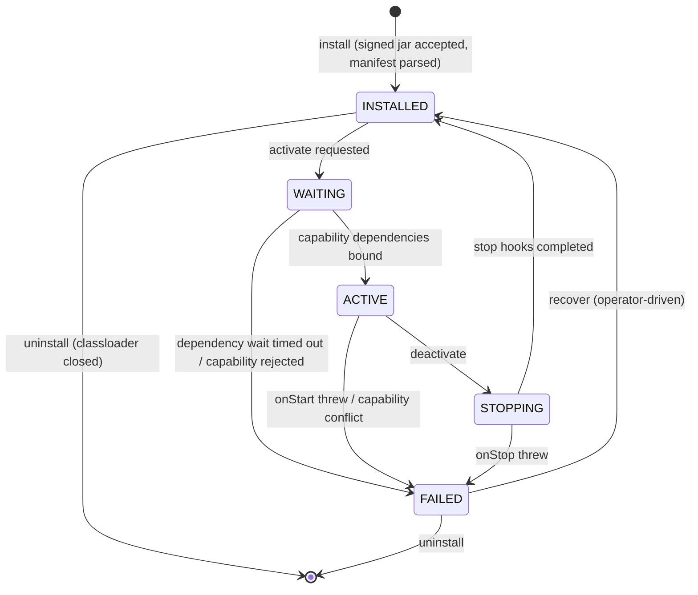
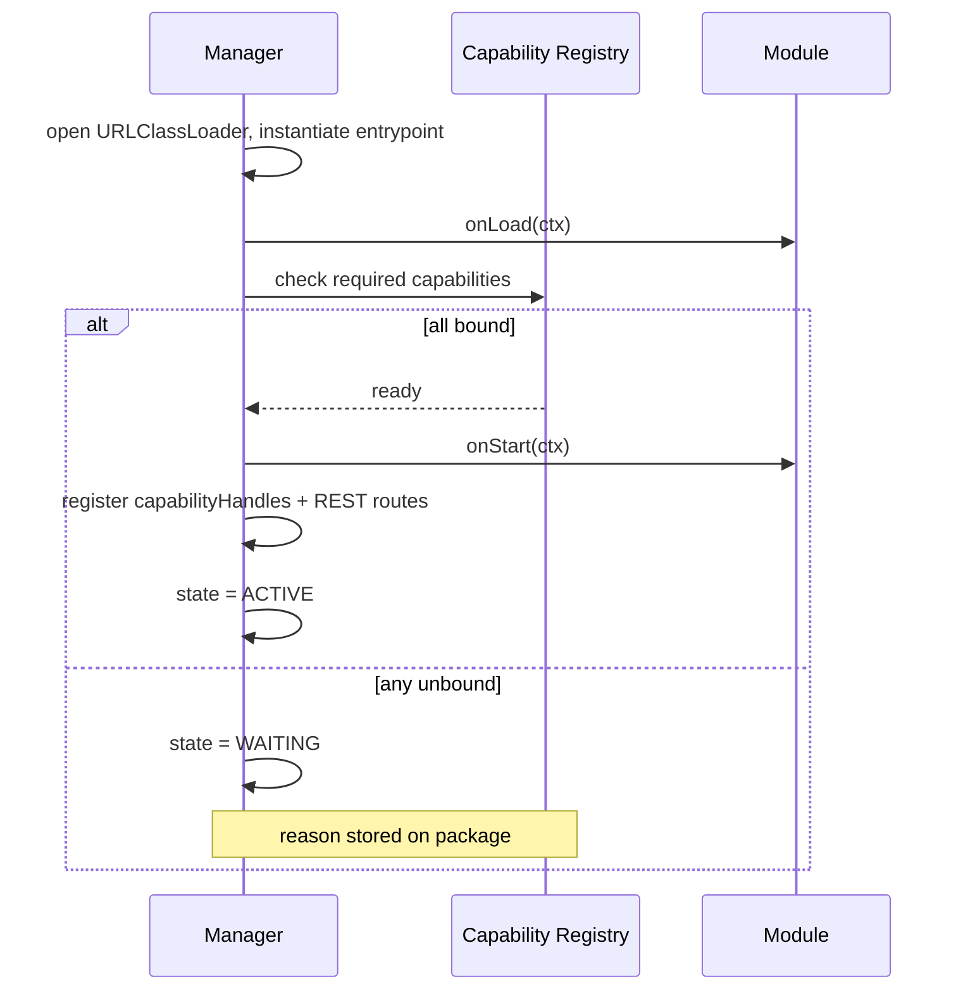

A module does not just "exist" in the controller — it walks a state
machine. Every transition is persisted to MongoDB, broadcast over SSE,
exercised by the test harness, and observable in the dashboard. This
page is the FSM in detail: when each state is entered, what runs in the
transition, and what happens on failure.

## What you'll learn

- The six states and the legal transitions between them.
- What hooks run at each transition, and in what order.
- How capability dependencies gate `WAITING → ACTIVE`.
- What the classloader does on `STOPPING → UNLOADED` and how leaks are
  detected.
- How upgrade and uninstall fit into the FSM.

## The state machine



| State | Meaning |
|---|---|
| `INSTALLED` | Jar present, manifest parsed, signature verified. Not running. |
| `WAITING` | Activation requested but at least one required capability is unbound. |
| `ACTIVE` | All required capabilities bound, `onStart` completed, routes registered. |
| `STOPPING` | Deactivation requested; `onStop` running. |
| `UNLOADED` | Classloader closed and tracked for GC. (Terminal — followed by full removal.) |
| `FAILED` | An operator-actionable error occurred. The reason is stored on the package record. |

Transitions are persisted to MongoDB (`module_packages` collection) and
emitted over the SSE bus as `MODULE_INSTALLED`, `MODULE_ACTIVATED`,
`MODULE_DEACTIVATED`, `MODULE_UNINSTALLED`. The dashboard module page
reflects state in real time.

## Install

```bash
prexorctl module install my-module.jar
```

The install pipeline:

1. Upload to the controller via `POST /api/v1/modules/platform/upload`.
2. **Signature verification.** When `modules.signing.required=true`, a
   missing or invalid signature fails the install with HTTP 422
   `SIGNATURE_VERIFICATION_FAILED`. Both `<jar>.cosign.bundle` (new
   style, with offline Rekor SET enforcement) and `<jar>.sig` (legacy
   keyed PEM, deprecated) are accepted. See
   [Security](/concepts/security/).
3. **Manifest parsing.** `META-INF/prexor-module.json` (or the legacy
   `module.yaml`-shaped form) is parsed into a `PlatformModuleManifest`.
   Cyclic capability declarations are rejected here.
4. **Persistence.** The package metadata is written to `module_packages`
   in MongoDB; the jar plus signature sidecar are stored under
   `artifacts/{sha256}.jar` (and `.cosign.bundle` / `.sig`).
5. **Daemon distribution.** If the manifest's `hosts` list includes
   `daemon`, `ModuleDistributor` fans the jar out to every connected
   daemon over the bidi gRPC stream.
6. The package transitions `[*] → INSTALLED`.

A successful install does not start the module. Activation is a
separate step.

## Activation: `INSTALLED → WAITING → ACTIVE`

Activation is normally automatic on install (and on controller boot for
already-installed modules). The flow:



Three transitions can fire here:

### `INSTALLED → WAITING`

If any required capability is unbound, the module enters `WAITING`. The
reason is stored on the package record (e.g.
`waiting_for_capability:prexor.player.journey`) so operators see *why*
in the dashboard.

The manager listens for `CapabilityRegisteredEvent` and re-checks
waiting modules. When all required capabilities are bound, the module
moves to `ACTIVE`.

### `WAITING → ACTIVE`

`onStart(ctx)` runs. Capability bindings declared in
`PlatformModule.capabilities()` (or `DaemonModule.capabilityHandles()`)
register on the registry. Routes declared in `onRegisterRoutes` register
on the route registry. The state flips to `ACTIVE`.

### `WAITING → FAILED`

If a configurable wait timeout expires
(`modules.activation.waitTimeoutSeconds`, default 0 = no timeout) or a
capability conflict is detected (two providers competing), the module
moves to `FAILED`. The reason is recorded.

## Active: `ACTIVE → STOPPING → INSTALLED`

Deactivation is operator-driven (`prexorctl module deactivate <id>`) or
controller-driven (uninstall, upgrade). The flow:

1. State flips to `STOPPING`.
2. `onStop(ctx)` runs. Module-side cleanup happens here: stop scheduled
   work, drain queues, finalise per-module storage.
3. The capability registry **clears the dynamic-handle delegate** for
   every binding the module owned. Consumers of those capabilities now
   see `handle.get() == null`.
4. The route registry **drops the module's routes atomically**. There
   is no "old route still served by ghost handler" possibility.
5. Event subscriptions registered through the module's `EventBus`
   handle are removed.
6. State flips to `INSTALLED`.

`STOPPING → FAILED` happens if `onStop` throws. The classloader is
still closed (we don't leak on misbehaving stop hooks) but the package
record carries the failure reason.

## Unload: `INSTALLED → UNLOADED → [*]`

Uninstall is the last transition:

1. State flips to `STOPPING` if the module was `ACTIVE` (running through
   the deactivation flow above).
2. `onUnload(ctx)` runs. Final resource release.
3. The classloader is closed via try-with-resources around
   `LoadedRuntime.closeable`.
4. The capability registry's proxy cache is cleared for any remaining
   bindings.
5. The frontend cache directory (if any) is deleted.
6. The package metadata is removed from `module_packages`. The jar plus
   signature sidecar are reference-counted and garbage-collected.
7. State flips to `UNLOADED`, then the package is removed entirely.

For daemon-host modules, the controller fans `ModuleUninstall` out to
every connected daemon. Each daemon runs the same FSM locally and reports
back via `ModuleStateUpdate`.

### Classloader leak detection

Each platform module's classloader is wrapped in a `PhantomReference`
against a `ReferenceQueue`. If the GC has not collected it within the
configured grace window, the tracker emits
`prexorcloud_module_classloader_leaked{moduleId}` and surfaces a leak
report at `GET /api/v1/modules/platform/leaked-classloaders`. The
dashboard's modules page shows leak warnings inline.

`POST /api/v1/modules/platform/force-cleanup` runs the tracker's
forced-cleanup escalation when an operator wants to push it.

The two registries that hold module-supplied references and cannot rely
on GC alone are explicitly cleaned on unload:

- **Capability registry.** Caches `Class<?> → Proxy` mappings; the
  delegate slot is set to `null` and the proxy cache is cleared so
  cached `Class<?>` keys do not pin the unloaded classloader.
- **Module frontend manager.** Removes the cached `LoadedFrontend` and
  deletes the on-disk asset directory.

`ExtensionRegistry` is constructed from manifests parsed into types from
`cloud-api` (parent classloader) and holds no module-loader-bound
references — no per-unload cleanup needed.

## Upgrade

`prexorctl module install` against a higher version of an
already-installed module triggers an upgrade. The flow is essentially
deactivate-old then activate-new, with one extra hook:

1. Old module: `ACTIVE → STOPPING → INSTALLED → UNLOADED → [*]`.
2. New module: `[*] → INSTALLED`.
3. `onUpgrade(ctx)` is called *before* `onStart(ctx)` on the new
   module. `ctx.previousVersion()` returns the old version string.
   This is where you migrate per-module storage when the schema
   changed.
4. New module: `INSTALLED → WAITING → ACTIVE` as usual.

If the new module fails to activate, the upgrade is recorded as a
failure and operators decide whether to re-install the old version.
There is no automatic rollback.

The platform-module mutation lease
(`prexor:v1:lease:platform-module`) gates the entire upgrade flow so
two controllers cannot run upgrades concurrently.

## Pause / resume

Operators can pause a module mid-lifecycle (typically when a capability
dependency cannot be resolved and they want the module off until they
ship a fix):

```bash
prexorctl module pause my-module --reason "waiting for dep upgrade"
```

A paused module is held in `INSTALLED` even when its dependencies are
satisfied. The reason is stored on the package record.
`prexorctl module resume my-module` clears the pause and the FSM
re-evaluates.

## Recovering from `FAILED`

A `FAILED` module stays `FAILED` until an operator acts. Three options:

- `prexorctl module recover <id>` — resets to `INSTALLED` and reruns
  activation.
- `prexorctl module install <id>.jar --replace` — install a fixed
  version (this is also an upgrade).
- `prexorctl module uninstall <id>` — give up.

The FAILED state is sticky on purpose. Auto-recovery would mask real
problems and create flap-detection problems.

## Daemon-side FSM

Daemon modules walk the same FSM, locally on each host, with two
differences:

1. **No REST registry, no frontend cache.** The corresponding
   transitions are no-ops.
2. **Instance lifecycle hooks** (`onInstanceStarting` etc.) are dispatched
   only while the module is `ACTIVE`. A `STOPPING` module receives no
   further instance-hook calls; a `WAITING` module never started.

Each daemon reports every state transition back to the controller via
`ModuleStateUpdate` over the gRPC stream. The controller treats the
daemon-side state as authoritative for that node and surfaces it in the
per-node module page in the dashboard.

## Next up

- [Module System overview](/concepts/modules/) — the orientation page.
- [Capabilities](/concepts/modules/capabilities/) — what
  `WAITING ↔ ACTIVE` actually checks.
- [Platform Modules](/concepts/modules/platform/) — what the lifecycle
  hooks see on the controller side.
- [Daemon Modules](/concepts/modules/daemon/) — what the lifecycle hooks
  see on the daemon side.
- [Events](/concepts/events/) — `MODULE_*` and `CAPABILITY_*` events on
  the SSE bus.
