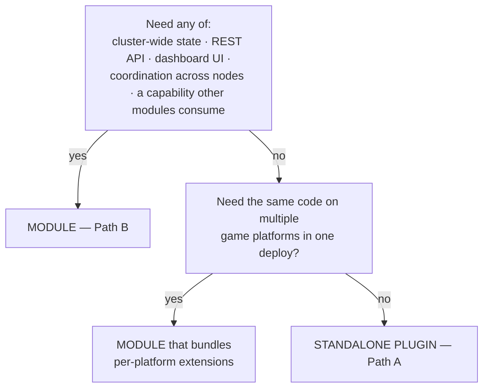

A Plugin in PrexorCloud is code that runs *inside* a Minecraft server or proxy JVM, next to the cloud-installed integration. This page covers the two models for shipping that code, every platform each one reaches, and how the code authenticates back to the Controller.

Two facts up front:

- Every managed Instance already runs the first-party PrexorCloud integration. The Daemon installs it; you write nothing. It registers the Instance with the Controller and reports players and metrics. It ships per platform — a Bukkit plugin on Paper/Spigot/Folia, a Velocity/BungeeCord proxy plugin, a Fabric or NeoForge mod, and a Geyser extension.
- Your own code rides on top through one of two paths: a standalone `@CloudPlugin` jar (Path A) or an extension bundled inside a Module (Path B).

The two paths are not a hierarchy. A standalone plugin is not a "lite module." It is a different model with its own tooling and deployment.

## What you'll learn

- The two authoring paths and a decision guide.
- The plugin SDK: `@CloudPlugin`, `CloudPluginBase`, `CloudPluginContext`, `@ForVersion`.
- Every platform each path reaches, including Fabric, NeoForge, and Geyser.
- How in-server code authenticates to the Controller and what the environment gives it.

## The decision



Three cases:

- **Cluster-wide state, a REST API, dashboard UI, or cross-node coordination?** Module (Path B). See [Modules](/concepts/modules/).
- **In-game or in-proxy behaviour on one platform only?** Standalone plugin (Path A).
- **Both — server-side logic plus dashboard or cluster state?** A Module that bundles per-platform extensions.

The single-platform case is common — an admin command suite that only runs on Paper, for example. A Module wrapper there is overhead with no payoff; pick Path A.

## Side by side

|  | Standalone plugin (Path A) | Module (Path B) |
|---|---|---|
| Lives at | `java/cloud-plugin/cloud-plugin-<name>/` | `java/cloud-modules/<name>/` |
| Manifest | none — the `@CloudPlugin` annotation only | `module.yaml` |
| Build output | one shaded jar | controller jar plus per-platform extension jars |
| Deployment | drop the jar into the server/proxy plugin folder | `prexorctl module install <bundle>` against the Controller |
| Activation | present when the jar is present | `explicit-group-attach` per the manifest; Controller resolves and the Daemon installs |
| Frontend | none | optional Vue package via `dashboard/packages/module-sdk` |
| REST endpoints | none | `/api/v1/modules/<id>/<sub>` |
| Per-module storage | none | MongoDB plus Valkey primitives, isolated by module id |
| Capability registry | consume only (via `cloud-api`) | provide and consume |
| Cross-platform | one platform per scaffold; rerun for more | many extensions ship inside one Module |
| Scaffold | `prexorctl plugin new --platform=<p>` | `prexorctl module new` |

Both paths coexist. A production Network usually runs both.

## The plugin SDK

`cloud-api` is the in-server SDK shared by both paths. Three types matter.

### `@CloudPlugin`

Marks the class. The annotation processor reads it and generates the platform bridge plus the descriptor file the platform expects. Fields (`java/cloud-api/.../api/plugin/annotation/CloudPlugin.java`):

| Field | Type | Default | Notes |
|---|---|---|---|
| `name` | `String` | required | Display name; also kebab-cased into the Velocity/Geyser id |
| `version` | `String` | required | |
| `description` | `String` | `""` | |
| `authors` | `String[]` | `{}` | |
| `dependencies` | `String[]` | `{}` | Hard deps loaded before this plugin; `PrexorCloud` is always added |
| `softDependencies` | `String[]` | `{}` | Loaded before this plugin if present |
| `apiVersion` | `String` | `"1.21"` | Bukkit/Paper `api-version`; ignored off Bukkit |

There is no `id` field. The Velocity and Geyser ids are derived from `name` (lower-cased, spaces to `-`).

`apiVersion` is auto-lowered. If your `@ForVersion` adapters declare a lower `min`, the processor writes that into the descriptor — you don't keep `apiVersion` in sync by hand.

### `CloudPluginBase`

Your class extends it. It does **not** extend `JavaPlugin` — it is platform-agnostic, and the generated bridge owns the platform lifecycle. Override points (`java/cloud-api/.../api/plugin/CloudPluginBase.java`):

```java
public abstract void onEnable(CloudPluginContext ctx);   // required
public void onDisable() {}                                // optional
public void onReload(CloudPluginContext ctx) {}           // optional
```

For version dispatch, call `adapt(Type.class)` from `onEnable` — see `@ForVersion` below.

### `CloudPluginContext`

The single entry point handed to `onEnable` (`java/cloud-api/.../api/plugin/CloudPluginContext.java`):

```java
public interface CloudPluginContext {
    InstanceContext self();           // this Instance: id, group, node
    EventBus events();                // subscribe to cluster events
    CloudCommandRegistry commands();  // register @Command classes
    PlayerManager players();          // players online on this Instance
    PluginScheduler scheduler();      // Folia-safe task scheduler
    CloudClient client();             // low-level Controller client
    Logger logger();                  // java.util.logging
}
```

`scheduler()` is Folia-safe on every platform, so the same code runs on Paper and on Folia's regionised scheduler without branching.

### `@ForVersion` — one jar, many Minecraft versions

Nest version-specific adapter classes and let the dispatcher pick at runtime (`java/cloud-api/.../api/client/version/ForVersion.java`):

```java
interface WelcomeHandler {
    @ForVersion(min = "1.21")
    class Modern implements WelcomeHandler { /* ... */ }

    @ForVersion(min = "1.17", max = "1.20")
    class Legacy implements WelcomeHandler { /* ... */ }

    @ForVersion(fallback = true)   // used when no range matches (e.g. 1.22)
    class Default implements WelcomeHandler { /* ... */ }
}

// in onEnable:
WelcomeHandler handler = adapt(WelcomeHandler.class);
```

`min` and `max` are inclusive; an empty `max` is unbounded. Exactly one `fallback = true` per group is allowed; both `min` and `max` are ignored on it. If a `@ForVersion` group has no fallback, the build prints a WARNING — servers outside the covered ranges would otherwise throw `UnsupportedOperationException` at runtime.

The dispatcher keys off the running version: the Minecraft version on Bukkit/Paper/Folia, and the proxy version on Velocity and BungeeCord. Geyser extensions get no dispatcher — a Geyser extension runs inside Geyser's own runtime regardless of the host server version, so version branching there is not meaningful.

## Path A: standalone plugins

A standalone plugin is one jar with one `@CloudPlugin` class. Scaffold it, build it, drop the shaded jar into the server's plugin folder.

```bash
prexorctl plugin new my-greeter --platform=paper
cd java && ./gradlew :cloud-plugin:cloud-plugin-my-greeter:shadowJar
# Drop build/libs/cloud-plugin-my-greeter-*.jar into the server's plugins/ folder.
```

`prexorctl plugin new` flags (`cli/cmd/plugin.go`):

| Flag | Required | Default | Notes |
|---|---|---|---|
| `--platform` | yes | — | `paper`, `spigot`, `folia`, `velocity`, or `bungeecord` |
| `--mc-version` | no | `1.20` | Paper only; `1.20` or `1.21`. Ignored elsewhere |
| `--package` | no | `me.prexorjustin.prexorcloud.plugins.<name>` | Override the Java package |
| `--description` | no | generated | Written into `@CloudPlugin` |
| `--author` | no | `PrexorCloud` | Written into `@CloudPlugin` |
| `--repo-root` | no | discovered upward | Repo root override |
| `--force` | no | `false` | Overwrite an existing plugin directory |
| `--dry` | no | `false` | Print what would be written, write nothing |

The scaffold writes one Gradle subproject under `java/cloud-plugin/cloud-plugin-<name>/`, applies the matching `prexorcloud.plugin-<platform>` convention plugin, and patches `java/settings.gradle.kts` after the `// ---- PLUGINS ---- //` anchor. The generated source is minimal:

```java
@CloudPlugin(
        name = "MyGreeter",
        version = "0.0.1",
        description = "MyGreeter — standalone PrexorCloud plugin.",
        authors = {"PrexorCloud"})
public final class MyGreeterPlugin extends CloudPluginBase {

    @Override
    public void onEnable(CloudPluginContext ctx) {
        ctx.logger().info("PrexorCloud connected on instance " + ctx.self().instanceId());
    }
}
```

You add platform listeners and commands from there.

### What the processor generates per platform

The processor resolves the target from `-Acloud.platform=<name>` if set, otherwise by classpath detection (Geyser → Velocity → BungeeCord → Folia → Paper), otherwise `paper` with a build WARNING. Each platform gets a bridge class and the right descriptor (`java/cloud-api/.../api/plugin/annotation/CloudPluginProcessor.java`):

| Platform | `--platform` | Bridge | Descriptor | Notes |
|---|---|---|---|---|
| Paper | `paper` | `*CloudBridge extends JavaPlugin` | `paper-plugin.yml` | Modern bootstrap; `join-classpath: true` exposes the cloud API to downstream plugins |
| Spigot | `spigot` | `*CloudBridge extends JavaPlugin` | `plugin.yml` | Legacy descriptor |
| Folia | `folia` | `*FoliaBridge extends JavaPlugin` | `plugin.yml` | `folia-supported: true`; region-aware scheduler |
| Velocity | `velocity` | `*VelocityBridge` (`@Plugin`) | `velocity-plugin.json` | Proxy-side; id derived from `name` |
| BungeeCord | `bungeecord` / `bungee` / `waterfall` | `*BungeeBridge extends Plugin` | `plugin.yml` | Proxy-side |
| Geyser | `bedrock-geyser` / `geyser` | `*GeyserBridge implements Extension` | `extension.yml` | Bedrock; `api: "1.0.0"` is the Extension API version, not a Geyser release |

The Bukkit and Velocity bridges auto-register your class: if it implements the platform `Listener`/event interface, the bridge registers it so your handlers fire under the bridge's plugin id without manual wiring.

The CLI scaffold (`prexorctl plugin new`) covers the five Bukkit and proxy platforms. The Geyser target is supported by the processor — set `-Acloud.platform=bedrock-geyser` in the subproject build. Fabric and NeoForge are **not** `@CloudPlugin` targets: the processor emits no mod descriptor for them. To run your own code on a Fabric or NeoForge Instance, write a normal Fabric mod or NeoForge mod and read the cloud environment directly with `PluginEnv` (below), the same way the first-party integration does.

### Velocity build note

`velocity-api` ships its own annotation processor that competes with `CloudPluginProcessor` (which already writes a complete `velocity-plugin.json`). The Velocity scaffold excludes it to keep compilation single-pass:

```kotlin
configurations.named("annotationProcessor") {
    exclude(group = "com.velocitypowered", module = "velocity-api")
}
```

## Path B: modules that bundle extensions

A Module ships a controller-side `PlatformModule` plus one or more in-server extensions. The Controller resolves which extension applies to a Group and the Daemon installs the matching jar. Extensions are declared in `module.yaml` (`java/cloud-modules/example/.../module.yaml`):

```yaml
extensions:
  - id: example-playtime-paper
    target: server/paper
    activation: explicit-group-attach
    variants:
      - id: example-playtime-paper
        mcVersionRange: "*"
        runtimeApiVersion: 1
        artifact: extensions/server/paper/example-playtime-paper.jar
        sha256: AUTO            # filled in at bundle time
        installPath: plugins/
  - id: example-playtime-velocity
    target: proxy/velocity
    activation: explicit-group-attach
    variants:
      - id: example-playtime-velocity
        mcVersionRange: "*"
        runtimeApiVersion: 1
        artifact: extensions/proxy/velocity/example-playtime-velocity.jar
        installPath: plugins/
  - id: example-playtime-bedrock-geyser
    target: server/bedrock-geyser
    activation: explicit-group-attach
    variants:
      - id: example-playtime-bedrock-geyser
        mcVersionRange: "*"
        installPath: extensions/   # Geyser loads from extensions/, not plugins/
```

Per-extension fields:

| Field | Notes |
|---|---|
| `target` | Platform key: `server/paper`, `server/folia`, `proxy/velocity`, `server/bedrock-geyser`, … |
| `activation` | `explicit-group-attach` — the extension installs only on Groups you attach it to |
| `variants` | One or more build variants matched by `mcVersionRange` |
| `mcVersionRange` | Semver-style range; `"*"` matches any |
| `runtimeApiVersion` | In-server runtime contract version the variant compiled against |
| `artifact` | Path inside the bundle |
| `sha256` | Content hash; the Controller folds it into the composition plan, and a mismatch is caught before install |
| `installPath` | Where the Daemon drops the jar — `plugins/` for Bukkit/proxy, `extensions/` for Geyser |

The extensions themselves are `@CloudPlugin` classes — Path B reuses the Path A SDK. The `example-playtime` Module under `java/cloud-modules/example/` is the worked reference: a `PlatformModule` plus Paper, Folia, Velocity, and Geyser extensions that report playtime back through the module's REST surface. See [Modules](/concepts/modules/) for the controller side.

## How in-server code authenticates

Every managed Instance gets a per-Instance plugin token. The Controller mints it when it dispatches a `Start` to the Daemon, and the Daemon injects it plus the addressing into the Instance environment. Read it with `PluginEnv` (`java/cloud-api/.../api/client/env/PluginEnv.java`):

| Method | Env var | Notes |
|---|---|---|
| `PluginEnv.instanceId()` | `CLOUD_INSTANCE_ID` | This Instance's id |
| `PluginEnv.group()` | `CLOUD_GROUP` | Owning Group |
| `PluginEnv.nodeId()` | `CLOUD_NODE_ID` | Node it runs on |
| `PluginEnv.controllerHost()` | `CLOUD_CONTROLLER_HOST` | Controller host |
| `PluginEnv.controllerPort()` | `CLOUD_CONTROLLER_PORT` | Controller port |
| `PluginEnv.pluginToken()` | `CLOUD_PLUGIN_TOKEN` | Bearer token for Controller REST |
| `PluginEnv.controllerUrl()` | — | `http://<host>:<port>`, composed |
| `PluginEnv.isCloudManaged()` | — | `true` when `CLOUD_INSTANCE_ID` is set |

`isCloudManaged()` is the guard for code that must also run on un-managed servers: when it returns `false`, fall back to standalone behaviour instead of failing. The first-party Fabric and NeoForge mods do exactly this — when `CLOUD_INSTANCE_ID` is absent they log a warning and stay out of the way.

The token is short-lived and scoped to the one Instance, so a compromised server exposes only its own REST surface. See [Security](/concepts/security/) for the full auth model and rotation.

## The first-party integration, per platform

You never write or install this — the Daemon does. It is what makes an Instance show up in the dashboard. The code lives under `java/cloud-plugins/`:

| Platform | Module | Entry point | Form |
|---|---|---|---|
| Paper / Spigot / Folia | `server/{paper,spigot,folia}` (over `server/shared`) | `AbstractCloudPlugin` (Bukkit) | Bukkit plugin |
| Velocity | `proxy/velocity` | `PrexorCloudVelocity` | Proxy plugin |
| BungeeCord | `proxy/bungeecord` | `PrexorCloudBungeeCord` | Proxy plugin |
| Fabric | `server/fabric` | `PrexorCloudFabric` (`DedicatedServerModInitializer`) | Fabric mod |
| NeoForge | `server/neoforge` | `PrexorCloudNeoForge` (`@Mod("prexorcloud")`) | NeoForge mod |
| Geyser | `proxy/geyser` | `PrexorCloudGeyser` (`Extension`) | Geyser extension |

All share one job: register the Instance, report player join/leave, and push a metrics snapshot on a timer. The Bukkit, Fabric, and NeoForge server integrations report over the platform-agnostic `ServerControllerClient`; the Fabric and NeoForge mods push metrics every 200 ticks (~10s). Both mods target Minecraft 1.21.1 and require Java 21+.

The proxy integrations do more. Velocity and BungeeCord implement [Network](/concepts/groups-instances-templates/) routing: they cache the network composition from `/api/proxy/networks` (plugin-token auth) and route players by it.

- **On connect:** walk `lobbyGroup` then `fallbackGroups` to pick a landing Group.
- **On kick:** walk the same chain, excluding the kicking Group.
- **On exhausted chain:** disconnect with the network's `kickMessage`.

They stay stateless beyond that cache. Change topology by editing the network record; every proxy re-routes within milliseconds.

Geyser is the exception. It is a Bedrock↔Java protocol translator, not a server-list proxy — it forwards every Bedrock client to its single configured remote (typically a Java proxy doing the edition-aware routing). The Geyser sidecar registers the Geyser process as a proxy Instance and reports every Bedrock session as `edition=bedrock`, authoritative even when Floodgate isn't in use.

## Where to look

| What | Where |
|---|---|
| Plugin SDK | `java/cloud-api/.../api/plugin/` |
| Annotation processor | `java/cloud-api/.../api/plugin/annotation/CloudPluginProcessor.java` |
| First-party integration | `java/cloud-plugins/server/*`, `java/cloud-plugins/proxy/*` |
| Reference module | `java/cloud-modules/example/` (`example-playtime`) |
| Scaffold a plugin | `prexorctl plugin new --platform=<p>` |
| Scaffold a module | `prexorctl module new` |

## Next

- [Modules](/concepts/modules/) — Path B in full, the controller side.
- [Networks](/concepts/groups-instances-templates/) — how proxy routing composes Groups.
- [Security](/concepts/security/) — plugin-token auth and rotation.
