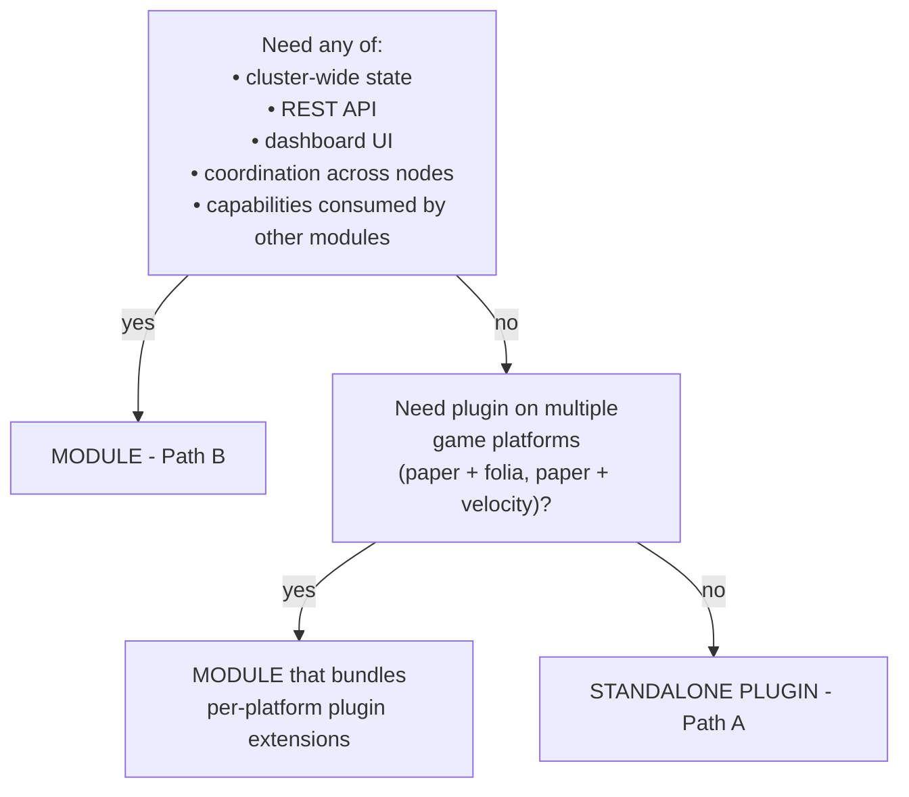

A Minecraft plugin in PrexorCloud is code that ships *inside* a Minecraft
server or proxy JVM, alongside the cloud-installed jar. There are two
deployment models for shipping plugin code, and they are **not** a
hierarchy — a standalone plugin is not a "lite module," it is a
different model with its own tooling, docs, and scaffold.

## What you'll learn

- The two paths: standalone `@CloudPlugin` jars (Path A) versus modules
  that bundle workload extensions (Path B).
- A decision flowchart for picking between them.
- The plugin SDK basics — `@CloudPlugin`, `CloudPluginBase`,
  `CloudPluginContext`.
- Cross-platform considerations (Paper, Spigot, Folia, Velocity,
  BungeeCord).
- How plugins authenticate to the controller and what they can do over
  REST.

## The decision flowchart



Three honest cases:

- **Cluster-wide state, REST API, dashboard UI, or coordination across
  nodes?** → Module (Path B). See [Platform
  Modules](/concepts/modules/platform/).
- **In-game / in-proxy behaviour on a single platform only?** →
  Standalone plugin (Path A).
- **Both — server-side game logic plus dashboard / cluster state?** →
  Module that bundles per-platform plugin extensions.

The single-platform case is genuinely common (e.g. an admin command
suite that only runs on Paper). For that case, the module wrapper would
be theatre — pick Path A.

## Side by side

|  | Standalone plugin (Path A) | Module (Path B) |
|---|---|---|
| Lives at | `java/cloud-plugin/cloud-plugin-<name>/` | `java/cloud-modules/<name>/` |
| Manifest | none — `@CloudPlugin` annotation only | `module.yaml` plus generated `META-INF/prexor-module.json` |
| Deployment | drop the shaded jar into `cloud-plugins/` | `prexorctl module install <bundle>` against the controller |
| Frontend | n/a | optional Vue package via `dashboard/packages/module-sdk` |
| REST endpoints | n/a | `/api/v1/modules/<id>/<sub>` via `ModuleRouteRegistry` |
| Per-module storage | n/a | MongoDB plus Valkey primitives, isolated by module id |
| Capability registry | consume only (via `cloud-api`) | provide and consume |
| Cross-platform variants | one platform per scaffold; rerun for more | per-platform plugin extensions ship inside the same module |
| Scaffold | `prexorctl plugin new --platform=<p>` | `prexorctl module new` (TUI wizard) |
| Signing | optional, plugin author's choice | cosign plus Rekor; verifier enforces on install |

Both paths can coexist — most production networks run both
(generic-purpose plugins per platform plus a few cluster-wide modules).

## Path A: standalone plugins

A standalone plugin is a single jar with the `@CloudPlugin` annotation.
Drop it into the server's `cloud-plugins/` directory and it gets the cloud
SDK at startup.

```bash
prexorctl plugin new my-greeter --platform=paper
cd java && ./gradlew :cloud-plugin:cloud-plugin-my-greeter:shadowJar
# Drop build/libs/cloud-plugin-my-greeter-all.jar into your Paper server's plugins/.
```

```java
@CloudPlugin(id = "my-greeter", name = "MyGreeter", version = "0.1.0")
public final class MyGreeterPlugin extends CloudPluginBase {

    @Override
    protected void onCloudEnable(CloudPluginContext ctx) {
        ctx.events().subscribe(PlayerJoinEvent.class, this::onJoin);
        ctx.commands().register("greet", new GreetCommand());
    }

    private void onJoin(PlayerJoinEvent e) {
        e.player().sendMessage("<green>Welcome to the cluster!");
    }
}
```

`CloudPluginContext` is the every-plugin-needs-this object:

```java
public interface CloudPluginContext {
    EventBus events();             // api.event.EventBus
    CommandRegistry commands();
    PlayerManager players();
    PluginScheduler scheduler();   // platform-specific (Bukkit, Velocity)
    CloudClient client();          // typed REST client to controller
    Logger logger();               // java.util.logging
    InstanceContext instance();    // this instance's id, group, port
}
```

The shared `CloudClient` handles plugin-token auth automatically — see
[Authentication](/concepts/security/) below.

### Cross-platform with `@ForVersion`

A single plugin jar can support multiple Minecraft versions through the
`@ForVersion` dispatcher pattern:

```java
@CloudPlugin(id = "version-aware", name = "VersionAware", version = "0.1.0")
public final class VersionAwarePlugin extends CloudPluginBase {
    @Override
    protected void onCloudEnable(CloudPluginContext ctx) {
        adapt(VersionAdapter.class);
    }

    @ForVersion("1.20")
    public static final class V120 implements VersionAdapter { /* ... */ }

    @ForVersion("1.21")
    public static final class V121 implements VersionAdapter { /* ... */ }
}
```

`VersionDispatcher` picks the right adapter at runtime based on the
detected server version. This is symmetric across Paper, Spigot, and
Folia.

### Supported platforms

| Platform | Scaffold flag | Notes |
|---|---|---|
| Paper | `--platform=paper` | Default plugin platform; multi-version via `--mc-version` |
| Spigot | `--platform=spigot` | Same SDK shape, narrower API surface |
| Folia | `--platform=folia` | Region-aware scheduler; `PluginScheduler` adapts |
| Velocity | `--platform=velocity` | Proxy-side; ships with disabled velocity-api annotation processor in the scaffold |
| BungeeCord | `--platform=bungeecord` | Proxy-side; no `CloudPluginBase` subclass — different SDK shape |

See the [plugin SDK reference](/reference/plugin-sdk/) for the full
plugin-side API.

## Path B: modules that bundle plugin extensions

A module (in the [module system](/concepts/modules/) sense) can bundle
one or more plugin extensions that the controller distributes to
matching server instances at start time.

```yaml
# module.yaml
manifestVersion: 1
id: stats-aggregator
version: 0.1.0
hosts: [controller]
backend:
  controller:
    entrypoint: com.example.StatsAggregatorModule
extensions:
  - id: stats-aggregator-paper
    targets:
      platform: paper
      versions: ["1.20", "1.21"]
    artifact: extensions/stats-aggregator-paper.jar
  - id: stats-aggregator-velocity
    targets:
      platform: velocity
    artifact: extensions/stats-aggregator-velocity.jar
```

The controller's `ExtensionRegistry` resolves which extension applies
to which group based on platform / version / variant matchers. The
decision is hashed into the [composition
plan](/concepts/groups-instances-templates/) so the daemon installs
exactly the right jar — and a hash mismatch is detected fast.

The module-side code (the controller-side `PlatformModule` and the
in-server extensions) communicate through the module's REST surface
plus capabilities. The reference module `stats-aggregator` is the worked
example.

## How plugins authenticate

Plugins authenticate to the controller with a **per-instance plugin
token** (`ptk_` prefix), short-TTL, scoped to the instance.

When the controller dispatches a `Start` to a daemon, it generates a
plugin token and includes it in the composition plan. The daemon writes
this into the instance's environment as `CLOUD_PLUGIN_TOKEN`. The cloud
plugin reads the env var on startup and presents it as a Bearer token
on `/api/proxy/*` and `/api/plugin/*` REST routes.

Why per-instance tokens:

- If a server is compromised, only that one instance's REST surface is
  exposed.
- Tokens have a short TTL (15 minutes by default); the plugin
  refreshes proactively before expiry.
- Tokens are revoked when the instance stops.
- Tokens carry a sequence window for replay protection
  (`prexor:v1:workloadseq:`).

See [Security](/concepts/security/) for the full auth model.

## The proxy-side: Network Composition routing

Proxy plugins (Velocity, BungeeCord) implement [Network
Composition](/concepts/groups-instances-templates/) routing. They cache
the `NetworkComposition` record from
`/api/proxy/networks` (plugin-token auth) and route players based on
it:

- **On player connect:** walk `[lobbyGroup] ++ fallbackGroups` to pick
  where to land the player.
- **On kick:** walk the same chain (excluding the kicking group) to
  redirect the player.
- **On exhausted chain:** disconnect with the network's `kickMessage`.

The proxy plugins are deliberately stateless beyond the cached
composition. Operators change topology by editing the network record;
every proxy instance re-routes within milliseconds.

## A standalone plugin in 30 lines

```java
@CloudPlugin(id = "lobby-greeter", name = "LobbyGreeter", version = "0.1.0")
public final class LobbyGreeterPlugin extends CloudPluginBase {
    @Override
    protected void onCloudEnable(CloudPluginContext ctx) {
        if (!"lobby".equals(ctx.instance().group())) {
            ctx.logger().info("not a lobby instance, skipping");
            return;
        }
        ctx.events().subscribe(PlayerJoinEvent.class, e ->
            e.player().sendMessage("<gold>Welcome to the lobby."));

        ctx.commands().register("hub", (sender, args) -> {
            ctx.client().requestTransfer(sender.uuid(), "lobby");
            return CommandResult.success();
        });
    }
}
```

Three things happened: an event subscription, a command registration,
and a controller-mediated player transfer. None of those need a module.

## Where to look

| What | Where |
|---|---|
| Plugin SDK reference | [`/reference/plugin-sdk/`](/reference/plugin-sdk/) |
| Module SDK reference | [`/reference/module-sdk/`](/reference/module-sdk/) |
| Cloud-plugin internals | `cloud-plugins-internal/` and `cloud-plugins-server-*`, `cloud-plugins-proxy-*` |
| Reference plugin scaffolds | `prexorctl plugin new` emits a working scaffold |

## Next up

- [Module System](/concepts/modules/) — the full module orientation if
  you decided you need Path B.
- [Security](/concepts/security/) — plugin-token auth, per-instance
  rotation, replay protection.
- [Events](/concepts/events/) — what plugin code can subscribe to.
- [Plugin SDK reference](/reference/plugin-sdk/) — the full plugin-side
  API.
