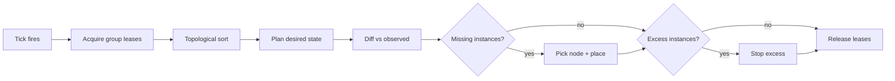

The scheduler is the scariest subsystem in the controller and the one
operators look at most. It decides where instances run, when scaling
fires, when crashes pause a group, when drains complete. This page is the
mental model — what fires when, what gates each decision, and how
declarative overlays change the inputs without changing the engine.

## What you'll learn

- How the scheduler is structured: per-group leases, a single tick loop,
  topological group ordering.
- The placement algorithm: weighted node scoring with affinity,
  anti-affinity, capacity, and spread.
- The three scaling modes (`STATIC`, `DYNAMIC`, `MANUAL`) and the
  cooldowns that prevent flapping.
- How Event Choreography overlays time-bound config changes onto groups.
- What crash-loop detection does, and how drains work.

## How the scheduler ticks

The scheduler runs a periodic evaluation loop. Each tick:

1. Acquire the per-group lease for every group eligible to evaluate.
   Groups whose leases are held by another controller are skipped this
   tick (active-active gating — see
   [Cluster Model](/concepts/cluster-model/)).
2. Topologically sort the leased groups by `dependsOn` (Kahn's algorithm).
   Cyclic dependencies are rejected at config-load time.
3. For each group, walk the evaluation pipeline:
   - Compute desired state (apply Choreography overlays, scaling rules,
     maintenance flags).
   - Compare with observed state (`ClusterState`).
   - For each missing instance, plan and dispatch a start.
   - For each excess instance, plan and dispatch a stop.
4. Release leases.

The tick interval is configurable (`scheduler.tickIntervalSeconds`,
default 5). `prexorcloud_scheduler_last_tick_lag_ms` and
`prexorcloud_scheduler_tick_duration` are the two metrics that matter for
diagnosing scheduler health — see
[Observability](/operations/monitoring/).



## Placement: the weighted node selector

When the scheduler decides an instance is missing, it asks
`WeightedNodeSelector` to pick a node. The selector scores every
candidate node and returns the highest-scoring one.

### The score

The score for a candidate node combines four signals:

| Signal | Direction | What it captures |
|---|---|---|
| Affinity match | required | Group `affinity: { region: eu-west }` requires the node to carry the matching label |
| Anti-affinity match | excluding | Group `antiAffinity: { gpu: true }` excludes nodes carrying the label |
| Capacity headroom | maximizing | Free CPU, free memory, free instance slots |
| Anti-spread | maximizing | Avoid stacking too many of the same group on one node |

Affinity and anti-affinity are filters, not scores — they determine
*eligibility*. A node that fails an affinity match cannot be picked at
all. Anti-spread and headroom are weighted scores within the eligible
set.

The default weighting is biased toward spread (we'd rather lose the
group's two instances on two nodes than two instances on the same node).
Operators can tune the weights via `scheduler.placement.weights`.

### Port allocation

Within the chosen node, the daemon scans the group's port range
(`ports.range: 25600-25699`) sequentially for the first unused port. If
the range is exhausted, the placement fails with a clear error and the
scheduler will retry on the next tick (likely picking a different node).

### Failure handling

A placement attempt can fail at three points:

| Failure | Behaviour |
|---|---|
| No eligible nodes | Instance stays `SCHEDULED`; controller retries next tick. Emits a `INSTANCE_UNPLACED` event. |
| Port allocation failed on chosen node | Same — retry next tick. |
| Daemon never acks the start within `scheduler.startTimeoutSeconds` | Plan retried on the next tick (idempotent — same `planHash`). After `scheduler.startMaxAttempts`, instance fails with a `START_FAILED` event. |

## Scaling

Three scaling modes per group, declared in the group config:

### `STATIC`

The scheduler maintains exactly `min` instances. To scale, edit the group.
Right for groups with deterministic IDs — the proxy group, a hub, a
creative-mode overworld.

### `DYNAMIC`

Auto-scale between `min` and `max` based on player-load thresholds.

```yaml
scaling:
  mode: DYNAMIC
  min: 2
  max: 10
  target: 0.7              # average player load triggers scale up
  scaleDownTarget: 0.3     # average load triggers scale down
  cooldownSeconds: 60
  scaleStep: 1             # how many instances to add per scaling event
```

The `ScalingEvaluator`:

1. Computes average player load across the group's `RUNNING` instances.
2. If load > `target` and we're under `max`, schedule a scale-up.
3. If load < `scaleDownTarget` and we're over `min`, schedule a
   scale-down.
4. Apply `cooldownSeconds` after each scaling event — no further scaling
   in either direction until the cooldown expires. This prevents
   flapping.

Scaling events emit `INSTANCE_SCHEDULED` (up) or `INSTANCE_STOPPING`
(down) on the SSE bus and increment
`prexorcloud_scaling_events_total{group, direction}`.

### `MANUAL`

The scheduler does not add or remove instances. Operators do it
explicitly:

```bash
prexorctl group scale lobby --target 5
```

Useful for staging environments where you want full control or for
in-progress migrations where automatic scaling would interfere.

## Crash-loop detection

When an instance crashes, the daemon classifies the exit (OOM, SIGKILL,
clean, unknown), captures the console tail, and reports a `CrashReport`
to the controller. The controller appends to the `crashes` collection
and updates the in-memory `CrashLoopDetector`.

The detector watches a sliding window per group: if **N crashes occur
within window W**, the group is automatically paused. Defaults:

```yaml
scheduler:
  crashLoop:
    threshold: 3            # crashes
    windowSeconds: 300      # within 5 minutes
    action: PAUSE_GROUP
```

A paused group is left alone — no new instances are scheduled, no
existing instances are restarted by the scheduler. Existing instances
continue running until they crash or stop. Operators investigate, fix,
and unpause:

```bash
prexorctl group resume lobby
```

The pause emits a `GROUP_PAUSED` event with the reason
(`crash_loop_threshold_exceeded`); the dashboard shows the group with a
red pause badge and the recent crash records inline.

## Drains

Operators take a node out of service via `prexorctl node drain <id>`
(gated on `nodes.manage`). The drain workflow:

1. The node is marked drainable. The scheduler stops placing new
   instances on it.
2. For each `RUNNING` instance on the node, the controller emits
   `INSTANCE_STOPPING` and instructs the daemon to stop gracefully.
3. The proxy plugins observe the SSE event and migrate connected players
   to fallback instances via the [Network
   Composition](/concepts/groups-instances-templates/) chain.
4. Once the daemon reports the instance `STOPPED`, the controller picks
   a new node and schedules a replacement (subject to the group's
   scaling rules).
5. When the node has no remaining instances, it is `DRAINED`. Operators
   can stop the daemon process, take the host offline, or do
   maintenance.

Drains are a workflow — their state is persisted to `workflow_intents` in
MongoDB and can resume across controller failover. The owner of the
node-ownership lease drives the drain. If the controller dies mid-drain,
another controller picks up the workflow and continues.

The full state machine for drains is in the [recovery
runbook](https://github.com/prexorjustin/prexorcloud/blob/main/docs/runbooks/recover-controller.md).

## Event Choreography overlays

The scaler is a pure function of group config. To get time-bound
behaviour ("scale lobby up Friday peak hours, scale down at 02:00 UTC,
maintenance window Sunday morning") without writing a parallel
scheduler, PrexorCloud overlays config via Event Choreography.

```yaml
events:
  - id: peak-hours
    cron: "0 19 * * 5"            # Fri 19:00
    duration: "PT7H"
    targetGroup: lobby
    overlay:
      minInstances: 4
      maxInstances: 20
      scalingMode: DYNAMIC

  - id: maintenance-window
    cron: "0 8 * * 0"             # Sun 08:00
    duration: "PT1H"
    targetGroup: lobby
    overlay:
      maintenance: true
      maintenanceMessage: "<yellow>Patching, back in 1h"
```

`EventChoreographer` is a 5-field cron parser with Vixie OR semantics on
day-of-month / day-of-week and IANA timezone support. It evaluates active
overlays each scheduler tick and feeds them into
`SchedulerDesiredStatePlanner.planGroup`. The scaler does the same job
it always did; overlays are just additional inputs.

State changes emit `CHOREOGRAPHY_OVERLAY_ACTIVATED` /
`_DEACTIVATED` on the SSE bus, so the dashboard shows a "peak hours
active" pill on the affected group.

Read-only REST surface:

- `GET /api/v1/events` — configured entries.
- `GET /api/v1/events/active` — currently firing overlays.

Both gated on `events.view`. There is no UI for editing overlays in v1 —
they are config-driven. Only `minInstances`, `maxInstances`,
`scalingMode`, and `maintenance` are overlay-able.

## Maintenance mode

A group can be put into maintenance mode (per-group) or the whole cluster
can be (global). Maintenance:

- Stops the scheduler from scheduling *new* instances in the group.
- Does not stop existing instances.
- Optionally rejects new player connections at the proxy with a custom
  message.

Useful for planned outages, large config rollouts, or pinning a known-bad
group while you debug.

```bash
prexorctl group maintenance lobby --enable --message "Patching, back in 30m"
prexorctl group maintenance lobby --disable
```

Choreography overlays can flip this on and off automatically — see the
overlay example above.

## Tuning knobs

The scheduler is conservative by default. The knobs operators most often
adjust:

| Knob | Default | What it changes |
|---|---|---|
| `scheduler.tickIntervalSeconds` | 5 | How often the loop runs. Lower for faster reaction, higher for less work under quiet load. |
| `scheduler.startTimeoutSeconds` | 60 | How long to wait for a daemon to ack a start before retrying. Increase on slow disks. |
| `scheduler.startMaxAttempts` | 3 | Per-instance start retries before failing the placement. |
| `scaling.cooldownSeconds` | 60 | Per-group scaling cooldown. Increase if you see flap. |
| `crashLoop.threshold` / `windowSeconds` | 3 / 300 | When to auto-pause a group. |
| `placement.weights` | balanced | Affinity, anti-spread, headroom weights. |

The full configuration reference lives at
Operations / Configuration.

## Next up

- [Deployments](/concepts/deployments/) — rolling restarts as the
  template-swap mechanism.
- [Cluster Model](/concepts/cluster-model/) — leases, fencing, what
  drives per-group lease ownership.
- [Events](/concepts/events/) — every scheduler decision emits an SSE
  event.
- [Observability](/operations/monitoring/) — the metrics that tell
  you the scheduler is healthy.
