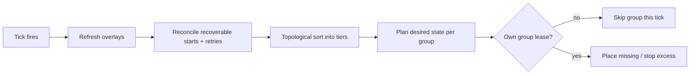

The scheduler is the part of the Controller that decides where Instances run and how many run. It runs one periodic loop, evaluates every Group in dependency order, and reconciles the cluster toward each Group's desired state. This page is the mental model: what fires on each tick, how a node is chosen, when scaling acts, what pauses a crash loop, and how time-bound overlays change a Group's inputs without editing it.

Read this once, then refer back. Every command, key, and default below is taken from the Controller source.

## What you'll learn

- How the scheduler loop is structured: dependency tiers, concurrent evaluation, per-Group leases.
- The weighted node selector: eligibility filters and the five scoring signals.
- The three scaling modes (`STATIC`, `DYNAMIC`, `MANUAL`) and the cooldown that prevents flapping.
- Crash-loop detection: the sliding window, the auto-unpause, the exponential backoff.
- How Event Choreography overlays apply cron-scheduled config changes to a Group.

## The scheduler tick

The scheduler runs a single-threaded loop on a daemon thread named `scheduler`. The interval is `scheduler.evaluationIntervalSeconds` in `controller.yaml`, default `15`.

Each tick (`Scheduler.evaluate`):

1. Refresh Event Choreography overlays (`EventChoreographer.refresh`) so the current wall-clock instant decides which overlays are active.
2. Reconcile recoverable starts, persisted start retries, and persisted deployments left over from a previous controller or a failed tick.
3. Compute the evaluation order: a topological sort of Groups by `dependsOn`, producing dependency tiers.
4. For each tier, fork one virtual task per Group (`StructuredTaskScope`, JEP 505) and join. Groups in the same tier evaluate concurrently; tiers run in order.
5. For each Group, plan desired state, acquire the Group lease, and execute the plan.

A failure in one Group is caught and logged; it does not abort the tick or the other Groups.



### Dependency tiers and ordering

`SchedulerDesiredStatePlanner.planEvaluationOrder` runs Kahn's algorithm over the `dependsOn` edges. A Group enters a tier once every Group it depends on is already placed in an earlier tier. If a cycle leaves Groups unplaceable, the remaining Groups are emitted as one final tier so the loop still makes progress instead of stalling.

Within a tier, Groups sort by `priority` descending, then `startupWeight` descending. Higher-priority Groups place first when resources are scarce.

A Group's `dependsOn` is also a runtime gate: in `planGroup`, a Group is skipped with reason `dependency <name> has no running instances` until at least one dependency Instance is `RUNNING`. A proxy that depends on a lobby waits for the lobby to come up.

### Per-Group leases

When Redis coordination is enabled, the scheduler acquires the lease `group:<name>` before acting on a Group. If another Controller holds it, the Group is skipped this tick (`leased by another controller`). This is how an active-active Controller set divides work without double-scheduling. With Redis disabled, the lease is always granted locally. See [Cluster model](/concepts/cluster-model/).

The lease is fenced. Every side-effecting step in placement re-checks `ensureLeaseCurrent`; if the fencing token went stale mid-placement, the step aborts rather than writing under a lease it no longer owns.

### When a Group is skipped

`planGroup` returns a skip reason and does nothing for the Group when any of these hold:

| Skip reason | Condition |
|---|---|
| `global maintenance` | `maintenance.enabled` is set Controller-wide |
| `maintenance mode` | the (overlay-resolved) Group has `maintenance: true` |
| `manual scaling` | the Group's `scalingMode` is `MANUAL` |
| `crash loop paused` | the Group is currently paused by the crash-loop detector |
| `dependency <name> has no running instances` | a `dependsOn` target has no `RUNNING` Instance |

## Placement: the weighted node selector

When the scheduler needs a new Instance, `InstancePlacementCoordinator` builds an `InstanceRequest` from the resolved Group and asks `WeightedNodeSelector` to pick a node. The selector filters to eligible nodes, then returns the highest-scoring one.

### Eligibility filters

A node is eligible only if all of these pass (`WeightedNodeSelector.isEligible`):

| Filter | Rule |
|---|---|
| Status | node status is `ONLINE` |
| Capacity | `ResourceAccounting.project(node, request).fits()` — memory, CPU, and disk reservations all fit (see below) |
| Ports | at least one free port exists in `[portRangeStart, portRangeEnd]` |
| Affinity | every label in `nodeAffinity` matches the node |
| Anti-affinity | no label in `nodeAntiAffinity` matches the node |

Label constraints use the format `key=value` (exact match) or `key` (presence check). Affinity and anti-affinity decide eligibility, not score: a node that fails affinity cannot be picked at all.

`ResourceAccounting.project` decides `fits()`:

- Memory fits when `usedMemoryMb + request.memoryMb <= totalMemoryMb`.
- CPU fits when `cpuUsage + cpuReservation <= 0.95` (`CPU_HARD_LIMIT`).
- Disk fits when the requested `diskReservationMb` is 0 or leaves non-negative free disk.

Watermarks (memory `0.90`, CPU `0.85`, disk low at `1024` MB free) do not block placement; they log a warning when a placement pushes a node into the danger zone.

### Scoring

Among eligible nodes, `score` is a weighted sum in `[0, 1]`. Higher wins:

| Signal | Weight | Computation |
|---|---|---|
| Free memory | 0.35 | `freeMemoryMb / totalMemoryMb` |
| CPU availability | 0.25 | `1 - cpuUsage` |
| Instance spread | 0.15 | `1 / (1 + instanceCount)` — fewer Instances on the node scores higher |
| Port availability | 0.10 | fraction of the port range still free |
| Group spread | 0.15 | spread across the `spreadConstraint` label bucket |

These weights are fixed in `WeightedNodeSelector`; there is no config key to retune them.

The group-spread signal uses `spreadConstraint`, a bare node-label key (for example `rack` or `zone`). The Controller counts how many of this Group's existing Instances sit in each label bucket and scores a candidate `1 - bucketCount/maxBucket`. A node in the most-loaded bucket scores 0 on this signal; a node in an empty bucket scores 1. Nodes without the label, or when no constraint is set, score 1 (not penalised). This pushes Instances of one Group across racks or zones rather than stacking them.

### Port allocation

`PortAllocator.allocate` scans `[portRangeStart, portRangeEnd]` and returns the lowest port not already in the node's `usedPorts`. Defaults are `30000`–`30100`. If the range is exhausted on the chosen node, placement fails and the scheduler retries next tick — likely on a different node, since the full one is now port-exhausted and scores lower.

### Placement lifecycle and failure

`InstancePlacementCoordinator.placeResolvedInstance` does, in order: select node, allocate port, write the `SCHEDULED` Instance into cluster state, reserve the port and memory on the node, build and persist the composition plan, then dispatch a `StartInstance` to the Daemon.

| Failure point | Behaviour |
|---|---|
| No eligible node | Logs `No eligible node available for group <name>`; the Instance is not created. The scheduler retries on the next tick. |
| No free port on chosen node | Same — retry next tick. |
| Composition plan build fails | The scheduled placement is rolled back (Instance removed, port and memory freed); retry next tick. |
| Daemon has no active session at dispatch | The `SCHEDULED` placement is preserved; the recoverable-start handoff redispatches once the Daemon reconnects. |
| Lease lost before dispatch | The `SCHEDULED` placement is preserved; recoverable-start redispatch picks it up. |

A static Group places its missing Instances one at a time; if one cannot be placed, the loop stops for that Group this tick and resumes next tick.

## Scaling modes

Every Group has a `scalingMode`: `STATIC`, `DYNAMIC`, or `MANUAL`. The default is `DYNAMIC`. The mode is case-insensitive in config and uppercased on load.

### `STATIC`

The scheduler maintains exactly `minInstances` Instances, using deterministic IDs. Static IDs come from `staticInstanceNames` when set, otherwise generated from the Group name and index. On each tick the planner computes the expected ID set, subtracts the active ones (anything not `STOPPED`/`CRASHED`), and places the missing ones. `STATIC` Groups never scale beyond `minInstances`.

Use `STATIC` for Groups that need stable identity: a proxy Group, a single hub, a persistent survival world.

### `DYNAMIC`

The scheduler keeps the Instance count between `minInstances` and `maxInstances` and scales on player load. `ScalingEvaluator` runs two checks each tick.

**Scale up** (`evaluateScaleUp`), in order:

1. If the active count is below `minInstances`, return the shortfall — the floor is always restored, regardless of load or cooldown.
2. If already at `maxInstances`, do nothing.
3. If the Group is on cooldown, do nothing.
4. Otherwise, if **every** `RUNNING` Instance is at or above `scaleUpThreshold` of capacity, add one Instance. Per-Instance load is `playerCount / maxPlayers`.

Scale-up adds one Instance per scaling event. It fires only when all running Instances are saturated, not on an average — one quiet Instance blocks a scale-up.

**Scale down** (`evaluateScaleDown`):

1. Only `DYNAMIC` Groups scale down.
2. Never below `minInstances`.
3. Respect the cooldown.
4. Stop one `RUNNING` Instance that has `playerCount == 0` and an uptime greater than `scaleDownAfterSeconds`. An Instance must be empty *and* old enough; a freshly started empty Instance is not torn down immediately.

Active-count math excludes `STOPPED`, `CRASHED`, and `DRAINING` Instances.

```yaml
# A dynamic group in controller.yaml (group fields)
name: lobby
scalingMode: DYNAMIC
minInstances: 2
maxInstances: 10
maxPlayers: 100
scaleUpThreshold: 0.8       # scale up when every instance is >= 80% full
scaleDownAfterSeconds: 300  # an empty instance must idle 5 min before teardown
scaleCooldownSeconds: 60    # no further scaling for 60s after an action
portRangeStart: 30000
portRangeEnd: 30100
```

### `MANUAL`

The scheduler never adds or removes Instances and never replaces a stopped one. You control the count yourself. The planner skips `MANUAL` Groups entirely (`manual scaling`), and `scheduleReplacement` refuses to act on them. Use `MANUAL` for staging or mid-migration Groups where automatic action would interfere.

## Cooldown

A cooldown stops a Group from scaling again immediately after it just scaled — the anti-flap guard. Both scale-up and scale-down check it.

- Per-Group: `scaleCooldownSeconds` on the Group (default `60`).
- Default fallback: `scheduler.scalingCooldownSeconds` in `controller.yaml` (default `60`), used when the Group sets no positive value.

`ScalingEvaluator.recordScaleAction` stamps the action time after every placement and after a scale-down. When Redis coordination is on, the cooldown is a `SETEX` key (`isOnCooldown` reads it), so the cooldown is shared across Controllers. With Redis off, it is tracked in memory per Group.

## Scaling commands

Scaling is config-driven. Change the bounds, the scheduler reconciles.

Adjust a Group's bounds or mode:

```bash
prexorctl group update lobby --min 4 --max 12
prexorctl group update lobby --scaling-mode STATIC
```

Add one Instance to a Group out of band (for a `MANUAL` Group, or to pre-warm):

```bash
prexorctl instance start lobby
```

`instance start` posts to `POST /api/v1/groups/{name}/start`. For a static Group it places the next missing static ID; for a dynamic Group it uses gap-filling ID generation and refuses if the Group is already at `maxInstances`.

Stop a specific Instance:

```bash
prexorctl instance stop lobby-3
prexorctl instance stop lobby-3 --force
```

There is no `group scale` or `group resume` command — scale through `group update`, and crash-loop pauses clear automatically (below).

## Maintenance

A Group in maintenance is skipped by the scheduler: no scaling, no replacement of stopped Instances. Existing Instances keep running.

```bash
prexorctl group maintenance lobby on
prexorctl group maintenance lobby off
```

The argument is positional (`on`/`off`/`true`/`1` enable; anything else disables) and patches `maintenance` on the Group. Controller-wide maintenance (`maintenance.enabled`) skips every Group. An Event Choreography overlay can also toggle a Group's maintenance on a schedule (below).

## Crash-loop detection

`CrashLoopDetector` watches a sliding crash window per Group and pauses a Group that crashes too often, so a broken build does not respawn forever.

Config lives under the top-level `crashes` block in `controller.yaml`:

| Key | Default | Meaning |
|---|---|---|
| `crashes.crashLoopThreshold` | `3` | crashes within the window that trip the pause |
| `crashes.crashLoopWindowSeconds` | `300` | sliding window length |
| `crashes.ringBufferSize` | `500` | in-memory crash records retained |

How it behaves:

1. Each crash appends a timestamp; entries older than the window are dropped.
2. When the window holds at least `crashLoopThreshold` crashes and the Group is not already paused, the Group is paused and a `GroupCrashLoopEvent` is published.
3. A paused Group is skipped by the scheduler (`crash loop paused`) — no new Instances, no auto-replacement. Running Instances keep running.
4. The Group auto-unpauses after a cooldown to allow one retry. The cooldown starts at `60` seconds and doubles per consecutive pause (exponential backoff), capped at `3600` seconds (1 hour).

Clear a pause manually (resets the crash window and the backoff counter):

```java
crashLoopDetector.unpause("lobby");
```

Manual unpause is an in-process API, not a CLI command. In practice you fix the underlying fault and let the auto-unpause retry, or restart the Controller to reset the detector.

## Instance recycling

A Group with `maxLifetimeSeconds > 0` passes that ceiling to the Daemon in the `StartInstance` message. The Daemon enforces the lifetime and stops the Instance when it expires; the scheduler then replaces it on a later tick (for `STATIC` and `DYNAMIC` Groups). This rolls long-lived Instances without an operator command. A value of `0` means no lifetime cap.

## Event Choreography overlays

Event Choreography applies cron-scheduled, time-bound config changes to a Group without editing the Group. An overlay fires at its cron time, stays active for `durationSeconds`, temporarily replaces selected fields of the Group's resolved config, then expires. The persisted Group is never mutated; overlays are applied in memory at tick time by `SchedulerDesiredStatePlanner`.

Entries live under the top-level `events` list in `controller.yaml`. Each entry (`EventChoreography`):

| Field | Required | Notes |
|---|---|---|
| `name` | yes | unique; must match `[a-z0-9_][a-z0-9_-]*` |
| `description` | no | free text |
| `group` | yes | target Group name |
| `cron` | yes | 5-field cron `m h dom mon dow`; supports `*`, comma lists, `a-b` ranges, `/step`. No seconds, no aliases |
| `timezone` | no | IANA zone (e.g. `Europe/Berlin`); defaults to `UTC` |
| `durationSeconds` | yes | must be `> 0`; how long each firing stays active |
| `overlay` | yes | the partial Group overlay |

The `overlay` is partial — `null` on a field means "leave it alone", and at least one field must be set or the entry is rejected as a no-op:

| Overlay field | Effect |
|---|---|
| `minInstances` | overrides the Group floor (must be `>= 0`) |
| `maxInstances` | overrides the Group ceiling (must be `> 0`) |
| `scalingMode` | `DYNAMIC` / `STATIC` / `MANUAL` |
| `maintenance` | toggles maintenance |
| `maintenanceMessage` | sets the maintenance message |

If an overlay would invert the bounds (`min > max`), the Controller clamps them to a coherent pair, preferring the side the overlay explicitly set.

### How overlays resolve

- On each tick, `EventChoreographer.apply` looks up the active overlay for the Group at the current instant and returns a choreographed copy of the resolved `GroupConfig`. The scheduler then treats that copy as the Group for this tick.
- The planner applies overlays to both the requested Group (for skip checks and scale decisions) and the resolved Group (for placement), so overlay scaling and maintenance take effect immediately.
- When multiple overlays target the same Group at once, the one whose firing window started most recently wins (last-write-wins).
- `refresh` emits `ChoreographyOverlayActivatedEvent` / `ChoreographyOverlayDeactivatedEvent` on the event bus when a Group's active overlay changes between ticks (activated, superseded, or expired).

### Worked example

Open more lobby Instances every Saturday 18:00–20:00 Berlin time, then fall back to the Group's own bounds:

```yaml
# controller.yaml
events:
  - name: weekend_rush
    description: Bigger lobby for the Saturday-evening peak
    group: lobby
    cron: "0 18 * * 6"        # 18:00 every Saturday
    timezone: Europe/Berlin
    durationSeconds: 7200     # active for 2 hours
    overlay:
      minInstances: 6
      maxInstances: 20
```

During the window, the lobby's effective floor is `6` and ceiling `20`; outside it, the Group reverts to its configured `minInstances`/`maxInstances` with nothing persisted.

A maintenance window during a patch:

```yaml
events:
  - name: tuesday_patch_window
    group: survival
    cron: "0 4 * * 2"         # 04:00 every Tuesday
    timezone: UTC
    durationSeconds: 1800     # 30 minutes
    overlay:
      maintenance: true
      maintenanceMessage: "Weekly patch window — back by 04:30 UTC"
```

## Metrics

The scheduler records these per tick through `MetricsCollector` (Prometheus exposition names shown):

| Metric | Type | Meaning |
|---|---|---|
| `prexorcloud_scheduler_tick_duration` | timer (p50/p95/p99) | duration of one evaluation pass |
| `prexorcloud_scheduler_tick_failures_total` | counter | passes that threw before completing |
| `prexorcloud_scheduler_groups_evaluated` | summary | Groups evaluated per tick |
| `prexorcloud_scheduler_last_tick_lag_ms` | gauge | milliseconds since the last completed tick (0 before the first) |

A rising `last_tick_lag` past roughly two intervals, or a climbing `tick_failures` counter, means the loop is stalling. See [Observability](/operations/monitoring/).

## Configuration reference

Scheduler-related keys in `controller.yaml`:

| Key | Default | Effect |
|---|---|---|
| `scheduler.evaluationIntervalSeconds` | `15` | tick interval |
| `scheduler.scalingCooldownSeconds` | `60` | default scaling cooldown when a Group sets none |
| `scheduler.nodeTimeoutSeconds` | `90` | node considered gone after this without heartbeat |
| `scheduler.auditRetentionDays` | `90` | audit-log retention |
| `crashes.crashLoopThreshold` | `3` | crashes per window that pause a Group |
| `crashes.crashLoopWindowSeconds` | `300` | crash-loop sliding window |
| `crashes.ringBufferSize` | `500` | retained crash records |

Per-Group scaling fields (Group config / `prexorctl group create|update`):

| Field | Default | Effect |
|---|---|---|
| `scalingMode` | `DYNAMIC` | `STATIC` / `DYNAMIC` / `MANUAL` |
| `minInstances` | `0` | floor, always restored |
| `maxInstances` | `10` | ceiling |
| `maxPlayers` | `100` | capacity denominator for load |
| `scaleUpThreshold` | `0.8` | per-Instance load at which all-saturated triggers scale-up |
| `scaleDownAfterSeconds` | `300` | idle time before an empty Instance is torn down |
| `scaleCooldownSeconds` | `60` | per-Group cooldown |
| `portRangeStart` / `portRangeEnd` | `30000` / `30100` | port allocation range |
| `nodeAffinity` / `nodeAntiAffinity` | empty | placement label filters |
| `spreadConstraint` | empty | node-label key for group spread |
| `priority` | `0` | within-tier ordering, descending |
| `startupWeight` | `0` | within-tier tiebreak after priority |
| `dependsOn` | empty | Groups that must have a `RUNNING` Instance first |
| `maxLifetimeSeconds` | `0` | Instance recycle ceiling; `0` disables |

## Next

- [Cluster model](/concepts/cluster-model/) — leases, fencing, and active-active Controller coordination.
- [Observability](/operations/monitoring/) — the scheduler metrics in context.
