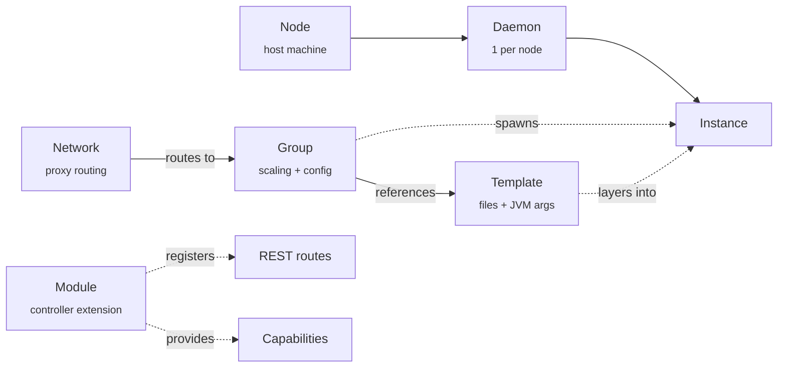

This page is the 10-minute orientation. After reading it, you'll know what
**every other page** is talking about. We define the seven nouns of the
system, link them together, and point you at the deeper-dive pages.

## What you'll learn

- The seven core nouns: node, daemon, instance, group, template, network,
  module.
- How they relate (which contains which, which references which).
- Where each one is authoritative and where the rules live.

## The seven nouns



### 1. Node

A **node** is a host machine connected to the cluster — bare metal, a VM,
or a container. Nodes don't run anything by themselves; they're identified
by an ID, an address, and a set of labels. The scheduler uses node labels
for affinity (`region=eu-west`) and anti-affinity (`gpu=true`).

State lives in `ClusterState.nodes` (in-memory authoritative) plus the
`nodes` MongoDB collection (durable). The dashboard's Nodes page is just
the SSE feed of node-state changes.

### 2. Daemon

A **daemon** is the agent process that runs on a node. Exactly one per
node. The daemon connects to the controller over mTLS gRPC, advertises the
node's capacity and labels, and applies composition plans the controller
sends it.

The daemon never invents state. If the controller hasn't sent a plan, the
daemon does nothing. This is the property that makes scheduler-issued
restarts safe across controller failover.

### 3. Instance

An **instance** is one running Minecraft server or proxy process — a Paper
JVM, a Velocity JVM, a Folia JVM. Each instance has:

- A unique ID (`lobby-3`, `bedwars-7`).
- A state in the lifecycle FSM:
  `SCHEDULED → PREPARING → STARTING → RUNNING → STOPPING → STOPPED/CRASHED`.
- A node (where it runs), a port, and a plugin token (per-instance,
  short-TTL).

When an instance crashes, the daemon classifies the exit (OOM / SIGKILL /
clean / unknown), captures the console tail, and reports a `CrashReport`
back to the controller. The crash-loop detector watches for "≥ N crashes
in window W" and pauses the group automatically until you investigate.

### 4. Group

A **group** is a logical collection of instances that share configuration
— platform, version, templates, scaling rules, port range, env vars,
resource limits. It's the unit of scaling, deployment, and template
management.

Three scaling modes:

| Mode | Behavior |
|---|---|
| `STATIC` | Fixed instance count. The scheduler maintains exactly `min` instances. |
| `DYNAMIC` | Auto-scales between `min` and `max` based on player-load thresholds with cooldowns. |
| `MANUAL` | The scheduler doesn't add or remove instances. Operators do it explicitly via `prexorctl group scale`. |

Groups also carry a `dependsOn` list. If `bedwars` depends on `lobby`, the
scheduler topologically sorts groups (Kahn's algorithm) so lobbies come up
before the games that fall back to them.

### 5. Template

A **template** is a versioned set of files (configs, plugins, worlds) plus
JVM args. Templates compose in a chain: every instance gets

```
base → base-{platform} → {group} → user-templates...
```

merged in order. Each layer overlays files; later layers win. This is how
you keep config DRY: `base-paper` carries the JVM tuning every Paper server
needs, `lobby` adds the lobby plugins, your custom `eu-events` template
adds region-specific event handling.

Files are reified deterministically by the daemon for each instance start.
The composition plan carries a hash of every layer; if a hash drifts, the
controller refuses the start.

### 6. Network

A **Network Composition** is a first-class topology record: which proxy
fronts which lobby, which fallback chain to walk on kick. Operators define
it once via REST or the dashboard; the proxy plugin caches it from the
controller and routes players accordingly.

Without Network Composition, you'd be hand-editing `velocity.toml` per
proxy instance. With it, you change one record and every proxy instance
re-routes within milliseconds.

### 7. Module

A **module** is a controller-side extension — a JVM jar loaded at runtime
that adds REST routes, subscribes to events, stores per-module state in
MongoDB or Valkey, and optionally provides typed **capabilities** other
modules can resolve.

Modules link to each other only through the capability registry — never
through shared classloaders. This is the rule that lets you upgrade,
disable, or unload a module without breaking the rest of the system.

There are two flavors:

- **Platform modules** load in the controller JVM. They get REST routes,
  Mongo storage, and the EventBus.
- **Daemon modules** load in the daemon JVM. They get instance-lifecycle
  hooks and node-local state. They can't talk to MongoDB; daemons don't.

If you're building cluster-wide functionality (a leaderboard service, a
Discord-notification bridge), it's a platform module. If you're hooking
into per-instance lifecycle (a startup-time mod-installer), it's a daemon
module.

## What lives where

| Concern | Authority | Backing store |
|---|---|---|
| Group config, templates, modules, audit log, users | Controller | MongoDB |
| Live cluster state (nodes online, instances running, players connected) | Controller in-memory `ClusterState` | (rehydrated from gRPC + Mongo on restart) |
| Composition plans, JWT revocation, leases, fencing tokens, SSE replay | Controller | Valkey (production) or in-memory (development) |
| Per-instance filesystem (templates materialised, world data) | Daemon | local filesystem on the node |
| Plugin tokens, scaling cooldowns | Controller | Valkey |

The split matters because it's also the recovery story:

- Lose the controller → restart it; daemons reconnect, `ClusterState`
  rehydrates, in-flight starts resume from persisted plans.
- Lose Valkey → mutations pause until it's back; the controller is still
  serving reads. See [recover-redis runbook](https://github.com/prexorjustin/prexorcloud/blob/main/docs/runbooks/recover-redis.md).
- Lose Mongo → controller fails readiness (`state.store=unavailable`);
  daemons keep running existing instances. See
  [recover-mongo runbook](https://github.com/prexorjustin/prexorcloud/blob/main/docs/runbooks/recover-mongo.md).

## How concepts connect at runtime

A worked example, end-to-end:

1. Operator hits `POST /api/v1/groups/lobby/scale {targetInstances: 5}`.
2. **Scheduler** (running on the per-group lease) decides instances are
   missing. Picks nodes via the weighted selector.
3. **Composition planner** generates a plan: ordered template-chain hashes,
   runtime jar reference, env, plugin token. Plan is persisted.
4. Controller sends a `Start` gRPC frame to the chosen daemon.
5. **Daemon** materialises the template chain into `instances/lobby-3/`,
   layers the Paper jar, spawns the JVM.
6. Cloud-plugin reads `CLOUD_*` env vars, exchanges the plugin token for a
   REST session, registers itself.
7. Server hits `RUNNING` → daemon emits `InstanceStarted` over gRPC →
   controller updates `ClusterState`, fans `INSTANCE_RUNNING` over SSE.
8. Dashboards subscribed to SSE see the instance flip green.

Failure cases are symmetric. Plans are hash-keyed and idempotent; if the
controller dies between steps 3 and 4, another controller acquires the
group lease, finds the persisted plan, and dispatches.

## Next up

- **[Architecture](/concepts/architecture/)** — the same diagram with one
  level more depth (controller subsystems, gRPC frame types, classloader
  rules).
- **[Groups, Instances, Templates](/concepts/groups-instances-templates/)** —
  the three core nouns, in detail.
- **[Module System](/concepts/modules/)** — platform vs daemon modules,
  capability registry, lifecycle FSM.
