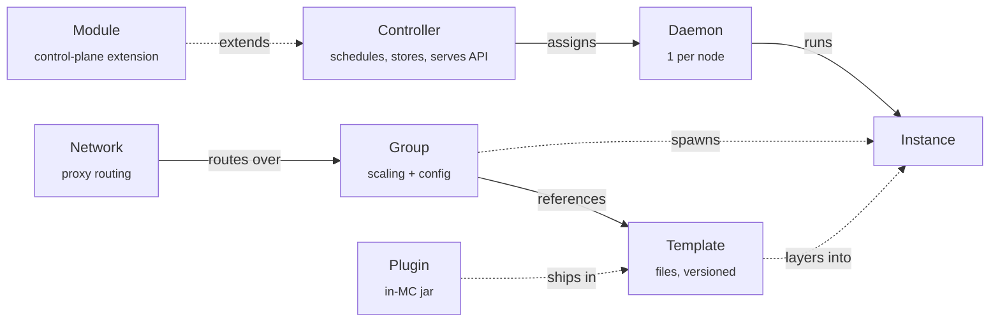

This page defines the nouns every other page assumes you know. Each section
gives the one-line definition, the fields that matter, the defaults the code
applies, and the `prexorctl` command that touches it. Read it once; refer back.

## The eight nouns

| Noun | One line | Lives where | You touch it with |
|---|---|---|---|
| Controller | The control plane. Schedules, stores state, serves the REST/gRPC API. | One process (HA via leases) | `prexorctl` talks to it for everything |
| Daemon | The per-node agent. Runs server processes the Controller assigns. | One per node | `prexorctl node …` |
| Group | A scalable set of instances sharing one config. | Controller + MongoDB | `prexorctl group …` |
| Instance | One running Minecraft server or proxy process. | A node; tracked in `ClusterState` | `prexorctl instance …` |
| Template | A versioned file package layered onto instances. | `templates/<name>/` on the Controller | `prexorctl template …` |
| Network | A routing composition over proxy and lobby groups. | Controller + MongoDB | REST `/api/v1/networks`, dashboard |
| Plugin | The in-Minecraft integration jar. | Inside the server/proxy JVM | bundled into a Template |
| Module | A Controller- or Daemon-side extension. | Controller or Daemon JVM | `prexorctl module …` |

A **Node** is the host machine (bare metal, VM, container) a Daemon runs on.
Nodes carry an ID, an address, and labels the scheduler uses for affinity.
This page treats the Daemon as the noun; the Node is its host.



## Controller

The **Controller** is the central control-plane process. It owns scheduling,
durable state, the REST API, and the gRPC services Daemons connect to.

What it does:

- Runs the **Scheduler** — a periodic loop that places and removes Instances
  to match each Group's desired state.
- Holds **`ClusterState`**, the in-memory authoritative model of every Node,
  Instance, player, and metric (thread-safe via `ConcurrentHashMap`).
- Persists durable data (Groups, Templates, Modules, users, audit log) to
  MongoDB through the `StateStore` abstraction.
- Serves the REST API under `/api/v1/…` and streams live changes over SSE.
- Issues mTLS certificates to Daemons through its self-managed CA.

The Controller never runs Minecraft itself. It tells Daemons what to run and
records what they report back. For high availability, mutations are gated by
**leases**: one Controller holds the lease for a given scope (a Group, a
platform module) at a time, and a **fencing token** stops a stale leader from
writing after failover.

`prexorctl` is the operator-facing client for the Controller. Set up a context
and authenticate before anything else.

## Daemon

The **Daemon** is the agent process that runs on a Node. Exactly one per Node.

What it does:

- Connects to the Controller over mTLS gRPC and advertises its Node's capacity
  and labels.
- Materializes the Template chain for each Instance, then spawns and supervises
  the JVM.
- Reports Instance state, console output, and metrics back over the gRPC stream.
- Classifies crashes (OOM / SIGKILL / clean / unknown), captures the console
  tail, and sends a crash report to the Controller.

The Daemon does not invent state. If the Controller has not sent it a plan, the
Daemon does nothing — the property that makes scheduler-issued restarts safe
across Controller failover. On reconnect, the Controller reconciles its known
Instances against the Daemon's running list; Instances the Daemon no longer has
are marked `CRASHED`.

A Daemon joins the cluster by exchanging a one-time **join token** for mTLS
certificates (the bootstrap exchange). Generate one on the Controller:

```bash
prexorctl cluster join-token
```

Manage Nodes through the `node` subcommands:

```bash
prexorctl node list
prexorctl node info node-fra-1
prexorctl node drain node-fra-1     # stop scheduling, evacuate players
prexorctl node undrain node-fra-1
```

## Group

A **Group** is a logical set of Instances that share one configuration —
platform, version, Templates, scaling rules, port range, resources, env. It is
the unit of scaling, deployment, and Template management. Config is the
`GroupConfig` record in the Controller, persisted to MongoDB.

### Identity and runtime

| Field | JSON key | Default | Meaning |
|---|---|---|---|
| Name | `name` | `""` | Unique Group ID (`lobby`, `bedwars`). |
| Parent | `parent` | — | Group this one inherits config from. |
| Platform | `platform` | `PAPER` | Uppercased. `PAPER`, `FOLIA`, `SPIGOT`, `VELOCITY`, `BUNGEECORD`, etc. |
| Platform version | `platformVersion` | `""` | e.g. `1.21.4`. |
| Jar file | `jarFile` | `server.jar` | Runtime jar name. |
| Templates | `templates` | `[]` | Ordered Template layers (see below). |

`VELOCITY`, `BUNGEECORD`, and `WATERFALL` resolve to the `PROXY` runtime
family; everything else is a `SERVER`.

### Scaling

Three modes, set by `scalingMode` (default `DYNAMIC`):

| Mode | Behavior |
|---|---|
| `STATIC` | Fixed set of Instances with deterministic names. The Scheduler keeps exactly the configured count. |
| `DYNAMIC` | Auto-scales between `minInstances` and `maxInstances` on player-load thresholds, with cooldowns. |
| `MANUAL` | The Scheduler neither adds nor removes Instances. You start and stop them by hand. |

| Field | JSON key | Default |
|---|---|---|
| Min instances | `minInstances` | `0` |
| Max instances | `maxInstances` | `10` |
| Max players | `maxPlayers` | `100` |
| Scale-up threshold | `scaleUpThreshold` | `0.8` (80% full) |
| Scale-down delay | `scaleDownAfterSeconds` | `300` |
| Scale cooldown | `scaleCooldownSeconds` | `60` |

There is no `group scale` command. Set the bounds with `group update` and let
the Scheduler converge, or use `MANUAL` mode and place Instances yourself.

```bash
prexorctl group create --name lobby --platform paper --platform-version 1.21.4 \
  --template base --template lobby --scaling-mode DYNAMIC --min 1 --max 5
prexorctl group update lobby --min 2 --max 8
prexorctl group list
prexorctl group info lobby
prexorctl group maintenance lobby on
```

### Networking, lifecycle, placement

| Field | JSON key | Default | Meaning |
|---|---|---|---|
| Port range start | `portRangeStart` | `30000` | First port the Daemon scans. |
| Port range end | `portRangeEnd` | `30100` | Last port in the scan. |
| Startup timeout | `startupTimeoutSeconds` | `120` | Time to reach `RUNNING` before fail. |
| Shutdown grace | `shutdownGraceSeconds` | `30` | Grace before SIGKILL. |
| Max lifetime | `maxLifetimeSeconds` | `0` (off) | Recycle an Instance after this age. |
| Memory | `memoryMb` | `1024` | Heap budget per Instance. |
| Node affinity | `nodeAffinity` | `[]` | Labels a Node must have to host this Group. |
| Node anti-affinity | `nodeAntiAffinity` | `[]` | Labels that exclude a Node. |
| Update strategy | `updateStrategy` | `ROLLING` | How deployments roll. |

Groups also carry orchestration links: `dependsOn` lists Groups that must come
up first (the Scheduler topologically sorts with Kahn's algorithm), and
`fallbackGroup` names where players land on kick. `maintenance` pauses new
scheduling for the Group; `defaultGroup` marks where new players spawn.

## Instance

An **Instance** is one running Minecraft server or proxy process — a Paper JVM,
a Velocity JVM, a Folia JVM. The Controller tracks it as `InstanceInfo`:

| Field | Meaning |
|---|---|
| `id` | Unique ID (`lobby-3`, `bedwars-7`). |
| `group` | The Group it belongs to. |
| `nodeId` | The Node it runs on. |
| `state` | Lifecycle state (below). |
| `port` | The allocated port. |
| `playerCount` | Live player count. |
| `uptimeMs` | Milliseconds since start. |
| `startedAt` | Start timestamp. |
| `deploymentRevision` | Which deployment revision produced it. |

### Lifecycle states

`InstanceState` is one enum, shared between the gRPC protocol and the API:

```
SCHEDULED → PREPARING → STARTING → RUNNING → STOPPING → STOPPED
                                      │
                                      ├──→ DRAINING (graceful evacuation)
                                      └──→ CRASHED  (unexpected exit)
```

- `RUNNING` and `DRAINING` are **active** — the Instance is serving or
  evacuating players.
- `STOPPED` and `CRASHED` are **terminal**.
- Everything else is **transitional**.

When an Instance crashes, the Daemon classifies the exit, captures the console
tail, and reports it. The **crash-loop detector** watches for repeated crashes
in a sliding window and pauses the Group automatically until you intervene.

```bash
prexorctl instance list
prexorctl instance info lobby-3
prexorctl instance start lobby            # place a new Instance in a Group
prexorctl instance stop lobby-3
prexorctl instance exec lobby-3 "say hello"
prexorctl instance console lobby-3        # attach to live console
```

## Template

A **Template** is a versioned package of files — configs, plugins, worlds —
layered onto Instances. Templates carry no runtime config of their own; they
are pure file sets, content-hashed with SHA-256 and versioned.

### Storage and metadata

Each Template lives on the Controller at `templates/<name>/files/`. Metadata is
the `TemplateConfig` record: `name`, `description`, `platform`, `hash`,
`sizeBytes`. Template names must match `[a-z0-9_][a-z0-9_-]*` and be at most 32
characters.

The `TemplateManager` watches the `templates/` tree with a filesystem
`WatchService`. Edit files by hand, rsync, or FTP, and the Controller rehashes
the affected Template automatically. Every hash change records a new version
and writes a `tar.gz` **snapshot** under `templates/<name>/snapshots/<hash>.tar.gz`,
so you can list, restore, or roll back to any prior version.

### The Template chain

Every Instance composes its files from an ordered chain. Later layers overlay
earlier ones; the last writer of a file wins:

```
base → base-{platform} → {group} → user templates…
```

So `base-paper` carries the JVM tuning every Paper server needs, `lobby` adds
the lobby plugins, and a custom `eu-events` Template adds region-specific
files. The Daemon materializes this chain deterministically per Instance start.
The composition plan carries each layer's hash; if a hash drifts from the plan,
the Controller refuses the start.

```bash
prexorctl template list
prexorctl template versions lobby         # version history
prexorctl template rollback lobby         # revert to the previous version
```

## Network

A **Network** is a first-class routing composition over Groups: which proxy
fronts which lobby, and which fallback chain to walk when a player is kicked.
The domain type is `NetworkComposition`; the Controller stores it in MongoDB
(`NetworkManager` / `MongoNetworkStore`).

You define a Network once over REST or the dashboard. The proxy Plugin caches
it from the Controller and routes players accordingly — no per-proxy
`velocity.toml` edits. Change one record and every proxy Instance re-routes.

The REST surface lives under `/api/v1/networks`:

```bash
curl -H "Authorization: Bearer $TOKEN" \
  https://controller.example.com/api/v1/networks
```

| Method | Path | Effect |
|---|---|---|
| `GET` | `/api/v1/networks` | List compositions. |
| `POST` | `/api/v1/networks` | Create one. |
| `GET` | `/api/v1/networks/{name}` | Fetch one. |
| `PUT` | `/api/v1/networks/{name}` | Replace one. |
| `DELETE` | `/api/v1/networks/{name}` | Remove one. |

For Bedrock, a Geyser (`GEYSER` platform) Group sets `bedrockProxyGroup` to the
proxy Group it fronts; the Controller injects a live Instance's `host:port` as
Geyser's remote at provision time.

## Plugin

A **Plugin** is the in-Minecraft integration jar that runs inside the server or
proxy JVM. It is how a running Instance talks back to the cluster. Plugins
extend `CloudPluginBase` — which deliberately does **not** extend `JavaPlugin`,
so one jar is platform-agnostic.

Supported platforms:

| Side | Platforms |
|---|---|
| Server | Paper, Spigot, Folia, Fabric, NeoForge |
| Proxy | Velocity, BungeeCord, Geyser |

At startup the Daemon injects `CLOUD_*` environment variables into every
Instance. The Plugin reads them through `PluginEnv` and exchanges its
per-Instance token for a REST session:

| Variable | Read by | Meaning |
|---|---|---|
| `CLOUD_INSTANCE_ID` | `PluginEnv.instanceId()` | This Instance's ID. |
| `CLOUD_GROUP` | `PluginEnv.group()` | Its Group. |
| `CLOUD_NODE_ID` | `PluginEnv.nodeId()` | Its Node. |
| `CLOUD_CONTROLLER_HOST` | `PluginEnv.controllerHost()` | Controller host. |
| `CLOUD_CONTROLLER_PORT` | `PluginEnv.controllerPort()` | Controller port. |
| `CLOUD_PLUGIN_TOKEN` | `PluginEnv.pluginToken()` | Per-Instance bearer token (`ptk_` prefix). |

A single jar supports multiple Minecraft versions through **version
adaptation**: `adapt(Type.class)` resolves the best `@ForVersion` match at
runtime via the `VersionDispatcher`. Plugins ship as files inside a Template,
so they are deployed by the Template chain, not installed separately.

> The word "mod" is reserved for actual Forge/Fabric mods. The in-cluster
> integration is a **Plugin**, even on a Fabric or NeoForge server.

## Module

A **Module** is a control-plane extension — a JVM jar loaded at runtime that
adds REST routes, subscribes to events, stores per-module state, and optionally
exports typed **capabilities** other Modules resolve. Modules link to each
other only through the capability registry (at most one provider per
capability), never through shared classloaders — the rule that lets you
upgrade, disable, or unload one Module without breaking the rest.

Two flavors, distinguished by `ModuleHost`:

| Flavor | Runs in | Gets | Storage |
|---|---|---|---|
| **Platform module** | Controller JVM | REST routes, the EventBus, scheduler, HTTP/JSON | MongoDB-backed `ModuleDataStore` |
| **Daemon module** | Daemon JVM | Instance-lifecycle hooks, node-local state | none — `requireMongoStorage()` throws; Daemons hold no Mongo handle |

A Platform module implements `PlatformModule`. Its lifecycle hooks —
`onLoad`, `onRegisterRoutes`, `onStart`, `onStop`, `onUnload`, `onUpgrade`,
`onReload` — each receive a `ModuleContext` with the module's manifest,
capabilities, storage, and the primitives shared with the Plugin SDK. Routes
register through `onRegisterRoutes` and mount under
`/api/v1/modules/{moduleId}/`, sharing the Controller's auth and rate-limit
middleware; they drop automatically on uninstall or upgrade.

Build cluster-wide functionality (a leaderboard service, a Discord bridge) as a
Platform module. Hook per-Instance lifecycle (a startup-time installer) with a
Daemon module.

```bash
prexorctl module list
prexorctl module install ./leaderboard.jar    # jar, bundle, or id[@version]
prexorctl module new leaderboard              # scaffold a new module
prexorctl module delete leaderboard
```

## What lives where

The split is also the recovery story.

| Concern | Authority | Backing store |
|---|---|---|
| Groups, Templates, Modules, Networks, users, audit log | Controller | MongoDB |
| Live cluster state (Nodes, Instances, players, metrics) | Controller in-memory `ClusterState` | rehydrated from gRPC + Mongo on restart |
| Composition plans, leases, fencing tokens, plugin tokens, SSE replay | Controller | Valkey (production) or in-memory (development) |
| Per-Instance filesystem (materialized Templates, world data) | Daemon | local disk on the Node |

- Lose the Controller → restart it; Daemons reconnect, `ClusterState`
  rehydrates, in-flight starts resume from persisted plans.
- Lose Valkey → mutations pause until it returns; reads keep serving.
- Lose Mongo → the Controller fails readiness; Daemons keep running existing
  Instances.

## How the nouns connect at runtime

A worked example, start to finish — placing a new lobby Instance:

1. You raise the Group's floor: `prexorctl group update lobby --min 5`.
2. The **Scheduler** (on the Group's lease) sees Instances are missing and
   picks Nodes with the weighted selector, honoring `nodeAffinity`.
3. The composition planner generates a plan: ordered Template-chain hashes, the
   runtime jar, env, and a plugin token. The plan is persisted.
4. The Controller sends a start frame over gRPC to the chosen Daemon.
5. The **Daemon** materializes the Template chain into `instances/lobby-3/`,
   layers the Paper jar, and spawns the JVM.
6. The **Plugin** reads `CLOUD_*` env vars, exchanges `CLOUD_PLUGIN_TOKEN` for a
   REST session, and registers the Instance.
7. The server reaches `RUNNING` → the Daemon reports it → the Controller updates
   `ClusterState` and fans the change over SSE.
8. Dashboards subscribed to SSE see the Instance flip to running.

Plans are hash-keyed and idempotent. If the Controller dies between steps 3 and
4, another Controller acquires the Group lease, finds the persisted plan, and
dispatches it — no duplicate Instance.

## Next

- [Groups, instances, templates](/concepts/groups-instances-templates/) — the
  three core nouns in depth.
- [Scheduling and scaling](/concepts/scheduling-and-scaling/) — how the
  Scheduler decides.
- [Architecture](/concepts/architecture/) — Controller subsystems, gRPC frames,
  classloader rules.
- [Module system](/concepts/modules/) — Platform vs Daemon modules, the
  capability registry, the lifecycle FSM.
- [Plugins](/concepts/plugins/) — the in-Minecraft SDK and version adaptation.
