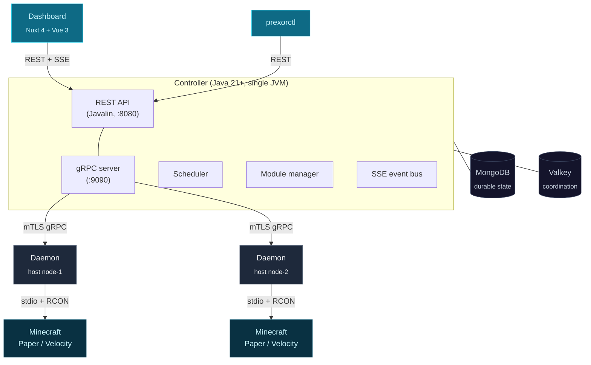

PrexorCloud is a self-hosted, Apache 2.0-licensed orchestrator for Minecraft networks.
One controller, one operator team, 50–5000 servers — bare metal or small VM
fleets. This page is the 30-second pitch + the architecture diagram you'll
keep coming back to.

## What you'll learn

- What problem PrexorCloud solves and who it's for.
- The three processes that make up a cluster, and the two backing stores.
- Where to go next once you decide it's a fit.

## The pitch

You operate a Minecraft network. Players connect through a Velocity or
BungeeCord proxy and bounce between lobbies, hubs, and game servers. Today
you script `screen` sessions, copy templates by hand, restart instances when
they crash, and wonder why your fleet keeps drifting from the config in your
git repo.

PrexorCloud replaces that with a single control plane:

- **Declarative groups.** You describe a group (a `lobby` running Paper 1.21,
  min 3 instances, scale up at 70% player load) and the controller keeps it
  there. No bash, no `screen`, no manual placement.
- **Layered templates.** Configs, plugins, and worlds compose from a chain
  (`base → base-paper → group-lobby → user`) so you don't fork the world for
  one config tweak.
- **Real cluster awareness.** A daemon on every host reports state in real
  time. Instance crashes are classified, players are migrated, scaling
  cooldowns prevent flapping, and the dashboard reflects all of it over SSE.
- **First-class plugin and module SDKs.** Extend the controller with platform
  modules (REST routes, capabilities, MongoDB-backed storage), or extend
  servers with `@CloudPlugin` jars that work across Paper / Spigot / Folia
  via a single annotation.
- **Operator-grade security.** Operators authenticate with username +
  password + JWT. Daemons authenticate with mTLS. Plugins authenticate with
  short-lived per-instance tokens. Every release is cosign-signed; signature
  verification is built into `prexorctl`.

If you've used Kubernetes, the mental model maps cleanly: controller →
control-plane, daemon → kubelet, group → deployment, instance → pod. We
borrow the patterns that made k8s repeatable; we leave behind the YAML
weight and the resource-tree taxonomy that doesn't fit a Minecraft network.

## Architecture, in one diagram

A cluster is **three processes plus two backing stores**:

- **Controller.** Authoritative state, REST + gRPC servers, scheduler,
  module lifecycle, SSE event bus. Wired by hand — no DI framework, no
  reflection at boot. Multiple controllers can run active-active against the
  same MongoDB + Valkey; lease-scoped fencing prevents split-brain writes.
- **Daemon.** One per host. Receives composition plans from the controller
  and applies them deterministically: assembles the template chain into the
  instance directory, layers the runtime jar, spawns the JVM, captures
  stdio + RCON, classifies exits. The daemon never invents state.
- **Plugin (in-server).** Code that ships *inside* a Minecraft server or
  proxy JVM, alongside the cloud-installed jar. Reports player connect /
  transfer / disconnect, exposes RCON, handles group-aware commands, and on
  the proxy side implements **Network Composition** routing.

Two backing stores, both first-party:

- **MongoDB** holds durable state — groups, templates, modules, audit log,
  user accounts, composition plans. We never embed Mongo; SSPL applies to
  the *Mongo distribution*, not to PrexorCloud as a downstream consumer.
- **Valkey** (or Redis-protocol-compatible) is for coordination — leases,
  fencing tokens, JWT revocation, SSE replay buffers, pub/sub fanout. In
  development you can run without it; in production it's required.

The whole thing fits on a laptop in development mode. In production it
scales to thousands of MC instances across dozens of hosts.

## Where PrexorCloud fits

| Want to… | Use… |
|---|---|
| Run a 5-server survival cluster on one box | PrexorCloud (single-node, dev profile) |
| Operate 50–5000 Minecraft instances on bare metal | PrexorCloud (production profile) |
| Hand non-technical users a panel to spin up servers | Pterodactyl — different category (panel vs orchestrator) |
| Orchestrate generic containers / VMs | Kubernetes / Nomad — PrexorCloud is Minecraft-specific |
| Sell hosting to end customers | Out of scope; PrexorCloud is OSS infra, not a billing layer |

PrexorCloud is **not** a hosting provider. There is no signup, no pricing,
no managed offering. You install it on infrastructure you already control.

## Next up

- **[Installation](/getting-started/installation/)** — compose-based and
  bare-metal install walkthroughs, with cosign verification and mTLS bootstrap.
- **[Quickstart (10 min)](/getting-started/quickstart/)** — install →
  daemon → first group → first instance, end-to-end.
- **[Core Concepts](/getting-started/core-concepts/)** — groups, instances,
  templates, nodes, daemons, modules in 10 minutes of reading.
