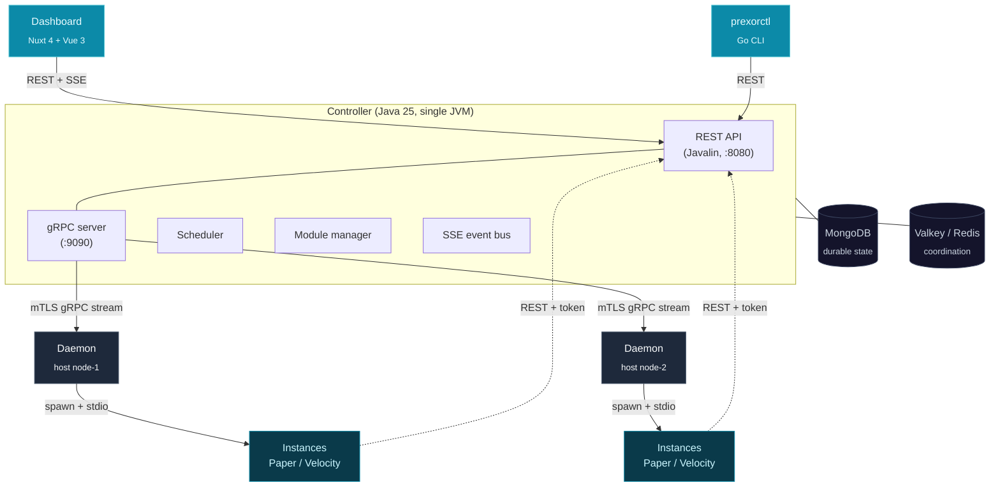

PrexorCloud is a self-hosted, Apache 2.0-licensed orchestrator for Minecraft networks. You describe the network you want — a `lobby` Group running Paper 1.21, three instances, scale up under load — and the Controller keeps it that way across a fleet of hosts.

This page is the 30-second pitch plus the architecture diagram you'll keep coming back to: three processes, two backing stores, and how each piece maps onto Kubernetes if you already think in those terms.

## What you'll learn

- What problem PrexorCloud solves and who it's for.
- The three processes in a cluster, and the two backing stores.
- How the model maps onto Kubernetes.
- Where to go next once you decide it's a fit.

## The pitch

You operate a Minecraft network. Players connect through a Velocity or BungeeCord proxy and bounce between lobbies, hubs, and game servers. Today you script `screen` sessions, copy server folders by hand, restart instances when they crash, and watch your fleet drift from the config in your git repo.

PrexorCloud replaces that with one control plane:

- **Declarative Groups.** You describe a Group — Paper 1.21, min 3 Instances, scale up at a player-load threshold — and the Controller schedules and maintains it. No bash, no `screen`, no manual placement.
- **Layered Templates.** Configs, plugins, and worlds compose from an inheritance chain so one config tweak doesn't fork the whole server folder. Snapshots are SHA-256 versioned, so rollback is exact.
- **Real cluster awareness.** A Daemon on every host reports Instance state to the Controller. Crashes are classified, players are migrated off failing Instances, scaling cooldowns prevent flapping, and the dashboard reflects all of it live over SSE.
- **First-class Plugin and Module SDKs.** Extend the Controller with Modules (REST routes, capabilities, MongoDB-backed storage) or extend servers with `@CloudPlugin` jars that work across Paper, Spigot, Folia, Fabric, and NeoForge from one codebase.
- **Operator-grade security.** Operators authenticate with username + password + JWT and a permission set (`groups.create`, `nodes.drain`, `cluster.manage`, and the rest). Daemons join with a single-use join token, then run on mTLS certificates issued by the Controller's own CA. Every release is cosign-signed.

If you've used Kubernetes, the mental model maps cleanly: Controller → control plane, Daemon → kubelet, Group → Deployment, Instance → Pod. PrexorCloud borrows the patterns that made k8s repeatable and drops the YAML weight and the generic resource taxonomy that don't fit a Minecraft network. See [the full mapping below](#the-kubernetes-mental-model).

## Who it's for

| Audience | What you get |
|---|---|
| **Operator** running a network in production | Declarative Groups, auto-scaling, rolling deploys, crash recovery, a live dashboard, and copy-paste CLI commands via `prexorctl`. |
| **Integrator-developer** building on top | A `@CloudPlugin` jar that works across five server platforms and three proxies, or a Controller-side Module with its own REST routes, events, and dashboard UI. |
| **Contributor** hacking on PrexorCloud | A hand-wired Java codebase (no DI framework, no boot-time reflection), Go CLI, Nuxt 4 dashboard, and a documented gRPC protocol. |

PrexorCloud is **not** a hosting provider. There is no signup, no pricing, no managed offering. You install it on infrastructure you already control.

## Architecture, in one diagram

A cluster is **three processes plus two backing stores**:

### The three processes

- **Controller.** The authoritative control plane. One JVM holds the REST API (Javalin on `:8080`), the gRPC server for Daemons (`:9090`), the Scheduler, Module lifecycle, and an SSE event bus. It's wired by hand — no DI framework, no reflection at boot. Multiple Controllers can run active-active against the same MongoDB and Valkey; the embedded Raft cluster control plane (Raft port `:9190`) coordinates leadership and config so two Controllers don't fight over the same writes.

- **Daemon.** One per host. It maintains a single bidirectional gRPC stream to the Controller (`DaemonService.Connect`), authenticated with mTLS. It receives composition plans, assembles the Template chain into the Instance directory, spawns the server JVM, captures its stdout/stderr, writes commands to its stdin, and classifies how each process exits (clean stop versus crash). The Daemon never invents state — it reports what the process actually did.

- **Plugin (in-server).** Code that ships *inside* a Minecraft server or proxy JVM, alongside the cloud-installed jar. It calls back to the Controller's REST API with a per-Instance token to register the server, report player connect / transfer / disconnect, and stream live state. On the proxy side it implements **Network** routing — sending players to the right Group based on the composition you define.

### The two backing stores

| Store | Holds | Required? |
|---|---|---|
| **MongoDB** | Durable state — Groups, Templates, Modules, the audit log, user accounts, Network compositions. | Always. |
| **Valkey** (or any Redis-protocol server) | Coordination — leases, fencing tokens, JWT revocation, SSE replay buffers, pub/sub fanout. | Production yes; development can run without it (the `redis` config block is nullable — `null` disables it). |

PrexorCloud never embeds either store; it connects to them as a downstream client. SSPL applies to the MongoDB *distribution*, not to PrexorCloud as a consumer of it.

The whole stack fits on a laptop in development mode. In production it scales to thousands of Instances across dozens of hosts.

## Default ports

These are the defaults from `ControllerConfig` (`HttpConfig`, `GrpcConfig`, `RaftConfig`); all are overridable in the controller config file.

| Port | Process | Purpose |
|---|---|---|
| `8080` | Controller | REST API + SSE (dashboard, `prexorctl`, in-server Plugins). |
| `9090` | Controller | gRPC server for Daemon streams (mTLS). |
| `9190` | Controller | Raft transport for multi-Controller clustering. |

The dashboard dev server runs on `:3000` when started standalone; in production the Controller serves the built dashboard.

## The Kubernetes mental model

If you think in Kubernetes, this table is the whole translation:

| Kubernetes | PrexorCloud | Notes |
|---|---|---|
| Control plane (API server + scheduler) | **Controller** | Single JVM, REST + gRPC. Active-active via Raft. |
| kubelet | **Daemon** | One per node, holds a gRPC stream to the Controller. |
| Node | Node (a Daemon host) | Scored on memory, CPU, Instance count, and Group spread when placing Instances. |
| Deployment / ReplicaSet | **Group** | Declares platform, version, min/max Instances, and scaling policy. |
| Pod | **Instance** | One running server or proxy process. |
| ConfigMap + image layers | **Template** | Layered, SHA-256-versioned config + files. |
| Ingress / Service routing | **Network** | Proxy-side routing composition over Groups. |
| Operator / CRD controller | **Module** | Controller-side extension with its own REST routes and storage. |
| `kubectl` | **`prexorctl`** | The Go CLI; talks to the REST API. |

What PrexorCloud deliberately does *not* copy: the generic object taxonomy (no arbitrary CRDs), the YAML-everywhere surface, and pod-level container isolation. Instances are plain JVM processes the Daemon owns, not containers.

## Where PrexorCloud fits

| Want to… | Use… |
|---|---|
| Run a 5-server survival cluster on one box | PrexorCloud (single-node, dev profile) |
| Operate hundreds-to-thousands of Instances on bare metal | PrexorCloud (production profile) |
| Hand non-technical users a panel to spin up servers | Pterodactyl — different category (panel vs orchestrator) |
| Orchestrate generic containers or VMs | Kubernetes / Nomad — PrexorCloud is Minecraft-specific |
| Sell hosting to end customers | Out of scope; PrexorCloud is OSS infra, not a billing layer |

## Next up

- **[Installation](/getting-started/installation/)** — Compose and bare-metal installs, with cosign verification and the mTLS join-token bootstrap.
- **[Quickstart](/getting-started/quickstart/)** — install → Daemon → first Group → first Instance, end to end.
- **[Core concepts](/getting-started/core-concepts/)** — Groups, Instances, Templates, Nodes, Daemons, and Modules in one pass.
