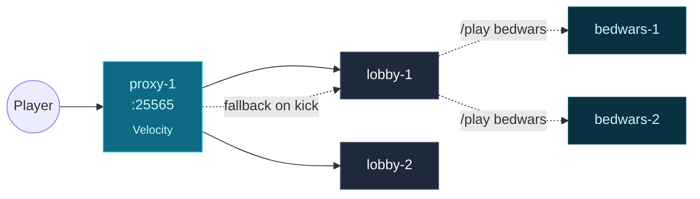

You have a controller, a daemon, and you've gone through the
[Quickstart](/getting-started/quickstart/). This page wires together
**three groups** — a proxy, a lobby, and a game-mode — and configures
**Network Composition** so a player connecting to the proxy lands in the
lobby and falls back cleanly when game instances die.

## What you'll learn

- How to compose multiple groups into a routable network.
- What **Network Composition** is and why it replaces hand-edited
  `velocity.toml`.
- How fallback chains route a kicked player back to the lobby
  automatically.

## What you'll build



Three groups: a Velocity proxy with a public port, a Paper lobby, and a
Paper game-mode. One Network Composition that ties them together. Players
who connect to the proxy land in the lobby; when a game instance crashes,
its players bounce back to the lobby.

## Step 1 — Define the three groups

Save the three configs as `proxy.yml`, `lobby.yml`, and `bedwars.yml`:

```yaml
# proxy.yml
name: proxy
platform: velocity
version: "3.4.0"
scaling: { mode: STATIC, min: 1, max: 1 }
ports: { from: 25565, to: 25565 }
resources: { memoryMB: 512 }
exposeOnHost: true        # bind to the node's external IP for player traffic
```

```yaml
# lobby.yml
name: lobby
platform: paper
version: "1.21.4"
scaling: { mode: STATIC, min: 2, max: 4 }
ports: { from: 25600, to: 25699 }
resources: { memoryMB: 1024 }
templates: [base-paper, lobby]
```

```yaml
# bedwars.yml
name: bedwars
platform: paper
version: "1.21.4"
scaling:
  mode: DYNAMIC
  min: 1
  max: 8
  scaleUpAt: 0.7          # 70% of slots filled triggers a new instance
  scaleDownAt: 0.2        # 20% triggers scale-down
  cooldownSeconds: 60
ports: { from: 25800, to: 25899 }
resources: { memoryMB: 2048 }
templates: [base-paper, bedwars]
dependsOn: [lobby]        # scheduler brings up `lobby` first
```

Apply them:

```bash
prexorctl group apply -f proxy.yml -f lobby.yml -f bedwars.yml
prexorctl group list
```

Within ~30 seconds you'll see one proxy, two lobby instances, and one
bedwars instance running. The `dependsOn: [lobby]` line on `bedwars`
ensures the lobby is up first; the topological sort guarantees this even
if you applied the configs in a different order.

## Step 2 — Create the Network Composition

A **Network Composition** is the topology record that drives proxy routing.
It says "this proxy fronts these groups, route new players to this lobby
group, and on kick, walk this fallback chain."

Save as `network.yml`:

```yaml
name: main
proxyGroup: proxy
lobbyGroup: lobby
fallbackGroups: [lobby]   # walked on kick / disconnect
gameGroups: [bedwars]
motd: "<gold>PrexorCloud Demo</gold>"
maxPlayers: 200
```

Apply it:

```bash
prexorctl network apply -f network.yml
```

Behind the scenes:

1. The controller persists the `NetworkComposition` record to MongoDB.
2. The proxy plugin (running inside `proxy-1`) caches the composition from
   the controller via REST.
3. Subsequent player connects walk the lobby chain to find a free instance;
   kicks walk the fallback chain.

Network Composition is **first-class state**, not config-as-yaml. The
proxy plugin re-syncs from the controller whenever the composition record
changes, so editing the YAML and re-applying is enough — no proxy restart.

## Step 3 — Connect

Find the proxy's public address:

```bash
prexorctl instance describe proxy-1
# NODE  node-1  (203.0.113.10)
# PORT  25565
```

Connect from a Minecraft 1.21 client to `203.0.113.10:25565`. You'll land
on whichever lobby instance has free slots. Try `/server lobby` from chat
to confirm you're on the lobby group.

## Step 4 — Add a `/play bedwars` command

The cloud-plugin running inside the lobby instance can route players to
the bedwars group via a small command. The simplest way is the bundled
`/play <group>` command — it walks the target group, picks a free
instance, and sends the player there. To enable it, add to the lobby
template's `cloud-plugins/cloud-plugin/config.yml`:

```yaml
commands:
  play:
    enabled: true
    permission: minecraft.command.play   # everyone, by default
```

Re-apply the template (`prexorctl template push lobby/`), then run a
rolling deployment to pick up the change:

```bash
prexorctl group deploy lobby --strategy rolling --max-unavailable 1
```

The deployment replaces lobby instances one at a time; players are
migrated to the surviving instance before the old one stops. Watch it via:

```bash
prexorctl events follow --filter deployment
```

## Step 5 — Test the fallback chain

To watch fallback in action, force-kill one of the bedwars instances while
a player is connected:

```bash
prexorctl instance stop bedwars-1 --force
```

The proxy plugin sees the disconnect, walks `fallbackGroups: [lobby]`,
finds a healthy lobby instance, and sends the player there. The player
sees a brief loading screen but stays in the network.

The Player Journey Bus records this: `INSTANCE_CRASHED → TRANSFER →
CONNECTED`. You can pull the journey for any player with
`prexorctl player journey <uuid> --limit 50`.

## What can go wrong

| Symptom | Likely cause |
|---|---|
| Player can connect to `<node>:25565` but not via the proxy | Proxy plugin can't reach the controller. Check `controller.url` in the proxy template's plugin config. |
| `prexorctl network apply` fails with `proxy group has no instances` | Apply the groups first; networks reference groups by name. |
| Bedwars `dependsOn: [lobby]` blocks startup | The lobby group is in `paused` state. `prexorctl group describe lobby` will show why (often crash-loop). |
| `/play bedwars` says "no instances available" | All bedwars instances are full. Bump `scaling.max` or check `prexorctl instance list --group bedwars`. |

## Next up

- **[Network Composition recipe](/recipes/multi-game-network/)** — the
  full multi-game-mode pattern (lobby + 3 game-modes + dynamic scaling).
- **[Concepts → Plugin System](/concepts/plugins/)** — how the proxy and
  server plugins fit together (Path A standalone vs Path B bundled).
- **[Concepts → Deployments](/concepts/deployments/)** — rolling deploys,
  `maxUnavailable`, plan-hash rollback.
