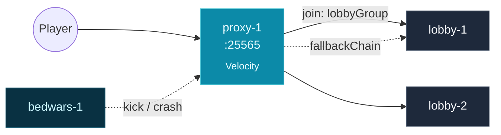

You have a Controller and at least one Daemon, and you've run the
[Quickstart](/getting-started/quickstart/). This page wires three Groups —
a proxy, a lobby, and a game-mode — into one **Network**, so a player who
connects to the proxy lands in the lobby and falls back cleanly when a
backend Instance dies.

## Before you start

- A Controller reachable on `https://<host>:8080`, with a Daemon reporting
  `READY` in `prexorctl node list`.
- Logged in: `prexorctl login` succeeds and `prexorctl status` shows the
  cluster.
- Catalog entries for a proxy platform (`velocity` or `bungeecord`) and a
  server platform (`paper`). Check what's installed before you create
  Groups that reference them.

## What you'll build



Three Groups: a Velocity proxy, a Paper lobby, and a Paper game-mode. One
`NetworkComposition` ties them together. New players join the lobby; when a
backend Instance kicks or crashes a player, the proxy walks the fallback
chain to a healthy Instance.

## How routing works

A **Network** is a `NetworkComposition` record held by the Controller. It
does not edit `velocity.toml`. The proxy plugin running inside each proxy
Instance reads the composition from the Controller and makes routing
decisions in process.

Two routing events drive everything (`NetworkRouter`,
`VelocityPlayerListener`):

| Event | What the proxy does |
|---|---|
| Player chooses initial server (first join) | Builds the chain `[lobbyGroup] ++ fallbackGroups`, removes duplicates, and connects to the first `RUNNING` Instance it finds. |
| Player is kicked from a backend (crash, `/kick`, restart) | Builds the same chain but **excludes the Group the player was kicked from**, then redirects to the first `RUNNING` Instance. If the chain is exhausted, the player is disconnected with `kickMessage`. |

The lobby Group is the implicit last-resort fallback — it always leads the
chain, so you never list it in `fallbackGroups` (the Controller rejects
that; see [Validation](#validation-rules-and-errors)).

Which composition applies to a given proxy Group:

- A composition whose `proxyGroups` contains the proxy's Group name wins.
- A composition with an empty `proxyGroups` is a wildcard, used only when
  no Group-scoped composition matches.

The proxy plugin caches compositions from `GET /api/proxy/networks` and
refreshes over an event stream, falling back to polling. Editing a
composition and re-applying it is enough — no proxy restart, no manual
sync.

## Step 1 — Create the three Groups

Groups are created with `prexorctl group create` and flags. The proxy Group
must use a proxy platform; the lobby and game Groups use `paper`.

```bash
prexorctl group create \
    --name proxy \
    --platform velocity \
    --platform-version 3.4.0 \
    --scaling-mode STATIC \
    --min 1 --max 1 \
    --port-start 25565 --port-end 25565 \
    --memory 512
```

```bash
prexorctl group create \
    --name lobby \
    --platform paper \
    --platform-version 1.21.4 \
    --scaling-mode STATIC \
    --min 2 --max 4 \
    --port-start 25600 --port-end 25699 \
    --memory 1024 \
    --template lobby
```

```bash
prexorctl group create \
    --name bedwars \
    --platform paper \
    --platform-version 1.21.4 \
    --scaling-mode DYNAMIC \
    --min 1 --max 8 \
    --port-start 25800 --port-end 25899 \
    --memory 2048 \
    --template bedwars
```

Flags that matter for a network:

| Flag | Meaning | Default |
|---|---|---|
| `--name` | Group name (required). | — |
| `--platform` | `velocity`, `bungeecord`, `paper`, `folia`, … (required). | — |
| `--platform-version` | Catalog version to provision. | — |
| `--scaling-mode` | `STATIC`, `DYNAMIC`, or `MANUAL`. | `DYNAMIC` |
| `--min` / `--max` | Instance bounds. | `1` / `10` |
| `--port-start` / `--port-end` | Daemon-side port range for Instances. | `30000` / `30100` |
| `--memory` | Memory per Instance, MB. | `1024` |
| `--template` | Template layer name (repeat for an ordered chain). | none |

Keep the proxy `STATIC` with `--min 1 --max 1` for a single entrypoint.
Run a Paper lobby `STATIC` so it's always up — it's the fallback target.
A game-mode like `bedwars` is a good fit for `DYNAMIC` scaling.

Confirm the Groups exist before you build the Network — the Controller
validates every referenced Group when you create the composition.

```bash
prexorctl group list
```

```
GROUP     TYPE     STATUS   INSTANCES   PLAYERS   VERSION          UPDATED
bedwars   GAME     UP       1/8         0         paper-1.21.4     just now
lobby     STATIC   UP       2/4         0         paper-1.21.4     just now
proxy     STATIC   UP       1/1         0         velocity-3.4.0   just now
```

## Step 2 — Create the Network

Networks have no `prexorctl` subcommand. Create them through the REST API
at `/api/v1/networks`. The request body is a `NetworkComposition`:

| Field | Type | Meaning |
|---|---|---|
| `name` | string | Network ID. Must match `[a-z0-9_][a-z0-9_-]*`, max 32 chars. |
| `description` | string | Free text, max 256 chars. Optional. |
| `lobbyGroup` | string | Default join target and last-resort fallback. Must be an existing Group. |
| `fallbackGroups` | string[] | Ordered fallback chain tried after the lobby on failure. May be empty. |
| `memberGroups` | string[] | Backend Groups in this Network. Empty means no restriction. |
| `proxyGroups` | string[] | Proxy Groups this composition applies to. Empty means all proxies. |
| `kickMessage` | string | Shown when every fallback is exhausted, max 256 chars. Optional. |
| `bedrockLobbyGroup` | string | Join target for Bedrock players. Blank means use `lobbyGroup`. |
| `bedrockFallbackGroups` | string[] | Bedrock-specific fallback chain. Empty means use `fallbackGroups`. |

Send the request with your CLI token. `prexorctl` stores it in
`~/.prexorcloud/config.yml`; export it as `TOKEN` for the examples below.

```bash
curl -sS -X POST https://<host>:8080/api/v1/networks \
  -H "Authorization: Bearer $TOKEN" \
  -H "Content-Type: application/json" \
  -d '{
        "name": "main",
        "description": "Primary public network",
        "lobbyGroup": "lobby",
        "fallbackGroups": ["bedwars"],
        "memberGroups": ["lobby", "bedwars"],
        "proxyGroups": ["proxy"],
        "kickMessage": "All lobbies are full — try again shortly."
      }'
```

A successful create returns `201` with the stored composition. The
Controller persists it and the proxy plugin picks it up on its next
refresh.

What this composition does:

- New players join a `RUNNING` `lobby` Instance.
- A player kicked from `bedwars` is redirected to a `RUNNING` `lobby`
  Instance (the kick chain excludes `bedwars`, the source Group).
- A player kicked from `lobby` with no other healthy backend is
  disconnected with `kickMessage`.

### List, fetch, update, delete

```bash
# All compositions
curl -sS https://<host>:8080/api/v1/networks \
  -H "Authorization: Bearer $TOKEN"

# One composition
curl -sS https://<host>:8080/api/v1/networks/main \
  -H "Authorization: Bearer $TOKEN"
```

Update replaces the whole composition. The body `name` must match the path:

```bash
curl -sS -X PUT https://<host>:8080/api/v1/networks/main \
  -H "Authorization: Bearer $TOKEN" \
  -H "Content-Type: application/json" \
  -d '{
        "name": "main",
        "lobbyGroup": "lobby",
        "fallbackGroups": ["bedwars", "skywars"],
        "proxyGroups": ["proxy"]
      }'
```

```bash
curl -sS -X DELETE https://<host>:8080/api/v1/networks/main \
  -H "Authorization: Bearer $TOKEN"
# 204 No Content
```

Each route requires a permission: `NETWORKS_VIEW` (list/get),
`NETWORKS_CREATE` (POST), `NETWORKS_UPDATE` (PUT), `NETWORKS_DELETE`
(DELETE). A token without the permission gets `403`.

## Step 3 — Connect

Find the proxy's address and port:

```bash
prexorctl instance list --group proxy
```

```
ID        GROUP   NODE     STATE     PORT    PLAYERS   UPTIME
proxy-1   proxy   node-1   RUNNING   25565   0         2m
```

```bash
prexorctl instance info proxy-1
```

Connect a Minecraft 1.21 client to the node's address on port `25565`. You
land on whichever `lobby` Instance the proxy picks first from the chain.

## Step 4 — Test the fallback chain

Force-stop a backend Instance while a player is on it and watch the proxy
fail the player over.

```bash
prexorctl instance stop bedwars-1 --force
```

When the backend drops, Velocity fires its kick event. The proxy plugin
builds the chain `[lobby] ++ [skywars]` (excluding `bedwars`, the source
Group), finds a `RUNNING` `lobby` Instance, and redirects the player. The
player sees a brief reconnect and stays in the network. The proxy log
shows:

```
Failover: routing Steve from bedwars-1 to lobby-1
```

If the entire chain is exhausted — no `RUNNING` Instance in lobby or any
fallback — the player is disconnected with `kickMessage` (or the proxy's
built-in default when `kickMessage` is blank).

## Bedrock-aware routing (optional)

If only some backends run Geyser and can accept Bedrock clients, route
Bedrock players separately. Set `bedrockLobbyGroup` and/or
`bedrockFallbackGroups` on the composition:

```json
{
  "name": "main",
  "lobbyGroup": "lobby",
  "fallbackGroups": ["bedwars"],
  "proxyGroups": ["proxy"],
  "bedrockLobbyGroup": "bedrock-lobby",
  "bedrockFallbackGroups": ["bedrock-bedwars"]
}
```

Behavior:

- Bedrock players (detected by edition) use `bedrockLobbyGroup` and
  `bedrockFallbackGroups` when set.
- A blank `bedrockLobbyGroup` makes Bedrock players follow `lobbyGroup`.
- An empty `bedrockFallbackGroups` makes them follow `fallbackGroups`.

This preserves the Java route exactly when neither Bedrock field is set.

## Validation rules and errors

The Controller validates a composition against current Groups on every
create and update. Each rule below returns `400` with a message naming the
offending field.

| Rule | Trigger |
|---|---|
| `name` matches `[a-z0-9_][a-z0-9_-]*`, ≤ 32 chars | Bad name. |
| `description` ≤ 256 chars, `kickMessage` ≤ 256 chars | Field too long. |
| `lobbyGroup` must exist | Unknown Group. |
| `fallbackGroups` entries must exist | Unknown fallback Group. |
| `fallbackGroups` must not include `lobbyGroup` | Lobby is the implicit last-resort fallback. |
| `fallbackGroups` must have no duplicates | Repeated entry. |
| `memberGroups` entries must exist, no duplicates | Unknown or repeated Group. |
| `proxyGroups` entries must exist **and** be a proxy platform | A non-proxy Group (e.g. a Paper Group) listed as a proxy. |
| `proxyGroups` must have no duplicates | Repeated entry. |
| Bedrock fields validated only when set | Unknown `bedrockLobbyGroup`; a Bedrock fallback that's unknown, duplicated, or equals the effective Bedrock lobby. |

Two more contract points:

- POST a name that already exists → `409 Network already exists`.
- PUT a `name` in the body that differs from the path → `400`.

## What can go wrong

| Symptom | Likely cause |
|---|---|
| Players connect but never leave the proxy's "connecting" screen | No `RUNNING` Instance in `lobbyGroup`. Check `prexorctl instance list --group lobby`; the lobby Group may be scaled to zero or crash-looping. |
| `POST /api/v1/networks` returns `400 lobbyGroup not found` | Create the Groups first — the Network references Groups by name. |
| `400 proxyGroups entry '<x>' is not a proxy platform` | You listed a Paper/Folia Group in `proxyGroups`. Only `velocity`/`bungeecord` Groups belong there. |
| `400 fallbackGroups must not include lobbyGroup` | Remove the lobby from `fallbackGroups`; it's already the chain head. |
| Kicked players are disconnected instead of failing over | Every Group in the chain is down, or `proxyGroups` doesn't include this proxy's Group, so no composition applies (the proxy then routes by its default Group only). |
| Routing changes don't take effect | The proxy refreshes from the Controller on a cycle; wait for the refresh, or confirm the proxy Instance can reach `/api/proxy/networks`. |

## Next up

- **[Groups, Instances, Templates](/concepts/groups-instances-templates/)** —
  the data model behind every Group you just created.
- **[Plugins](/concepts/plugins/)** — how the proxy and server plugins read
  cluster state and route players.
- **[Rolling deployments](/guides/rolling-deployments/)** — roll a template
  or module change across a Group with `prexorctl deploy <group>`.
