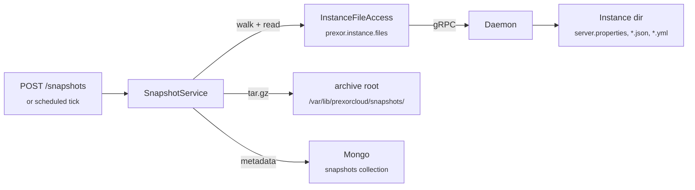

The `backup-orchestrator` Module captures an Instance's config and small
state files into a controller-local `tar.gz`, triggered over REST or on a
fixed schedule. This guide installs the Module, runs a full
snapshot → restore → validate cycle on one Instance, and shows the
scheduled path for a fixed target list.

Read the scope line first: this Module snapshots **config and small text
files only** — `server.properties`, `ops.json`, plugin YAML,
whitelist/banlist JSON. It does **not** capture binary world data (region
files, NBT). For full Mongo + Valkey + filesystem disaster recovery, see
[Operations → Backups and DR](/operations/backups-and-dr/); this page is
about per-Instance config snapshots through the Module's REST surface.

## Before you start

- A PrexorCloud Controller you can reach over REST, and a bearer token with
  permission to install Modules and call Module routes. Every command below
  assumes `TOKEN` holds that token and the Controller is at
  `http://localhost:8080`.
- At least one running Instance whose `nodeId`, `group`, and `instanceId`
  you know. The `group` may be empty for an ungrouped Instance.
- The `prexor.instance.files` capability (`InstanceFileAccess`) available on
  the Controller. It ships built in; the Module declares it as a hard
  requirement and fails to load without it.
- `prexorctl` on your path, logged in (`prexorctl login`), with a saved
  context. The REST calls and `prexorctl` are interchangeable — both hit the
  same Controller.

## How it works



The Module walks the Instance working directory through
`InstanceFileAccess`, filters by glob pattern, reads each matching file
over the daemon RPC, and packs the results into one `tar.gz` on the
Controller host. A `SnapshotMetadata` record lands in Mongo so you can list,
fetch, and delete snapshots by id.

| Property | Value | Source |
|---|---|---|
| Module id | `backup-orchestrator` | `module.yaml` |
| REST base path | `/api/v1/modules/backup-orchestrator/` | module-route dispatcher |
| Capability required | `prexor.instance.files` (`>=1.0.0 <2.0.0`) | `module.yaml` |
| Archive root (default) | `/var/lib/prexorcloud/snapshots/` | `BackupOrchestratorModule` |
| Archive root override | `PREXORCLOUD_BACKUP_DIR` | `BackupOrchestratorModule` |
| Mongo collection | `snapshots` (indexed on `instanceId`, `createdAt`) | `SnapshotRepository` |
| Mongo document cap | 50 000 | `module.yaml` |

## 1. Install the Module

Install from the built jar with `prexorctl`:

```bash
prexorctl module install backup-orchestrator.jar
```

`module install` also accepts a registry id (`prexorctl module install
backup-orchestrator@1.0.0`), a `.tar`/`.tar.gz` bundle, and these flags:

| Flag | Effect |
|---|---|
| `--signature <path>` | Verify the jar against a detached signature (otherwise a sidecar `<jar>.sig` is used if present). |
| `--check-requires` | Fail the install if a required capability is missing before uploading. |
| `--registry <name>` | Pin which configured registry to resolve an `id[@version]` against. |

Confirm it loaded and is enabled:

```bash
prexorctl module list
```

```text
NAME                  ENABLED   FRONTEND  PLUGINS
backup-orchestrator   ENABLED   no        0
```

On load, the Module logs its archive root. Check the Controller log if you
overrode the default:

```text
backup-orchestrator: archive root = /var/lib/prexorcloud/snapshots
```

To change the archive root, set `PREXORCLOUD_BACKUP_DIR` in the Controller's
environment **before** the Module loads, then restart the Controller. The
value is read once at `onLoad`; changing it later has no effect until the
next load.

## 2. Take a snapshot over REST

Trigger a snapshot with `POST /snapshots`. The body identifies the target
Instance; `patterns` is optional.

```bash
curl -s -X POST \
  -H "Authorization: Bearer $TOKEN" \
  -H "Content-Type: application/json" \
  -d '{"nodeId":"node-1","group":"lobby","instanceId":"inst-1"}' \
  http://localhost:8080/api/v1/modules/backup-orchestrator/snapshots
```

```json
{
  "id": "7c3b9e2a-5f41-4d8e-9b22-0a1c2d3e4f50",
  "instanceId": "inst-1",
  "group": "lobby",
  "nodeId": "node-1",
  "createdAt": "2026-06-07T08:00:00Z",
  "archiveSizeBytes": 4096,
  "archivePath": "/var/lib/prexorcloud/snapshots/inst-1/1749283200000-7c3b9e2a.tar.gz",
  "fileCount": 4,
  "truncatedFiles": [],
  "patterns": ["*.properties", "*.json", "*.yml", "*.yaml", "*.txt", "*.cfg", "*.toml"],
  "error": ""
}
```

### Request body

| Field | Required | Notes |
|---|---|---|
| `instanceId` | yes | Non-blank. Missing or blank returns `400`. |
| `nodeId` | yes | Daemon hosting the Instance. Missing or blank returns `400`. |
| `group` | no | Instance's Group name. Omit or pass `""` for an ungrouped Instance. |
| `patterns` | no | Glob list applied to file **base names**. Omitted or empty falls back to the default set. |

### Default patterns

When you omit `patterns`, the Module matches these base-name globs:

```text
*.properties  *.json  *.yml  *.yaml  *.txt  *.cfg  *.toml
```

The glob supports `*` (any run of characters) and literal characters only —
no `?`, no character classes. Matching is on the file's base name, so
`*.json` matches `world/region/foo.json` by its `foo.json` tail. Directories
are always skipped.

To capture a narrower set, pass an explicit list:

```bash
curl -s -X POST \
  -H "Authorization: Bearer $TOKEN" \
  -H "Content-Type: application/json" \
  -d '{"nodeId":"node-1","group":"lobby","instanceId":"inst-1","patterns":["server.properties","ops.json"]}' \
  http://localhost:8080/api/v1/modules/backup-orchestrator/snapshots
```

### Response codes

| Code | Meaning |
|---|---|
| `201` | Snapshot written. Body is the `SnapshotMetadata` record. |
| `502` | The walk or archive failed. Body is still the metadata record, with `error` set (for example `DAEMON_UNREACHABLE`, `INSTANCE_NOT_FOUND`, `TIMEOUT`, `ARCHIVE_DIR: …`). The record **is persisted** so the failure is visible in the list. |
| `400` | `{"error":"instanceId is required"}` or `{"error":"nodeId is required"}`, or `{"error":"invalid json body","details":"…"}` when the JSON does not parse. |

A `502` does not throw — every daemon-side failure surfaces as a populated
`error` tag, never an exception. The metadata row is saved either way.

### Where the archive lands

The archive path is deterministic:

```text
<archive-root>/<sanitized-instanceId>/<epochMillis>-<first-8-of-id>.tar.gz
```

`instanceId` is sanitized to `[A-Za-z0-9_.-]` (other characters become `_`).
With the default root, a snapshot of `inst-1` at epoch `1749283200000` with
id `7c3b9e2a-…` is written to
`/var/lib/prexorcloud/snapshots/inst-1/1749283200000-7c3b9e2a.tar.gz`.

## 3. List and inspect snapshots

List recent snapshots, newest first:

```bash
curl -s -H "Authorization: Bearer $TOKEN" \
  http://localhost:8080/api/v1/modules/backup-orchestrator/snapshots | jq
```

```json
{
  "snapshots": [
    { "id": "7c3b9e2a-…", "instanceId": "inst-1", "fileCount": 4, "createdAt": "2026-06-07T08:00:00Z", "error": "" }
  ]
}
```

Query parameters:

| Param | Default | Notes |
|---|---|---|
| `instance` | (all) | Filter to one `instanceId`. Blank or omitted lists across all Instances. |
| `limit` | `50` | Capped at `500`. Non-numeric, zero, or negative values fall back to `50`. |

```bash
# last 10 snapshots of inst-1
curl -s -H "Authorization: Bearer $TOKEN" \
  "http://localhost:8080/api/v1/modules/backup-orchestrator/snapshots?instance=inst-1&limit=10" | jq
```

Fetch one snapshot by id:

```bash
curl -s -H "Authorization: Bearer $TOKEN" \
  http://localhost:8080/api/v1/modules/backup-orchestrator/snapshots/7c3b9e2a-5f41-4d8e-9b22-0a1c2d3e4f50 | jq
```

A missing id returns `404` with `{"error":"snapshot not found: <id>"}`.

### Snapshot metadata fields

| Field | Meaning |
|---|---|
| `id` | Snapshot UUID. Used in the path and the get/delete routes. |
| `instanceId` / `group` / `nodeId` | The target. `group` is `""` when none was supplied. |
| `createdAt` | Snapshot instant (UTC). |
| `archiveSizeBytes` | Size of the `tar.gz` on disk. `0` on an error record. |
| `archivePath` | Controller-local path to the archive. `""` on an error record. |
| `fileCount` | Number of files packed. |
| `truncatedFiles` | Files captured only up to the read cap — see below. |
| `patterns` | The pattern set actually used for this snapshot. |
| `error` | `""` on success; a failure tag otherwise. |

## 4. Restore and validate

The Module writes archives but does not restore them — there is **no
restore endpoint**. Restore is a manual extract on the Controller host (or
wherever you shipped the archive off to). The archive is a plain `tar.gz`,
so the standard tools work.

Find the archive path from the metadata, then inspect it before extracting:

```bash
ARCHIVE=$(curl -s -H "Authorization: Bearer $TOKEN" \
  "http://localhost:8080/api/v1/modules/backup-orchestrator/snapshots?instance=inst-1&limit=1" \
  | jq -r '.snapshots[0].archivePath')

tar -tzf "$ARCHIVE"
```

```text
server.properties
ops.json
whitelist.json
config/paper-global.yml
```

Paths inside the archive are the Instance-relative paths the daemon
reported (forward slashes). Extract into a staging directory and diff
against the live Instance before copying anything back:

```bash
mkdir -p /tmp/restore-inst-1
tar -xzf "$ARCHIVE" -C /tmp/restore-inst-1
diff -ru /tmp/restore-inst-1/server.properties \
         /var/lib/prexorcloud/instances/inst-1/server.properties
```

To restore a file, stop the Instance, copy the file back into its working
directory, and start it again. Restoring under a running Instance risks the
process overwriting your change on shutdown.

### Validate the restore

After extracting, confirm:

- `tar -tzf "$ARCHIVE"` lists every file you expected, with no
  `truncatedFiles` entries you did not anticipate.
- The metadata `error` is `""` and `fileCount` matches the file count in the
  archive listing.
- A `diff` against the live Instance shows only the changes you intend to
  roll back.
- After copying a file back and restarting, the Instance starts clean —
  check the Instance log for parse errors on the restored config.

### The read cap and truncated files

Each file is read through `InstanceFileAccess`, which encodes content as
**UTF-8 text**. Two limits matter:

- The Module reads up to **256 KiB** per file (`READ_MAX_BYTES`), above the
  daemon's default per-file cap of **64 KiB**. A file larger than the
  effective cap is captured up to the cap, and its path is recorded in
  `truncatedFiles`. The archive still lands.
- Because content round-trips as UTF-8, **binary files are lossy** and must
  not be snapshotted. The default patterns deliberately exclude region
  files and NBT. World data needs a future `prexor.instance.snapshot`
  capability backed by a daemon-side tar handler; it is not available here.

The walk itself is bounded daemon-side to **5 000 entries** across at most
**24 directory levels**, and each walk/read call blocks up to **20 seconds**
before returning a `TIMEOUT` error tag. A truncated walk sets `truncated` on
the tree; the snapshot proceeds with whatever entries came back.

## 5. Delete a snapshot

Delete removes the archive from disk (best-effort) and the metadata record:

```bash
curl -s -X DELETE \
  -H "Authorization: Bearer $TOKEN" \
  http://localhost:8080/api/v1/modules/backup-orchestrator/snapshots/7c3b9e2a-5f41-4d8e-9b22-0a1c2d3e4f50
```

| Code | Meaning |
|---|---|
| `204` | Metadata row existed and was deleted. The archive file is unlinked best-effort; an unlink failure is logged, not surfaced. |
| `404` | No metadata row for that id. |

There is no built-in retention or pruning. To cap disk use, list snapshots
on a timer and delete the ones past your retention window. The `createdAt`
index makes the "oldest first" scan cheap.

## 6. Schedule periodic snapshots

REST triggers are always available. To snapshot a **fixed** set of
long-lived Instances (a persistent lobby, a hub) without an external
trigger, configure the schedule through environment variables on the
Controller. The Module cannot enumerate live Instances from its context, so
targets are listed explicitly.

| Variable | Default | Effect |
|---|---|---|
| `PREXORCLOUD_BACKUP_INTERVAL_MINUTES` | `0` (disabled) | Snapshot period in minutes. `0`, absent, or non-numeric leaves the schedule disabled. |
| `PREXORCLOUD_BACKUP_INITIAL_DELAY_MINUTES` | `1` | Delay before the first run. Non-numeric falls back to `1`; negative clamps to `0`. |
| `PREXORCLOUD_BACKUP_TARGETS` | (none) | Comma-separated `nodeId/group/instanceId` triples. |

The schedule is enabled only when the interval is positive **and** at least
one well-formed target is present. Otherwise the Module stays REST-only and
logs:

```text
backup-orchestrator: periodic snapshots disabled (set PREXORCLOUD_BACKUP_INTERVAL_MINUTES and PREXORCLOUD_BACKUP_TARGETS to enable; REST triggers remain)
```

### Target syntax

Each target is `nodeId/group/instanceId`:

- `nodeId` and `instanceId` are required; a target with either blank is
  skipped.
- `group` may be blank — `node-3//inst-3` is a valid ungrouped target.
- A token without exactly two slashes (`garbage`, `node/only`) is skipped,
  not fatal. Malformed tokens never abort the rest of the list.

### Example

Snapshot two Instances every 30 minutes, first run 5 minutes after start:

```bash
PREXORCLOUD_BACKUP_INTERVAL_MINUTES=30
PREXORCLOUD_BACKUP_INITIAL_DELAY_MINUTES=5
PREXORCLOUD_BACKUP_TARGETS=node-1/lobby/inst-1,node-2/survival/inst-2
```

On start the Module logs the resolved schedule:

```text
backup-orchestrator: periodic snapshots every PT30M for 2 target(s), first run in PT5M
```

Scheduled snapshots use the **default patterns** — per-target pattern
filters are not yet wired into the periodic path. Each target is snapshotted
on the scheduler thread; a single unreachable Instance is logged and
skipped, never aborting the run:

```text
scheduled snapshot of inst-2 failed: DAEMON_UNREACHABLE
```

## Ship archives off-host

Archives are controller-local. For durability, copy them somewhere else.
The path is deterministic, so a post-snapshot sync is straightforward:

```bash
# nightly: mirror the archive root to S3
aws s3 sync /var/lib/prexorcloud/snapshots/ s3://prexor-backups/snapshots/
```

The same shape works with `restic backup`, `borg create`, or
`rclone copy` pointed at the archive root. Pruning archive files off-host
does not delete the Mongo metadata; use the DELETE route to keep the two in
sync.

## Common pitfalls

| Symptom | Likely cause |
|---|---|
| `POST` returns `502` with `error: DAEMON_UNREACHABLE` | The daemon for `nodeId` is down or unreachable. The metadata row is still saved. |
| `POST` returns `502` with `error: INSTANCE_NOT_FOUND` | Wrong `nodeId`/`instanceId`, or the Instance isn't running on that node. |
| `fileCount` lower than expected | Patterns matched fewer base names than you thought, or matched files failed to read (each skip is logged). Patterns match base names, not full paths. |
| `truncatedFiles` is non-empty | A config exceeded the 256 KiB module cap (or 64 KiB daemon cap). The archive still landed; the listed files are partial. |
| World data missing from the archive | Expected. Binary world data is out of scope — UTF-8 text only. |
| `404` on every Module route | The Module isn't installed or didn't load. Run `prexorctl module list`; a missing `prexor.instance.files` capability blocks load. |
| Schedule never runs | Interval is `0`/absent/non-numeric, or no target is well-formed. Both must hold for the schedule to enable. |
| `module install` fails before upload | With `--check-requires`, a missing required capability fails fast. Install the capability provider first. |

## Where to go next

- [Operations → Backups and DR](/operations/backups-and-dr/) — full Mongo +
  Valkey + filesystem disaster recovery, the tier this Module does not cover.
- [Reference → Module SDK](/reference/module-sdk/) — how Module REST routes,
  capabilities, and Mongo storage fit together.
