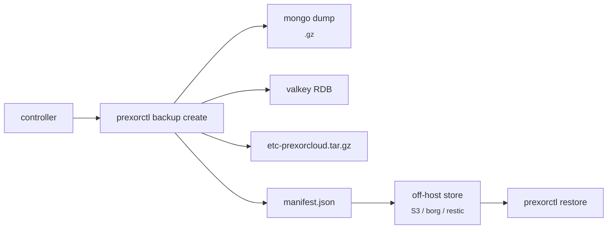

A PrexorCloud backup captures four things: durable platform state
(Mongo), coordination state (Valkey), the controller filesystem
(`/etc/prexorcloud/`), and per-module storage. This guide runs you
through `prexorctl backup` for the happy path, `prexorctl restore` for
a recovery, and the nightly DR drill that exercises both end-to-end.

## What you'll build



End state: a daily full backup, an off-host copy, a quarterly verified
restore drill, and a CI job that gates merges on the backup→restore
loop staying green.

## Prerequisites

- PrexorCloud v1.0+ controller. The CLI talks to the same
  `BackupCreator` the controller uses internally.
- Disk space for the backup directory (Mongo dump dominates; rule of
  thumb: 1 GiB per 100 instances per month of audit retention).
- An off-host destination (S3 bucket, borg repo, restic repo, or just
  another host's `/var/backups`). Optional but strongly recommended.

## 1. Take a backup

The CLI wraps the controller's backup logic and writes a single tarball
plus a manifest:

```bash
prexorctl backup create --description "pre-1.0.1-upgrade"
# -> Backup bk-2026-05-10-001 created
#    files: mongo, valkey, filesystem
#    size:  142 MiB
#    path:  /var/backups/prexorcloud/bk-2026-05-10-001/
```

What got captured:

| Tier | Source | Loss impact |
|---|---|---|
| Durable platform | Mongo `mongodump` | Catastrophic — every group, deployment, audit entry, module record. |
| Coordination | Valkey `BGSAVE` snapshot | Tolerable — login lockouts and SSE replay reset; in-flight workflows resume from Mongo intent. |
| Filesystem | `tar` of `/etc/prexorcloud/` | Catastrophic for config and CA; recoverable for module storage. |
| Per-module storage | Captured inside Mongo + Valkey backups | Module-defined. |

The MongoDB dump is `--gzip --out`; the Valkey snapshot is the post-`BGSAVE`
`dump.rdb`; the filesystem tarball excludes runtime logs.

List backups:

```bash
prexorctl backup list
# ID                    CREATED               SIZE     SCOPE
# bk-2026-05-10-001     2026-05-10T08:00:00Z  142 MiB  mongo,valkey,filesystem
# bk-2026-05-09-001     2026-05-09T08:00:00Z  138 MiB  mongo,valkey,filesystem
```

## 2. Schedule + ship off-host

Run nightly via systemd timer or cron. Encrypt with `age` and ship to
your off-host store:

```bash
# /etc/systemd/system/prexor-backup.service
[Service]
Type=oneshot
ExecStart=/usr/local/bin/prexorctl backup create --description nightly
ExecStartPost=/bin/sh -c 'BK=$(prexorctl backup list --json | jq -r ".[0].path"); \
                          tar -cf - -C /var/backups/prexorcloud "$(basename $BK)" \
                            | age -r age1xxx... > /tmp/$(basename $BK).tar.age; \
                          aws s3 cp /tmp/$(basename $BK).tar.age s3://prexor-backups/'
ExecStartPost=/usr/local/bin/prexorctl backup prune --keep-days 14
```

```bash
# /etc/systemd/system/prexor-backup.timer
[Timer]
OnCalendar=daily
Persistent=true
```

Replace `age1xxx…` with your real recipient (`age-keygen | tee
~/.config/age/key.txt`) and the S3 URI with your bucket. The same shape
works with `borg create`, `restic backup`, or `rclone copy`.

Recommended cadence:

| Frequency | Scope | Retention |
|---|---|---|
| Hourly | Mongo only | 24 hours |
| Daily | Full + off-host ship | 14 days |
| Weekly | Full + off-host ship | 90 days |
| Pre-upgrade | Full | Until next stable upgrade window |

## 3. Verify a backup without restoring

`prexorctl backup verify` validates checksums, parses the Mongo dump
without restoring, and runs a structural restore-dry-run:

```bash
prexorctl backup verify bk-2026-05-10-001
# checksums           OK
# manifest schema     OK
# mongo dump bson     OK (12 collections, 142,884 docs)
# valkey rdb          OK (preamble version 11)
# filesystem tar      OK
```

A backup you've never restored is not a backup. Run a real restore drill
in a throwaway environment **at least quarterly** — see step 5.

## 4. Restore

Stop every controller talking to the target Mongo + Valkey first:

```bash
sudo systemctl stop prexorcloud-controller     # on each controller host
```

Then restore:

```bash
prexorctl restore bk-2026-05-10-001 --dry-run
# … reports what would be replaced …

prexorctl restore bk-2026-05-10-001 \
    --datastores \
    --filesystem
# RestoreExecutor: drop+restore mongo... OK
# RestoreExecutor: replace valkey RDB... OK
# RestoreExecutor: untar /etc/prexorcloud... OK
# Run `systemctl start prexorcloud-controller` to bring the cluster back.
```

`--datastores` covers Mongo and Valkey; `--filesystem` covers
`/etc/prexorcloud/`. Use `--filesystem` alone for a config-only
recovery, `--datastores` alone if your config is intact.

Bring the controller back:

```bash
sudo systemctl start prexorcloud-controller
sudo journalctl -u prexorcloud-controller -f
```

Watch for `migration applied:` (normal for older backups into the same
controller version), `coordination.store=available`, and
`state.store=available`. Daemons reconnect automatically; if their certs
predate the restored CA, re-issue with `prexorctl token create
--description rejoin --ttl 1h` and `prexorctl setup --rejoin`.

## How to verify it works

After every restore drill, confirm:

- `prexorctl status` lists every controller and node as healthy.
- `prexorctl group list` shows the same groups as before, all
  `currentRevision == desiredRevision`.
- `prexorctl module list` shows installed modules in `ACTIVE`.
- `prexorctl crash list --since "1 day ago"` matches the backup era.
- A smoke deploy on a non-prod group succeeds.

## 5. The nightly DR drill

The repo's `.github/workflows/nightly.yml` runs a `dr-drill` job that
spins up ephemeral Mongo + Valkey containers, takes a real backup,
restores into a second pair of containers, and verifies cluster state
matches. If a drill fails, the workflow opens an issue automatically.
The harness lives under `cloud-test-harness:drDrill`.

You can run the same drill locally:

```bash
cd java
./gradlew :cloud-test-harness:drDrill
```

This is the single best signal that your backup/restore pipeline is
healthy without needing a real disaster.

## Common pitfalls

| Symptom | Likely cause |
|---|---|
| `mongorestore` fails with `unsupported BSON version` | The local `mongorestore` is older than the source Mongo. Match versions. |
| Controller starts then logs `migration failed` | Restoring across a major-version gap. Restore into the same controller version that took the backup. |
| Daemons can't connect: `peer not found in trust store` | CA was not in the restored backup. Restore `data/certs/`. |
| First login rejected with `Locked` | Restored login-attempt counters. Wait out the lockout or `prexorctl user unlock <username>`. |
| Module shows `LOAD_FAILED` after restore | Module jar was outside the backup. Reinstall: `prexorctl module install <bundle>`. |

## Where to go next

- [Operations → Backups & DR](/operations/backups-and-dr/) — the full
  operator runbook with manual `mongodump`/`mongorestore` fallbacks.
- [Operations → Disaster Drill](/operations/disaster-drill/) — what the
  nightly drill actually tests, and how to interpret a failure.
- [Guides → HA Controller (Redis)](/guides/ha-controller/) — the HA
  shape changes restore semantics; read this if you run multiple
  controllers.
