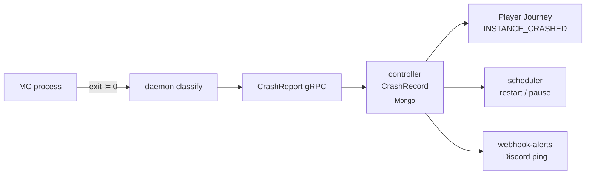

A crash is any instance exit that wasn't an operator-initiated
`stop`. The daemon classifies it, the controller persists a
`CrashRecord`, the Player Journey Bus appends `INSTANCE_CRASHED` for
every affected player, and the scheduler decides whether to restart or
quarantine the group. This guide shows the operator-visible side of all
four steps and how to act on them.

## What you'll build



End state: every crash is one Mongo row, one SSE event, one webhook
delivery (if configured), one journey entry per affected player, and a
deterministic restart-vs-pause decision.

## Prerequisites

- PrexorCloud v1.0+ controller and at least one daemon.
- A group with `≥1` running instance. Examples below use `lobby`.
- Optional: the `webhook-alerts` module installed for Discord/Slack
  notifications — see [Recipes → Discord Notifications](/recipes/discord-notifications/).

## 1. Inspect a crash

Force a crash for the demonstration (skip if you have a real one):

```bash
prexorctl instance stop lobby-1 --force --no-graceful
```

`--no-graceful` sends `SIGKILL` rather than `STOP /save-all` followed by
`SIGTERM`, so the daemon classifies the exit as `KILLED` rather than
`CLEAN`. List recent crashes:

```bash
prexorctl crash list --since "5 min ago"
# CRASH-ID         INSTANCE  GROUP   EXIT  CLASS         AGE
# crash-A1B2C3D4   lobby-1   lobby   137   KILLED        12s
```

Inspect:

```bash
prexorctl crash info crash-A1B2C3D4
```

You get exit code, classification (`CLEAN`, `KILLED`, `OOM`,
`STARTUP_FAILURE`, `RUNTIME_FAILURE`), uptime in ms, console tail
(default last 200 lines), and the responsible node. The console tail is
captured by the daemon's stdio reader; the full record lives in the
`crash_records` Mongo collection. See [Concepts → Cluster Model](/concepts/cluster-model/)
for how the daemon classifies exits.

## 2. Read the journey for affected players

Every player who was on the instance at crash time gets an
`INSTANCE_CRASHED` entry on the Player Journey Bus.

```bash
prexorctl player journey <player-uuid> --limit 20
# 2026-05-10T12:00:01Z  PLAYER_CONNECTED      proxy-1
# 2026-05-10T12:00:02Z  PLAYER_TRANSFER       proxy-1 -> lobby-1
# 2026-05-10T12:15:42Z  INSTANCE_CRASHED      lobby-1   exit=137 class=KILLED
# 2026-05-10T12:15:43Z  PLAYER_TRANSFER       lobby-1 -> lobby-2  (fallback)
```

The proxy plugin walked the `fallbackGroups` chain on
`KickedFromServerEvent` and sent the player to a healthy lobby. For
this to work the group must be behind a Velocity/Bungee proxy with a
[Network Composition](/concepts/groups-instances-templates/) — see
[Your First Network](/getting-started/your-first-network/).

## 3. Understand the restart decision

The crash-loop detector runs in the controller and counts crashes per
group in a rolling window. Defaults: **3 crashes within 60 seconds
pause the group.** Configure under
`/etc/prexorcloud/controller.yml`:

```yaml
scheduler:
  crashLoop:
    windowSeconds: 60
    maxCrashes: 3
    backoffSeconds: 30      # delay between auto-restart attempts
```

When tripped, the controller emits `GROUP_CRASH_LOOP` and sets the
group to `paused` with reason `crash-loop`. New placements stop until
you resume. Inspect:

```bash
prexorctl group info lobby
# STATE   PAUSED
# REASON  crash-loop  (3 crashes in 47s)

prexorctl crash list --group lobby --since "5 min ago"
```

## 4. Resume the group

Fix the underlying issue (bad template, OOM, port conflict, missing
plugin) and resume:

```bash
prexorctl group resume lobby
# Group lobby resumed. Scheduler reactivated.
```

The scheduler immediately re-evaluates desired state and re-places
missing instances. If the root cause persists, the loop trips again
and the group re-pauses; that's the safety mechanism doing its job.

## How to verify it works

After a real crash, the after-incident checklist:

- `prexorctl crash list --since "<incident start>"` shows the crash.
- `prexorctl crash info <id>` console tail surfaces the root cause.
- For affected players: `prexorctl player journey <uuid>` shows the
  `INSTANCE_CRASHED → PLAYER_TRANSFER` redirect.
- `prexorctl group info <group>` shows either restored or `PAUSED` —
  if paused, address the cause and `group resume`.
- If `webhook-alerts` is installed, the configured webhooks received
  one POST per `instance_crashed` and (if tripped) one for `crash_loop`.

## OOM-specific recovery

`OutOfMemoryError` shows up as `class=OOM` in the crash record. Check
the heap-dump path (set in the group's `resources.jvmArgs` or the
template):

```yaml
# templates/lobby/jvm-args.txt
-Xmx2G
-XX:+HeapDumpOnOutOfMemoryError
-XX:HeapDumpPath=/var/lib/prexorcloud/heapdumps/
```

If you see repeated OOMs, bump `resources.memoryMB` on the group and
roll a deploy:

```bash
prexorctl group update lobby --memory 3072
prexorctl deploy lobby --strategy rolling
```

## Common pitfalls

| Symptom | Likely cause |
|---|---|
| `crash list` empty after a visible crash | Daemon couldn't reach the controller. Check `prexorctl node list` for the daemon's state. |
| Group keeps re-pausing post-fix | Crash-loop counter window not yet expired. Wait `windowSeconds`, or restart the controller to clear in-process counters. |
| Players see `Connection lost` instead of fallback | No Network Composition for the group's proxy. Apply one. |
| `class=STARTUP_FAILURE` repeats | Template is broken. Roll back: `prexorctl template rollback <name>`. |

## Where to go next

- [Recipes → Discord Notifications](/recipes/discord-notifications/) —
  pipe crash events to a Discord channel.
- [Concepts → Events](/concepts/events/) — every crash-related SSE
  event, with payload shape.
- [Guides → Backup + Restore](/guides/backup-and-restore/) — recover
  state if a crash takes Mongo with it (rare, but covered).
