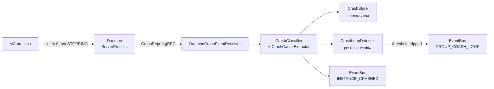

A crash is any instance exit the Daemon did not initiate. The Daemon
classifies the exit, sends a `CrashReport` to the Controller, the
Controller derives a cause and signature, records it, counts it against
a per-Group crash-loop window, and emits events. If a Group crosses the
threshold it is auto-paused for a cooldown, then auto-unpaused for one
retry. This guide covers what the operator sees and how each step
behaves.

For operators.

## What counts as a crash

The Daemon's exit monitor decides crash vs. clean exit with one rule:

```
crashed = (state != STOPPING) && (exitCode != 0)
```

So:

| Situation | Crashed? |
|---|---|
| You ran `instance stop` (Daemon set state to `STOPPING`), any exit code | No |
| You ran `instance stop --force` (still a Daemon-initiated stop) | No |
| Server ran `/stop` itself and exited `0` | No (clean self-shutdown) |
| Process died on its own with a non-zero exit code | Yes |

A clean exit reports state `STOPPED`. A crash reports state `CRASHED`
and triggers a `CrashReport`. Exit code `0` from a self-shutdown is
never a crash, even when you did not ask for it.

`instance stop --force` cannot be used to fake a crash: the Daemon set
the instance to `STOPPING` before killing it, so the exit is classified
clean regardless of the SIGKILL exit code. To see a real crash, kill the
underlying process directly (outside PrexorCloud) or wait for one.

Source: `ServerProcess.monitorExit()` in the Daemon.

## The crash pipeline



What the Daemon sends in `CrashReport` (proto `daemon_service.proto`):

| Field | Meaning |
|---|---|
| `instance_id` | Crashed instance |
| `group` | Its Group |
| `exit_code` | Process exit code |
| `log_tail` | Last N console lines (the Daemon's ring buffer) |
| `uptime_ms` | Milliseconds the instance was alive before the exit |

The Controller rejects a report whose `log_tail` exceeds 500 entries or
whose lines exceed 8192 chars, and verifies the reporting node actually
owns the instance before recording anything.

## Exit-code and log classification

The Controller classifies every crash into one string. Log-pattern
matches win over exit codes — the classifier scans the log tail first
and falls back to the exit code only if no pattern matches.

Log-pattern classifications (checked in this order, any matching line in
the tail):

| Classification | Triggered by a log line containing |
|---|---|
| `OOM` | `java.lang.OutOfMemoryError` or `There is insufficient memory` |
| `STACK_OVERFLOW` | `java.lang.StackOverflowError` |
| `CLASS_NOT_FOUND` | `java.lang.ClassNotFoundException` or `java.lang.NoClassDefFoundError` |
| `PORT_BIND_FAILURE` | `Failed to bind to port` or `Address already in use` |

Exit-code classifications (used only when no log pattern matched):

| Exit code | Classification |
|---|---|
| `0` | `CLEAN` |
| `1` | `GENERAL_ERROR` |
| `130` | `SIGINT` |
| `134` | `SIGABRT` |
| `137` | `SIGKILL` |
| `139` | `SIGSEGV` |
| `143` | `SIGTERM` |
| anything else | `UNKNOWN` |

A non-zero exit that does not match a known signal and has no
recognizable log pattern lands in `UNKNOWN`. `OOM` is special: it is
detected from the log tail regardless of exit code, so an OOM-killed
process (`137`) still classifies as `OOM`, not `SIGKILL`.

Source: `CrashClassifier.classify(int exitCode, List<String> logTail)`.

### Cause summary and signature

Alongside the classification, the Controller derives two extra fields
(`CrashCauseExtractor`):

- **`causeSummary`** — one human-readable line, so you can tell crashes
  apart in the list without opening each one. It scans the tail
  bottom-up for, in order: an OOM line (`OutOfMemoryError: <detail>`), a
  bind failure, then the last Java exception/error line
  (`NullPointerException: Cannot invoke ...`, truncated at ~200 chars).
  If none match, it falls back to a classification-derived phrase
  (`Killed (SIGKILL)`, `Segmentation fault`, `Exit code <n>`, …).
- **`signature`** — a 16-hex-char SHA-256 over the normalized cause
  (digits replaced with `N`, first stack frame folded in). Crashes with
  the same root cause across instances and time share a signature, which
  is what lets the dashboard group recurring crashes. An empty tail
  yields signature `00000000`.

## Crash-loop auto-pause

The Controller counts crashes per Group in a sliding window. Crossing
the threshold pauses the Group: the scheduler stops placing or
restarting its instances. The pause is internal scheduler state, not a
Group field you toggle.

Defaults and behavior (`CrashLoopDetector` + `CrashConfig`):

| Parameter | Default | Config key | Notes |
|---|---|---|---|
| Threshold | `3` crashes | `crashes.crashLoopThreshold` | `>=` trips the pause |
| Window | `300` seconds | `crashes.crashLoopWindowSeconds` | Sliding; old timestamps drop out |
| Initial cooldown | `60` seconds | not configurable | First pause duration |
| Cooldown cap | `3600` seconds (1 h) | not configurable | Upper bound after backoff |

When the window holds `>= threshold` crashes and the Group is not
already paused:

1. The Group is added to the paused set. The scheduler skips it — every
   placement plan for that Group returns `skipReason = "crash loop paused"`.
2. The Controller logs a warning and publishes `GroupCrashLoopEvent`
   (event type `GROUP_CRASH_LOOP`, payload: `group`, `crashCount`,
   `windowStart`).
3. A cooldown is scheduled. The first cooldown is 60 s. Each subsequent
   trip for the same Group **doubles** it (`60 → 120 → 240 → …`),
   capped at 3600 s.

After the cooldown the Group is auto-unpaused for one retry. If it
crashes again past the threshold, it re-pauses with the next (longer)
backoff. The backoff counter resets only on a manual clear.

### Configure the thresholds

These keys live under `crashes` in the Controller config. A missing
`crashes` block uses the defaults below.

```yaml
crashes:
  ringBufferSize: 500          # in-memory crash records kept for metrics
  crashLoopThreshold: 3        # crashes in the window that trip a pause
  crashLoopWindowSeconds: 300  # sliding window width
```

Any value `<= 0` is replaced with its default
(`500` / `3` / `300`). There is no `backoffSeconds` key — the 60 s → 1 h
backoff is internal. There is no `scheduler.crashLoop` block.

## Recovery: how a Group comes back

There are two ways a crash-loop pause ends.

**Automatic (the normal path).** After the cooldown, the
`crash-loop-cooldown` thread removes the Group from the paused set and
clears its crash timestamps. The scheduler re-evaluates on its next tick
and replaces missing instances — one retry. If the root cause is still
there, it crashes again, re-trips the threshold, and re-pauses with the
next backoff step. The escalating backoff is the safety mechanism: a
permanently broken Group ends up paused for up to an hour at a time
rather than thrashing.

**Manual clear.** `CrashLoopDetector.unpause(group)` removes the pause,
clears the timestamps, and resets the backoff counter to its 60 s base.

Note: there is no shipped `prexorctl` command or REST route that calls
`unpause`. `prexorctl group` has `list`, `info`, `create`, `update`,
`delete`, and `maintenance <name> <on|off>`, and none of them clear a
crash-loop pause. In practice you fix the root cause and let the
cooldown auto-unpause the Group. To force an immediate retry before the
cooldown expires, restart the Controller (the paused set and timestamps
are in-process and reset on restart).

The fastest fixes by classification:

| Classification | Likely fix |
|---|---|
| `OOM` | Raise the Group's memory; check for a leak via a heap dump |
| `PORT_BIND_FAILURE` | Free the port or fix the port range; stale process |
| `CLASS_NOT_FOUND` | Missing or incompatible Plugin or jar in the Template |
| `STACK_OVERFLOW` | Plugin recursion bug; roll back the Template |
| `SIGSEGV` / `SIGABRT` | Native crash — JVM, native lib, or platform |
| `GENERAL_ERROR` / `UNKNOWN` | Read the log tail; the cause is in the console |

## Inspect crashes from the CLI

`prexorctl crash` reads the Controller's crash API. Two subcommands.

### List

```bash
prexorctl crash list
```

```
ID                INSTANCE   GROUP   NODE     EXIT   CLASS              CRASHED AT             UPTIME
crash-7f3c…       lobby-1    lobby   node-a   137    OOM                2026-06-07T12:15:42Z   14m
```

Flags:

| Flag | Effect |
|---|---|
| `--group <name>` | Filter to one Group |
| `--node <name>` | Filter to one node |
| `--since <ISO 8601>` | Sent as the `from` query param |
| `--json` | Raw JSON instead of the table |

Note on `--since`: the CLI takes an ISO-8601 timestamp and sends it as
`from`, but the Controller's `GET /api/v1/crashes` route does not read a
`from` parameter — it paginates by `page`/`pageSize` (with `limit` as a
deprecated alias) and filters by `group`/`node` only. So `--since` is a
no-op against the shipped Controller; do not rely on it to narrow
results. Crash IDs are `crash-<UUID>`.

### Detail

```bash
prexorctl crash info crash-7f3c2a1b
```

Prints the classification pill, crashed-at and uptime, a context card
(instance, Group, node, exit code, uptime), and the stored log tail
(`LAST LOG LINES`). The log tail is whatever the Daemon captured in its
ring buffer at crash time — not a fixed line count.

To export a crash to the configured paste service, pass the share flags
to `crash info` (it POSTs to `/api/v1/crashes/{id}/share`). This needs
both the `CRASHES_VIEW` and `SHARE_INVOKE` permissions and a configured
paste backend, or the route returns `409`.

## The crash trend

The Controller buckets crashes over a window for sparkline rendering on
the dashboard (`GET /api/v1/crashes/trends`, `CrashTrendBucketer`).

Query parameters:

| Param | Default | Range / format | Meaning |
|---|---|---|---|
| `window` | `24h` | `<n>s\|m\|h\|d`, e.g. `7d` | Window duration; clamped to 30 days |
| `buckets` | `24` | `1`–`288` | Buckets dividing the window |
| `group` | all | — | Filter to one Group |
| `node` | all | — | Filter to one node |

Each bucket is `windowSeconds / buckets` wide (minimum 1 s). The
response carries `windowStart`, `windowEnd`, `windowSeconds`,
`bucketSeconds`, a per-bucket `count` and `byClassification` breakdown,
plus `total` and `totalsByClassification` across the window. Points
outside `[windowStart, windowEnd)` are dropped. There is no CLI
subcommand for trends; it is a dashboard/REST surface.

## Where crash data lives, and for how long

Two stores hold crash data, and they are not the same:

- **`CrashStore`** — an in-memory ring buffer of `ringBufferSize`
  records (default 500), oldest-evicted. It backs the
  `prexorcloud.crashes.total` metric gauge. It is lost on Controller
  restart.
- **The `crashes` MongoDB collection** — what the REST list/detail/trend
  routes read (`getCrashes`, `getCrash`, `getCrashTrend`,
  `countCrashes`). It has a TTL index `crashes_ttl` set to **30 days**,
  so crash documents expire automatically. The trend window is clamped
  to that 30-day retention.

> Known gap (verify against your build before relying on it): in the
> source read for this page, the crash path writes only the in-memory
> `CrashStore` — `StateStore.saveCrash(...)` has no production caller —
> while the REST routes read the Mongo `crashes` collection. If a
> deployment shows an empty `crash list` despite crashes appearing in
> Controller logs and the `prexorcloud.crashes.total` metric, this is
> the likely cause: the in-memory store has the record, the queried
> collection does not. Flagged here rather than asserted either way.

## Events you can subscribe to

| Event type | When | Payload |
|---|---|---|
| `INSTANCE_CRASHED` | Every recorded crash | `instanceId`, `group`, `nodeId`, `exitCode`, `classification`, `logTail`, `uptimeMs` |
| `GROUP_CRASH_LOOP` | Threshold tripped for a Group | `group`, `crashCount`, `windowStart` |

Both flow through the Controller `EventBus` (and out over SSE / to
Modules). Wire `GROUP_CRASH_LOOP` to your alerting so a paused Group
pages someone instead of going quiet.

## Verify it end to end

After a real crash:

1. `prexorctl crash list --group <group>` shows the crash with its
   `EXIT` and `CLASS`. (If empty, see the known gap above.)
2. `prexorctl crash info <id>` shows the log tail — the root cause is
   in `LAST LOG LINES`.
3. Controller logs carry
   `Instance <id> crashed on node <node> (exit=…, classification=…)`.
4. If the Group tripped the loop, the log carries
   `Crash loop detected for group <g> (<n> crashes in <window>s window,
   attempt=…, cooldown=…s)` and the scheduler skips it with
   `crash loop paused` until the cooldown elapses.
5. After the cooldown,
   `Auto-unpause for group <g> after <n>s cooldown (allowing one retry)`
   appears and the instance is replaced on the next tick.

## Common pitfalls

| Symptom | Cause |
|---|---|
| Force-stopped instance never shows as a crash | Expected — a Daemon-initiated stop sets state `STOPPING`, so the exit classifies clean. |
| `crash list --since` does not filter | Expected — the Controller route ignores `from`; filter by `--group`/`--node`. |
| Group keeps re-pausing after a "fix" | The fix did not hold; each re-trip doubles the cooldown up to 1 h. Confirm via `crash info` that the classification changed. |
| Looking for `group resume` | It does not exist. Let the cooldown auto-unpause, or restart the Controller to clear the in-process pause. |
| `crash list` empty but logs show crashes | The in-memory `CrashStore` vs. Mongo `crashes` gap (see "Where crash data lives"), or the Daemon could not reach the Controller — check `prexorctl node list`. |
