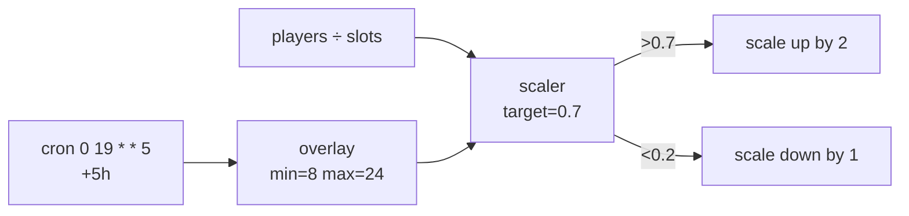

PrexorCloud's built-in scaler covers most production needs without a
single line of code: target player utilisation, hard `min`/`max` floors,
cooldowns, and time-bound overlays via Event Choreography. This guide
configures all three together for a typical weekend-peak workload.

If you need decisions the built-in scaler can't express (queue depth,
external matchmaker, ticketed events), see
[Recipes → Custom Scaling Logic](/recipes/custom-scaling-logic/) for
writing a scaling module instead.

## What you'll build



End state: a `bedwars` group that scales between 1 and 24 instances
based on player utilisation, raises its floor to 8 every Friday 19:00
UTC for 5 hours, and never oscillates more than once a minute.

## Prerequisites

- PrexorCloud v1.0+ controller with multiple daemon nodes (single-node
  also works; spread is just less interesting).
- A working group config; we extend the one from
  [Your First Network](/getting-started/your-first-network/).

## 1. Enable player-utilisation scaling

Add a `scaling` block to the group config. The metric `players` is the
ratio of online players to declared slots across all running instances
of the group.

```yaml
# bedwars.yml
name: bedwars
platform: paper
version: "1.21.4"
ports: { from: 25800, to: 25899 }
resources: { memoryMB: 2048 }
templates: [base-paper, bedwars]

scaling:
  enabled: true
  mode: DYNAMIC
  metric: players          # players | cpu | memory | custom
  target: 0.7              # scale up when avg utilisation ≥ 0.7
  min: 1
  max: 24
  scaleUpStep: 2           # add 2 instances per up-tick
  scaleDownStep: 1         # remove 1 per down-tick
  scaleDownAt: 0.2         # scale down threshold
  cooldownSeconds: 60      # min seconds between scaler actions
```

Apply:

```bash
prexorctl group apply -f bedwars.yml
```

The `SchedulerEvaluator` runs every `scheduler.evaluationInterval`
(default 5s), respects `cooldownSeconds`, and refuses to violate
`min` or `max`. See [Concepts → Scheduling and Scaling](/concepts/scheduling-and-scaling/)
for the full evaluator algorithm.

## 2. Add a peak-hours overlay

Event Choreography is a cron-shaped overlay on the live scaler.
Overlays adjust `minInstances`, `maxInstances`, `scalingMode`, and
`maintenance` for a firing window. Add to
`/etc/prexorcloud/controller.yml`:

```yaml
events:
  - id: peak-hours
    cron: "0 19 * * 5"           # Friday 19:00 UTC
    duration: "PT5H"             # 5 hours
    targetGroup: bedwars
    overlay:
      minInstances: 8            # peak floor
      maxInstances: 24           # unchanged
      scalingMode: DYNAMIC

  - id: maintenance-window
    cron: "0 4 * * 1"            # Monday 04:00 UTC
    duration: "PT1H"
    targetGroup: bedwars
    overlay:
      maintenance: true
      maintenanceMessage: "<yellow>Patching, back in 1h"
```

The cron parser is a 5-field Vixie cron with day-of-month / day-of-week
OR semantics and IANA timezone support (default UTC; add `timezone:
Europe/Berlin` per overlay). Reload the controller config:

```bash
sudo systemctl reload prexorcloud-controller
prexorctl events list
# ID                  TARGET     CRON           DURATION   ACTIVE
# peak-hours          bedwars    0 19 * * 5     PT5H       false
# maintenance-window  bedwars    0 4 * * 1      PT1H       false
```

## 3. Watch the scaler in action

Stream the scaler's decisions:

```bash
prexorctl events follow --filter scaling
# 12:00:05  SCALING_EVALUATED  bedwars  utilisation=0.42 desired=2 actual=2  noop
# 12:01:05  SCALING_EVALUATED  bedwars  utilisation=0.81 desired=4 actual=2  scaleUp
# 12:01:05  INSTANCE_SCHEDULED bedwars-3 node-2
# 12:01:05  INSTANCE_SCHEDULED bedwars-4 node-1
# 12:01:08  SCALING_COOLDOWN   bedwars  remainingSec=57
```

When the overlay activates:

```bash
prexorctl events list --active
# peak-hours  bedwars  active until 2026-05-10T00:00:00Z

prexorctl events follow --filter choreography
# CHOREOGRAPHY_OVERLAY_ACTIVATED   peak-hours  bedwars  min=8 max=24
# … 5 hours later …
# CHOREOGRAPHY_OVERLAY_DEACTIVATED peak-hours  bedwars
```

## 4. Manual override

Bypass the scaler temporarily:

```bash
prexorctl group scale bedwars --target 12
```

This sets a one-shot desired count and disables the auto-scaler for
`cooldownSeconds`. Useful for ticketed events that don't justify a
recurring overlay.

## How to verify it works

Synthetic load from a second terminal — connect 50 dummy players via a
load test client of your choice, then:

```bash
prexorctl group info bedwars
# DESIRED         6
# ACTUAL          6
# UTILISATION     0.71
# LAST SCALE UP   30s ago
```

Drop the dummies and wait `cooldownSeconds`:

```bash
prexorctl group info bedwars
# DESIRED         3
# ACTUAL          3
# UTILISATION     0.18
# LAST SCALE DOWN 12s ago
```

`utilisation`, `desired`, and `actual` should converge on the target
within two evaluation cycles after each step change.

## Common pitfalls

| Symptom | Likely cause |
|---|---|
| Scaler oscillates up/down repeatedly | `scaleUpAt` and `scaleDownAt` too close. Widen the gap (e.g. 0.7 / 0.2). |
| Group never scales up under load | `max` already reached. `prexorctl group info` will say. |
| Overlay doesn't fire | Wrong timezone or cron field count. Test with `prexorctl events test peak-hours --at "2026-05-09T19:00:00Z"`. |
| Manual `--target` keeps reverting | Cooldown elapsed and the auto-scaler reasserted. Disable scaling with `--mode static` if you want a hard hold. |

## Where to go next

- [Recipes → Custom Scaling Logic](/recipes/custom-scaling-logic/) —
  when the built-in metrics aren't enough.
- [Concepts → Scheduling and Scaling](/concepts/scheduling-and-scaling/)
  — the evaluator's full decision tree.
- [Recipes → BedWars Network](/recipes/bedwars-network/) — production
  scaling config end-to-end.
