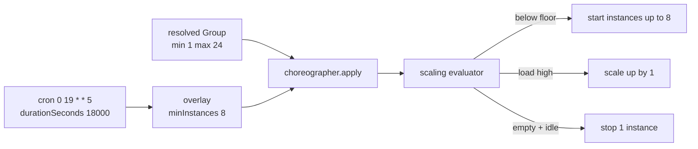

The Controller's built-in scaler keeps a dynamic Group between `minInstances` and
`maxInstances` based on player load. When you need a different floor or ceiling at a
known time — a higher lobby floor every Friday evening, a forced ceiling during a
maintenance window — add an Event Choreography overlay. An overlay fires on a cron
schedule, stays active for a fixed duration, and replaces selected scaling fields of a
target Group in memory for that window. It never edits the persisted Group.

This guide configures a `bedwars` Group that scales on player load and raises its floor
to 8 instances every Friday 19:00 for five hours.

For decisions the built-in scaler can't express (queue depth, an external matchmaker,
ticketed one-offs), write a scaling Module instead — overlays only adjust the four fields
listed in [Overlay fields](#overlay-fields).

## Before you start

- A running Controller (v1.0+) and at least one Daemon node. A single node works; spread
  is less interesting.
- A `DYNAMIC` Group to scale. This guide extends one named `bedwars`.
- Shell access to the Controller host: overlays live in `config/controller.yml` and are
  read once at Controller start. There is no API to add or change them at runtime.

## How overlays fit the scaler

Each scheduler tick, before it evaluates scaling, the Controller asks the choreographer
whether any overlay's firing window covers the current instant. If one does, the scaler
sees a choreographed copy of the resolved Group — same Group, with the overlay's fields
swapped in — for that tick. When the window ends, the next tick sees the persisted Group
again.



The scheduler tick interval is `scheduler.evaluationIntervalSeconds` in
`controller.yml`, default `15`. An overlay therefore takes effect within one tick of its
firing minute, not instantly. The full evaluator is in
[Concepts → Scheduling and scaling](/concepts/scheduling-and-scaling/).

## 1. Configure the Group's base scaling

A Group carries its own scaling fields. Set them when you create the Group or update them
later. The CLI exposes the common ones as flags; everything else is set through the REST
API or the Group config the Controller seeds from.

```bash
prexorctl group create \
  --name bedwars \
  --platform paper \
  --platform-version 1.21.4 \
  --template base-paper --template bedwars \
  --scaling-mode DYNAMIC \
  --min 1 \
  --max 24 \
  --memory 2048
```

Update bounds or mode later:

```bash
prexorctl group update bedwars --min 1 --max 24 --scaling-mode DYNAMIC
```

### Scaling fields and defaults

These are the Group fields the scaler and overlays read. Defaults are applied by the
Controller when the value is missing or non-positive.

| Field | Default | Meaning |
|---|---|---|
| `scalingMode` | `DYNAMIC` | `DYNAMIC` scales on load; `STATIC` holds exactly `minInstances`; `MANUAL` is never evaluated. Upper-cased on load. |
| `minInstances` | `0` | Floor. The scaler always brings the Group up to this count. |
| `maxInstances` | `10` | Ceiling. The scaler never starts past this count. |
| `maxPlayers` | `100` | Per-instance player capacity. The denominator for the load ratio. |
| `scaleUpThreshold` | `0.8` | Scale up by one when **every** running instance is at or above this fraction of `maxPlayers`. |
| `scaleDownAfterSeconds` | `300` | An empty instance must run at least this long before it's eligible to stop. |
| `scaleCooldownSeconds` | `60` | Minimum seconds between scale actions for the Group. |

How `DYNAMIC` scaling acts each tick (see `ScalingEvaluator`):

- **Below floor.** If active instances `< minInstances`, start the difference. This runs
  before the cooldown and threshold checks, so a raised floor takes effect immediately.
- **Scale up.** If at or above the floor, below `maxInstances`, off cooldown, and every
  running instance is at or above `scaleUpThreshold` of `maxPlayers`, start one instance.
- **Scale down.** Above the floor and off cooldown, stop one running instance that has
  zero players and has been up longer than `scaleDownAfterSeconds`.

The load signal is players per instance against `maxPlayers`. There is no CPU or memory
metric and no configurable step — scale-up adds exactly one instance per tick (except
when filling below the floor, which adds the full gap).

`STATIC` Groups maintain exactly `minInstances` and never scale on load. `MANUAL` Groups
are skipped by the scheduler entirely.

## 2. Add a peak-hours overlay

Overlays live under `events:` in `config/controller.yml`. Add an entry that targets
`bedwars` and raises its floor.

```yaml
events:
  - name: peak-hours
    description: Friday evening lobby floor
    group: bedwars
    cron: "0 19 * * 5"          # Friday 19:00
    timezone: Europe/Berlin     # defaults to UTC if omitted
    durationSeconds: 18000      # 5 hours
    overlay:
      minInstances: 8           # raise the floor for the window
```

While this window is active, the scaler treats `bedwars` as having `minInstances: 8` and
brings it up to eight instances; `maxInstances` and everything else stay as configured.
When the window ends, the floor drops back to the Group's persisted `minInstances` and the
scaler stops idle instances per `scaleDownAfterSeconds`.

### Overlay entry fields

| Key | Required | Notes |
|---|---|---|
| `name` | yes | Unique across all entries. Must match `[a-z0-9_][a-z0-9_-]*`. A duplicate name fails Controller start. |
| `description` | no | Free text. Defaults to empty. |
| `group` | yes | Target Group name. Must exist when the entry fires; a missing Group means the overlay finds nothing to apply. |
| `cron` | yes | Five-field cron. See [Cron syntax](#cron-syntax). |
| `timezone` | no | IANA zone ID (`UTC`, `Europe/Berlin`, `America/New_York`). Defaults to `UTC`. An invalid zone fails Controller start. |
| `durationSeconds` | yes | Active window length after each firing. Must be `> 0`. |
| `overlay` | yes | The fields to swap in. At least one must be set. |

### Overlay fields

`overlay` is a partial Group. A field left out means "leave the Group's value alone." At
least one field must be set or the entry is rejected as a no-op.

| Field | Constraint | Effect during the window |
|---|---|---|
| `minInstances` | `>= 0` | Replaces the Group floor. |
| `maxInstances` | `> 0` | Replaces the Group ceiling. |
| `scalingMode` | `DYNAMIC`, `STATIC`, or `MANUAL` | Replaces the mode. Upper-cased on load. `MANUAL` freezes the Group; `STATIC` pins it to the (possibly overlaid) `minInstances`. |
| `maintenance` | boolean | When `true`, the scheduler skips the Group for the window. |
| `maintenanceMessage` | string | MiniMessage shown to players blocked by maintenance. A blank value is treated as unset. |

If an overlay would set `minInstances` above `maxInstances`, the Controller clamps the
pair to stay coherent rather than rejecting it — it keeps whichever bound the overlay set
and pulls the other in to match.

### Cron syntax

The parser is five fields, space-separated: `minute hour day-of-month month day-of-week`.

| Field | Range | Notes |
|---|---|---|
| minute | 0–59 | |
| hour | 0–23 | |
| day-of-month | 1–31 | |
| month | 1–12 | numeric only |
| day-of-week | 0–7 | `0` and `7` both mean Sunday |

Each field accepts `*`, comma lists (`1,15`), dashed ranges (`9-17`), and `/step`
(`*/15`). There are no name aliases (`MON`, `JAN`) and no shorthands (`@hourly`,
`@daily`). A wrong field count fails Controller start.

Day-of-month and day-of-week use Vixie OR semantics: when **both** are restricted (neither
is `*`), the cron matches if **either** matches. When only one is restricted, only that
field is consulted. So `0 19 13 * 5` fires on the 13th **or** any Friday — not only
Friday the 13th.

Examples:

| Cron | Fires |
|---|---|
| `0 19 * * 5` | Fridays at 19:00 |
| `0 19 * * 5,6` | Friday and Saturday at 19:00 |
| `*/15 18-23 * * *` | every 15 minutes, 18:00–23:59, daily |
| `0 4 1 * *` | 04:00 on the 1st of each month |

## 3. Restart the Controller

The choreographer reads `events:` once, at Controller construction. Restart to pick up new
or changed entries.

```bash
sudo systemctl restart prexorcloud-controller
```

A malformed entry — bad cron, unknown timezone, duplicate `name`, empty overlay, negative
`durationSeconds` — fails the start with a message naming the offending entry. Fix the
YAML and restart.

## 4. Verify the overlay

Two read-only REST endpoints expose choreography. Both require the `events.view`
permission on your token.

List every configured entry:

```bash
curl -s -H "Authorization: Bearer $TOKEN" \
  http://localhost:8080/api/v1/events | jq
```

```json
[
  {
    "name": "peak-hours",
    "description": "Friday evening lobby floor",
    "group": "bedwars",
    "cron": "0 19 * * 5",
    "timezone": "Europe/Berlin",
    "durationSeconds": 18000,
    "overlay": {
      "minInstances": 8,
      "maxInstances": null,
      "scalingMode": null,
      "maintenance": null,
      "maintenanceMessage": null
    }
  }
]
```

List only the overlays whose window covers right now:

```bash
curl -s -H "Authorization: Bearer $TOKEN" \
  http://localhost:8080/api/v1/events/active | jq
```

```json
{
  "active": [
    {
      "eventName": "peak-hours",
      "group": "bedwars",
      "activeSince": "2026-06-12T17:00:00Z",
      "activeUntil": "2026-06-12T22:00:00Z"
    }
  ]
}
```

At most one overlay is active per Group. When several entries cover the same Group at the
same instant, the one whose firing started most recently wins.

The Controller also publishes events on the EventBus at each transition, visible on the
SSE stream and in the Controller log:

| Event type | When |
|---|---|
| `CHOREOGRAPHY_OVERLAY_ACTIVATED` | a Group's active overlay starts, or changes to a different overlay |
| `CHOREOGRAPHY_OVERLAY_DEACTIVATED` | the window expires, or another overlay supersedes it (`reason` is `expired` or `superseded`) |

Watch the floor move while the window is active:

```bash
prexorctl group info bedwars
```

The scaling panel shows `mode`, `min replicas`, `max replicas`, and `max players` from the
**persisted** Group — overlays do not rewrite the Group, so `min replicas` still reads `1`.
Confirm the overlay by the running instance count converging on the overlaid floor (8) and
by the `/api/v1/events/active` response above.

## Worked example: weekend peak plus a maintenance window

```yaml
events:
  - name: weekend-peak
    description: Higher lobby floor Fri-Sun evenings
    group: bedwars
    cron: "0 18 * * 5,6,0"
    timezone: Europe/Berlin
    durationSeconds: 21600        # 6 hours
    overlay:
      minInstances: 6
      maxInstances: 32            # also raise the ceiling for the rush

  - name: patch-window
    description: Tuesday early-morning patching
    group: bedwars
    cron: "0 4 * * 2"
    timezone: Europe/Berlin
    durationSeconds: 3600         # 1 hour
    overlay:
      maintenance: true
      maintenanceMessage: "<yellow>Patching — back within the hour"
```

During `weekend-peak`, `bedwars` runs at least six instances and may scale to 32 under
load. During `patch-window`, the scheduler skips the Group: no scaling, and players are
blocked with the message. The two windows don't overlap, so there's no contention. If they
did, the more recently fired window would win for the overlapping minutes.

## Common pitfalls

| Symptom | Cause and fix |
|---|---|
| Overlay never fires | Wrong `timezone` (overlays default to UTC, not the host zone) or a cron that doesn't match. Set `timezone` explicitly and re-check the field order: `minute hour dom month dow`. |
| Cron matches more days than expected | Day-of-month and day-of-week use OR semantics when both are restricted. Leave one as `*`. |
| Controller won't start after editing `events:` | A malformed entry. The start error names the entry and the reason (bad cron, unknown zone, duplicate `name`, empty overlay). |
| Floor raised but instances don't appear | `maxInstances` is below the overlaid floor, or nodes lack capacity. The overlay clamps an inverted pair; check `maxInstances` and node free slots. |
| Group keeps scaling down during a busy window | The window expired, or `scaleDownAfterSeconds` let idle instances go. Extend `durationSeconds`, or raise the persisted `minInstances`. |
| Edited the YAML, nothing changed | Overlays are read only at Controller start. Restart the Controller. |
| Scaler reacts slowly to a fired overlay | Expected: scaling runs on the scheduler tick. Lower `scheduler.evaluationIntervalSeconds` (default `15`) if you need tighter timing. |

## Where to go next

- [Concepts → Scheduling and scaling](/concepts/scheduling-and-scaling/) — the full
  evaluator and node placement.
- [Concepts → Events](/concepts/events/) — the EventBus and the SSE stream the
  choreography events ride on.
- [Concepts → Groups, Instances, Templates](/concepts/groups-instances-templates/) — what
  the overlay fields belong to.
