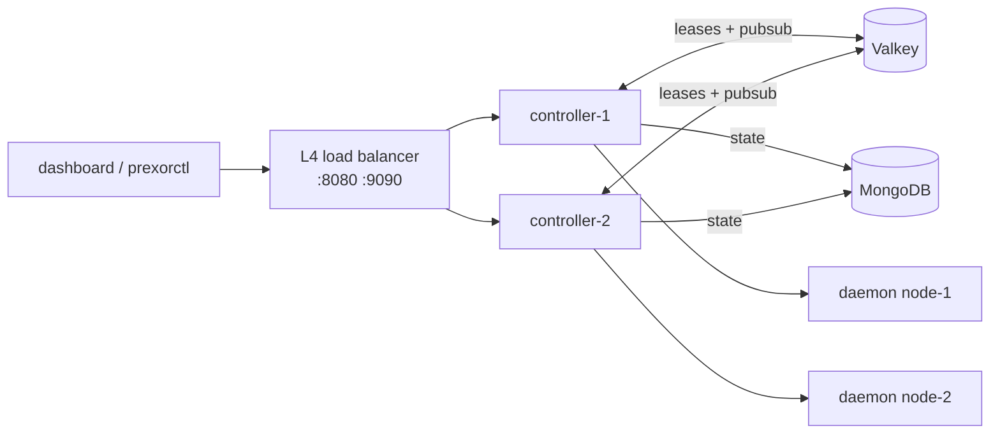

PrexorCloud HA is **active-active with lease-scoped work**. Multiple
controllers run simultaneously against the same MongoDB and Valkey;
any healthy controller serves REST and gRPC. Mutating work is
serialised through Valkey leases with monotonic fencing tokens — there
is no single primary waiting for failover. This guide adds a second
controller to a single-controller install, validates the failover, and
covers operator-facing HA semantics.

## What you'll build



Two controllers, one Valkey, one Mongo, lease-scoped writes, ~15-second
failover with no manual intervention.

## Prerequisites

- PrexorCloud v1.0+ controller already running (single-node) on
  `controller-1`.
- A shared MongoDB (replica set recommended) reachable from both
  controller hosts.
- A shared Valkey (or Redis-protocol-compatible) reachable from both
  controller hosts. Valkey ships with the project's Compose stack.
- Reasonably synchronised clocks across controllers (NTP). Fencing
  protects against split-brain writes; clock skew only affects lease
  expiry timing.
- An L4 load balancer (HAProxy, nginx-stream, AWS NLB, Cloudflare
  Spectrum) in front of `:8080` (REST) and `:9090` (gRPC). Round-robin
  is fine.

## 1. Confirm the existing controller runs in `production` profile

HA requires the production wiring graph (`RedisRuntimeServices`).
Check `/etc/prexorcloud/controller.yml`:

```yaml
runtime:
  profile: production
redis:
  uri: "redis://valkey.internal:6379"
mongo:
  uri: "mongodb://mongo-rs/prexorcloud?replicaSet=rs0"
```

`ConfigValidator` rejects a `production` config without a configured
coordination store. If yours says `profile: development`, switch to
`production` and restart the controller before continuing.

## 2. Add the second controller

On the new host (`controller-2`), point the installer at the existing
Mongo and Valkey and skip bootstrapping:

```bash
sudo prexorctl setup \
    --component controller \
    --controller-mongo-uri "mongodb://mongo-rs/prexorcloud?replicaSet=rs0" \
    --controller-redis-uri "redis://valkey.internal:6379" \
    --bootstrap=false \
    --non-interactive
```

`--bootstrap=false` skips admin-user creation (the existing controller
already has one) and skips CA generation (the new controller reads the
existing CA from Mongo). Within ~15 seconds:

```bash
prexorctl status
# CONTROLLERS
#   controller-1   READY   leases=4
#   controller-2   READY   leases=2
```

Both controllers compete for leases; mutating work distributes
automatically. Reads serve from any.

## 3. Put the load balancer in front

Example HAProxy snippet:

```
frontend prexor-rest
    bind :8080
    default_backend prexor-rest-be

backend prexor-rest-be
    option httpchk GET /api/v1/system/ready
    server c1 controller-1.internal:8080 check inter 5s fall 2 rise 2
    server c2 controller-2.internal:8080 check inter 5s fall 2 rise 2

frontend prexor-grpc
    bind :9090
    mode tcp
    default_backend prexor-grpc-be

backend prexor-grpc-be
    mode tcp
    balance roundrobin
    server c1 controller-1.internal:9090 check
    server c2 controller-2.internal:9090 check
```

`/api/v1/system/ready` is the single liveness endpoint — it returns
200 only when both `coordination.store=available` and
`state.store=available`.

Point `prexorctl` at the load balancer:

```bash
prexorctl config set controller "https://prexor.example.com:8080"
prexorctl status     # should still show two controllers
```

Daemons keep their existing certs and reconnect through the LB to
whichever controller serves them; node ownership is tracked via
`prexor:v1:node:<id>:owner` keys.

## 4. Validate failover

Stop one controller and watch the survivor pick up the leases:

```bash
# On controller-1:
sudo systemctl stop prexorcloud-controller

# On any host that can reach controller-2:
prexorctl --controller https://controller-2:8080 status
# CONTROLLERS
#   controller-2   READY   leases=6     ← absorbed all leases
```

Within `lease.timeoutSeconds` (default 15s) the survivor reconciles
live node sessions, persisted workflows, and runtime records before
issuing additional mutations. The harness verifies this at four points
in `RecoveryTest`: drain, deployment, placement-time, and in-flight
module mutation.

Restart `controller-1`:

```bash
sudo systemctl start prexorcloud-controller
prexorctl status
# CONTROLLERS
#   controller-1   READY   leases=2     ← reacquires its share
#   controller-2   READY   leases=4
```

## How to verify it works

The four signals you want green at all times:

- **Both `/api/v1/system/ready` return 200.** LB health-checks
  catch this immediately.
- **`prexorctl status` lists every expected controller in `READY`.**
- **`prexorcloud.lease.acquired.total` (Prometheus, per controller) is
  monotonically increasing.** Long flat lines mean a controller stopped
  doing mutating work.
- **`prexorcloud.fencing.token.rejected.total` is zero or near-zero.**
  Bursts mean clock skew or a stuck-process fencing fight; investigate.

The nightly perf-baseline job (`.github/workflows/nightly.yml`)
exercises a multi-controller path; drift comparator alerts on
regression.

## What HA gives you over a single controller

| Feature | Single | HA |
|---|---|---|
| Write availability through one controller dying | no | yes (~15s) |
| SSE replay across controller restart | depends on profile | yes (Valkey-buffered) |
| Module mutation handoff during restart | no | yes |
| Workflow handoff (drain, deploy, healing) | no | yes |
| Persisted REST + workload rate-limit windows | yes (production) | yes |
| Cluster event fanout (Redis pub/sub) | local only | pub/sub fanout |

## Common pitfalls

| Symptom | Likely cause |
|---|---|
| Both controllers stop accepting writes after add | Pointed at same Mongo, different Valkey instances. Confirm `redis.uri` matches on both. |
| Operations on group X hang for >60s | Stuck lease. `redis-cli -u $REDIS_URI GET prexor:v1:lease:group:X` to inspect; `DEL` to force-release if needed (fencing token rejects stale writes). |
| `prexorcloud.fencing.token.rejected` spikes | Clock skew between controllers. NTP-sync; the fencing token math itself is safe. |
| Daemons flap between controllers | Node-ownership records timing out due to network blips. Increase `node.ownership.ttlSeconds`. |
| Restore is racing with HA | `prexorctl restore` does not currently grab all mutation leases. Stop every controller before restoring. |

## Where to go next

- [Concepts → Architecture](/concepts/architecture/) §"HA model" —
  why active-active rather than primary/standby.
- [Guides → Backup + Restore](/guides/backup-and-restore/) — special
  HA care during restores.
- [Operations → Monitoring](/operations/monitoring/) — Prometheus
  alerts specific to HA (lease churn, fencing rejects).
- [Operations → HA Setup](/operations/ha-setup/) — operator runbook
  with the full failure-mode catalog.
