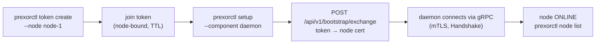

One Controller can drive many Daemon nodes. Each node runs the Daemon
agent, connects to the Controller over gRPC, and hosts Instances the
scheduler places on it. This guide takes a working single-node install and
adds two more Daemon nodes: you issue a join token per node, run the
installer, label the nodes by region, and configure a Group so its
Instances spread across them.

This guide covers **Daemon nodes** (the per-node agents that run
Instances). It does not cover running multiple **Controllers** for
control-plane high availability — that is a separate Raft cluster managed
by `prexorctl cluster`. See [HA controller](/guides/ha-controller/).

## Before you start

- A PrexorCloud Controller already running and reachable from each new
  Daemon host on its **gRPC port** (default `9090`) and its **HTTP port**
  (default `8080`). The HTTP port is used once per node to redeem the join
  token.
- One Linux host per new Daemon, with systemd and outbound network to the
  Controller. The installer downloads a managed Temurin JRE, so Java need
  not be preinstalled.
- `prexorctl` logged in to the Controller with an admin token
  ([Quickstart](/getting-started/quickstart/)). The `token create`,
  `node`, and `group` commands all require authentication.

## How a node joins



A join token is **bound to one node ID** and has a TTL. The Daemon
installer trades the token for a per-node mTLS certificate at
`POST /api/v1/bootstrap/exchange`, writes the cert locally, then connects
over gRPC. From that point the Daemon authenticates with its certificate;
the token is single-use and not needed again.

## 1. Issue a join token

Create one token per node. The `--node` flag is required — it pins the
token to a node ID, and that becomes the node's identity in the cluster.

```bash
prexorctl token create --node node-1 --ttl 1h
```

```text
Join Token Created
  Token ID    tok_a1b2c3d4
  Join Token  pxt_9f8e7d6c5b4a3f2e1d0c…
  Node ID     node-1
  Expires At  2026-06-07T15:04:05Z
```

The `pxt_…` join token is shown once. Copy it now.

### `token create` flags

| Flag | Default | Notes |
|---|---|---|
| `--node` | — | **Required.** Node ID the token is bound to. |
| `--ttl` | `1h` | Time-to-live. Accepts `30m`, `1h`, `24h`, `7d` (`s`/`m`/`h`/`d`). Unparseable values fall back to `1h`. |

The Controller rejects a token request with `409 CONFLICT` if the node ID
is already connected, already registered (known but offline), or already
has an outstanding token. Pick a fresh node ID, or revoke the existing
token first.

Manage outstanding tokens:

```bash
prexorctl token list
prexorctl token revoke tok_a1b2c3d4
```

`token list` columns: `TOKEN ID`, `NODE`, `EXPIRES AT`, `STATUS`.

## 2. Install the Daemon on each host

SSH into the new host and run the installer as root. The Daemon installer
needs root for the managed JRE and the systemd unit.

```bash
sudo prexorctl setup \
  --component daemon \
  --install-mode native \
  --non-interactive \
  --daemon-node-id node-1 \
  --daemon-controller-host controller.example.com \
  --daemon-controller-grpc-port 9090 \
  --daemon-controller-http-port 8080 \
  --daemon-join-token pxt_9f8e7d6c5b4a3f2e1d0c…
```

`--daemon-node-id` must match the `--node` you passed to `token create`.
In `--non-interactive` mode, the installer errors out if the node ID,
controller host, or join token is empty.

What the installer does:

1. Verifies Java (downloads managed Temurin if missing).
2. Downloads and cosign-verifies `PrexorCloudDaemon.jar` into
   `/opt/prexorcloud/daemon`.
3. Writes `/opt/prexorcloud/daemon/config/daemon.yml`.
4. Redeems the join token at
   `http://<controller-host>:8080/api/v1/bootstrap/exchange` and writes the
   node certificate, password, and CA bundle to
   `/opt/prexorcloud/daemon/config/security/`:
   - `node.p12` — the per-node PKCS#12 keystore (mode `0600`)
   - `.node-password` — its password (mode `0600`)
   - `ca.pem` — the Controller CA bundle (mode `0644`)
5. Installs and starts the `prexorcloud-daemon` systemd unit.
6. Links your CLI on this host to the Controller using a `DAEMON_HOST` JWT
   returned by the exchange — a CLI context named after the node ID — so
   you can run `prexorctl node list` from the Daemon host without a
   separate login.

If REST redemption fails (for example the HTTP port is firewalled), the
installer prints a warning and the Daemon retries the exchange over gRPC on
first start. The cert files end up in the same place either way; the Daemon
skips its own bootstrap if the certs already exist.

### Installer flags (Daemon)

| Flag | Default | Notes |
|---|---|---|
| `--component` | — | `daemon` for a Daemon node. |
| `--install-mode` | — | `native` (systemd) or `compose` (Docker). |
| `--non-interactive` | `false` | Skip prompts; drive entirely from flags. |
| `--daemon-node-id` | hostname | Node ID; must match the join token. |
| `--daemon-controller-host` | — | Controller IP or hostname. Required (non-interactive). |
| `--daemon-controller-grpc-port` | `9090` | Controller gRPC port. |
| `--daemon-controller-http-port` | `8080` | Controller HTTP port, for token redemption. |
| `--daemon-join-token` | — | The `pxt_…` token. Required (non-interactive). |
| `--daemon-install-dir` | `/opt/prexorcloud/daemon` | Install directory. |

### Verify the node connected

```bash
prexorctl node list
```

```text
ID       STATUS   CPU   MEMORY        INSTANCES   CONNECTED SINCE
node-1   ONLINE   3%    512/4096 MB   0           2026-06-07T15:05Z
```

A node appears in `node list` in one of three forms:

| Form | When | Status shown |
|---|---|---|
| Connected | Daemon has an active gRPC session | `ONLINE`, `DRAINING`, `CORDONED`, or `UNREACHABLE` |
| Disconnected | Known node, no current session | `OFFLINE` |
| Pending | A join token exists but no Daemon has connected yet | `PENDING` |

Filter by status with `prexorctl node list --state ONLINE`.

Repeat steps 1–2 for `node-2` and `node-3` with their own tokens and node
IDs.

## 3. Label nodes by region

Labels are key/value tags on a node. The scheduler uses them for placement:
`nodeAffinity`/`nodeAntiAffinity` filter which nodes a Group may land on,
and `spreadConstraint` spreads a Group's Instances across distinct label
values.

Labels are declared on the **Daemon side**, in `daemon.yml`, and travel to
the Controller in the gRPC handshake. Edit the file on each node:

```yaml
# /opt/prexorcloud/daemon/config/daemon.yml on node-1
labels:
  region: eu-west-1a
  tier: standard
```

Restart the Daemon to send the new labels:

```bash
sudo systemctl restart prexorcloud-daemon
```

Set `region: eu-west-1b` on `node-2` and `region: eu-west-1c` on `node-3`.
Confirm the labels reached the Controller:

```bash
prexorctl node info node-1
```

`node info` prints the node's status, resources, and any running
Instances. The labels are visible in the JSON form:

```bash
prexorctl node info node-1 --json | grep -A3 labels
```

### `daemon.yml` reference

The installer writes a full `daemon.yml`. Keys relevant to multi-node
operation, with their defaults:

| Key | Default | Notes |
|---|---|---|
| `nodeId` | `node-1` | Node identity. Set by the installer to your node ID. |
| `advertiseAddress` | `""` | Routable IP/hostname other components reach this node at. Empty = auto-detect from the gRPC peer address. |
| `controller.host` | `127.0.0.1` | Controller host. |
| `controller.grpcPort` | `9090` | Controller gRPC port. |
| `security.certificateDir` | `config/security` | Where the node cert, password, and CA live. |
| `security.joinToken` | `""` | Join token; consumed on first bootstrap, then unused. |
| `labels` | `{}` | Operator-defined key/value labels for scheduling. |
| `reconnect.initialDelayMs` | `1000` | First reconnect backoff after a lost session. |
| `reconnect.maxDelayMs` | `60000` | Reconnect backoff ceiling. |
| `reconnect.multiplier` | `2.0` | Backoff growth factor. |
| `resources.maxMemoryMb` | `0` | Memory ceiling the scheduler may allocate; `0` = use detected total. |
| `instances.directory` | `instances` | Per-Instance working directories. |
| `instances.shutdownTimeoutSeconds` | `30` | Graceful stop before kill. |
| `instances.killTimeoutSeconds` | `10` | Force-kill grace after the stop timeout. |

Set `advertiseAddress` explicitly when the node sits behind NAT or has
multiple interfaces and the auto-detected gRPC peer address is not the one
proxies and players should reach.

## 4. Spread a Group across nodes

Placement is configured on the Group, not the node. The three relevant
Group fields are flat top-level keys:

| Field | Type | Effect |
|---|---|---|
| `nodeAffinity` | list of strings | **Hard filter.** Every constraint must match for a node to be eligible. |
| `nodeAntiAffinity` | list of strings | **Hard filter.** A node is excluded if any constraint matches. |
| `spreadConstraint` | single string | **Soft preference.** A label key; the scheduler prefers nodes whose value of that key holds fewer of this Group's Instances. |

A constraint string is `key=value` for an exact label match, or a bare
`key` for a presence check. So `tier=standard` requires the label
`tier=standard`; `gpu` requires only that the node carries a `gpu` label
with any value.

`spreadConstraint` takes a single **label key** (for example `region`), not
a `key=value` pair. It contributes 15% of the node score, biasing
placement toward the least-loaded region bucket for this Group. It is a
preference, not a cap — under capacity pressure the scheduler will still
co-locate Instances rather than fail to place them. Nodes missing the
spread label are not penalised.

### Apply placement

The placement fields are set through the Controller REST API (the
`prexorctl group create`/`update` flags do not cover them). Apply them to a
new or existing Group:

```bash
# new Group with placement
curl -sS -X POST https://controller.example.com:8080/api/v1/groups \
  -H "Authorization: Bearer $PREXOR_TOKEN" \
  -H "Content-Type: application/json" \
  -d '{
    "name": "lobby",
    "platform": "PAPER",
    "platformVersion": "1.21.4",
    "jarFile": "server.jar",
    "scalingMode": "STATIC",
    "minInstances": 3,
    "maxInstances": 3,
    "memoryMb": 1024,
    "portRangeStart": 30000,
    "portRangeEnd": 30100,
    "nodeAffinity": ["tier=standard"],
    "spreadConstraint": "region"
  }'
```

This `lobby` Group runs three Static Instances (`scalingMode: STATIC`),
only on `tier=standard` nodes, spread across distinct `region` values — one
per zone when each node sits in a different region. Valid `scalingMode`
values are `STATIC`, `DYNAMIC`, and `MANUAL`.

Confirm the placement:

```bash
prexorctl instance list --group lobby
```

```text
ID        NODE     STATE     PORT
lobby-1   node-1   RUNNING   30000
lobby-2   node-2   RUNNING   30000
lobby-3   node-3   RUNNING   30000
```

### How the scheduler picks a node

The `WeightedNodeSelector` first filters to **eligible** nodes — `ONLINE`,
with enough free memory, a free port in the Group's range, and matching
affinity/anti-affinity. Among the eligible nodes it scores each:

| Weight | Factor |
|---|---|
| 35% | Free memory ratio |
| 25% | CPU availability (`1 − cpuUsage`) |
| 15% | Instance spread (fewer existing Instances scores higher) |
| 10% | Free ports in the Group's range |
| 15% | Group spread across the `spreadConstraint` label bucket |

The highest score wins. A `DRAINING`, `CORDONED`, or `UNREACHABLE` node is
not eligible, so new Instances never land on a node you are taking out of
service. See
[Scheduling and scaling](/concepts/scheduling-and-scaling/) for the full
model.

## Verify the cluster holds together

Drain a node and watch its Instances reschedule onto nodes that fit.

```bash
prexorctl node drain node-1
```

```text
✓ Node node-1 set to DRAINING
```

`node drain` marks the node `DRAINING` and asks it to shut down its
Instances; the scheduler stops placing new work there and reschedules
displaced Instances onto eligible nodes. Confirm the move:

```bash
prexorctl node info node-1     # status DRAINING, instances draining off
prexorctl instance list --group lobby
```

Bring the node back into rotation:

```bash
prexorctl node undrain node-1
```

```text
✓ Node node-1 set to ONLINE
```

### Node lifecycle commands

| Command | Status it sets | Use |
|---|---|---|
| `prexorctl node drain <id>` | `DRAINING` | Maintenance: stop Instances and reschedule them. |
| `prexorctl node undrain <id>` | `ONLINE` | Return a drained node to service. |
| `prexorctl node list [--state S]` | — | List nodes, optionally filtered by status. |
| `prexorctl node info <id>` | — | Status, resources, running Instances. |

Three further operations are available over REST but not as dedicated CLI
verbs:

- **Cordon** (`POST /api/v1/nodes/{id}/cordon`) marks a node `CORDONED`:
  no new schedules, but existing Instances stay. Useful for soak-testing a
  node before draining it. Reverse with `.../uncordon`.
- **Drain options.** The REST drain endpoint accepts query params
  `shutdown` (default `true`), `timeout` (seconds, default `60`), and
  `kickMessage`. The `prexorctl node drain` command uses the defaults; call
  the endpoint directly to override them.
- **Delete** (`DELETE /api/v1/nodes/{id}`) unregisters a disconnected
  node. It returns `409 CONFLICT` for a node that is currently connected —
  drain and stop the Daemon first.

## Where to go next

- [HA controller](/guides/ha-controller/) — run multiple Controllers
  behind a Raft cluster, the control-plane counterpart to multiple
  Daemons.
- [Scheduling and scaling](/concepts/scheduling-and-scaling/) — the
  full weight model and scaling modes.
- [Custom scaling rules](/guides/custom-scaling-rules/) — tune how Groups
  grow and shrink across the nodes you just added.
- [Upgrading](/operations/upgrading/) — drain semantics during rolling
  node maintenance.
