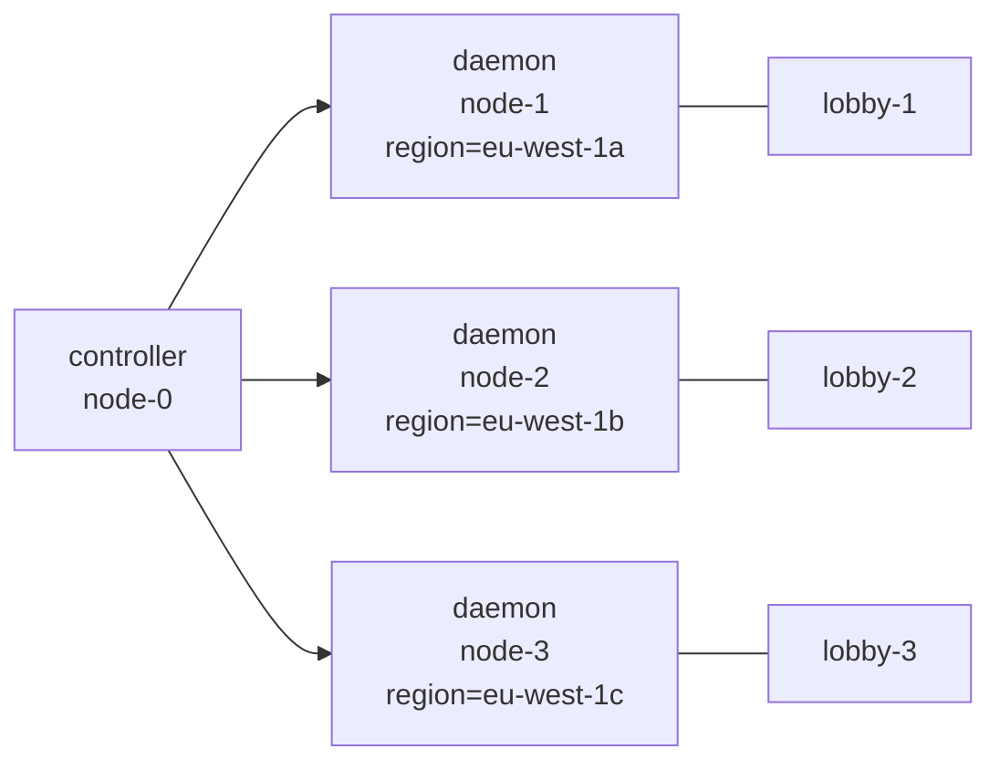

A single daemon is fine for a homelab. The moment you care about player
uptime through a kernel update, you want at least three. This guide adds
two more daemon nodes to a working install, labels them by region, and
configures a group so its instances spread across nodes — no two replicas
on the same host.

## What you'll build



A controller plus three daemons across three availability zones. The
`lobby` group keeps three replicas — one per node — through reboots,
upgrades, and zone outages.

## Prerequisites

- PrexorCloud v1.0+ controller already running on `node-0` and reachable
  on `:9090` (gRPC) from each daemon host.
- Three Linux hosts (Debian 12 / Ubuntu 22.04 / Rocky 9 supported) with
  systemd, ≥4 GiB RAM, and Java 21+ installed.
- `prexorctl` v1.0+ on your laptop, logged in
  ([Quickstart](/getting-started/quickstart/)).

## 1. Issue a join token

A node-join token is a short-lived bearer that the daemon installer
exchanges for a per-daemon mTLS certificate. One token per node is fine;
TTL of an hour is plenty.

```bash
prexorctl token create --description "node-1" --ttl 1h
# -> Token: prxn_xxxxxxxxxxxxxxxx
```

Copy the `prxn_…` value. It is shown once.

## 2. Install the daemon on each host

SSH into the new daemon host and run the installer in non-interactive
mode:

```bash
sudo prexorctl setup \
    --component daemon \
    --controller-grpc node-0.example.com:9090 \
    --join-token prxn_xxxxxxxxxxxxxxxx \
    --non-interactive
```

`prexorctl setup` downloads the daemon archive, writes
`/etc/prexorcloud/daemon.yml`, exchanges the join token for a per-daemon
mTLS cert under `/etc/prexorcloud/data/certs/`, installs the systemd unit,
and starts `prexorcloud-daemon.service`. Within ~10 seconds:

```bash
prexorctl node list
# NODE     STATE   LABELS  RUNNING
# node-1   READY   {}      0
```

Repeat steps 1–2 for `node-2` and `node-3` with fresh tokens.

## 3. Label nodes by region

Labels drive scheduler placement decisions: `placement.nodeSelector`
filters which nodes a group can land on, and `placement.spreadConstraint`
spreads instances across distinct values of a given label.

Labels are declared on the daemon side, in `/etc/prexorcloud/daemon.yml`:

```yaml
# /etc/prexorcloud/daemon.yml on node-1
labels:
  region: eu-west-1a
  zone: a
  tier: standard
```

Restart the daemon to pick the labels up:

```bash
sudo systemctl restart prexorcloud-daemon
```

Repeat with `region: eu-west-1b` for `node-2` and `eu-west-1c` for
`node-3`. Confirm:

```bash
prexorctl node list
# NODE     STATE   LABELS                                         RUNNING
# node-1   READY   region=eu-west-1a,zone=a,tier=standard         0
# node-2   READY   region=eu-west-1b,zone=b,tier=standard         0
# node-3   READY   region=eu-west-1c,zone=c,tier=standard         0
```

## 4. Spread a group across nodes with anti-affinity

Apply a group config that requires every replica to land on a distinct
`region`:

```yaml
# lobby.yml
name: lobby
platform: paper
version: "1.21.4"
scaling: { mode: STATIC, min: 3, max: 3 }
ports: { from: 25600, to: 25699 }
resources: { memoryMB: 1024 }
placement:
  nodeSelector:
    tier: standard           # only nodes labelled tier=standard
  spreadConstraint:
    topologyKey: region      # at most one instance per distinct region
    maxSkew: 1
```

```bash
prexorctl group apply -f lobby.yml
prexorctl instance list --group lobby
# lobby-1   node-1   RUNNING
# lobby-2   node-2   RUNNING
# lobby-3   node-3   RUNNING
```

The `WeightedNodeSelector` evaluates capacity (free memory, free port
slots), affinity, anti-affinity, and existing-instance spread; ties go to
the node with the most headroom. See
[Concepts: Scheduling and Scaling](/concepts/scheduling-and-scaling/) for
the full weight breakdown.

## How to verify it works

Force a rebalance by draining `node-1` and watching `lobby-1` reschedule
onto a node that doesn't already host a `lobby` instance:

```bash
prexorctl node drain node-1 --shutdown=false --timeout 5m
prexorctl events follow --filter instance | head
# INSTANCE_STOPPING  lobby-1  node-1  drain
# INSTANCE_SCHEDULED lobby-1  node-2  ← rescheduled
```

Once the drain completes, `prexorctl node info node-1` shows
`runningInstances: 0`. Restore with `prexorctl node undrain node-1`.

## Where to go next

- [Guides → HA Controller (Redis)](/guides/ha-controller/) — pair this
  multi-daemon setup with multiple controllers.
- [Recipes → Multi-Game Network](/recipes/multi-game-network/) — full
  3-node lobby + game-mode topology.
- [Operations → Monitoring](/operations/monitoring/) — what to alert on
  per node.
- [Runbooks → Drain a Node](/operations/upgrading/) — drain semantics
  during maintenance.
