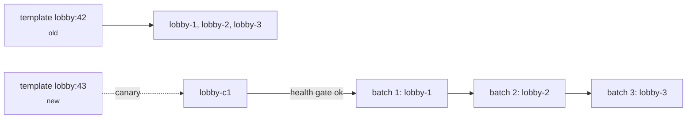

A deployment is what PrexorCloud does when something about a group
changes — the template hash, the runtime jar, an env var, a workload
extension from a module. The default rollout strategy moves players off
each instance, replaces it, waits for the new instance to report
healthy, and only then moves to the next one. This guide walks one
through end-to-end on a working `lobby` group.

## What you'll build



A canary instance, then batches of one, with a 60-second health gate
between batches. Auto-rollback if the canary or any batch fails.

## Prerequisites

- PrexorCloud v1.0+ controller and at least one daemon.
- A running group with two or more instances (`prexorctl group list`
  shows it).
- A template change ready to push (a tweak to `paper-global.yml`,
  a plugin update, anything inside the template chain).

## 1. Push the template change

Templates are layered tarballs the daemon materialises into the instance
directory. Edit yours locally, push the new version with
`prexorctl template push`:

```bash
# 1. Edit. Anything under templates/lobby/ is fair game.
$EDITOR templates/lobby/paper-global.yml

# 2. Push.
prexorctl template push templates/lobby/
# -> Pushed lobby v43 (sha256:abcd…)
```

`prexorctl template push` uploads the tarball, deduplicates by content
hash, and bumps the template's logical version. Existing instances keep
serving the previous version (`v42`); the new version is stored in
Mongo but not yet rolled out.

To confirm:

```bash
prexorctl template versions lobby
# v43  2026-05-10T12:00:00Z  current=false
# v42  2026-05-09T08:00:00Z  current=true
```

## 2. Trigger the rollout

Run `prexorctl deploy <group>` to roll the new template across the
group's instances:

```bash
prexorctl deploy lobby \
    --strategy rolling \
    --canary-instances 1 \
    --batch-size 1 \
    --health-gate \
    --min-healthy 60 \
    --auto-rollback
# -> Deployment dep-2026-05-10-001 created (rev 43)
```

Flag by flag:

| Flag | Meaning |
|---|---|
| `--strategy rolling` | Use the rolling strategy (vs `recreate`). |
| `--canary-instances 1` | Spawn one extra instance on the new revision before touching existing ones. |
| `--batch-size 1` | Replace one running instance per batch. |
| `--health-gate` | Block batch promotion until the canary reports healthy. |
| `--min-healthy 60` | New instance must stay healthy for ≥60s before advancing. |
| `--auto-rollback` | On failure, restore the previous revision automatically. |

Defaults come from the group's `updateStrategy` block; flags override
per-deploy. If you omit them all, you get the group's defaults.

## 3. Watch the rollout

The CLI streams progress live:

```bash
prexorctl deploy show lobby 43 --watch
```

Or via SSE:

```bash
prexorctl events follow --filter deployment
# DEPLOYMENT_CREATED      lobby  rev 43
# CANARY_STARTING         lobby  lobby-c1
# CANARY_HEALTHY          lobby  lobby-c1   uptime 62s
# BATCH_STARTING          lobby  batch=1 instances=[lobby-1]
# INSTANCE_TRANSFERRING   lobby-1 → lobby-c1
# INSTANCE_STOPPED        lobby-1
# INSTANCE_RUNNING        lobby-1   rev=43
# BATCH_HEALTHY           lobby  batch=1
# … (repeats per batch)
# DEPLOYMENT_COMPLETED    lobby  rev 43
```

Players are migrated to a healthy peer before each instance is
replaced. For a lobby group fronted by a Velocity proxy, the proxy
plugin sees the target instance enter `STOPPING` and walks the
[Network Composition](/concepts/groups-instances-templates/) fallback
chain to redirect the player.

## 4. Verify the new revision

```bash
prexorctl group info lobby
# CURRENT REVISION   43
# DESIRED REVISION   43
# INSTANCES          3 RUNNING (all on rev 43)
```

`currentRevision == desiredRevision` and `revisionDrift = 0` means
every instance now runs the new template.

## How to verify it works

Force a failure to confirm auto-rollback. Push a deliberately bad
template (e.g. a `paper-global.yml` with a syntax error), deploy it,
and watch:

```bash
prexorctl deploy lobby --strategy rolling --canary-instances 1 --auto-rollback
# DEPLOYMENT_CREATED  lobby  rev 44
# CANARY_STARTING     lobby  lobby-c1
# CANARY_FAILED       lobby  lobby-c1   exit=1 reason=startup-error
# DEPLOYMENT_ROLLBACK lobby  rev 44 → rev 43
# DEPLOYMENT_FAILED   lobby  rev 44   reason=canary-unhealthy
```

The bad revision never touches a running instance. Players see no
disruption.

## Common pitfalls

| Symptom | Likely cause |
|---|---|
| `deploy` rejected with `revision already current` | Template content didn't change. Edit something or bump the version manually. |
| Canary stays in `STARTING` forever | Cloud-plugin can't reach the controller from the new instance. Check the controller URL in the template's plugin config. |
| Auto-rollback triggers on the first batch | `--min-healthy` too short for your boot time. Increase it; Paper cold starts can take 30–90s. |
| Players see "kicked" rather than transfer | Group is not behind a Velocity/Bungee proxy with Network Composition. See [Recipes → Reverse Proxy](/recipes/reverse-proxy/). |

## Where to go next

- [Concepts → Deployments](/concepts/deployments/) — deployment FSM,
  plan-hash semantics, what happens during a controller restart
  mid-roll.
- [Recipes → CI/CD Deployments](/recipes/cicd-deployments/) — drive
  `prexorctl deploy` from GitHub Actions.
- [Guides → Crash Recovery](/guides/crash-recovery/) — what happens
  when the new revision crash-loops post-deploy.
