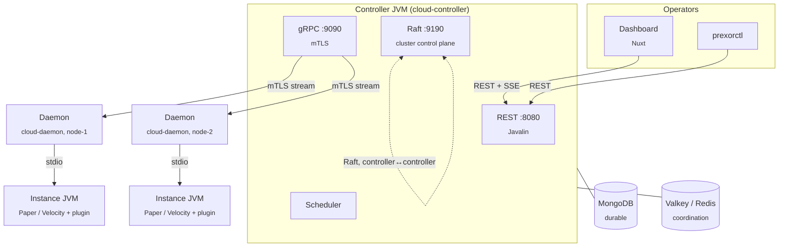

This page is for contributors hacking on PrexorCloud itself. It maps the
system to the source tree: which JVM each piece runs in, where the
scheduling loop lives, how the two lease tiers divide the work, and what
the embedded Raft control plane actually holds. For the read-once mental
model, start at the [Architecture concept](/concepts/architecture/); for
the state catalogue, see [Storage schema](/internals/storage-schema/).
This page does not repeat either — it points at the code.

## What you'll learn

- The processes and the Gradle modules that compile into each one.
- How the controller is wired at boot, with no DI framework.
- What runs on every scheduler tick, and in what order.
- The two lease tiers — Redis for per-group work, Raft for
  cluster-singletons — and which one gates what.
- What the embedded Raft control plane replicates, and how leadership works.
- The gRPC and extension surfaces, and where each is defined.

## Process topology

Three processes plus backing stores. The controller decides, the Daemon
applies, the Plugin reports.

- **Controller** — one JVM (`cloud-controller`). Owns authoritative state,
  the REST and gRPC servers, the scheduler, the module manager, and the
  embedded Raft control plane. Several controllers run active-active
  against shared MongoDB and Redis.
- **Daemon** — one per host (`cloud-daemon`). Connects out to the
  controller over an mTLS gRPC stream, applies the controller's
  `CompositionPlan`, and reports back. It never invents state.
- **Plugin** — ships inside each Minecraft server or proxy JVM
  (`cloud-plugins/{server,proxy}`). Reports player join/transfer/quit and
  drives proxy-side [Network](/concepts/groups-instances-templates/) routing.

The CLI (`prexorctl`, Go, under `cli/`) and the dashboard (Nuxt, under
`dashboard/`) are not cluster processes — both talk to the same REST API.

## The Gradle module map

The Java build is one multi-project Gradle layout. Knowing which module a
class lives in tells you which JVM runs it and what it may depend on.

| Module | Runs in | Owns |
|---|---|---|
| `cloud-api` | — (compiled against by modules/plugins) | Public types: `PlatformModule`, `DaemonModule`, `ModuleContext`, `CapabilityHandle<T>`, Minecraft-domain records. Java 21 release target. |
| `cloud-protocol` | Controller + Daemon | Generated gRPC/protobuf types and `ProtocolConstants`. |
| `cloud-security` | Controller | JWT, certificate authority, mTLS context, Argon2 hashing, cosign/Rekor verification. |
| `cloud-common` | Controller + Daemon | YAML config loader, logging setup, shared HTTP client and `ObjectMapper` factories. |
| `cloud-modules/runtime` | Controller | Host-agnostic module runtime: lifecycle FSM, capability registry, route registry, manifest parser. |
| `cloud-controller` | Controller JVM | REST, gRPC server, scheduler, persistence, Raft control plane. |
| `cloud-daemon` | Daemon JVM | Process supervision, template materialization, plan application. |
| `cloud-plugins/{server,proxy}/*` | Instance JVM | Paper/Spigot/Folia/Fabric/NeoForge and Velocity/BungeeCord/Geyser integrations. |
| `cloud-test-harness` | test JVM | Multi-controller integration tests (recovery, HA, DR, perf). |

Platform modules link to each other through capability handles, never
through shared internal types. See [Tech stack](/internals/tech-stack/)
for the language and version each module targets.

## Inside the controller

The controller is a single JVM with cooperating subsystems — no service
mesh, no message broker, no microservice split.

### Bootstrap wiring

Construction lives in `PrexorCloudBootstrap.start()`. Everything is
constructor-injected through grouped service records (`CoreServices`,
`SecurityServices`, `AuthServices`, `TemplateServices`, `NetworkServices`,
and so on) assembled into one `PrexorController` registry. There is no
annotation-based DI and no reflective component discovery: boot order is
auditable, missing wiring is a compile error, and the only thing that runs
at startup is what the bootstrap explicitly constructs.

The boot sequence, in order:

1. `initStorage()` — connect MongoDB, open collections, run the
   v1.0→v1.1 cluster-identity migration.
2. Start the cluster control plane (Day-0 bootstrap, restart, or join via
   a `pending-join-token` file).
3. `initRuntimeServices()` — `RedisRuntimeServices` when `redis.uri` is
   set, `InMemoryRuntimeServices` otherwise.
4. `initCore` → `initSecurity` → `initAuth` → `initTemplates` →
   `initCrashDetection` → `initNetworks` → `initModuleManagers` →
   `initObservability`.
5. Build `PrexorController`, boot platform modules, wire the Redis event
   bridge, then start the scheduler, gRPC server, and REST server.
6. Register shutdown hooks, drained in registration order on SIGTERM.

### The two network surfaces

The controller exposes exactly two listeners, and they never overlap.

| Surface | Default | Auth | For |
|---|---|---|---|
| REST + SSE (Javalin) | `:8080` | JWT bearer | Dashboard, `prexorctl`, automation. Generated from the route handlers under `controller/rest`. |
| gRPC (`GrpcServer`) | `:9090` | mTLS | Daemons and joining controllers. Four services, every call through `MtlsEnforcementInterceptor` then `SubnetGuardInterceptor`. |

Port and timing defaults come from the `ControllerConfig` records; the
canonical list is in [Configuration](/operations/configuration/).

## The reconciliation loop

The `Scheduler` runs one single-threaded executor that calls `evaluate()`
every `scheduler.evaluationIntervalSeconds` (default 15). A second task on
the same executor drains the start-retry wakeup queue once per second.

Each `evaluate()` tick, in order:

1. Refresh the `EventChoreographer` (time-window rules).
2. `reconcileRecoverableStarts()` — re-dispatch starts that a daemon never
   acknowledged.
3. `reconcilePersistedStartRetries()` — replay due `workflow_start_retries`.
4. `reconcilePersistedDeployments()` — advance `IN_PROGRESS` deployments.
5. Drain due start-retry wakeups.
6. Plan the group evaluation order, then evaluate.

Step 6 is the core. `SchedulerDesiredStatePlanner.planEvaluationOrder()`
topologically sorts groups by their `dependsOn` edges into tiers. Groups
within a tier are evaluated concurrently with a `StructuredTaskScope` (JEP
505), ordered by `startupWeight`. For each group, `evaluateGroup()` builds
a desired-state plan (place static IDs, add or remove dynamic instances,
honour `scalingMode`, `maintenance`, and crash-loop pauses), then applies
it under a lease. The deeper placement story — node selection, ports,
composition planning — is in [Scheduling and
scaling](/concepts/scheduling-and-scaling/).

## The two lease tiers

Mutation paths are gated by leases. There are two managers, and picking
the wrong one is the common contributor mistake.

| Tier | Manager | Backed by | Use for |
|---|---|---|---|
| Fine-grained | `DistributedLeaseManager` | Redis | Per-group, per-node, per-instance work. Cheap, high-churn — every controller races for `group:<name>` on every tick. |
| Cluster-singleton | `ClusterLeaseManager` | Raft | One-of-N work across the whole cluster: deployment reconciliation, audit pruning. Raft commit latency would dwarf fine-grained work. |

Redis leases carry a monotonic fencing token. Before any write under a
lease, the controller calls `ensureLeaseCurrent()` — if a different
controller took the lease during a GC pause or network blip, the stale
holder aborts instead of issuing a conflicting write. The fencing model
and failover behaviour are detailed in the
[Architecture concept](/concepts/architecture/#active-active-ha-lease-scoped).

`ClusterLeaseManager` wraps the Raft `GrantLease` / `RenewLease` /
`ReleaseLease` entries and surfaces contention as a quiet boolean: its
`runUnderLease(name, ttl, work)` runs `work` only if this controller wins
the grant, and the next tick retries otherwise. The bootstrap wires it for
two singletons — `deployment-reconciler` (5-minute TTL, on the
`Scheduler`) and `audit-pruner` (1-hour TTL). Each holder identifies
itself by the controller's `config.uuid()`, so a lease held by one
controller cannot be renewed by another.

## The cluster control plane

When the controller runs the embedded cluster control plane, an Apache
Ratis Raft group replicates a small typed state machine across
controllers. The pieces:

| Class | Role |
|---|---|
| `RaftBootstrap` | Wraps the Ratis server and client. Exposes `submitRaw()`, `isLeader()` (reads `RoleInfoProto`), membership changes, and snapshots. |
| `ClusterControlPlane` | Typed façade. Writes go through Raft; reads return immutable snapshots of the local projection. Conflict-checked writes throw `ClusterWriteConflict`. |
| `ClusterControlStateMachine` | The replicated projection: cluster identity, versioned config, members, join tokens, leases, and cluster files (the CA cert/key). |

A single-node Raft group is its own leader and every write commits
locally; multi-controller deployments elect a leader (election timeout
150–300 ms) and replicate the log. Reads do not go through Raft — they
return the local sequentially-consistent projection, which is what the
dashboard and the lease checks need.

This tier is separate from Redis on purpose. Redis coordinates per-cycle
mutation; Raft holds the cluster's slowly-changing identity and config,
which must be agreed across controllers rather than merely shared. What
each store holds, and why the split exists, is in
[Storage schema](/internals/storage-schema/).

## Where state lives

Four stores, one home per fact. The full catalogue — every collection,
key family, index, and TTL — is [Storage
schema](/internals/storage-schema/); the short version:

| Store | Holds | Loss means |
|---|---|---|
| MongoDB | Durable record state: groups, templates, deployments, crashes, audit log, composition plans, workflow intents, accounts. | The cluster is gone. |
| Redis / Valkey | Coordination: leases, fencing tokens, runtime snapshots, plugin tokens, revocation, rate limits, SSE replay. | In-flight retries pause; replay window shrinks. |
| Raft control plane | Cluster identity, config versions, members, join tokens, leader leases, cluster CA. | Rebuilt from surviving members. |
| Process memory | Live model: nodes, instances, players, registries, console buffers. | Rebuilt from Mongo plus daemon reconnect. |

The rule that overrides everything: never split one piece of conceptual
state across two stores.

## The gRPC protocol

The daemon-facing contract is four `.proto` services in
`cloud-protocol/src/main/proto/prexorcloud/`. The daemon's
`DaemonService.Connect` is a single bidirectional stream that multiplexes
every control message through a `oneof` envelope — to add a message type
you add a variant, not an RPC. `StartInstance` carries the fully resolved
`CompositionPlan`; the daemon checks `plan_hash` before launch and applies
it without further decisions.

This is an internal cluster contract, not a public API. The full message
catalogue, the compatibility model, and the contract hash that gates
changes are on the [gRPC protocol pages](/internals/protocol/).

## Inside the daemon

One Daemon per host. Its contract is narrow: receive a plan, apply it,
report back. The relevant packages:

- **`daemon.grpc`** — `DaemonGrpcClient` holds the outbound stream;
  `ReconnectManager` re-dials on stream loss; `MessageDispatcher` routes
  inbound `ControllerMessage` variants.
- **`daemon.process`** — `ProcessManager` runs a `ServerProcess` per
  Instance via `ProcessBuilder`, `ConsoleCapture` mirrors stdio,
  `ProcessKiller` stops cleanly, and `InstanceFileReader` /
  `InstanceFileTreeWalker` serve bounded file reads and structure-only
  trees in reply to controller requests.
- **`daemon.template`** — materializes the layered Template chain into the
  Instance directory, reusing artifact and bootstrap caches across
  Instances.

Daemons do not run Instances in containers or cgroups; process isolation
is delegated to the host OS.

## Extension surfaces

Two extension points, distinct from the three core processes:

- **Modules** are controller-side, built against `cloud-api` and the
  `cloud-modules/runtime` lifecycle. They load from Mongo-stored bundles
  into isolated classloaders and reach the platform through
  `CapabilityHandle<T>`. See [Modules](/concepts/modules/) and the
  [module SDK](/reference/module-sdk/).
- **Plugins** run inside the Instance JVM — server plugins for
  Paper/Spigot/Folia/Fabric/NeoForge, proxy plugins for
  Velocity/BungeeCord/Geyser. See [Plugins](/concepts/plugins/).

## Next up

- [Architecture concept](/concepts/architecture/) — the mental model and the HA failover walk-through.
- [Storage schema](/internals/storage-schema/) — every collection, key, and TTL.
- [gRPC protocol](/internals/protocol/) — the four services and the wire contract.
- [Tech stack](/internals/tech-stack/) — languages, libraries, and versions per module.
</content>
</invoke>
