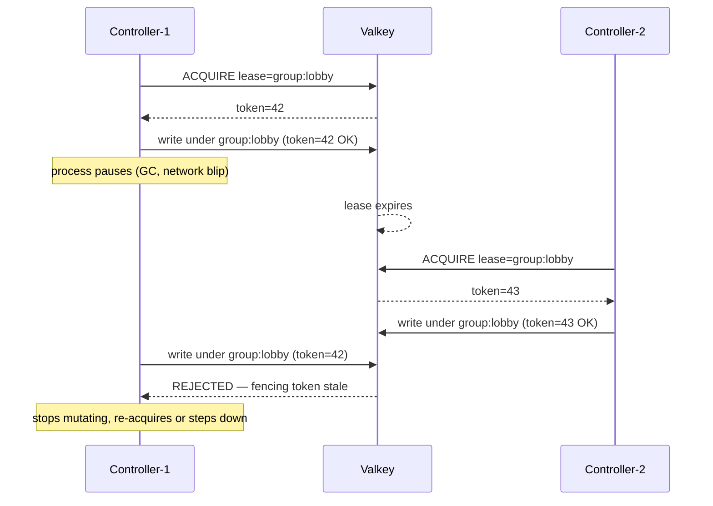

PrexorCloud is three processes plus two backing stores. The
[Concepts](/concepts/architecture/) overview gives you the shape; this page is the
deep-dive — what each process owns, how state is split across three
memory tiers, the active-active HA model that lets controllers be
upgraded without downtime, and the lifecycle of a module classloader
from install to clean unload.

## What you'll learn

- The Java module layout and which JVM each piece runs in
- The three memory tiers (MongoDB / Valkey / process memory) and the
  rule that keeps state from getting torn between them
- The lease + fencing model that makes active-active HA safe
- The SSE event bus, replay model, and ticket-based auth
- How modules load, expose capabilities, and get cleanly unloaded

## 1. Process topology

```
                  ┌────────────────┐
                  │   Dashboard    │  Nuxt 4 + Vue 3
                  └────────┬───────┘
                           │ REST + SSE
            ┌──────────────▼──────────────┐
            │         Controller          │  Java 25, single JVM per instance
            │  REST · gRPC · scheduler    │  active-active HA via Valkey leases
            │  module manager · SSE bus   │
            └────┬───────────────┬────────┘
                 │ gRPC          │
        ┌────────▼─────┐   ┌─────▼──────┐
        │   Daemon     │   │  Daemon    │  one per host
        │ (host node)  │   │ (host node)│  spawns MC processes
        └──────────────┘   └────────────┘
                 ▲               ▲
                 │ stdio + RCON  │
        ┌────────┴─────────┐    │
        │ Minecraft server │ …  │  Paper / Spigot / Velocity / Bungee
        │     processes    │    │  with prexor-plugin embedded
        └──────────────────┘    │

                  ┌──────────────┐    ┌──────────────┐
                  │   MongoDB    │    │    Valkey    │
                  │ durable state│    │ coordination │
                  └──────────────┘    └──────────────┘
```

The whole thing fits on a laptop in development. In production it
scales to thousands of MC instances across dozens of hosts.

## 2. Module layout

The Java codebase is a multi-project Gradle build:

| Module | Process | Role |
|---|---|---|
| `cloud-api` | — | Public types every module compiles against. `PlatformModule`, `CapabilityHandle<T>`, frontend manifest, MC-domain records. |
| `cloud-protocol` | — | Generated gRPC + protobuf types shared between controller and daemon. |
| `cloud-security` | — | JWT, certificate authority, mTLS context, password hashing. No process state. |
| `cloud-common` | — | Shared infrastructure: YAML config loader, logging setup, version detection, file permissions, `HttpClients`, `ObjectMappers`, `Backoff`. |
| `cloud-controller` | controller JVM | REST, gRPC server, scheduler, module lifecycle, SSE bus, all persistence. |
| `cloud-daemon` | daemon JVM | Process supervision, template materialisation, plan application. |
| `cloud-modules/stats-aggregator` | controller JVM (loaded) | First-party reference platform module. |
| `cloud-plugins/server/*` | MC server JVM | Paper / Spigot / Folia plugin code. |
| `cloud-plugins/proxy/*` | proxy JVM | Velocity / Bungee plugin code (Network Composition routing). |
| `cloud-test-harness` | test JVM | Multi-controller integration tests (recovery, HA, perf, DR). |

Cross-module classpath exposure between platform modules is
forbidden. Modules link through capabilities, never through shared
internal types.

The CLI (`prexorctl`) is a separate Go project under `cli/`. It
compiles to a single static binary and talks to the controller over
the same REST API the dashboard uses.

The dashboard is a separate Node project under `dashboard/`. It is a
Nuxt 4 SPA that consumes the OpenAPI-generated SDK and SSE event
stream.

## 3. The controller

One JVM process owns:

- REST API (Javalin 7, port 8080 by default).
- gRPC server for daemon connections (port 9090 by default).
- Scheduler — decides where instances run and when they are reaped.
- Module lifecycle — install, activate, capability resolution, unload.
- SSE event bus — pushes state changes to dashboards and modules.
- Persistence to MongoDB (durable) and Valkey (coordination).
- mTLS material — issues + rotates certificates for daemons.

Construction lives in `PrexorCloudBootstrap`. There is **no DI
framework**. Everything is wired by hand. This is intentional — see
the design decisions section. With ~80 components, hand-wiring keeps
the dependency graph readable in one file and catches accidental
circulars at compile time.

Multiple controller processes can run at once. They share MongoDB and
Valkey, and coordinate through Valkey leases. Any healthy controller
serves REST and gRPC traffic. See §6 below for the HA model.

## 4. The daemon

One daemon process per host. Connects to the controller over gRPC.

The daemon never invents state. The controller produces a *composition
plan* (templates + runtime jar + extensions + env/config patches, all
hashed) and the daemon applies it. If the plan does not exist or is
not addressed to this daemon, the daemon does nothing.

Per host the daemon owns:

- Process supervision — `ProcessBuilder` per MC instance, stdio
  capture, RCON when applicable, exit-code classification.
- Template materialisation — assembles the layered template chain
  (base → base-{platform} → group → user templates) into the instance
  directory.
- Plan application — applies controller-issued composition plans
  deterministically.
- Crash classification — captures console tail and exit code, reports
  to controller via gRPC `CrashReport`.
- Heartbeat — keeps the gRPC stream alive; the controller treats
  stream loss as node-offline after `scheduler.nodeTimeoutSeconds`.

The daemon does *not* run MC processes inside containers or cgroups.
Process isolation is not in v1 scope.

## 5. Three memory tiers

Knowing which tier a piece of state lives in is the difference
between "this survives a controller crash" and "this evaporates on
restart."

### Tier 1 — MongoDB (durable)

Everything that must survive a full restart of every controller, every
daemon, and every coordination-store node. If MongoDB is gone, the
cluster is gone. Owned collections are catalogued in
[Storage Schema](/internals/storage-schema/).

### Tier 2 — Valkey / Redis-protocol (coordination)

Everything ephemeral but cluster-shared. Leases, fencing tokens,
replay buffers, rate-limit windows, JWT revocation. If Valkey is gone,
in-flight workflows pause and SSE replay windows shrink, but no
operator-meaningful data is lost — recovery is automatic when Valkey
returns.

### Tier 3 — Process memory (transient)

`ClusterState` and friends. Authoritative live model of nodes,
instances, players. Reconstructed from MongoDB + gRPC reconciliation
on controller start. Lost on controller restart, then rebuilt.

### The rule

**Never split a single piece of conceptual state across two stores.**
A workflow intent lives in MongoDB *or* in Valkey, never half-and-half.
We have made the mistake before; we will not again.

When you add a new piece of state, work down this checklist:

1. **Does it have to survive a full restart of every controller?** → MongoDB.
2. **Is it ephemeral but cluster-shared (TTL-driven, lease-shaped, rate-limited)?** → Valkey.
3. **Is it derivable from MongoDB + live gRPC reconciliation in <5s?** → process memory.

## 6. HA model: active-active, lease-scoped {#ha-model}

PrexorCloud controller HA is **active-active with lease-scoped work**.
Multiple controllers can run simultaneously against the same MongoDB +
Valkey. Any healthy controller serves REST and gRPC. Mutation paths
must hold the relevant lease and carry the current fencing token.

There is no single standby waiting for a leader to fail.

### What is leased

| Lease scope | Key shape | Purpose |
|---|---|---|
| Group | `prexor:v1:lease:group:<name>` | Group-scoped scheduling work (placement, scaling, drains for instances in the group). |
| Platform module mutation | `prexor:v1:lease:platform-module` | Install / upgrade / uninstall / storage deletion. |
| Workflow resumption | `prexor:v1:lease:workflow:<scope>` | Persisted start-retry, node-drain, healing, recoverable-start workflows resume only when the controller owns the matching lease. |
| Node ownership | tracked separately via `prexor:v1:node:` ownership records | Commands for a connected node go through the controller that owns its gRPC session. |

### Fencing

Every lease acquisition returns a monotonic fencing token. Before a
controller mutates state under a lease (reserves placement, dispatches
a start, mutates module state, resumes a workflow), it checks that
its token is still current. If a different controller has since taken
the lease, the old controller stops mutating.

This is the write-safety mechanism. Clock skew can move lease
*expiry* timing around but cannot cause two controllers to issue
conflicting writes against the same scope, because only one
controller holds a current fencing token at a time.



### Failover

When a controller stops or loses its lease, another controller can
acquire the same scoped lease after expiry and resume from durable
state in MongoDB + Valkey. The new owner reconciles live node /
session state, persisted workflow state, and runtime records before
issuing additional mutations.

Standby promotion is exercised at four points in `RecoveryTest` —
drain, deployment, placement-time, and in-flight module mutation.
The harness shows a controller restart mid-failover resumes without
duplicate restarts.

### Operator requirements for HA

- Run Valkey when active-active is enabled. Without a coordination
  store, the controller behaves as a single-writer deployment.
- Use shared MongoDB and shared Valkey across every controller in the
  HA set.
- Keep controller clocks reasonably synchronised.
- Coordinate backup and restore with controller shutdown or a
  maintenance window — restore tooling does not currently acquire all
  mutation leases.

See [HA Setup](/operations/ha-setup/) for the install walk-through.

## 7. Data flow: launching an instance

A worked example, end-to-end:

1. Operator hits `POST /api/v1/groups/lobby/scale {targetInstances: 5}`
   (or scaling rules trigger automatically).
2. **Scheduler** (per controller, running on a per-group lease) decides
   the instance is missing. Picks a node via `WeightedNodeSelector`
   (affinity / anti-affinity / capacity / spread).
3. **InstancePlacementCoordinator** allocates `lobby-3`, picks a port
   from the daemon's port range, holds the placement under the group
   lease's fencing token.
4. **CompositionPlanner** generates a plan: ordered template chain
   hashes, runtime jar reference, workload extensions, env vars,
   plugin token. Plan is persisted to `instance_composition_plans`
   in MongoDB.
5. Controller sends a `Start` gRPC frame to the daemon owning the
   chosen node.
6. **Daemon** receives `Start`, reads the composition plan,
   materialises the template chain into `instances/lobby-3/`, layers
   the runtime jar, applies env patches, spawns the JVM via
   `ProcessBuilder`.
7. The MC process boots. The bundled prexor-plugin reads `CLOUD_*` env
   vars, exchanges its plugin token for an authenticated REST session,
   registers itself.
8. Server hits `RUNNING` → daemon emits `InstanceStarted` over gRPC →
   controller updates `ClusterState` and fans `INSTANCE_STARTED` out
   on the SSE bus.
9. Dashboards subscribed to SSE see the instance flip green.

Failure cases are symmetric. If the daemon never acks the start, the
scheduler retries from the persisted plan (idempotent — plans are
hash-keyed). If the controller dies between steps 4 and 5, another
controller acquires the group lease, finds the persisted plan, and
dispatches.

## 8. Module classloader lifecycle

Each platform module loads in a `URLClassLoader` whose parent is the
controller's classloader. Modules see `cloud-api` types through the
parent and their own classes through their own loader. Cross-module
classloader exposure is forbidden — modules link through capability
handles.

On unload, `PlatformModuleManager` closes the classloader through
try-with-resources around `LoadedRuntime.closeable`.

`ModuleClassLoaderTracker` wraps each loaded classloader in a
`PhantomReference` against a `ReferenceQueue` and emits four metrics:

- `prexorcloud_module_classloader_leaked` (counter, by module ID)
- `prexorcloud_module_classloader_collected_total`
- `prexorcloud_module_classloader_tracked_total`
- `prexorcloud_module_classloader_pending`

`GET /api/v1/modules/platform/leaked-classloaders` returns pending
leak reports for the dashboard.
`POST /api/v1/modules/platform/leaked-classloaders/force-cleanup`
runs the tracker's forced-cleanup escalation. Both are gated on
`MODULES_MANAGE`.

Two registries that hold module-supplied references are explicitly
cleaned on unload:

- `CapabilityRegistry` — the dynamic handle stored per capability
  caches `Class<?> → Proxy` mappings. When a provider deactivates (or
  rebinds with a new manifest dropping a capability), the dynamic
  handle's delegate is set to `null` and its proxy cache cleared, so
  neither cached `Class<?>` keys nor proxy classes pin the unloaded
  classloader.
- `ModuleFrontendManager` — on `removeFrontend`, the cached
  `LoadedFrontend` is removed and the on-disk asset directory deleted.
  `LoadedFrontend` holds only paths and parsed manifest records, so
  it cannot pin a classloader.

`ExtensionRegistry` is constructed from manifests parsed into types
from `cloud-api` (parent classloader). It holds no
module-loader-bound references and needs no per-unload cleanup.

## 9. SSE event bus

The controller exposes a single SSE stream at
`GET /api/v1/events/stream`. Twenty-two event types currently flow
through it (group, instance, node, player, deployment, module,
capability, network, choreography, journey, etc.).

Each event carries a monotonic sequence number. Clients reconnect with
`Last-Event-ID` and the server replays missed events from the
per-client replay buffer. In production the replay buffer lives in
Valkey and survives controller restart; in development it lives in
process memory and is cleared on restart.

Authentication uses short-lived tickets. The dashboard exchanges its
JWT for a 30-second SSE ticket via `POST /api/v1/events/ticket`, then
connects with the ticket as a query string. This avoids passing the
long-lived JWT through `EventSource` (which cannot set headers).

The same pattern applies to console SSE (`/services/{id}/console`),
controller log SSE (`/system/logs/stream`), and daemon log SSE
(`/nodes/{id}/logs/stream`).

## 10. Runtime profiles

The controller boots in one of two profiles, selected by
`runtime.profile`:

- **`production`** (default). Requires a Redis-protocol coordination
  store (Valkey by default). The wiring graph is
  `RedisRuntimeServices`; every coordination accessor returns a
  non-null component. `ConfigValidator` rejects a `production` config
  without a configured coordination store.
- **`development`**. Single-controller, no shared coordination store.
  The wiring graph is `InMemoryRuntimeServices`. Several
  coordination-only features fall back or degrade.

There is no silent fallback. The selection is made once at
`PrexorCloudBootstrap`, and the aggregate `RuntimeServices` hides the
difference. The only branch consumer code makes is
`RuntimeServices.coordinationEnabled()`. `RuntimeServicesWiringTest`
enforces by reflection that the production graph contains zero
`Optional<*Redis*>` and zero nullable Redis-typed fields.

| Feature | Development | Production |
|---|---|---|
| Single-controller correctness | yes | yes |
| Multi-controller HA (lease-scoped work, fencing, standby promotion) | no | yes |
| SSE replay across controller restart | no — replay buffer in process memory | yes — buffered in Valkey |
| Persisted SSE / console session tickets | no | yes |
| Persisted REST + workload rate-limit windows | no | yes |
| Per-module Redis-protocol storage (when module *requests*) | no-op handle | real handle |
| Per-module Redis-protocol storage (when module *requires*) | activation fails | activation succeeds |
| Cluster event fanout (Redis pub/sub) | local EventBus only | pub/sub fanout |
| Workflow handoff across controllers | runs locally only; harness tests skipped | full handoff |

## Design decisions

The design is opinionated. Highlights:

- **Active-active, not active-passive.** Lease-scoped work
  eliminates the standby-warming window. (ADR 4)
- **Two stores: MongoDB + Valkey.** Different shape, different
  durability, different operational characteristics. (ADR 3)
- **Constructor injection only, no DI framework.** Hand-wired graph
  in `PrexorCloudBootstrap`. (ADR 5)
- **No Kubernetes-style isolation.** `ProcessBuilder` per MC instance,
  no cgroups. (ADR 7)
- **Username + password + JWT only.** No OIDC / SAML / MFA. (ADR 8)
- **Prometheus only, no OpenTelemetry.** Two services, one gRPC
  contract. (ADR 9)
- **No Grafana dashboard pack.** Stable metrics; build your own
  panels. (ADR 10)
- **SSE for live data, not WebSocket.** Server-to-client only;
  Last-Event-ID resumption built in. (ADR 11)
- **Modules via capability handles, not classpath.** No "shared
  internal types" module. (ADR 12)
- **Cosign + offline Rekor SET.** No bespoke signing scheme. (ADR 15)

## Next up

- [Storage Schema](/internals/storage-schema/) — Mongo collections + Valkey keys
- [Cosign Pipeline](/internals/cosign-pipeline/) — release signing + Rekor enforcement
- [Tech Stack](/internals/tech-stack/) — what runs where
- [HA Setup](/operations/ha-setup/) — operational view of the model on this page
