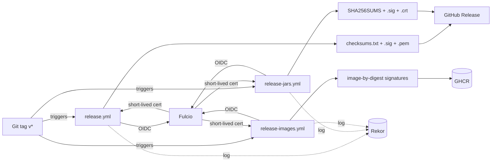
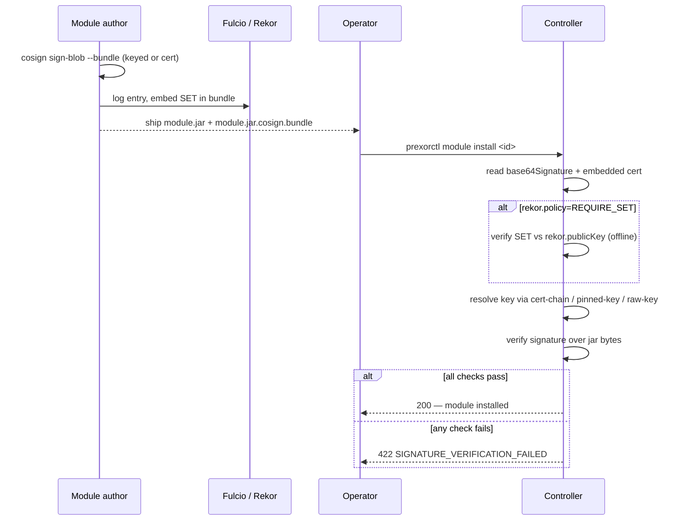

PrexorCloud signs everything it ships and verifies everything it installs.
There are two distinct signing scopes, and they use cosign differently:

- **Release artefacts** are signed by GitHub Actions with cosign *keyless*
  (OIDC identity, short-lived Fulcio cert, no maintained key). Operators
  verify them before they run.
- **Module bundles** are signed by their authors with cosign *key-based*
  (a long-lived keypair, or a self-issued cert chain). The controller
  verifies them at install time against a configured trust root, with
  optional offline Rekor SET enforcement.

This page is the contributor-facing deep dive. For the operator checklist,
see [Production checklist](/operations/production-checklist/); for the config
keys, see [Configuration reference](/operations/configuration/).

## What you'll learn

- The three release workflows and exactly what each one signs
- How `prexorctl` verifies a downloaded artefact before running it
- How the controller verifies a module bundle, including the cert-chain and
  raw-key paths
- How offline Rekor SET enforcement works without contacting Rekor
- The trust-root format and the runtime defaults that govern fail-closed

## The two scopes at a glance

| Scope | Signer | cosign mode | Verifier | Sidecar |
|---|---|---|---|---|
| Release artefacts | GitHub Actions OIDC identity | keyless | `prexorctl` wizard / operators | `.sig` + `.crt` (JARs), `.sig` + `.pem` (CLI), image-by-digest |
| Module bundles | Module author's keypair or cert | key-based | Controller `PlatformModuleSignatureVerifier` at install | `<jar>.cosign.bundle` (or legacy `<jar>.sig`) |

The two scopes solve different problems. Release artefacts come from *us*, so
keyless is right: verification proves "this came from that workflow on that
repo at that tag." Module bundles come from *third-party authors*, so a trust
root the operator controls is right: the controller never trusts the Sigstore
identity directly, only the keys and CA certs in the PEM bundle the operator
configured.

## Release artefacts

Three workflows fire on a `v*` tag. Each signs a different surface.

| Workflow | Builds | Signs |
|---|---|---|
| `release.yml` | `prexorctl` binaries via GoReleaser | `checksums.txt` (keyless), sidecars `.sig` + `.pem` |
| `release-jars.yml` | controller + daemon shadow JARs, dashboard static bundle | `SHA256SUMS` (keyless), sidecars `.sig` + `.crt` |
| `release-images.yml` | controller / daemon / dashboard container images | each image **by digest** (keyless) |

All three request `id-token: write` so the runner can mint an OIDC token, and
all three install `sigstore/cosign-installer@v3` pinned to cosign `v2.4.1`.

### `release.yml` — the prexorctl CLI

GoReleaser builds `prexorctl` for `linux`, `darwin`, `windows` × `amd64`,
`arm64`, emits a CycloneDX SBOM per archive, and writes a single
`checksums.txt`. The `signs` block in `cli/.goreleaser.yaml` signs only the
checksums file:

```yaml
signs:
  - id: checksum
    cmd: cosign
    signature: '${artifact}.sig'
    certificate: '${artifact}.pem'
    args:
      - sign-blob
      - --yes
      - --oidc-issuer=https://token.actions.githubusercontent.com
      - --output-signature=${signature}
      - --output-certificate=${certificate}
      - ${artifact}
    artifacts: checksum
```

Signing `checksums.txt` once transitively covers every archive: verify the
checksums file, then check each archive's SHA-256 against a trusted entry.
The sidecars are `checksums.txt.sig` and `checksums.txt.pem`.

### `release-jars.yml` — controller, daemon, dashboard bundle

This workflow builds `:cloud-controller:shadowJar` and
`:cloud-daemon:shadowJar`, plus the dashboard's static SPA via `pnpm generate`.
It stages three assets — `cloud-controller-<version>.jar`,
`cloud-daemon-<version>.jar`, `dashboard-static-<version>.tar.gz` — then writes
one `SHA256SUMS` covering all of them and signs **only that file**:

```bash
cosign sign-blob --yes \
  --output-signature   "${sums}.sig" \
  --output-certificate "${sums}.crt" \
  "${sums}"
```

The sidecar extensions differ from the CLI release: JAR signing uses `.crt` for
the certificate, GoReleaser uses `.pem`. The workflow re-verifies its own
signature as the next step (against the `release-jars.yml` identity) and runs
`sha256sum --check SHA256SUMS`, so a broken signature fails the release before
any operator sees it.

### `release-images.yml` — container images

A matrix builds three images and pushes them to GHCR:

| Image | Repo |
|---|---|
| controller | `ghcr.io/<owner>/prexorcloud-controller` |
| daemon | `ghcr.io/<owner>/prexorcloud-daemon` |
| dashboard | `ghcr.io/<owner>/prexorcloud-dashboard` |

Each build attaches a BuildKit max-mode provenance attestation
(`provenance: mode=max`) and an SBOM (`sbom: true`). The v1.0 line builds
`linux/amd64` only — arm64 via QEMU broke the Gradle-wrapper download
repeatedly, and the proper fix (native arm64 runners) is tracked separately.

Signing is by digest, for every tag the metadata action emitted:

```bash
for tag in $TAGS; do
  ref="${tag%%:*}@${DIGEST}"
  cosign sign --yes "$ref"
done
```

Pinning the signature to `<repo>@<digest>` (not `<repo>:<tag>`) binds it to the
exact image pushed. The workflow then runs `cosign verify` against its own
signature, lowercasing the owner segment first because OCI references must be
lowercase.



### Operator verification

For the prexorctl release, verify `checksums.txt`, then the archive:

```bash
cosign verify-blob \
  --certificate-identity-regexp "(?i)^https://github.com/prexorjustin/prexorcloud/.github/workflows/release.yml@.*" \
  --certificate-oidc-issuer "https://token.actions.githubusercontent.com" \
  --signature checksums.txt.sig \
  --certificate checksums.txt.pem \
  checksums.txt
sha256sum -c checksums.txt
```

For the controller / daemon / dashboard JARs, the signed file is `SHA256SUMS`
and the cert sidecar is `.crt`, under the `release-jars.yml` identity:

```bash
cosign verify-blob \
  --certificate-identity-regexp "(?i)^https://github.com/prexorjustin/prexorcloud/.github/workflows/release-jars.yml@.*" \
  --certificate-oidc-issuer "https://token.actions.githubusercontent.com" \
  --signature SHA256SUMS.sig \
  --certificate SHA256SUMS.crt \
  SHA256SUMS
sha256sum -c SHA256SUMS
```

For images, verify by tag or digest:

```bash
cosign verify \
  --certificate-identity-regexp "(?i)^https://github.com/prexorjustin/prexorcloud/.github/workflows/release-images.yml@.*" \
  --certificate-oidc-issuer "https://token.actions.githubusercontent.com" \
  ghcr.io/prexorjustin/prexorcloud-controller:<semver>
```

The identity regex pins the repo (`prexorjustin/prexorcloud`) and the workflow
file; the OIDC issuer pins to GitHub Actions. The regexes are case-insensitive
(`(?i)`) because GitHub sometimes lowercases the org/repo segment of the OIDC
subject even though the canonical repo name is mixed-case.

### How prexorctl verifies during install

The wizard does this automatically. The trust chain lives in
`cli/internal/setup/cosign.go`:

1. `VerifyReleaseAsset` finds `SHA256SUMS`, `SHA256SUMS.sig`, `SHA256SUMS.crt`
   on the release, downloads them, and runs `cosign verify-blob` against the
   appropriate identity regex (`CosignIdentityRegexJars` for controller/daemon
   JARs and the dashboard tarball).
2. It parses the now-trusted `SHA256SUMS` and looks up the entry for the asset
   it downloaded (by the *remote* filename, independent of any local rename).
3. It SHA-256-hashes the local file and compares against the trusted entry.
   A mismatch fails with `SHA-256 mismatch for <name>: expected …, got …`.

The identity regexes are constants:

```go
CosignIdentityRegexPrexorctl = `(?i)^https://github\.com/prexorjustin/prexorcloud/\.github/workflows/release\.ya?ml@.*`
CosignIdentityRegexJars      = `(?i)^https://github\.com/prexorjustin/prexorcloud/\.github/workflows/release-jars\.ya?ml@.*`
DefaultCosignOIDCIssuer      = "https://token.actions.githubusercontent.com"
```

The wizard installers (`cli/cmd/setup_controller.go`, `cli/cmd/setup_daemon.go`,
`cli/internal/setupweb/`) all pass `CosignIdentityRegexJars`.

**Soft-fail policy.** Verification has an `AllowMissing` flag. When `true`:

- `cosign` not on `PATH` → warn and continue (step 3 still runs).
- a sidecar URL returns 404 → warn and continue with checksum-only integrity.

`AllowMissing` is for dev and unsigned-fixture flows. Production callers pass
`false` to fail closed. To make signature verification real rather than
soft-failed, the wizard installs cosign itself: `EnsureCosign`
(`cli/internal/setup/install_cosign.go`) downloads the official
`cosign-linux-<arch>` binary, pins it against the release's
`cosign_checksums.txt`, and installs it to `/usr/local/bin/cosign`.

## Module bundle signing

Modules are signed by their authors and verified by the controller at install
time. The verifier interface lives in `cloud-security` at
`me.prexorjustin.prexorcloud.security.signing.PlatformModuleSignatureVerifier`,
so both the controller and the daemon-side module store reuse one
implementation. There are two formats.

### `KEYED` (legacy, backwards-compat default)

A PEM trust root holds `PUBLIC KEY` blocks. The module ships with a sidecar
`<jar>.sig` containing a Base64 signature over the raw jar bytes.
`TrustRootVerifier` reads the sidecar, then tries every trusted key. The first
match wins; no match fails with `module signature did not match any trusted
key`. A missing sidecar fails with `missing signature sidecar`.

```yaml
# controller.yml
modules:
  signing:
    required: true
    mode: KEYED
    trustRoot: "/opt/prexorcloud/controller/config/security/module-trust-root.pem"
```

`KEYED` is the default `mode` when unset.

### `COSIGN_BUNDLE` (recommended)

The module ships with a `<jar>.cosign.bundle` JSON file — the output of
`cosign sign-blob --bundle <out> <jar>`. `CosignBundleVerifier` reads the
bundle's `base64Signature` field and an optional embedded `cert`, then resolves
a verifying key from the trust root:

- **Bundle has a cert, trust root has `CERTIFICATE` blocks** — the leaf cert is
  validated via PKIX against the trust anchors (revocation checking disabled),
  and the cert's public key verifies the signature. Trust source logged as
  `cert-chain`.
- **Bundle has a cert, trust root has raw `PUBLIC KEY` blocks** — the cert's
  public key must byte-for-byte match one of the trusted keys, then verifies the
  signature. Logged as `embedded-cert-pinned-key`.
- **Bundle has no cert** — the signature is tried against each trusted public
  key directly. Logged as `raw-key`.

```yaml
modules:
  signing:
    required: true
    mode: COSIGN_BUNDLE
    trustRoot: "/opt/prexorcloud/controller/config/security/module-trust-root.pem"
```

The verifying algorithm is chosen by key type in `SignatureUtils`:
`SHA256withRSA` for RSA, `SHA256withECDSA` for EC/ECDSA, `Ed25519` for Ed25519.
Anything else returns "did not verify."

### Offline Rekor SET enforcement

The strict mode. When `rekor.policy=REQUIRE_SET`, the verifier checks the
bundle's `rekorBundle.SignedEntryTimestamp` against a bundled Rekor public key
**without contacting Rekor**. Air-gapped production controllers still get
transparency-log binding.

```yaml
modules:
  signing:
    required: true
    mode: COSIGN_BUNDLE
    trustRoot: "/opt/prexorcloud/controller/config/security/module-trust-root.pem"
    rekor:
      policy: REQUIRE_SET
      publicKey: "/opt/prexorcloud/controller/config/security/rekor.pub"
```

The SET is an ECDSA signature over the canonical JSON of `rekorBundle.Payload`.
`CosignBundleVerifier` reconstructs that canonical form exactly: the `Payload`
sub-object with keys in Go `encoding/json` struct order and no whitespace —
`{"body":…,"integratedTime":…,"logID":…,"logIndex":…}`. It then verifies the
Base64-decoded SET against each Rekor public key loaded from `publicKey`. The
cosign-public-good Rekor key is a single ECDSA P-256 key; operators running
their own Rekor can ship several for rotation overlap.

Failure modes, all surfaced as `SIGNATURE_VERIFICATION_FAILED`:

- `REQUIRE_SET` with no `rekorBundle` → "requires rekorBundle in cosign bundle"
- `rekorBundle` missing `SignedEntryTimestamp` or `Payload`
- `Payload` missing any of `body`, `integratedTime`, `logID`, `logIndex`
- SET verifies against no trusted Rekor key

`ConfigValidator` enforces two preconditions at startup:

- `REQUIRE_SET` requires `mode: COSIGN_BUNDLE` (raw `.sig` files carry no Rekor
  entry).
- `REQUIRE_SET` requires `rekor.publicKey` to be set.

Inclusion-proof Merkle-path verification is intentionally out of scope. The SET
binds the signature to a Rekor log entry, which is enough for the v1 threat
model. See ADR 15 (Cosign + offline Rekor, not custom signing) in
`docs/engineering/decisions.md`.

## End-to-end install flow



On rejection, the controller returns HTTP `422` with error code
`SIGNATURE_VERIFICATION_FAILED` and the verifier's message as the body
(`ModuleRoutes.java`). The integration test `CosignSignedModuleInstallTest`
(in `cloud-test-harness`) exercises this end-to-end and asserts the route
returns `422 SIGNATURE_VERIFICATION_FAILED` on a tampered bundle.
`DaemonCosignSignedModuleInstallTest` covers the daemon-side store.

## Trust-root format

The trust root is one PEM file. Concatenate as many blocks as you trust:

```text
-----BEGIN PUBLIC KEY-----
MFkwEwYHKoZIzj0CAQYIKoZIzj0DAQcDQgAE...     # Author A's raw cosign key
-----END PUBLIC KEY-----
-----BEGIN PUBLIC KEY-----
MFkwEwYHKoZIzj0CAQYIKoZIzj0DAQcDQgAE...     # Author B's raw cosign key
-----END PUBLIC KEY-----
-----BEGIN CERTIFICATE-----
MIIB+DCCAX...                                # Internal CA root
-----END CERTIFICATE-----
```

`CosignBundleVerifier.fromPemBundle` extracts every `PUBLIC KEY` and every
`CERTIFICATE` block. It requires at least one of either; an empty bundle throws
at construction. For `KEYED`, only `PUBLIC KEY` blocks are read.

The `prexorctl` wizard auto-provisions a trust root when the operator doesn't
supply one. `ProvisionModuleTrustRoot`
(`cli/internal/setup/install_signing.go`) runs `cosign generate-key-pair`
(`COSIGN_PASSWORD=` for an unencrypted key, so systemd installs don't hang on a
stdin prompt) and writes:

- `config/security/module-trust-root.pem` (`0644`) — the public key, referenced
  by `modules.signing.trustRoot`.
- `secrets/cosign.key` (`0600`) — the private key operators sign modules with.

Splitting the two prefixes keeps a careless `tar config/` backup from sweeping
up the private key. Provisioning is idempotent: if both halves exist it returns
the existing paths rather than rotating (rotating would invalidate every
signature the operator already issued).

## Runtime defaults and fail-closed

`modules.signing.required` resolves at startup via
`requiredOrDefault(productionProfile)`: if `required` is set, that value wins;
otherwise it defaults to `true` in the production profile and `false` in
development. `buildSignatureVerifier` in `PrexorCloudBootstrap` wires the result:

| `runtime.profile` | `signing.required` unset | `required=false` | `required=true` |
|---|---|---|---|
| `development` | unsigned allowed (`NOOP`) | unsigned allowed (`NOOP`) | `NOOP` with a loud WARN if `allowUnsignedDevelopment=true` (the default); otherwise the configured verifier |
| `production` | **fail-closed** (verifier required) | unsigned allowed, WARN logged | verifier required; `failClosed()` if `trustRoot` empty |

`allowUnsignedDevelopment` defaults to `true` and only relaxes verification in
the development profile — it has no effect in production. When a production
controller runs `required=false`, the bootstrap logs a WARN so the opt-out is in
the audit trail. When `required=true` but `trustRoot` is empty, the verifier
becomes `failClosed()` (every install rejected) — and `ConfigValidator` refuses
to start a production controller in that state at all, with
`modules.signing.trustRoot must be configured when runtime.profile=production`.

The daemon-side `ModuleSigningDaemonConfig` defaults `mode` to `COSIGN_BUNDLE`
rather than `KEYED` — the daemon module store is newer and has no legacy
sidecars to stay compatible with.

## Rotating the trust root

When an author rotates their signing key:

1. Add the new key (or CA cert) to the trust root file — concatenate PEM blocks.
   The verifier tries all of them.
2. Restart controllers in turn.
3. Re-sign and re-upload modules with the new key.
4. Remove the old key from the trust root.
5. Restart controllers.

Modules signed only with the old key fail closed at install after step 4. Don't
skip step 3. The procedure for the Rekor public key is the same shape: ship the
new key alongside the old in the `rekor.publicKey` PEM, restart, then drop the
old once nothing needs it. See [Production checklist](/operations/production-checklist/)
for the operator walkthrough.

## Why keyless for releases, key-based for modules

For our own artefacts there is no long-lived signing key to steal or rotate.
GitHub Actions' OIDC identity yields a short-lived Fulcio cert, cosign signs and
logs to Rekor, the key is discarded. Verification proves the artefact came from a
specific workflow on this repo at a specific tag — exactly what an operator
checks before running it.

Module signing is a different problem: third-party authors, not us. Keyless
would tie the controller's trust to whatever OIDC identity an author happened to
use, which the operator can't reason about. Instead the operator owns a trust
root of public keys and CA certs. The controller verifies the author's signature
against that root and, optionally, binds it to a Rekor entry offline. The
operator decides who to trust; the controller enforces it fail-closed.

## Next steps

- [Production checklist](/operations/production-checklist/) — operator-side
  cosign verification and the `modules.signing.*` startup checks
- [Configuration reference](/operations/configuration/) — every
  `modules.signing.*` key and its default
- [Architecture](/internals/architecture/) — module classloader lifecycle and
  ADR 15
