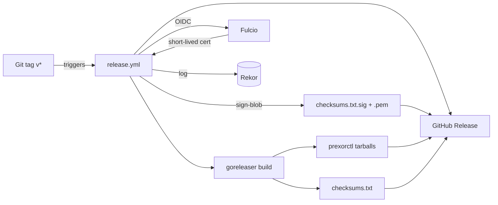
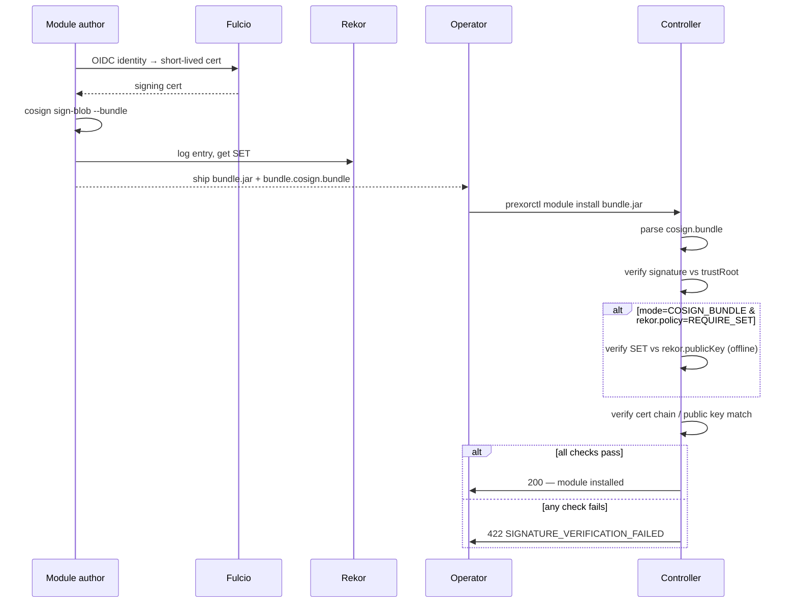

PrexorCloud signs everything it ships and verifies everything it
installs. There are two distinct signing scopes: **release artefacts**
(signed by the project, verified by operators) and **module bundles**
(signed by module authors, verified by the controller at install
time). Both use Cosign keyless. This page is the deep-dive on the
pipeline.

## What you'll learn

- The two cosign keyless flows and what each one signs
- The release.yml and release-images.yml workflow surface
- How the controller verifies module bundles, including offline Rekor SET enforcement
- The trust-root format the controller consumes

## The two scopes

| Scope | Signer | Verifier | Format |
|---|---|---|---|
| Release artefacts | GitHub Actions OIDC identity (`release.yml`, `release-images.yml`) | Operators (before extracting / pulling) | Cosign keyless on `checksums.txt` and on each image-by-digest |
| Module bundles | Module author's Cosign-signed blob bundle | Controller's `PlatformModuleSignatureVerifier` at install time | `.cosign.bundle` next to the bundle, or sidecar `.sig` (legacy) |

Both flows share the cosign keyless model: short-lived Fulcio
certificates issued from an OIDC identity, signature logged to Rekor,
private key discarded. We never maintain a long-lived signing key.

## Release artefacts

### What gets signed on `release.yml`

Each release tag (`v*`) produces, via `release.yml`:

| Artefact | Signed how |
|---|---|
| `prexorctl` Linux/macOS/Windows × x86_64 + arm64 binaries | Cosign keyless on `checksums.txt` (one signature covers every archive) |
| CycloneDX SBOM, one per archive | n/a (data, not executable) |
| sha256 checksums | Cosign keyless on the checksums file |



### What gets signed on `release-images.yml`

Multi-arch container images for controller / daemon / dashboard,
pushed to GHCR with `:<semver>` and `:latest` tags. Each digest is
signed with cosign keyless, and a BuildKit-native max-mode provenance
attestation is attached.

The release workflow runs `cosign verify` against its own
freshly-signed images as the last step, so a broken signature fails
CI before operators see it.

### Operator verification

Before extracting / running:

```bash
cosign verify-blob \
  --certificate-identity-regexp "^https://github.com/prexorjustin/prexorcloud/.github/workflows/release.yml@refs/tags/" \
  --certificate-oidc-issuer "https://token.actions.githubusercontent.com" \
  --signature checksums.txt.sig \
  --certificate checksums.txt.pem \
  checksums.txt
sha256sum -c checksums.txt
```

For images:

```bash
cosign verify \
  --certificate-identity-regexp "^https://github.com/prexorjustin/prexorcloud/.github/workflows/release-images.yml@refs/tags/" \
  --certificate-oidc-issuer "https://token.actions.githubusercontent.com" \
  ghcr.io/prexorjustin/prexorcloud-controller:<semver>
```

The identity regex pins:

- Repo: `prexorjustin/prexorcloud`
- Workflow file: `release.yml` or `release-images.yml`
- Tag pattern: `refs/tags/v*`

OIDC issuer pins to GitHub Actions. Together they prove "this artefact
was signed by *that* workflow on the prexorcloud repo at *that* tag."

## Module bundle signing

Modules are signed by their authors and verified by the controller at
install time. The verifier supports two formats:

### `KEYED` (legacy)

A PEM-bundled trust root holds `PUBLIC KEY` blocks. Modules ship with
a sidecar `.sig` file containing a Base64 signature over the bundle.

```yaml
# controller.yml
modules:
  signing:
    required: true
    mode: KEYED
    trustRoot: "/etc/prexorcloud/config/security/module-trust.pem"
```

### `COSIGN_BUNDLE` (recommended)

Modules ship with a `<bundle>.cosign.bundle` JSON file produced by
`cosign sign-blob --bundle`. The trust root may hold either:

- `PUBLIC KEY` blocks — for raw cosign-keyed signing.
- `CERTIFICATE` blocks — PKIX CA roots that validate cosign-issued
  embedded certs. Useful when an author signs via their own internal
  CA chain.

```yaml
modules:
  signing:
    required: true
    mode: COSIGN_BUNDLE
    trustRoot: "/etc/prexorcloud/config/security/module-trust.pem"
```

### Offline Rekor SET enforcement

The most paranoid mode. The bundle's `rekorBundle.SignedEntryTimestamp`
is verified against a bundled Rekor public key — **without contacting
Rekor at install time**. Production controllers behind air gaps still
get transparency-log binding.

```yaml
modules:
  signing:
    required: true
    mode: COSIGN_BUNDLE
    trustRoot: "/etc/prexorcloud/config/security/module-trust.pem"
    rekor:
      policy: REQUIRE_SET
      publicKey: "/etc/prexorcloud/config/security/rekor.pub"
```

`policy: REQUIRE_SET` makes signature verification fail-closed when
the bundle does not include a SET. `policy: DISABLED` (default) skips
the check.

`ConfigValidator` enforces:

- `REQUIRE_SET` requires `mode: COSIGN_BUNDLE` (raw `.sig` files
  carry no Rekor entry).
- `REQUIRE_SET` requires `rekor.publicKey` to be configured.

Inclusion-proof Merkle-path verification is **not** implemented. The
SET binds the signature to a Rekor entry, which is enough for the
v1 threat model. See
ADR 15.

## End-to-end flow



The integration test
`CosignSignedModuleInstallTest` exercises this end-to-end and asserts
the route returns `422 SIGNATURE_VERIFICATION_FAILED` on a tampered
bundle.

## Trust-root format

The trust-root file is a single PEM bundle. Concatenate as many
blocks as you trust:

```text
-----BEGIN PUBLIC KEY-----
MFkwEwYHKoZIzj0CAQYIKoZIzj0DAQcDQgAE...     # Author A's raw key
-----END PUBLIC KEY-----
-----BEGIN PUBLIC KEY-----
MFkwEwYHKoZIzj0CAQYIKoZIzj0DAQcDQgAE...     # Author B's raw key
-----END PUBLIC KEY-----
-----BEGIN CERTIFICATE-----
MIIB+DCCAX...                                # Internal CA root
-----END CERTIFICATE-----
```

When `mode: COSIGN_BUNDLE`, the verifier:

1. Tries each `PUBLIC KEY` block against the bundle's signing key.
2. Falls through to chain validation against any `CERTIFICATE` block
   if the embedded cert chains to one.

The first match wins. No match = fail-closed.

## Default behaviour by profile

`signing.required` resolves at runtime:

| `runtime.profile` | `signing.required` not set | `signing.required=false` | `signing.required=true` |
|---|---|---|---|
| `development` | unsigned bundles allowed | unsigned bundles allowed | unsigned bundles allowed (via `allowUnsignedDevelopment=true` default) |
| `production` | **fail-closed** | unsigned bundles allowed (warned) | fail-closed |

`PrexorCloudBootstrap` logs a WARN when `production +
required=false` is detected — operators choose to opt out
explicitly, with the warning in the audit trail.

`ConfigValidator` refuses to start a production controller with
`required=true` and an empty `trustRoot`, since that combination
would fail every install.

## Rotating the trust root

When an author rotates their signing key:

1. Add the new key (or CA cert) to the trust root file (concatenate
   PEM blocks).
2. Restart controllers in turn.
3. Re-sign and re-upload modules with the new key.
4. Remove the old key from the trust root.
5. Restart controllers.

Modules signed only with the old key fail-closed at install after
step 4. Don't skip step 3.

The rotation procedure is symmetric for the Rekor public key when
Sigstore rotates theirs — the change is rare but bundled into a
`rekor.publicKey` PEM update + controller restart.

## Why keyless

We do not maintain a long-lived private key. Cosign's keyless flow
uses GitHub Actions' OIDC identity to receive a short-lived Fulcio
cert, signs the artefact, logs the entry to Rekor, and discards the
key. Verification proves "this artefact was signed by *that* GitHub
Actions workflow on that repo" — exactly what operators want.

For module signing (a different problem — third-party authors, not
us), authors run their own cosign-keyless flow. The controller
verifies their identity via the trust root, not via the Sigstore
identity directly.

## CI / supply chain

| Job | Purpose |
|---|---|
| `cve-scan` (Trivy) | Vulnerability scan against the controller / daemon / dashboard images. |
| `sbom` (Syft) | Generates CycloneDX SBOM per image. |
| `goreleaser-check` | Validates `cli/.goreleaser.yaml` so release config can't drift silently. |
| `dr-drill` (nightly) | The end-to-end DR drill. |
| `perf-baselines` (nightly) | Perf drift comparator. |

Trivy results gate PRs by default. SBOMs are uploaded as build
artefacts and attached to releases.

## License posture

- **MongoDB** — SSPL. We **never** embed Mongo. The reference install
  runs Mongo as its own service.
- **Redis** — BSL since 7.4. We default to **Valkey** (BSD-3) to
  avoid the question. Operators who prefer Redis can use it; the
  controller speaks the Redis protocol.
- **Valkey** — BSD-3. Vendored as the default coordination store.

## Next up

- [Production Checklist](/operations/production-checklist/) — operator-side cosign verification
- [Configuration Reference](/operations/configuration/) — `modules.signing.*` keys
- [Architecture](/internals/architecture/) — module classloader lifecycle
