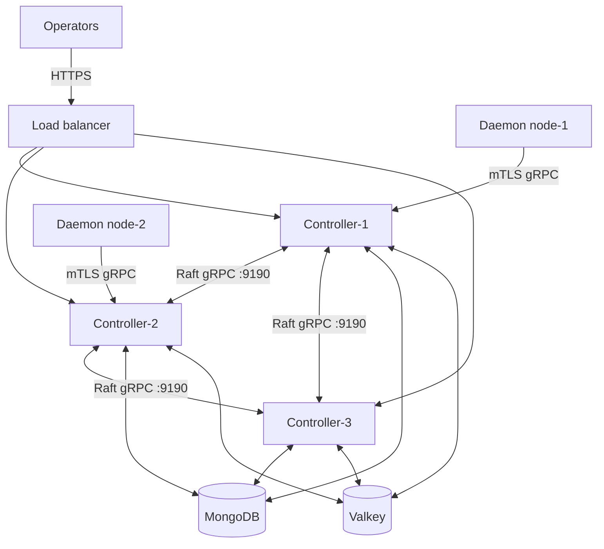
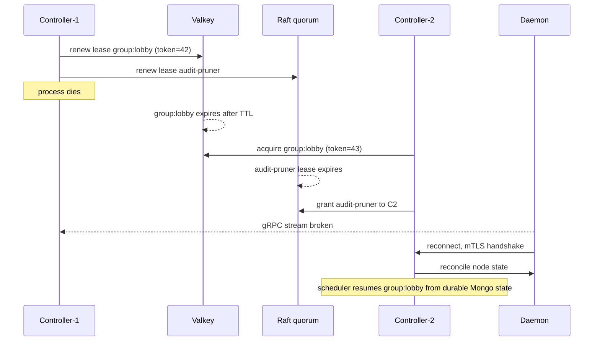

PrexorCloud runs active-active. Multiple controllers serve REST and gRPC at the same time against one shared MongoDB and one shared Valkey. There is no standby waiting to be promoted. Any healthy controller answers reads; mutating work is partitioned by leases so two controllers never act on the same scope at once.

This page is for the operator who runs more than one controller in production. It covers the coordination model, what you need before you add a controller, how to add and remove controllers, what happens on failover, and how fencing prevents split-brain writes.

## What you'll do here

- Understand the two coordination layers (Raft quorum + Valkey leases) and which one gates what.
- Meet the requirements for running more than one controller.
- Add a second controller and verify it joined.
- Read the failover sequence and the fencing guarantees.
- Remove a controller cleanly.

## The coordination model

Two layers cooperate. They sit on different stores and protect different work.

| Layer | Store | Protects | Manager |
|---|---|---|---|
| Embedded Raft quorum | On-disk Raft log per controller (`raft.dataDir`), replicated over gRPC | Cluster identity, membership, join tokens, cluster-shared config versions, cluster-wide singleton leases | `ClusterControlPlane` / `ClusterLeaseManager` |
| Distributed leases | Valkey (shared) | Per-group scheduling, recoverable workflows | `DistributedLeaseManager` |

Why two. Raft gives linearizable, quorum-backed writes for things that must never diverge — who is in the cluster, which config version is active, who holds a cluster-wide singleton. Raft commit latency is too expensive for high-frequency, fine-grained partitioning (per-group, every scheduler tick), so that work uses cheap Valkey `SET NX EX` leases instead.

Both stores must be shared by every controller. Mongo holds durable platform state. Valkey holds the fine-grained coordination keys. The Raft log is per-node but the peers replicate to a quorum.



Each daemon holds one gRPC stream to one controller. If that controller dies, the daemon reconnects to a healthy peer. Operators reach controllers through an L4 load balancer; no session affinity is needed because any controller serves any read.

## Requirements

Before you run more than one controller:

| Requirement | Why |
|---|---|
| `runtime.profile=production` | Production wires the real coordination stores. Development runs single-writer in-process and `ConfigValidator` rejects production without Valkey. |
| Shared MongoDB | Durable platform state. Every controller points at the same Mongo. A replica set is strongly recommended. |
| Shared Valkey | Fine-grained coordination. Every controller points at the *same* Valkey. Different Valkeys mean split-brain on group leases. |
| Raft reachability | Each controller's Raft gRPC port (`raft.port`, default `9190`) must be reachable from every other controller. Raft needs a quorum (majority) to commit. |
| Odd controller count | Raft tolerates `(N-1)/2` failures. Run 3 controllers to tolerate 1 loss, 5 to tolerate 2. Two controllers tolerate zero Raft failures. |
| Time sync | Lease *expiry* depends on clocks. Fencing tokens — not clocks — prevent conflicting writes, but run `chronyd` or `systemd-timesyncd` to keep expiry sane. |
| Network reachability | Each controller's REST and gRPC must be reachable from operators and daemons. |
| L4 load balancer (optional) | Only if you want a single dashboard URL. PrexorCloud doesn't ship one. |

`ConfigValidator` enforces the hard ones at boot. With `runtime.profile=production` and no `redis.uri`, the controller refuses to start:

```text
redis.uri must be configured when runtime.profile=production
```

> Valkey is wire-compatible with Redis. The config keys, URIs, and log lines say `redis`; point them at your Valkey endpoint.

## Configuration keys

These live in `controller.yml`. Defaults come from the controller config records.

| Key | Default | Meaning |
|---|---|---|
| `runtime.profile` | `development` | Set to `production` for HA. |
| `redis.uri` | `redis://localhost:6379` | Shared Valkey endpoint. Required in production. |
| `cluster.id` | none | Pins this controller to a Mongo cluster. Boot cross-checks it against the `cluster_meta` collection and the Raft state; a mismatch refuses startup. |
| `raft.host` | `0.0.0.0` | **Advertised** address — what this controller tells peers to dial it at. The transport always *binds* `0.0.0.0:port`; this value is purely the advertised host. The `0.0.0.0` default works for a single controller but **must** be set to a routable address (the node's private IP) for HA — otherwise peers are told to dial `0.0.0.0` and the join fails. |
| `raft.port` | `9190` | Raft gRPC port. Must be reachable from peers. |
| `raft.dataDir` | `data/raft` | On-disk Raft log + snapshots for this node. Persistent; replayed on restart. |
| `raft.joinAddrs` | `[]` | Raft endpoints of existing members used at boot to discover the cluster. Empty means "first controller, or restart of an existing member" — the bootstrap reads `raft.dataDir` to disambiguate. |
| `scheduler.evaluationIntervalSeconds` | `15` | Scheduler tick. Also sets the Valkey lease TTL (see below). |

The Valkey lease TTL is `scheduler.evaluationIntervalSeconds * 2`. With the default tick of 15 s the TTL is 30 s — a controller renews its group lease on every tick, and a dead controller's group lease expires after at most 30 s.

### Raft networking

The Raft transport binds `0.0.0.0:9190` and advertises `raft.host:9190`. Every controller must be able to dial every other controller's advertised address, so:

- **Set `raft.host` to a routable address** — the node's private IP (`10.0.0.3`), not `0.0.0.0` and not a loopback. Peers receive this address in the join handshake and dial it directly.
- **Run controllers on host networking** (`network_mode: host` in Compose, or native systemd). Under Docker bridge networking a controller's Raft client dials its *own* advertised IP, which only works if the bridge hairpins NAT back to the published port — fragile and easy to misconfigure. Host networking makes the bound address, the advertised address, and the reachable address the same private IP.
- If you must use bridge networking, publish `9190` bound to the private interface (`10.0.0.3:9190:9190`), never to `0.0.0.0` — the Raft port is unauthenticated at the transport layer beyond mTLS and should stay on a trusted network.

Changing `raft.host` on a controller that already booted is safe: on the next restart it re-advertises the new address to the cluster automatically (the membership record self-heals and the leader re-runs the group configuration).

## Lease scopes

Two managers, two key spaces.

### Valkey leases (fine-grained, fenced)

`DistributedLeaseManager` acquires with `SET key value NX EX ttl`. Keys are namespaced `prexor:v1:lease:<resource>`; the fencing counter is `prexor:v1:lease-token:<resource>`.

| Scope | Key shape | Gates |
|---|---|---|
| Group | `prexor:v1:lease:group:<name>` | Per-group scheduling: start-retry resends, deployment rolling updates, drain dispatches, healing. Only the lease holder emits cluster-mutating actions for that group. |
| Recoverable workflows | `prexor:v1:lease:<resource>` | Healing, drain, and start-retry workflows resume only on the controller holding the matching lease. |

Each acquire increments a monotonic **fencing token** (`INCR` on the token key). The lease value is `<controllerId>|<token>`. Before any cluster-mutating action, the caller revalidates with `ensureLeaseCurrent`: if the stored holder is no longer this controller, or the token has moved, the controller bails out instead of writing. This stops the old owner from acting after a new owner has taken over — clock skew can shift *when* a lease expires but cannot make two controllers pass the token check for the same scope.

The three-method seam (`LeaseGate`) collaborators use:

- `ownsGroupLease(group)` — fast pre-check, does not renew.
- `acquireGroupLease(group)` — take the lease for a unit of work; returns `null` when no Valkey is configured (development: every controller "owns" every group).
- `ensureLeaseCurrent(lease, group, action)` — fencing-token recheck immediately before the mutation.

### Raft leases (cluster-wide singletons)

`ClusterLeaseManager` wraps `GrantLease` / `RenewLease` / `ReleaseLease` entries on the Raft control plane. Use it for work that must run on exactly one controller cluster-wide, where Raft's commit cost is negligible against the work.

| Lease name | Holder | Purpose |
|---|---|---|
| `audit-pruner` | one controller, 1 h TTL | Prunes the audit log once per cluster, not once per controller. |
| Deployment-reconciler singleton | one controller | The scheduler's deployment reconciliation loop runs on a single controller instead of every controller racing on Mongo. |

Holder identity is the controller UUID. A lease held by controller A cannot be renewed or released by controller B — the state machine compares holder strings and rejects the mismatch with a `ClusterWriteConflict`. `runUnderLease(name, ttl, work)` does acquire → run → release and returns `false` (skips the work) when another controller holds the lease or Raft is unreachable; the next tick retries.

Inspect the Raft lease holders:

```bash
curl -s https://controller-1:8080/api/v1/cluster/leases \
  -H "Authorization: Bearer $TOKEN"
```

Requires the `CLUSTER_VIEW` permission.

## Add a controller

A new controller joins an existing cluster with a single-use join token. The token is HMAC'd with the cluster seed, committed to the Raft log, and carries the **gRPC** `joinAddrs` of existing members — the addresses the joiner dials to redeem the token over the `ClusterMembership` service.

> **`joinAddrs` is the gRPC port (`grpc.port`, default `9090`), not the Raft port (`9190`).** The join handshake (`ClusterMembership.RequestJoin`) is served on the controller gRPC server, which is mTLS-exempt for this call — the join token is the authentication. The joiner has no cluster cert yet, so it *cannot* reach the Raft port (`9190`), which requires cluster mTLS. Pointing `joinAddrs` at `:9190` makes the join fail with a TLS `CERTIFICATE_REQUIRED` alert. (Once joined, peers dial each other's `9190` for Raft using the cluster-CA cert they obtained via the join.)

### 1. Issue a join token on a running controller

```bash
curl -s -X POST https://controller-1:8080/api/v1/cluster/join-tokens \
  -H "Authorization: Bearer $TOKEN" \
  -H "Content-Type: application/json" \
  -d '{
        "joinAddrs": ["controller-1:9090"],
        "ttlSeconds": 3600,
        "label": "controller-2"
      }'
```

Expected:

```json
{
  "jti": "f1c2...",
  "token": "ey...<wire token>...",
  "expiresAt": "2026-06-07T18:00:00Z"
}
```

Notes:

- `joinAddrs` is required and must be a non-empty array of `host:port` **gRPC** endpoints (the `grpc.port`, default `9090` — see the note above; **not** the Raft `9190`). Omitting it returns `400 MISSING_JOIN_ADDRS`.
- `ttlSeconds` defaults to 24 h (`86400`) and is capped at 30 days. Out-of-range returns `400 BAD_TTL`.
- Tokens are single-use. List outstanding ones with `GET /api/v1/cluster/join-tokens`; revoke with `DELETE /api/v1/cluster/join-tokens/{jti}`.
- The call needs `CLUSTER_MANAGE`. If the cluster meta is not yet stamped you get `409 CLUSTER_NOT_READY`; if Raft can't commit, `503 RAFT_UNAVAILABLE`.

### 2. Install the new controller

Run the setup wizard on the new host and point it at the same Mongo and Valkey. The wizard probes the shared Valkey for existing cluster state and tells you whether you're starting fresh or joining:

```text
✓  Redis probe        cluster has 2 node owner(s), 1 group lease(s) — joining existing cluster
```

Non-interactive form:

```bash
prexorctl setup \
  --non-interactive \
  --component controller \
  --install-mode native \
  --controller-mongo-mode remote \
  --controller-mongo-uri "$EXISTING_MONGO_URI" \
  --controller-redis-mode remote \
  --controller-redis-uri "$EXISTING_VALKEY_URI"
```

Set `runtime.profile=production` and the same `cluster.id` in the generated `controller.yml`.

### 3. Hand the controller its join token

Write the wire token from step 1 to `config/security/pending-join-token` (relative to the controller install dir) before first start:

```bash
printf '%s' "$WIRE_TOKEN" > config/security/pending-join-token
```

On boot the controller detects the file and starts in Raft join mode: it presents cluster-CA-signed mTLS material, calls `GroupManagementApi.add`, and the leader expands the Raft group through joint consensus. On success the controller mirrors the cluster id into `controller.yml` and deletes the token file. On failure the file stays in place so a restart retries automatically.

If the file is missing and `config/security/cluster/` is unpopulated, the controller runs a Day-0 fresh bootstrap and mints its own CA — that is how the *first* controller comes up, not how you add a second one. Always issue and stage a join token for additions.

### 4. Verify

```bash
curl -s https://controller-2:8080/api/v1/cluster \
  -H "Authorization: Bearer $TOKEN"
```

Returns the cluster id, member count, and this node's role. List members in detail:

```bash
curl -s https://controller-1:8080/api/v1/cluster/members \
  -H "Authorization: Bearer $TOKEN"
```

Then add the controller to your load balancer. Group leases redistribute on the next scheduler tick; Raft singletons stay where they are until their holder dies.

## Failover

When a controller stops or loses coordination, the two layers recover independently.



Step by step:

1. Controller-1 stops renewing its Valkey group leases and its Raft singleton leases.
2. Group leases expire in Valkey after at most `scheduler.evaluationIntervalSeconds * 2` (30 s default). Another controller acquires them on its next tick; each acquire bumps the fencing token.
3. Raft singleton leases (`audit-pruner`, deployment-reconciler) expire on their own TTL and a surviving controller re-grants them through the quorum.
4. Daemons whose gRPC session was on controller-1 reconnect to a healthy controller.
5. The new owner reads workflow intents from Mongo, holds the matching leases, and resumes from durable state. The fencing-token recheck rejects any late write from the dead controller, so there are no duplicate restarts and no torn writes.

Raft availability needs a quorum. With 3 controllers, losing 1 keeps Raft writable (membership changes, join tokens, cluster config patches, singleton leases). Losing 2 of 3 makes the Raft control plane read-only until a peer returns — REST reads and Valkey-gated scheduling keep working, but you can't issue join tokens or change cluster-shared config until quorum is restored.

## Fencing — why there's no split-brain

The guarantee is the same on both layers, by different mechanisms:

- **Valkey leases** carry a monotonic fencing token. A controller revalidates the token immediately before each mutation (`ensureLeaseCurrent`). A stale owner fails the check and aborts. Clock skew moves expiry timing but cannot make two controllers pass the token check for one scope.
- **Raft leases** are linearizable. A grant only succeeds through quorum, and renew/release are rejected for any holder that isn't the recorded one (`ClusterWriteConflict`). A partitioned minority cannot grant itself a lease because it cannot reach quorum.

Net effect: at most one controller acts on any given scope at any time, even across a controller death mid-workflow.

## Remove a controller

Graceful removal takes the controller out of the Raft group and the load balancer.

### 1. Drain traffic

Remove the controller from the load balancer so no new operator requests land on it.

### 2. Leave the Raft group

```bash
curl -s -X POST https://controller-2:8080/api/v1/cluster/leave \
  -H "Authorization: Bearer $TOKEN"
```

This is graceful self-removal. Keep a quorum: don't drop below a majority of voting members. Removing the leader hands leadership to a survivor first.

If the controller is already gone and can't leave on its own, force-eject it from a survivor:

```bash
curl -s -X DELETE https://controller-1:8080/api/v1/cluster/members/<nodeId> \
  -H "Authorization: Bearer $TOKEN"
```

Eject needs `CLUSTER_MANAGE`. An unknown `nodeId` returns `404 MEMBER_NOT_FOUND`.

### 3. Stop the service

```bash
sudo systemctl stop prexorcloud-controller
sudo systemctl disable prexorcloud-controller
```

Its Valkey leases expire within the TTL and redistribute; its Raft singletons re-grant to survivors.

## Observability

The coordination counters (Micrometer):

| Metric | Meaning |
|---|---|
| `prexorcloud.coordination.lease.acquisitions` | New Valkey leases taken (excludes renewals). |
| `prexorcloud.coordination.lease.renewals` | Leases renewed by the current holder. |
| `prexorcloud.coordination.lease.contentions` | Acquisitions that lost the race to another controller. |

Steady contention with low acquisition is normal — every controller races on each tick and most lose. Watch for a controller whose renewals drop to zero (it stopped holding anything) and acquisitions spiking elsewhere (a peer took over its work).

REST surfaces for live state:

- `GET /api/v1/cluster` — id, member count, this node's role.
- `GET /api/v1/cluster/members` — full member list.
- `GET /api/v1/cluster/leases` — current Raft singleton holders.
- `GET /api/v1/cluster/config/versions` — cluster-shared config version history.
