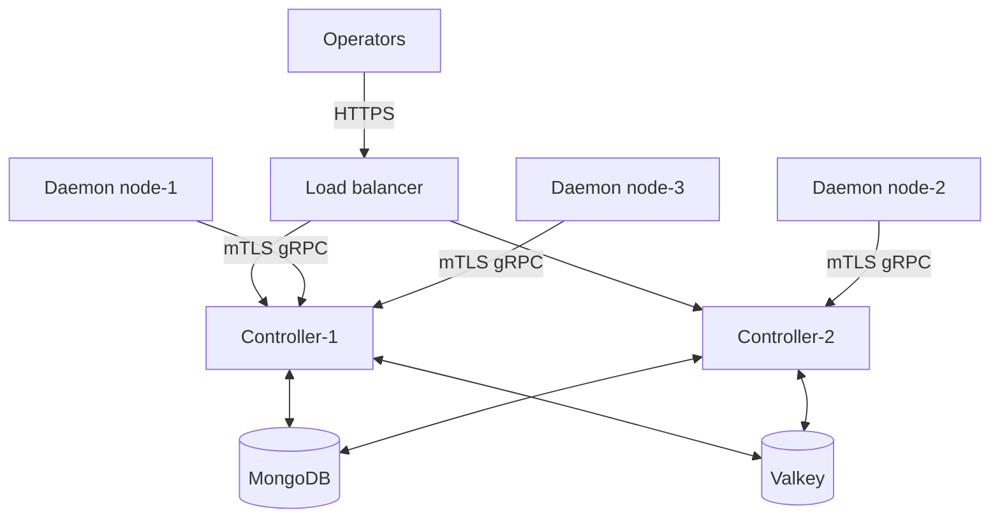
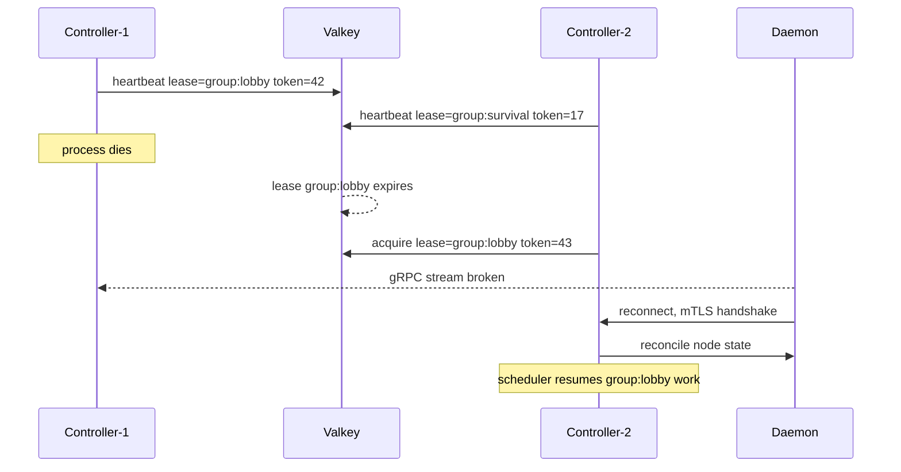

PrexorCloud HA is **active-active with lease-scoped work**. Multiple
controllers run simultaneously against the same MongoDB and Valkey;
any healthy controller can serve REST and gRPC traffic. There is no
"leader" that other controllers wait on. This page walks the install
and explains the failover semantics so you know exactly what happens
when one controller dies at 03:14.

## What you'll learn

- Why PrexorCloud picked active-active with leases instead of active-passive
- The exact requirements before you can run more than one controller
- How to add and remove controllers without downtime
- What happens to in-flight workflows when a controller fails

## Why active-active

Active-passive failover always has a window where the standby is not
yet ready and the leader is gone. Lease-scoped active-active
eliminates that window — work simply moves to a different lease
holder. Standby promotion drills (drain mid-failover, deployment
mid-failover, placement-time, in-flight module mutation) all converge
without duplicate side effects, because the fencing token rejects
stale writes from the old owner.

See `RecoveryTest` in `cloud-test-harness` for the full proof.

## Requirements

Before you run more than one controller:

| Requirement | Why |
|---|---|
| `runtime.profile=production` | Production wires real coordination accessors. Development is single-writer. |
| Shared MongoDB | Durable platform state. All controllers must point at the same Mongo URI. Replica set strongly recommended. |
| Shared Valkey | Coordination store. All controllers must point at the *same* Valkey — different Valkeys = split-brain. |
| Time sync | Fencing protects against split-brain writes; clock skew only affects lease *expiry*. Run `chronyd` or `systemd-timesyncd`. |
| Network reachability | Each controller's REST + gRPC must be reachable from operators and daemons. |
| L4 / L7 load balancer (optional) | If you want a single dashboard URL. PrexorCloud doesn't ship one. |



Each daemon picks one controller for its gRPC stream; if that
controller dies, the daemon reconnects to a healthy peer. Operators
typically reach controllers through an L4 LB; the LB does not need
session affinity — every read can be served by any controller.

## Install a second controller

Assuming controller-1 is up and healthy.

```bash
# On controller-2:
sudo prexorctl setup --role controller \
    --mongo-uri "$EXISTING_MONGO_URI" \
    --redis-uri "$EXISTING_VALKEY_URI" \
    --bootstrap=false
```

`--bootstrap=false`:

- Skips admin-user creation (controller-1 already has one).
- Skips CA generation. Controller-2 reads the existing CA public cert
  from Mongo. The CA private key is **not** copied to controller-2 —
  it remains only on controller-1's filesystem. This is correct: only
  the host that issued the original CA needs the private material to
  mint daemon certs. (See "CA private key location" below.)

Verify:

```bash
prexorctl status
# Should list two controllers; both reach ready.
```

Both controllers compete for leases via Valkey. Mutating work is
distributed; reads served from any.

### CA private key location

The mTLS CA private key must live on a controller that signs new
daemon certificates. By default this is controller-1 (where setup
generated the CA). When you add controller-2, copy the CA bundle
manually if you want either controller to mint certs:

```bash
# On controller-1, package the CA material.
sudo tar -czf /tmp/ca-bundle.tgz -C /etc/prexorcloud/data/certs ca/

# Transfer to controller-2 via your normal secret-transfer path
# (NOT scp into a world-readable place; use an encrypted channel).

# On controller-2:
sudo tar -xzf /tmp/ca-bundle.tgz -C /etc/prexorcloud/data/certs/
sudo chown -R prexorcloud:prexorcloud /etc/prexorcloud/data/certs/ca/
sudo chmod 600 /etc/prexorcloud/data/certs/ca/ca.key
sudo systemctl restart prexorcloud-controller
```

If you skip this step, daemon-cert issuance succeeds only when the
operator hits controller-1; controller-2 returns 503 from
`/nodes/{id}/cert-issue` and similar.

## Lease scopes

Mutations gate on a lease. Lease keys are namespaced under
`prexor:v1:lease:` in Valkey.

| Lease scope | Key shape | Purpose |
|---|---|---|
| Group | `prexor:v1:lease:group:<name>` | Group-scoped scheduling work — placement, scaling, drains for instances in this group. |
| Platform module mutation | `prexor:v1:lease:platform-module` | Install / upgrade / uninstall / storage deletion. |
| Workflow resumption | `prexor:v1:lease:workflow:<scope>` | Persisted start-retry, node-drain, healing, recoverable-start workflows resume only when the controller owns the matching lease. |
| Node ownership | tracked via `prexor:v1:node:` ownership records | Commands for a connected node go through the controller that owns its gRPC session. |

Each acquisition returns a **monotonic fencing token**. Before any
write under the lease, the controller checks the token is still
current. If a different controller has since taken the lease, the old
controller stops mutating. Clock skew can move lease *expiry* timing
around but cannot cause two controllers to issue conflicting writes
against the same scope.

## Failover

When a controller stops or loses its lease:



1. Controller-1 stops heartbeating its leases.
2. After lease TTL (default = `scheduler.evaluationIntervalSeconds × 2`),
   the leases expire in Valkey.
3. Controller-2's lease reconciler picks them up on the next tick.
   Each acquire bumps the fencing token.
4. Daemons whose gRPC session was on controller-1 reconnect to
   controller-2 (round-robin via the LB or via their daemon-side
   reconnect logic).
5. Controller-2 reads workflow intents from Mongo, holds the matching
   leases, and resumes operations from durable state.

`RecoveryTest` exercises this at four points (drain, deployment,
placement-time, in-flight module mutation) and asserts no duplicate
restarts and no torn writes.

## Add or remove a controller

### Add

```bash
sudo prexorctl setup --role controller \
    --mongo-uri "$EXISTING_MONGO_URI" \
    --redis-uri "$EXISTING_VALKEY_URI" \
    --bootstrap=false
```

Verify:

```bash
prexorctl status
prexorctl --controller https://controller-N:8080 system info
```

Add it to the LB. New leases distribute on the next tick.

### Remove

```bash
# On the controller being removed.
sudo systemctl stop prexorcloud-controller
sudo systemctl disable prexorcloud-controller
```

The peer picks up any leases this controller held within
`scheduler.evaluationIntervalSeconds × 2` seconds. Pull the host out
of the LB.

## Operator-side requirements for HA

- Run **one** Valkey across the HA set. Two Valkeys = split-brain.
  Valkey itself can be HA (Sentinel / Cluster) — use a single
  endpoint URI.
- Run shared MongoDB. Replica sets strongly recommended; the driver
  handles primary failover transparently.
- Keep controller clocks reasonably synchronised.
- Coordinate backup and restore with controller shutdown or a
  maintenance window — restore tooling does not currently acquire all
  mutation leases. See [Backups and DR](/operations/backups-and-dr/).

## What HA does *not* give you

- **Cross-region failover.** v1 is single-region. A second region
  recovering from a backup of the first is a manual procedure, not a
  target. See [Disaster Drill](/operations/disaster-drill/).
- **Hot data replication.** PrexorCloud does not replicate Mongo or
  Valkey for you. That is upstream — use a Mongo replica set and
  Valkey Sentinel / Cluster as you would for any other workload.
- **Geographic load balancing.** The dashboard / REST is one region.
  Players still hit the proxy via whatever DNS / GeoIP tier you've
  set up; PrexorCloud is not in that path.

## Common failures

| Symptom | Likely cause | Fix |
|---|---|---|
| Both controllers stop accepting writes after adding a peer | Both pointed at same Mongo, **different** Valkeys | Ensure all controllers share the same coordination store. |
| Lease contention rate climbing on a specific scope | Two controllers tick at the same time on the same scope | Stagger tick start times; check `scheduler.evaluationIntervalSeconds`. |
| Stuck workflow after controller restart | Workflow intent not picked up | Confirm a controller holds the relevant lease; check `coordination.store=available`; see the [recover-controller runbook](https://github.com/prexorjustin/prexorcloud/blob/main/docs/runbooks/recover-controller.md). |
| Daemon-cert issuance fails on controller-2 | CA private key not copied | See "CA private key location" above. |
| `prexorctl status` shows `clock.synchronized=false` | Time daemon not running | Install / start `chronyd` or `systemd-timesyncd`. |

## Next up

- [Upgrading](/operations/upgrading/) — zero-downtime rolling controller upgrades
- [Backups and DR](/operations/backups-and-dr/) — restore choreography under HA
- [Architecture](/internals/architecture/) — lease + fencing model in depth
