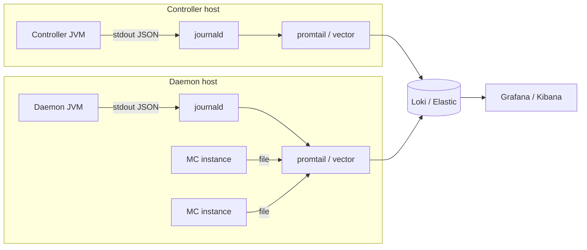

PrexorCloud separates two log streams that operators frequently
conflate: **process logs** (what the JVM did, line-by-line, via SLF4J
+ Logback) and the **audit log** (every state-changing API call,
persisted to MongoDB). This page is the field guide for both.

## What you'll learn

- Where controller, daemon, instance, and module logs live and how to read them
- The HUMAN vs JSON log formats and when to choose each
- How to correlate a REST request across logs via MDC `requestId`
- What ends up in the Mongo `audit_log` collection and how to query it

## Process logs

Both the controller and the daemon log via SLF4J + Logback. There is
no `System.out.println` anywhere. Output goes to stdout (and therefore
to the systemd journal under the reference units) and to a rotating
file under `logs/`.

### Format

Set per-process via `logging.format`:

| Format | When to use |
|---|---|
| `HUMAN` (default) | Single-line layout. Easy on humans, easy on `journalctl`. |
| `JSON` | Line-delimited structured JSON via `JsonLogEncoder`. Pipes cleanly into Loki, Elastic, Datadog, etc. |

```yaml
# controller.yml or daemon.yml
logging:
  format: JSON
  level: INFO
```

JSON output includes: `timestamp`, `level`, `thread`, `logger`,
`message`, MDC fields (e.g. `requestId`), and any structured argument
the log call passed.

### Levels

| Level | What you'll see |
|---|---|
| `ERROR` | Unexpected failures requiring attention. |
| `WARN` | Recoverable issues — crash reports, reconnects, stale data, classloader leaks. |
| `INFO` | Lifecycle events — node connected, instance started, module loaded, lease acquired. |
| `DEBUG` | Operational detail — gRPC payload cases, template hashing, lease renewal. |
| `TRACE` | Very detailed — gRPC frame bodies, Mongo query shapes. |

Default is `INFO`. Bump to `DEBUG` for a subset by overriding via
`logging.loggers.<name>: DEBUG` in `controller.yml`.

### Where they live

| Component | Default | Override |
|---|---|---|
| Controller | systemd journal + `logs/latest.log` | `logging.format`, `logging.file` |
| Daemon | systemd journal + `logs/latest.log` | same |
| MC instance | `data/instances/<id>/logs/latest.log` | server-side, per template |
| Module | controller log, prefixed `[module:<id>]` | use `LoggerFactory.getLogger` |

Logback rotation defaults: 50 MB per file, 30 days of history. Override
under `logging.maxFileSize` and `logging.maxHistory`.

### Streaming logs without ssh

```bash
# Last 200 warn-or-higher lines from the controller.
prexorctl logs controller --tail 200 --level WARN

# Follow controller logs.
prexorctl logs controller --follow

# Filter by logger.
prexorctl logs controller --logger me.prexorjustin.prexorcloud.scheduler

# Daemon logs over its gRPC channel — no ssh into the host.
prexorctl logs daemon node-1 --follow
```

Both commands are SSE-backed — `/api/v1/system/logs/stream` and
`/api/v1/nodes/{id}/logs/stream`. They require the `system.logs`
permission. Daemon log SSE is gated by mTLS at the gRPC layer in
addition to the REST permission.

A controller restart clears the controller log ring buffer and the
per-node `DaemonLogStore`. Logback persists to disk regardless;
historical reads go through your file aggregation pipeline.

### MDC correlation

`RequestIdMiddleware` adds a `requestId` to MDC for every REST
request. You can correlate "operator did X" across the request log
line, any subsequent module log lines, and the audit-log record by
`requestId`.

When module code or async tasks switch threads, plumb the requestId
forward by reading MDC and re-binding around the switch.

```text
2026-05-10T14:02:11.453Z INFO  [http-1] [requestId=abf12d49] api.groups -- create group=lobby parent=null
2026-05-10T14:02:11.481Z INFO  [scheduler-1] [requestId=abf12d49] scheduler.placement -- placed lobby-1 on node-1
2026-05-10T14:02:11.502Z DEBUG [grpc-out-1] [requestId=abf12d49] grpc.outbound -- start frame to node-1 instance=lobby-1
```

Same `requestId` on every line; that is your trace ID for a request.

### Forwarding to Loki / Elastic / Datadog

Three patterns work:

- **Tail the file.** Promtail / Filebeat / Vector reads
  `logs/latest.log`. Pair with `logging.format: JSON` for structured
  ingest.
- **journald exporter.** When running under systemd, point `journald`
  → Loki / Elastic directly. Tag by `_SYSTEMD_UNIT=prexorcloud-controller.service`.
- **Stdout in a container.** Compose / k8s log drivers ship stdout to
  whatever sink you've configured. JSON format makes parsing trivial.



## Audit log

The audit log is the durable record of every state-changing API
operation. It lives in the Mongo `audit_log` collection and survives
controller restart. It is the source of truth for "who did what and
when."

### What gets written

The `AuditMiddleware` writes a record on every successful mutation
that passes through the REST API:

- `auth.login.succeeded` / `auth.login.failed` / `auth.logout`
- `groups.create` / `.update` / `.delete` / `.scale`
- `templates.create` / `.update` / `.delete`
- `nodes.register` / `.drain` / `.delete` / `.cert-issued` / `.cert-revoked`
- `modules.install` / `.activate` / `.deactivate` / `.uninstall`
- `instances.stop` / `.command`
- `system.settings.update`
- `users.create` / `.delete` / `.set-password`
- `roles.create` / `.update` / `.delete`
- `tokens.create` / `.revoke`

Each record carries: `_id`, `createdAt`, `requestId`, `actor.userId`,
`actor.username`, `actor.ip`, `type`, `target`, `detail`,
`outcome`, optional `error`.

### TTL

`scheduler.auditRetentionDays` (default 90) drives a Mongo TTL index
on `createdAt`. Bump it for compliance regimes that demand longer
retention; budget Mongo storage accordingly (~1 GiB per 100 instances
per month at default load).

### Queries

Until the dedicated `prexorctl audit query` lands, query Mongo
directly:

```bash
mongosh "$MONGO_URI" --quiet --eval '
  db.audit_log.find({
    createdAt: { $gt: ISODate("2026-05-10T00:00:00Z") },
    type: { $regex: "^auth\\." }
  }).sort({createdAt: -1}).limit(100).pretty()
'
```

A few patterns we lean on:

```javascript
// Who issued daemon certificates this week?
db.audit_log.find({
  type: "nodes.cert-issued",
  createdAt: { $gt: ISODate("2026-05-03T00:00:00Z") }
});

// All actions by a specific user in the last 24h.
db.audit_log.find({
  "actor.username": "alice",
  createdAt: { $gt: new Date(Date.now() - 86400000) }
}).sort({createdAt:-1});

// Failed logins from a specific IP.
db.audit_log.find({
  type: "auth.login.failed",
  "actor.ip": "203.0.113.42"
});

// Who changed system settings last?
db.audit_log.findOne({type: "system.settings.update"}, {sort: {createdAt: -1}});
```

### Audit hygiene

- `audit_log` is **append-only by convention**. Cryptographic chaining
  (tamper-evident audit) is a v2 conversation. If you suspect tamper,
  treat as a security incident.
- Audit writes are batched but flushed on every controller shutdown —
  only `kill -9` loses entries. SIGTERM under systemd is graceful.
- A restore brings the audit log back to the manifest's snapshot
  point. Any actions taken after the snapshot, before the incident,
  are not in the restored audit log. Document the restore in your
  on-call channel for the gap.

### Audit log + RBAC

`audit.view` (granted to OPERATOR by default) lets a user view the
audit log via dashboard. The dashboard surfaces a search UI; the same
data is queryable directly in Mongo for compliance exports.

## Crash records

Distinct from logs and audit. The Mongo `crashes` collection records
every unexpected MC instance termination with classification, exit
code, and console tail. The dashboard renders them; CLI access:

```bash
prexorctl crash list --since "1 hour ago"
prexorctl crash info <crash-id>
```

The `CrashLoopDetector` keeps an in-memory sliding window per group
(`crashes.crashLoopWindowSeconds`, `crashes.crashLoopThreshold`). Hit
the threshold and the group is paused; `prexorcloud_crash_loops_total`
increments. See [Monitoring](/operations/monitoring/) for the alert.

## Common questions

**"My controller log shows no DEBUG output even though I set
`logging.level=DEBUG`."** Logback level overrides via env var
(`LOGGING_LEVEL=DEBUG`) or via per-logger overrides take precedence.
Check the systemd unit's `Environment=` lines.

**"Audit entries delayed by minutes."** Mongo write contention. Check
disk on the Mongo host; verify the `audit_log` TTL index hasn't been
dropped (`db.audit_log.getIndexes()`).

**"`prexorctl logs daemon` returns empty."** The daemon was just
restarted and the controller-side `DaemonLogStore` is rebuilding.
Wait one heartbeat (30s default) and retry.

## Next up

- [Monitoring](/operations/monitoring/) — metric series and alerts
- [Backups and DR](/operations/backups-and-dr/) — what restore preserves about the audit log
- [Production Checklist](/operations/production-checklist/) — pre-launch logging hygiene
