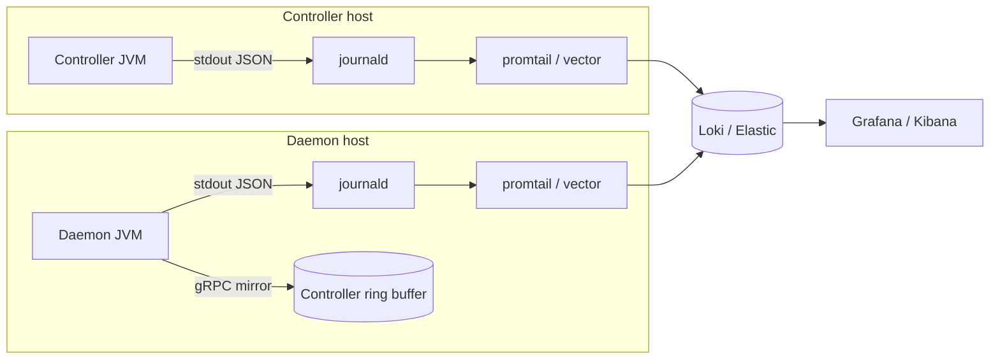

PrexorCloud has two separate records that operators conflate: **process
logs** (what the JVM did, line by line, via SLF4J + Logback) and the
**audit log** (every state-changing API call, persisted to MongoDB).
This page is the field guide for both, plus crash records.

## What you'll learn

- Where Controller, Daemon, Instance, and Module logs go, and how to read them
- The HUMAN and JSON log formats, and the exact JSON shape
- How to correlate a REST request across logs via the MDC `requestId`
- What lands in the Mongo `audit_log` collection, how it's retained, and how to page it

## Process logs

The Controller and the Daemon both log through SLF4J + Logback. There is
no `System.out.println`. `LoggingSetup.configure(LoggingConfig)` resets
the Logback context at startup and attaches a single `ConsoleAppender`
to stdout. There is no rotating file appender — historical retention is
your platform's job (systemd journal under the reference units, the
container log driver under Compose or Kubernetes).

> Anything logged before `LoggingSetup.configure()` runs is discarded;
> the configure call performs a full context reset.

### Configuration

Logging has exactly two keys, under `logging` in `controller.yml` and
`daemon.yml`:

```yaml
# controller.yml or daemon.yml
logging:
  level: INFO    # TRACE | DEBUG | INFO | WARN | ERROR — default INFO
  format: HUMAN  # HUMAN | JSON — default HUMAN
```

| Key | Type | Default | Notes |
|---|---|---|---|
| `logging.level` | string | `INFO` | Root logger level. Unrecognized values fall back to `INFO`. |
| `logging.format` | enum | `HUMAN` | `HUMAN` or `JSON`. Unrecognized values fall back to `HUMAN`. |

These are the only logging keys the config record (`LoggingConfig`)
accepts. There is no `logging.file`, `logging.maxFileSize`,
`logging.maxHistory`, or `logging.loggers` key — earlier docs that
referenced them were wrong.

Four framework loggers are pinned to `WARN` regardless of
`logging.level` to keep their chatter out of the stream: `io.grpc`,
`io.netty`, `io.javalin`, `org.eclipse.jetty`.

### Levels

| Level | What you see |
|---|---|
| `ERROR` | Unexpected failures needing attention. |
| `WARN` | Recoverable issues — crash reports, reconnects, stale data, classloader leaks. |
| `INFO` | Lifecycle events — node connected, instance started, module loaded, lease acquired. |
| `DEBUG` | Operational detail — gRPC payload cases, template hashing, lease renewal. |
| `TRACE` | Very detailed — gRPC frame bodies, Mongo query shapes. |

### HUMAN format

Single line, Logback pattern layout. Easy on `journalctl`, ANSI-colored
on a TTY:

```text
2026-06-07 14:02:11.453 [http-1] INFO  api.groups - create group=lobby parent=null
```

Pattern: `%d{yyyy-MM-dd HH:mm:ss.SSS} [%thread] %-5level %logger{0} - %msg%n`.
`%logger{0}` prints only the final logger segment (`api.groups`, not the
fully qualified class). HUMAN output does **not** inline MDC fields — set
`format: JSON` when you need `requestId` on every line.

### JSON format

One NDJSON object per line, emitted by `JsonLogEncoder`. Pipes cleanly
into Loki, Elastic, or Datadog:

```json
{"timestamp":"2026-06-07T14:02:11.453Z","level":"INFO","logger":"me.prexorjustin.prexorcloud.controller.rest.route.GroupRoutes","thread":"http-1","message":"create group=lobby parent=null","mdc":{"requestId":"abf12d49-...","correlationId":"abf12d49-...","httpMethod":"POST","httpPath":"/api/v1/groups"}}
```

Fields, in order:

| Field | Always present | Source |
|---|---|---|
| `timestamp` | yes | UTC, `yyyy-MM-dd'T'HH:mm:ss.SSS'Z'` |
| `level` | yes | log level |
| `logger` | yes | fully qualified logger name |
| `thread` | yes | thread name |
| `message` | yes | formatted message |
| `mdc` | only when MDC is non-empty | nested object of all MDC keys |
| `exception` | only when a throwable is attached | full stack trace as one string |

MDC fields are nested under `mdc`, not flattened to top level. Map your
log-store field on `mdc.requestId`, not `requestId`.

### Where logs go per component

| Component | Destination | How to read |
|---|---|---|
| Controller | stdout → systemd journal (or container log driver) | `journalctl -u prexorcloud-controller.service` or `prexorctl logs controller` |
| Daemon | stdout on its host **and** mirrored to the Controller over gRPC | `journalctl` on the host, or `prexorctl logs daemon <node-id>` from anywhere |
| Module | the Controller log stream, under logger name `module:<id>` | filter with `--logger module:<id>` |
| Instance (MC) | the server process's own console output, captured by the Daemon | stream it with the console API / dashboard console |

The Daemon attaches a second Logback appender, `DaemonGrpcLogAppender`,
alongside its console appender. It mirrors each daemon log event up to
the Controller, where it lands in a per-node bounded ring buffer. That
is what `prexorctl logs daemon <node-id>` and the dashboard read — no
SSH into the host required. Field lengths are clamped daemon-side before
transmission.

The Controller keeps its own bounded ring buffer of recent records
(`ControllerLogBuffer`) for the live operator view. A Controller restart
clears both ring buffers; the journal or container log driver keeps the
durable history.

### Streaming logs without SSH

```bash
# Last 200 records, then follow the live controller tail.
prexorctl logs controller --follow

# Recent warn-or-higher controller records, no streaming.
prexorctl logs controller --tail 200 --level WARN

# Only records from one logger prefix (e.g. a module).
prexorctl logs controller --logger me.prexorjustin.prexorcloud.controller.scheduler

# Daemon logs over the controller, no SSH into the node.
prexorctl logs daemon node-1 --follow
```

`prexorctl logs` flags (persistent across both subcommands):

| Flag | Default | Meaning |
|---|---|---|
| `--follow` | `false` | Open the live tail view. Filter with `/`, pause with `p`, scroll with `j`/`k`. |
| `--tail <n>` | `200` | Records to print before streaming. |
| `--level <lvl>` | `INFO` | Minimum level: `TRACE`/`DEBUG`/`INFO`/`WARN`/`ERROR`. |
| `--logger <prefix>` | empty | Only records from loggers with this prefix. |
| `--share` | off | Create a shareable read-only snapshot link instead of streaming. Cannot be combined with `--follow`. |

`prexorctl logs --follow` with no subcommand opens the cluster-wide
controller tail.

Both flows are SSE-backed:

| Endpoint | Backs |
|---|---|
| `GET /api/v1/system/logs` | recent controller records |
| `GET /api/v1/system/logs/stream` | live controller tail |
| `GET /api/v1/system/logs/ticket` | short-lived ticket for the SSE stream |
| `POST /api/v1/system/logs/share` | shareable snapshot |
| `GET /api/v1/nodes/{id}/logs` and `.../stream` | daemon records for one node |

All require the `system.logs.view` permission. The `--share` flow also
requires `share.invoke`. By default these permissions belong to the
built-in **ADMIN** role only — OPERATOR and VIEWER do not get them.

### MDC correlation

`RequestIdMiddleware` runs on every REST request and binds four keys
into the SLF4J MDC:

| MDC key | Value |
|---|---|
| `requestId` | a fresh UUID, generated per request |
| `correlationId` | the inbound `X-Correlation-Id` header, sanitized; a fresh UUID if absent or malformed |
| `httpMethod` | the request method |
| `httpPath` | the request path |

Both IDs are echoed back as response headers `X-Request-Id` and
`X-Correlation-Id`, so a client can stitch its own logs to the
Controller's. With `format: JSON`, every log line a request produces
carries the same `mdc.requestId`:

```text
{"timestamp":"...","level":"INFO","logger":"...GroupRoutes","thread":"http-1","message":"create group=lobby","mdc":{"requestId":"abf12d49","httpMethod":"POST","httpPath":"/api/v1/groups"}}
{"timestamp":"...","level":"INFO","logger":"...Scheduler","thread":"scheduler-1","message":"placed lobby-1 on node-1","mdc":{"requestId":"abf12d49"}}
```

The middleware clears these keys after the request via an
`afterMatched` handler. When your own module code hops threads, carry
the IDs across with `CorrelationContext.open(...)` — a try-with-resources
`Scope` that restores the previous MDC on close — so async log lines
stay correlated.

> The `requestId` correlates **log lines**. It is not stored on audit
> records — the audit schema has no `requestId` field (see below). To
> tie an audit entry to its request, match on actor, action, and
> timestamp, or correlate through the logs at request time.

### Forwarding to Loki / Elastic / Datadog

Because logs go to stdout, ship them the way you ship any stdout service:

- **journald exporter.** Under systemd, point journald at Loki/Elastic.
  Tag by `_SYSTEMD_UNIT=prexorcloud-controller.service`.
- **Container log driver.** Under Compose or Kubernetes, the log driver
  ships stdout to your sink. Set `format: JSON` for structured ingest.
- **Sidecar tailer.** Promtail / Filebeat / Vector reading the journal
  or container logs.

Map `mdc.requestId` as your trace field.



## Audit log

The audit log is the durable record of every state-changing API
operation. It lives in the Mongo `audit_log` collection and survives a
Controller restart. It is the source of truth for "who did what and
when."

### Record schema

Each document in `audit_log` has these fields:

| Field | Type | Notes |
|---|---|---|
| `_id` | ObjectId | Mongo primary key. Monotonic by insert time. Used as the keyset cursor. |
| `username` | string | The acting principal. `"system"` when no user is attributed. |
| `action` | string | Dotted verb, e.g. `group.create`, `node.drain` (full list below). |
| `resourceType` | string | The kind of object, e.g. `group`, `node`, `template`. |
| `resourceId` | string | The affected object's id. |
| `details` | string | Free-form JSON payload of the change (`"{}"` when none). |
| `before` | string | JSON snapshot before the change. Present only for diff-audited mutations; absent on create. |
| `after` | string | JSON snapshot after the change. Present only for diff-audited mutations; absent on delete. |
| `ipAddress` | string | The caller's IP. |
| `createdAt` | Date | Insert timestamp. Drives the TTL index. |

`before`/`after` snapshots are written by `auditDiff(...)` so the
dashboard can render a change diff. A create has no `before`; a delete
has no `after`. Snapshot serialization failures fall back to a null
slot — they never block the underlying mutation from being audited.

The REST DTO surfaces a numeric `id` field; it is derived from the
ObjectId's hash, not a sequential counter. Use `_id` (the ObjectId hex)
for cursors, not the numeric `id`.

### What gets audited

A record is written on every successful mutation routed through the REST
API. The exact `action` values present in the code:

| Domain | Actions |
|---|---|
| Groups | `group.create`, `group.update`, `group.delete` |
| Networks | `network.create`, `network.update`, `network.delete` |
| Templates | `template.create`, `template.update`, `template.delete`, `template.import`, `template.export`, `template.rollback`, `template.variables.update`, `template.version.delete`, `template.file.upload`, `template.file.delete`, `template.file.rename`, `template.file.extract` |
| Instances | `instance.stop`, `instance.force-stop`, `instance.delete` |
| Nodes | `node.drain`, `node.undrain`, `node.cordon`, `node.uncordon`, `node.delete`, `node.revoke-cert`, `node.unrevoke-cert` |
| Modules | `platform-module.delete`, `platform-module.frontend.reload`, `platform-module.storage.drop`, `platform-module.classloader.force-cleanup` |
| Catalog | `catalog.add`, `catalog.update`, `catalog.remove`, `catalog.recommend` |
| Users & roles | `user.create`, `user.update`, `user.delete`, `user.minecraft.link`, `user.minecraft.unlink`, `role.create`, `role.update`, `role.delete` |
| Tokens & credentials | `token.create`, `token.revoke`, `workload-credential.revoke`, `workload-credential.revoke-instance` |
| Maintenance | `maintenance.update` |
| Cluster | `cluster.config.patched`, `cluster.config.rolled_back`, `cluster.join_token.issued`, `cluster.join_token.revoked`, `cluster.member.joined`, `cluster.member.ejected`, `cluster.leave`, `cluster.seed.rotated` |

These are the audited actions in the code today. Login/logout events are
not in this set — auth events surface in the process logs, not
`audit_log`.

### Retention and pruning

The `audit_log` collection carries a Mongo **TTL index** on `createdAt`
with a fixed 90-day expiry (index name `audit_ttl`). Mongo's background
TTL monitor deletes expired documents; this is the real retention
mechanism.

`scheduler.auditRetentionDays` (default 90) exists in `SchedulerConfig`,
and a cluster-singleton `audit-pruner` job calls `pruneAuditLog(days)`
once every 24 hours under an `audit-pruner` cluster lease. In the current
Mongo implementation `pruneAuditLog` is a **no-op** that returns `0` —
the TTL index does the actual deletion. Two consequences:

- Setting `scheduler.auditRetentionDays` higher than 90 does **not**
  extend retention; the TTL index is hardcoded to 90 days. To keep audit
  records longer, drop and recreate the `audit_ttl` index with a longer
  `expireAfterSeconds`, or ship records to long-term storage before they
  expire.
- The `audit-pruner` lease is visible at `/api/v1/cluster/leases` even
  though the prune itself is currently inert.

```javascript
// Inspect the TTL index.
db.audit_log.getIndexes()
// To retain for one year instead of 90 days:
db.audit_log.dropIndex("audit_ttl")
db.audit_log.createIndex(
  { createdAt: -1 },
  { expireAfterSeconds: 31536000, name: "audit_ttl" }
)
```

### Reading the audit log

Endpoint: `GET /api/v1/audit`, permission `audit.view`. By default only
the built-in **ADMIN** role holds `audit.view`; OPERATOR and VIEWER do
not. There is no `prexorctl audit` command — read the log through the
dashboard, the REST API, or Mongo directly.

The endpoint has two pagination modes.

**Page mode** (`page`/`pageSize`, with deprecated `offset`/`limit`
aliases) returns a standard paginated envelope and uses `skip(offset)`
internally. `pageSize` is clamped to `1..500`; default page size 100.

```bash
curl -s -H "Authorization: Bearer $TOKEN" \
  "$CONTROLLER_URL/api/v1/audit?page=1&pageSize=50"
```

**Keyset (seek) mode** — pass `cursor` (blank for the newest page) to
opt into flat-cost pagination that never uses `skip()`. The cursor is
the `_id` ObjectId of the boundary entry; each page returns a
`nextCursor` to fetch the next, older page. `nextCursor` is `null` when
no older entries remain. Use this for deep walks and exports — its cost
stays flat instead of growing with the offset.

```bash
# First (newest) page.
curl -s -H "Authorization: Bearer $TOKEN" \
  "$CONTROLLER_URL/api/v1/audit?cursor=&pageSize=200"
```

Seek-mode response shape:

```json
{
  "data": [ /* audit entry DTOs, newest first */ ],
  "pageSize": 200,
  "nextCursor": "66a1f0c2e4b0a1d2c3e4f5a6",
  "total": 18423
}
```

A malformed `cursor` (not a valid ObjectId) returns `400 BAD_CURSOR`.

### Querying Mongo directly

For compliance exports, query the collection. The `_id` is the cursor
and is time-ordered, so sort by `_id` for a stable newest-first walk:

```bash
mongosh "$MONGO_URI" --quiet --eval '
  db.audit_log.find({
    createdAt: { $gt: ISODate("2026-06-01T00:00:00Z") },
    action: { $regex: "^node\\." }
  }).sort({_id: -1}).limit(100).pretty()
'
```

```javascript
// Every node certificate revocation this week.
db.audit_log.find({
  action: "node.revoke-cert",
  createdAt: { $gt: ISODate("2026-06-01T00:00:00Z") }
}).sort({_id: -1});

// All actions by one user in the last 24h.
db.audit_log.find({
  username: "alice",
  createdAt: { $gt: new Date(Date.now() - 86400000) }
}).sort({_id: -1});

// Actions from a specific IP.
db.audit_log.find({ ipAddress: "203.0.113.42" }).sort({_id: -1});

// The most recent group deletion, with its before-snapshot.
db.audit_log.findOne(
  { action: "group.delete" },
  { sort: { _id: -1 } }
);
```

There is a secondary index on `username`, so per-user queries are
indexed. Other field filters are collection scans.

### Audit hygiene

- `audit_log` is **append-only by convention**. There is no
  cryptographic chaining (tamper-evident audit) today. If you suspect
  tampering, treat it as a security incident.
- A Mongo restore brings the audit log back to the snapshot point. Any
  actions taken after the snapshot but before the incident are not in
  the restored log. Document the gap in your on-call channel.

## Crash records

Distinct from logs and audit. The Mongo `crashes` collection records
every unexpected Instance termination with classification, exit code,
and console tail. It has its own 30-day TTL index (`crashes_ttl`). The
dashboard renders them; CLI access:

```bash
prexorctl crash list --since 2026-06-07T00:00:00Z
prexorctl crash info <crash-id>
```

`prexorctl crash list` flags:

| Flag | Meaning |
|---|---|
| `--group <name>` | Filter by group. |
| `--node <id>` | Filter by node. |
| `--since <iso8601>` | Show crashes since an ISO 8601 timestamp (not relative phrases). |

The `CrashLoopDetector` keeps an in-memory sliding window per group.
Cross `crashes.crashLoopThreshold` crashes (default `3`) within
`crashes.crashLoopWindowSeconds` (default `300`) and the group is paused;
`prexorcloud_crash_loops_total` increments. See
[Monitoring](/operations/monitoring/) for the alert.

## Common questions

**"My controller log shows no DEBUG output even though I set
`logging.level=DEBUG`."** An env override on the unit takes precedence
over the YAML. Check the systemd unit's `Environment=` lines for a level
override. Also note `io.grpc`, `io.netty`, `io.javalin`, and Jetty are
pinned to `WARN` regardless of level.

**"My JSON log shipper can't find `requestId`."** MDC fields are nested
under `mdc`. Map `mdc.requestId`, not a top-level `requestId`.

**"I bumped `scheduler.auditRetentionDays` but old entries still vanish
at 90 days."** Retention is governed by the `audit_ttl` index, hardcoded
to 90 days; `pruneAuditLog` is a no-op. Recreate the index with a longer
`expireAfterSeconds` (see [Retention and pruning](#retention-and-pruning)).

**"`prexorctl logs daemon` returns empty."** The node restarted recently
and the Controller-side ring buffer is rebuilding from the daemon's gRPC
mirror. Wait one heartbeat and retry.

**"Audit entries delayed."** Mongo write contention. Check disk on the
Mongo host and confirm the `audit_log` indexes are intact with
`db.audit_log.getIndexes()`.

## Next up

- [Monitoring](/operations/monitoring/) — metric series and alerts
- [Backups and DR](/operations/backups-and-dr/) — what restore preserves about the audit log
- [Production checklist](/operations/production-checklist/) — pre-launch logging hygiene
