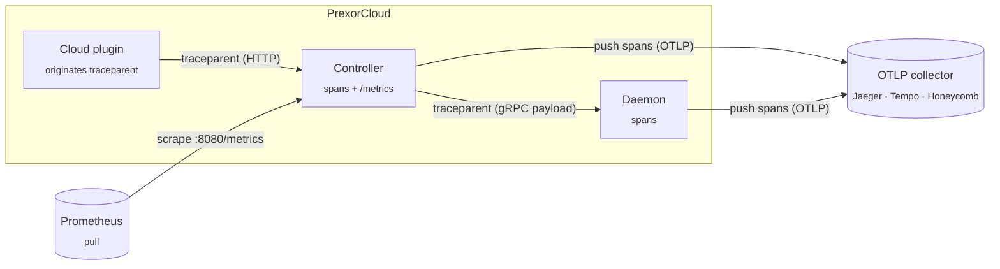

The Controller exposes Prometheus metrics at `GET /metrics`. This page lists every series the Controller emits, with exact names and labels, then gives PromQL recipes and an alert baseline you can copy.

Metrics answer "is the cluster degrading over time?" For "what happened at 03:14?" use [Logs and audit](/operations/logs-and-audit/). For "what is happening right now?" use the SSE event stream under [Architecture](/internals/architecture/).

## What you get and what you don't

You get a Prometheus exposition endpoint, stable metric names and labels, the recipes below, and opt-in OpenTelemetry tracing (off by default — see [Distributed tracing](#distributed-tracing)).

You do not get:

- **A bundled Grafana dashboard pack.** A shipped dashboard rots faster than the code and ties you to one Grafana version and one panel taste. Metric names and labels are stable, so build the panels you need from the reference below. See [Architecture decisions](/internals/architecture/#design-decisions).
- **In-app alert configuration.** Wire the [alert rules](#alert-rules) into Prometheus and route through Alertmanager.
- **A managed tracing backend.** Tracing emits OTLP to a collector you run (Jaeger, Tempo, Honeycomb, Datadog) — PrexorCloud does not store or render spans itself.

## Scrape config

The Controller serves Prometheus exposition (`text/plain; version=0.0.4`) at `GET /metrics` on the HTTP port. The default port is `8080` (`http.port`, host `http.host` default `0.0.0.0`).

```yaml
# prometheus.yml
scrape_configs:
  - job_name: prexorcloud
    metrics_path: /metrics
    scrape_interval: 15s
    static_configs:
      - targets:
          - 'controller-1:8080'
          - 'controller-2:8080'
```

The endpoint has **no authentication**. `/metrics` is exempt from JWT auth and from the subnet guard, so it answers on whatever interface the HTTP server binds. Gate it with a reverse-proxy ACL or firewall if your scrape network is not trusted.

### Enable or disable

Metrics are **on by default**. They are controlled by the `metrics` block in the Controller config:

| Key | Type | Default | Effect |
|---|---|---|---|
| `metrics.enabled` | boolean | `true` | When `false`, the collector is never built and `/metrics` returns `404`. |
| `metrics.retentionHours` | int | `168` | Carried in config; clamped to `168` if `<= 0`. |
| `metrics.collectionIntervalSeconds` | int | `30` | Carried in config; clamped to `30` if `<= 0`. |

When `metrics.enabled` is `false`, no HTTP request timings, daemon message counters, lease counters, or any other series are recorded — the recording hooks check for the collector first.

### Naming and types

The Controller uses Micrometer with the Prometheus registry, so exposition names follow Micrometer conventions, not the dotted meter names in the source:

- Dots become underscores: meter `prexorcloud.nodes.total` exposes as `prexorcloud_nodes_total`.
- **Counters gain a `_total` suffix.** Meter `prexorcloud.http.requests` exposes as `prexorcloud_http_requests_total`.
- **Timers and distribution summaries** expose three series: `<name>_count`, `<name>_sum`, and `<name>_bucket{le="..."}`. Timers publishing percentiles also expose `<name>{quantile="..."}`.
- Gauges expose the bare name with no suffix.

All names below are the **exposition names** — what you query in PromQL.

## Metric reference

### Cluster gauges

Live counts read off cluster state on each scrape.

| Metric | Type | Labels | Meaning |
|---|---|---|---|
| `prexorcloud_nodes_total` | gauge | — | Connected nodes |
| `prexorcloud_instances_total` | gauge | — | Running instances |
| `prexorcloud_players_total` | gauge | — | Online players |
| `prexorcloud_groups_total` | gauge | — | Configured groups |
| `prexorcloud_crashes_total` | gauge | — | Crash records currently in the in-memory buffer |

`prexorcloud_crashes_total` is a **gauge**, not a counter, despite the `_total` name — it reports the size of a bounded crash buffer, so it rises and falls. Do not wrap it in `rate()`.

### Scheduler

One evaluation pass is a "tick". These are recorded on every scheduler pass.

| Metric | Type | Labels | Meaning |
|---|---|---|---|
| `prexorcloud_scheduler_tick_duration_seconds` | timer | — | Duration of one evaluation pass. Publishes p50/p95/p99 plus `_count`/`_sum`/`_bucket`. |
| `prexorcloud_scheduler_tick_failures_total` | counter | — | Passes that threw before completing |
| `prexorcloud_scheduler_groups_evaluated` | summary | — | Groups evaluated per tick (`_count`/`_sum`/`_bucket`) |
| `prexorcloud_scheduler_last_tick_lag_millis` | gauge | — | Milliseconds since the last **successful** tick; `0` before the first tick |

A failed tick does not update the lag gauge, so a stuck-but-not-crashing scheduler still drives `last_tick_lag_millis` up.

### Composition planning

| Metric | Type | Labels | Meaning |
|---|---|---|---|
| `prexorcloud_composition_planning_failures_total` | counter | — | Instance composition planning attempts that failed |

### Coordination and auth

Lease counters come from the distributed (Redis) lease manager. They are only non-zero in an HA deployment with Redis-backed coordination.

| Metric | Type | Labels | Meaning |
|---|---|---|---|
| `prexorcloud_coordination_lease_acquisitions_total` | counter | — | Leases acquired (excludes renewals) |
| `prexorcloud_coordination_lease_renewals_total` | counter | — | Leases renewed by the current holder |
| `prexorcloud_coordination_lease_contentions_total` | counter | — | Acquisitions that lost the race to another Controller |
| `prexorcloud_coordination_jwt_revocations_total` | counter | — | JWT revocation entries written to the coordination store |

### gRPC (Controller to Daemon)

| Metric | Type | Labels | Meaning |
|---|---|---|---|
| `prexorcloud_grpc_daemon_sessions_active` | gauge | — | Active Controller to Daemon gRPC streams |
| `prexorcloud_grpc_daemon_messages_in_total` | counter | `payload_case` | Inbound messages by protobuf payload case |
| `prexorcloud_grpc_daemon_messages_out_total` | counter | `payload_case`, `outcome` | Outbound messages by payload case and delivery |

`outcome` is `delivered` or `dropped`. `payload_case` is the lower-cased protobuf oneof case name (for example `heartbeat`, `start_instance`), so its cardinality is bounded by the protocol.

### HTTP

Recorded per request by the REST after-handler when the collector is enabled.

| Metric | Type | Labels | Meaning |
|---|---|---|---|
| `prexorcloud_http_requests_total` | counter | `method`, `status_class` | Request count |
| `prexorcloud_http_request_duration_seconds` | timer | `method`, `status_class` | Request latency (`_count`/`_sum`/`_bucket`) |

`status_class` buckets the response code into `1xx`, `2xx`, `3xx`, `4xx`, `5xx`, or `unknown`. `method` is lower-cased (`get`, `post`, ...). Status code is bucketed deliberately to keep label cardinality flat.

### SSE event stream

Registered once the SSE streamer exists; gauges read live streamer state.

| Metric | Type | Labels | Meaning |
|---|---|---|---|
| `prexorcloud_sse_clients_connected` | gauge | — | Clients connected to `/api/v1/events/stream` |
| `prexorcloud_sse_replay_buffer_size` | gauge | — | Events currently retained in the replay buffer |

### Durable workflows

Gauges over the durable workflow state store. Non-zero counts here mean work is queued and waiting to reconcile.

| Metric | Type | Labels | Meaning |
|---|---|---|---|
| `prexorcloud_workflows_pending_transfers` | gauge | — | Player transfer intents awaiting acknowledgement |
| `prexorcloud_workflows_node_drains` | gauge | — | Node drain intents awaiting completion |
| `prexorcloud_workflows_healing_actions` | gauge | — | Healing actions awaiting reconciliation |
| `prexorcloud_workflows_start_retries` | gauge | — | Start retry intents awaiting reconciliation |

### Platform modules

| Metric | Type | Labels | Meaning |
|---|---|---|---|
| `prexorcloud_platform_modules_total` | gauge | — | Platform modules known to the Controller |
| `prexorcloud_platform_modules_state` | gauge | `state` | Module count per lifecycle state (one series per state value) |
| `prexorcloud_platform_extensions_total` | gauge | — | Registered workload extensions from non-failed modules |
| `prexorcloud_platform_extension_variants_total` | gauge | — | Registered extension variants from non-failed modules |
| `prexorcloud_module_health` | gauge | `status` | Active modules per self-reported health status (one series per status value) |
| `prexorcloud_module_quota_exceeded_total` | counter | `module`, `resource` | Soft-quota breaches by module and resource (`cpu` / `allocation` / `threads`) |

`prexorcloud_module_quota_exceeded_total` is advisory — the module keeps running after a breach. The `state` and `status` labels are bounded by the lifecycle and health enums.

### Module capabilities

| Metric | Type | Labels | Meaning |
|---|---|---|---|
| `prexorcloud_capabilities_resolutions_total` | counter | — | Capability resolution passes |
| `prexorcloud_capabilities_rebindings_total` | counter | — | Capability rebinding events |
| `prexorcloud_capabilities_unresolved_requirements` | gauge | — | Currently unresolved capability requirements |
| `prexorcloud_capabilities_last_resolution_latency_millis` | gauge | — | Latency of the most recent resolution pass |
| `prexorcloud_capabilities_deprecated_resolutions_total` | counter | — | Resolutions that landed on a deprecated provider |

### Module classloader leaks

These pair with the leaked-classloader endpoint at `GET /api/v1/modules/platform/leaked-classloaders`.

| Metric | Type | Labels | Meaning |
|---|---|---|---|
| `prexorcloud_module_classloader_pending` | gauge | — | Classloaders awaiting collection after unload |
| `prexorcloud_module_classloader_tracked_total` | counter | — | Classloaders tracked since startup |
| `prexorcloud_module_classloader_collected_total` | counter | — | Classloaders observed GC'd after unload |
| `prexorcloud_module_classloader_leaked_total` | counter | — | Leak detections (one per poll a loader survives past the threshold) |

A single leaked loader increments `leaked_total` on every poll it survives, so this counter climbs steadily under a real leak — alert on its rate, not its absolute value.

### Paste-share

Emitted only when the paste-share feature is configured and used.

| Metric | Type | Labels | Meaning |
|---|---|---|---|
| `prexorcloud_share_attempts_total` | counter | `kind`, `outcome` | Share upload attempts; `outcome` is `success` or `error` |
| `prexorcloud_share_upstream_errors_total` | counter | `status` | Upstream errors keyed by HTTP status, or `network` when no response arrived |
| `prexorcloud_share_upload_bytes` | summary | — | Redacted UTF-8 byte size of each upload (`_count`/`_sum`/`_bucket`) |
| `prexorcloud_share_revocations_total` | counter | `outcome` | Revoke attempts; `outcome` is `success`, `error`, or `missing-token` |

### Process and JVM

The Prometheus registry also exposes the standard Micrometer JVM and process meters (`jvm_memory_used_bytes`, `jvm_gc_pause_seconds`, `process_cpu_usage`, and similar). Use these for Controller-process health; they follow upstream Micrometer naming, not the `prexorcloud_` prefix.

## PromQL recipes

Confirm the scrape target is up:

```promql
up{job="prexorcloud"}
```

Scheduler tick p95 in seconds:

```promql
histogram_quantile(0.95, rate(prexorcloud_scheduler_tick_duration_seconds_bucket[5m]))
```

Scheduler failure rate:

```promql
rate(prexorcloud_scheduler_tick_failures_total[5m])
```

HTTP 5xx error ratio:

```promql
sum(rate(prexorcloud_http_requests_total{status_class="5xx"}[5m]))
  / sum(rate(prexorcloud_http_requests_total[5m]))
```

HTTP request p99 latency by method:

```promql
histogram_quantile(0.99,
  sum by (le, method) (rate(prexorcloud_http_request_duration_seconds_bucket[5m])))
```

Lease contention rate (early warning of HA coordination noise):

```promql
rate(prexorcloud_coordination_lease_contentions_total[5m])
```

Dropped Daemon messages by payload case:

```promql
sum by (payload_case) (
  rate(prexorcloud_grpc_daemon_messages_out_total{outcome="dropped"}[5m]))
```

Modules reporting unhealthy:

```promql
prexorcloud_module_health{status!="healthy"}
```

Classloader leak signal:

```promql
rate(prexorcloud_module_classloader_leaked_total[15m])
```

Players per node ratio (cluster fill):

```promql
prexorcloud_players_total / prexorcloud_nodes_total
```

Pending durable work (any queue backing up):

```promql
prexorcloud_workflows_pending_transfers
  + prexorcloud_workflows_node_drains
  + prexorcloud_workflows_healing_actions
  + prexorcloud_workflows_start_retries
```

## Alert rules

This is a baseline. Tune thresholds to your cluster size and SLOs, then route through Alertmanager.

```yaml
groups:
  - name: prexorcloud
    rules:
      - alert: PrexorCloudControllerDown
        expr: up{job="prexorcloud"} == 0
        for: 2m
        labels: { severity: critical }
        annotations:
          summary: "Controller scrape target {{ $labels.instance }} is down"

      - alert: PrexorCloudSchedulerStalled
        expr: prexorcloud_scheduler_last_tick_lag_millis > 30000
        for: 2m
        labels: { severity: warning }
        annotations:
          summary: "Scheduler last successful tick is over 30s old"

      - alert: PrexorCloudSchedulerFailing
        expr: rate(prexorcloud_scheduler_tick_failures_total[5m]) > 0
        for: 5m
        labels: { severity: warning }
        annotations:
          summary: "Scheduler ticks are throwing"

      - alert: PrexorCloudHttp5xx
        expr: |
          sum(rate(prexorcloud_http_requests_total{status_class="5xx"}[5m]))
            / sum(rate(prexorcloud_http_requests_total[5m])) > 0.05
        for: 10m
        labels: { severity: warning }
        annotations:
          summary: "Over 5% of Controller HTTP responses are 5xx"

      - alert: PrexorCloudLeaseContention
        expr: rate(prexorcloud_coordination_lease_contentions_total[5m]) > 1
        for: 10m
        labels: { severity: warning }
        annotations:
          summary: "Sustained lease contention between Controllers"

      - alert: PrexorCloudDaemonDropouts
        expr: rate(prexorcloud_grpc_daemon_messages_out_total{outcome="dropped"}[5m]) > 0
        for: 5m
        labels: { severity: warning }
        annotations:
          summary: "Controller is dropping outbound Daemon messages"

      - alert: PrexorCloudModuleUnhealthy
        expr: sum(prexorcloud_module_health{status!="healthy"}) > 0
        for: 5m
        labels: { severity: warning }
        annotations:
          summary: "One or more platform modules report unhealthy"

      - alert: PrexorCloudClassloaderLeak
        expr: rate(prexorcloud_module_classloader_leaked_total[15m]) > 0
        for: 15m
        labels: { severity: warning }
        annotations:
          summary: "Module classloader leak detected — check /api/v1/modules/platform/leaked-classloaders"

      - alert: PrexorCloudWorkflowBacklog
        expr: |
          prexorcloud_workflows_pending_transfers
            + prexorcloud_workflows_node_drains
            + prexorcloud_workflows_healing_actions
            + prexorcloud_workflows_start_retries > 50
        for: 15m
        labels: { severity: warning }
        annotations:
          summary: "Durable workflow backlog is not draining"
```

## Distributed tracing

Metrics tell you the cluster is degrading; traces tell you *where* one request spent its time. PrexorCloud ships **opt-in OpenTelemetry tracing** — off by default with zero runtime cost until you enable it ([ADR 30](/internals/architecture/#design-decisions)). A trace follows a request across process boundaries: a cloud plugin originates a `traceparent`, the Controller continues it, and it rides the gRPC payload to the Daemon.

Two pipelines, two directions — Prometheus pulls metrics; the Controller and Daemon push spans:



Turn it on in the `telemetry` block — [Configuration → telemetry](/operations/configuration/#telemetry) lists every key. The short version:

```yaml
telemetry:
  enabled: true
  otlpEndpoint: http://localhost:4317           # Jaeger, Tempo, Honeycomb, Datadog
  samplerRatio: 1.0                             # parent-based head sampler, [0,1]
  traceUiTemplate: http://localhost:16686/trace/{traceId}
```

Set the same block on the Daemon (`daemon.yml`) with a matching `samplerRatio`, so a sampled trace stays sampled across the hop. When `traceUiTemplate` is set, the dashboard surfaces a "view trace" deep link on traced responses.

## Verify the endpoint

Confirm the Controller is exporting metrics:

```bash
curl -s http://controller-1:8080/metrics | grep '^prexorcloud_'
```

Expected output (counts vary):

```text
prexorcloud_nodes_total 3.0
prexorcloud_instances_total 12.0
prexorcloud_players_total 87.0
prexorcloud_groups_total 4.0
prexorcloud_scheduler_tick_failures_total 0.0
prexorcloud_http_requests_total{method="get",status_class="2xx"} 1841.0
```

An empty result means either `metrics.enabled=false` or the scrape target is wrong. A `404` confirms metrics are disabled.
