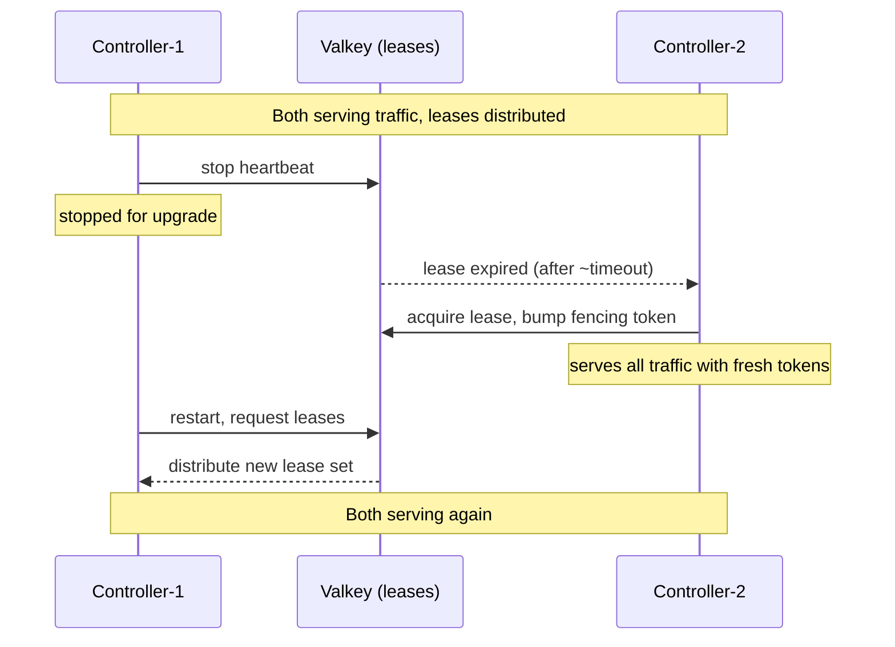

PrexorCloud upgrades are designed around two facts: controllers are
active-active under shared MongoDB + Valkey, and daemons are stateless
re-attachers. Both let you upgrade in place without a maintenance
window, provided you walk the steps in order.

## What you'll learn

- The pre-flight every upgrade owes you, regardless of size
- How to roll a single controller (downtime) versus an HA pair (zero downtime)
- Daemon and module upgrades — drain, replace, rejoin
- The rollback path when an upgrade goes wrong

## Pre-flight (always)

1. **Read the release notes** for every version between current and
   target. Pay attention to:
   - Config schema changes (new required keys, deprecated keys).
   - Mongo schema migrations — the controller logs `migration applied:`
     on startup; some require a manual data backfill (release notes
     call these out).
   - Module SDK or capability changes that might break installed modules.
2. **Verify the current install is healthy:**
   ```bash
   prexorctl status
   curl -fs http://localhost:8080/api/v1/system/ready
   ```
3. **Take a backup.** Always.
   ```bash
   prexorctl backup create --label "pre-upgrade-$(date -u +%Y%m%d)"
   ```
4. **Check module compatibility.**
   ```bash
   prexorctl module list
   ```
   Confirm each is compatible with the target release.
5. **Verify the new release is signed.**
   ```bash
   cosign verify-blob \
     --certificate-identity-regexp "^https://github.com/prexorjustin/prexorcloud/.github/workflows/release.yml@refs/tags/" \
     --certificate-oidc-issuer "https://token.actions.githubusercontent.com" \
     --signature checksums.txt.sig \
     --certificate checksums.txt.pem \
     checksums.txt
   sha256sum -c checksums.txt
   ```

## Single-controller upgrade

This path causes ~10–60s of downtime. Use it only when you're not
running HA.

```bash
# 1. Stop the controller.
sudo systemctl stop prexorcloud-controller

# 2. Replace the binary / package / image.
# A — package manager:
sudo apt-get install --only-upgrade prexorcloud-controller
# B — manual jar swap:
sudo cp prexorcloud-controller-<new-version>.jar /opt/prexorcloud/lib/
# C — Docker Compose:
docker compose pull controller
docker compose up -d controller

# 3. Watch it come back up.
sudo systemctl start prexorcloud-controller
sudo journalctl -u prexorcloud-controller -f
```

Watch for:

- `migration applied:` — normal when restoring an older config or
  bumping schema.
- `migration failed:` — stop, restore the pre-flight backup, open an
  issue. Do not improvise schema fixes.
- `coordination.store=available` — Valkey reachable.
- `state.store=available` — Mongo reachable.

Verify:

```bash
curl -fs http://localhost:8080/api/v1/system/ready
prexorctl status
```

If `/system/ready` does not go green within two minutes:

```bash
sudo journalctl -u prexorcloud-controller --since "5 min ago" | grep -i ERROR
```

Most upgrade failures are config drift (a new required key) or a
Mongo migration that needs manual intervention.

## HA controller upgrade (zero downtime)

Run controllers one at a time. The surviving controller picks up
leases automatically within `nodeTimeoutSeconds` of the stopped one
losing its session.

```bash
# On controller-1:
sudo systemctl stop prexorcloud-controller

# controller-2 acquires leases within ~lease-timeout seconds.
# Verify on controller-2:
curl -fs http://controller-2:8080/api/v1/system/ready
prexorctl status

# Upgrade and restart controller-1.
sudo apt-get install --only-upgrade prexorcloud-controller
sudo systemctl start prexorcloud-controller

# Wait until controller-1 reports ready.
curl -fs http://controller-1:8080/api/v1/system/ready

# Then repeat on controller-2.
```



While controllers run mixed versions, the schema must be
backwards-compatible. PrexorCloud guarantees this **within a single
minor release** (e.g. 0.7.x ↔ 0.7.y) and **during one major hop**
(e.g. 0.7 ↔ 0.8). Skipping majors (0.7 → 0.9) is **not** supported
during a rolling upgrade — stop all controllers, upgrade Mongo
schema, then start them.

### Lease handoff timing

Failover is bounded by `scheduler.nodeTimeoutSeconds` (default 90s for
node sessions) and the lease TTL (typically `scheduler.evaluationIntervalSeconds × 2`).
For controller-restart failover, the surviving controller sees lease
expiry within ~30 seconds of the stopped controller's last heartbeat
and resumes mutations immediately. Existing in-flight operations
under the stopped controller are bounded by fencing — the new lease
holder bumps the fencing token, and the stopped controller cannot
write under the old token if it comes back unaware.

## Daemon upgrade

Daemons are upgraded one at a time. The controller continues to
schedule onto un-upgraded daemons.

```bash
# Drain the node first so running instances finish gracefully.
prexorctl node drain <node-id> --shutdown=false --timeout 5m

# Wait until the node reports zero running instances.
prexorctl node info <node-id>

# Stop, upgrade, start.
sudo systemctl stop prexorcloud-daemon
sudo apt-get install --only-upgrade prexorcloud-daemon
sudo systemctl start prexorcloud-daemon

# Confirm.
prexorctl node list
prexorctl node undrain <node-id>
```

The daemon's existing mTLS certificate carries across upgrades —
nothing to re-issue. If the upgrade changes the gRPC contract enough
that the cert can no longer authenticate (very rare; we treat this as
a major-version event), re-issue per
[Rotate Secrets](https://github.com/prexorjustin/prexorcloud/blob/main/docs/runbooks/rotate-secrets.md).

## Module upgrade

State-preserving hot reload is intentionally not supported. Upgrading
a module triggers a planned controller-side reload for that bundle:

```bash
prexorctl module install ./my-module-2.0.0.bundle
# This creates a new module-package record. Existing instances keep
# the previous version until the group is redeployed.

prexorctl group deploy <group> --module my-module=2.0.0
```

`group deploy` performs a rolling restart of the affected instances.
Watch progress:

```bash
prexorctl group info <group>
prexorctl workflow list --filter "group=<group>"
```

## Dashboard upgrade

The dashboard is a separate Node project. Backward / forward
compatibility is guaranteed across one minor version.

```bash
# Compose:
docker compose pull dashboard
docker compose up -d dashboard

# Bare-metal: ship the new bundle, restart the systemd unit / nginx /
# whatever is serving the static files.
```

## Rollback

If the upgrade fails:

1. Stop the controller(s).
2. Reinstall the previous package version:
   ```bash
   sudo apt-get install prexorcloud-controller=<previous-version>
   ```
3. Restore the backup taken in pre-flight (only required if a Mongo
   schema migration ran during the failed upgrade — release notes will
   say). See [Backups and DR](/operations/backups-and-dr/).
4. Start the controller(s) and verify.

For HA, roll back the upgraded controllers in reverse order before
restoring data.

## Validation checklist

After a successful upgrade, confirm:

- [ ] `/api/v1/system/ready` returns 200 on every controller.
- [ ] `prexorctl status` lists all expected nodes in `READY`.
- [ ] `prexorctl group list` shows expected groups, no
  `desiredVersion != currentVersion` drift.
- [ ] `prexorctl module list` shows each installed module in `ACTIVE`.
- [ ] `prexorctl crash list --since "10 min ago"` is empty (or only
  shows pre-existing entries).
- [ ] No new errors:
  `journalctl -u prexorcloud-controller --since "10 min ago" | grep -i ERROR`.
- [ ] Audit log shows `controller.startup.completed` for the new version.

## Common failures

| Symptom | Likely cause | Fix |
|---|---|---|
| Controller fails to start, log says `unknown config key` | Removed key still present in `controller.yml` | Edit out the key, restart. |
| Controller starts but `coordination.store=unavailable` | New release requires a Valkey/Redis feature | Upgrade Valkey/Redis to documented minimum. |
| Daemons disconnect after upgrade | mTLS client trust changed (very rare) | Re-issue daemon certificates per [Rotate Secrets](https://github.com/prexorjustin/prexorcloud/blob/main/docs/runbooks/rotate-secrets.md). |
| Module install rejected after upgrade | Manifest schema bumped | Re-publish module against the new SDK; existing installs keep running. |
| Audit log spikes "migration applied" | Normal — schema migrations run once on startup | None. Confirm no `migration failed` follows. |
| HA peer can't take leases after one upgrades | Mixed version skipped > 1 major | Stop both, upgrade in lockstep instead of rolling. |

## Why HA rolling works

Two pieces make it safe:

1. **Lease + fencing tokens.** When controller-2 takes a lease that
   controller-1 just lost, the fencing token bumps. controller-1
   cannot mutate under the old token even if it comes back without
   noticing. See [Architecture](/internals/architecture/#ha-model).
2. **Persisted workflows.** In-flight rolling restarts, drains,
   placements, and module mutations live in the
   `workflow_intents` Mongo collection. The new lease holder reads
   the intent and resumes deterministically.

The harness exercises this — `RecoveryTest` runs four mid-failover
scenarios (drain, deployment, placement-time, in-flight module
mutation) and asserts no duplicate side effects.

## Next up

- [Backups and DR](/operations/backups-and-dr/) — pre-flight backup procedure
- [HA Setup](/operations/ha-setup/) — multi-controller install + lease semantics
- [Production Checklist](/operations/production-checklist/) — pre-launch hardening
