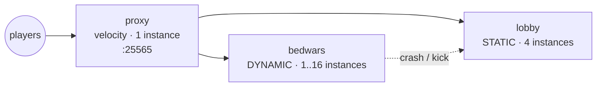

This recipe builds a BedWars network end to end: a Velocity proxy on a
fixed public port, a static lobby group, and a BedWars game group that
scales from a warm minimum up to a ceiling as instances fill. A Network
Composition tells the proxy which group is the lobby and which groups to
try when a backend instance crashes or goes away. Game instances are
spread across nodes with a soft spread constraint so one node failure
takes out a smaller slice of live matches.

Every group field, network field, and command below is taken from the
shipped types: `GroupConfig`
(`java/cloud-controller/.../controller/group/GroupConfig.java`),
`NetworkComposition`
(`java/cloud-api/.../api/domain/NetworkComposition.java`), the
`/api/v1/networks` routes
(`java/cloud-controller/.../controller/rest/route/NetworkRoutes.java`),
and the `prexorctl group`, `instance`, and `deploy` commands under
`cli/cmd/`.

## What you'll build



End state: three groups, one Network Composition named `main`, dynamic
scaling on the game group, and a node-label spread constraint that
prefers placing BedWars instances on under-used nodes.

## How routing actually works

The proxy plugin reads compositions from the controller and routes with
two hooks, both backed by the same fallback chain
(`NetworkRouter.fallbackChain`):

- **Initial join** (`PlayerChooseInitialServerEvent`): the proxy walks
  `[lobbyGroup] ++ fallbackGroups`, deduplicated, and connects the
  player to the first `RUNNING` instance it finds.
- **Crash / kick fallback** (`KickedFromServerEvent`): the proxy walks
  the same chain with the source group removed, and redirects the player
  to the first `RUNNING` instance. If the chain is exhausted, the player
  is disconnected with the network's `kickMessage`.

The composition does not, on its own, send a lobby player into a
BedWars match. Moving a player from the lobby to a game group is the job
of your queue or game plugin — see [Sending players into a
match](#sending-players-into-a-match). The composition is what makes the
lobby the spawn point and what catches players when a game instance
dies.

## Prerequisites

- A PrexorCloud controller and at least two daemon nodes registered and
  `ONLINE`. One node works; the spread constraint is only meaningful
  with two or more.
- Authenticated `prexorctl` (run `prexorctl login` against your
  controller). Group and network operations require the matching
  permissions (`GROUPS_*`, `NETWORKS_*`).
- A BedWars plugin or datapack you maintain. This recipe does not ship
  one; place it in your `bedwars` template's `plugins/` directory.
- A lobby plugin that offers a way to queue (a sign, an NPC, or a
  command) and connects the player to the `bedwars` group through the
  proxy.

## 1. Define the three groups

Group configuration is plain YAML loaded from the controller's groups
directory (`GroupConfigLoader` reads `groups/<name>.yml`). The field
names below are the JSON/YAML property names from `GroupConfig`. You can
write these files directly, or create the groups with `prexorctl group
create` and edit the generated YAML; both end up as `groups/<name>.yml`.

### Proxy group

A proxy group runs a Velocity proxy. Give it a one-wide port range so it
always binds the same public port.

```yaml
# groups/proxy.yml
name: proxy
platform: velocity
platformVersion: "3.4.0"
jarFile: server.jar
templates: [base-velocity, proxy]
scalingMode: STATIC
minInstances: 1
maxInstances: 1
maxPlayers: 1000
memoryMb: 512
portRangeStart: 25565
portRangeEnd: 25565
startupTimeoutSeconds: 120
shutdownGraceSeconds: 30
```

### Lobby group

The lobby is static: a fixed number of instances, never scaled on
player load. `STATIC` groups hold exactly `minInstances`.

```yaml
# groups/lobby.yml
name: lobby
platform: paper
platformVersion: "1.21.4"
jarFile: server.jar
templates: [base-paper, lobby]
scalingMode: STATIC
minInstances: 4
maxInstances: 4
maxPlayers: 200
memoryMb: 1024
portRangeStart: 25600
portRangeEnd: 25699
spreadConstraint: zone
```

### BedWars group

The game group is dynamic. It holds at least `minInstances` warm, scales
toward `maxInstances` as instances fill, and reclaims idle instances
after they sit empty.

```yaml
# groups/bedwars.yml
name: bedwars
platform: paper
platformVersion: "1.21.4"
jarFile: server.jar
templates: [base-paper, bedwars]
scalingMode: DYNAMIC
minInstances: 1
maxInstances: 16
maxPlayers: 16
scaleUpThreshold: 0.7
scaleDownAfterSeconds: 300
scaleCooldownSeconds: 60
memoryMb: 2048
portRangeStart: 25800
portRangeEnd: 25899
dependsOn: [lobby]
spreadConstraint: zone
```

What these scaling fields do, per `ScalingEvaluator`:

- `minInstances` / `maxInstances` — the group is kept at or above
  `minInstances` and never scaled past `maxInstances`.
- `scaleUpThreshold` (a ratio, `0.7` here) — the scheduler adds one
  instance when **every** running instance is at or above
  `playerCount / maxPlayers >= scaleUpThreshold`. With `maxPlayers: 16`
  and `scaleUpThreshold: 0.7`, that trips once all instances hold 12 or
  more players.
- `scaleDownAfterSeconds` — a running instance with zero players that
  has been up longer than this becomes a scale-down candidate, as long
  as the group stays at or above `minInstances`.
- `scaleCooldownSeconds` — minimum gap between scale actions for the
  group.

`scalingMode` is one of `STATIC`, `DYNAMIC`, or `MANUAL`. `MANUAL`
groups are never evaluated; you start and stop their instances yourself.

### Node spread with `spreadConstraint`

`spreadConstraint` is a single node-label key (optionally `key=value`).
The scheduler's `WeightedNodeSelector` adds a soft score (15% of the
node score) that prefers nodes whose label bucket holds fewer existing
instances of this group. It is a preference, not a hard cap: there is no
`maxSkew` and no guarantee of one-per-node.

For it to do anything, your daemons must carry the label. Set it in each
daemon's config:

```yaml
# daemon config on node A
labels:
  zone: a
```

```yaml
# daemon config on node B
labels:
  zone: b
```

With `spreadConstraint: zone`, the scheduler spreads `bedwars`
instances across `zone=a` and `zone=b`, so losing one zone drops a
smaller share of live matches. Nodes with no `zone` label are not
penalised.

For a hard rule, use `nodeAffinity` (the node must carry all listed
labels) or `nodeAntiAffinity` (the node must carry none of them). Both
are lists of `key=value` or bare-`key` constraints. Example: pin the
proxy to edge nodes only.

```yaml
# groups/proxy.yml (excerpt)
nodeAffinity: [role=edge]
```

### Apply the groups

If you wrote the YAML files directly, restart or reload the controller
so it picks them up from the groups directory. To create them through
the CLI instead:

```bash
prexorctl group create \
  --name proxy --platform velocity --platform-version 3.4.0 \
  --scaling-mode STATIC --min 1 --max 1 \
  --memory 512 --port-start 25565 --port-end 25565 \
  --template base-velocity --template proxy

prexorctl group create \
  --name lobby --platform paper --platform-version 1.21.4 \
  --scaling-mode STATIC --min 4 --max 4 \
  --memory 1024 --port-start 25600 --port-end 25699 \
  --template base-paper --template lobby

prexorctl group create \
  --name bedwars --platform paper --platform-version 1.21.4 \
  --scaling-mode DYNAMIC --min 1 --max 16 \
  --memory 2048 --port-start 25800 --port-end 25899 \
  --template base-paper --template bedwars
```

`group create` does not expose `scaleUpThreshold`, `spreadConstraint`,
`dependsOn`, or `maxPlayers`. Set those by editing the generated
`groups/<name>.yml` (then reload the controller) — the YAML carries the
full `GroupConfig` surface, the CLI flags carry a subset.

Confirm the groups exist:

```bash
prexorctl group list
# GROUP    TYPE    STATUS  INSTANCES  PLAYERS  VERSION         UPDATED
# bedwars  GAME    UP      1/16       0        paper-1.21.4    just now
# lobby    STATIC  UP      4/4        0        paper-1.21.4    just now
# proxy    STATIC  UP      1/1        0        velocity-3.4.0  just now
```

## 2. Apply the Network Composition

The composition wires the proxy's routing. Compositions are managed over
REST at `/api/v1/networks`; create one with `POST`. There is no
`prexorctl network` command — use the REST API directly (or the
dashboard).

`NetworkComposition` fields:

| Field | Meaning |
|---|---|
| `name` | Unique identifier, must match `[a-z0-9_][a-z0-9_-]*`. |
| `description` | Free text (may be empty). |
| `lobbyGroup` | Default join target and last-resort fallback. Required. |
| `fallbackGroups` | Ordered chain tried on instance failure (may be empty). |
| `memberGroups` | Backend groups in this network; empty means no restriction. |
| `proxyGroups` | Proxy groups this composition applies to; empty means all proxies. Entries must be proxy-platform groups. |
| `kickMessage` | Shown when every fallback is exhausted (may be empty). |
| `bedrockLobbyGroup` | Join target for Bedrock players; blank means use `lobbyGroup`. |
| `bedrockFallbackGroups` | Bedrock-specific fallback chain; empty means use `fallbackGroups`. |

Every group named in `lobbyGroup`, `fallbackGroups`, `memberGroups`,
and `proxyGroups` must already exist, so apply the composition after the
groups.

Create the composition:

```bash
curl -sS -X POST "$CONTROLLER/api/v1/networks" \
  -H "Authorization: Bearer $TOKEN" \
  -H "Content-Type: application/json" \
  -d '{
    "name": "main",
    "description": "BedWars network",
    "lobbyGroup": "lobby",
    "fallbackGroups": ["lobby"],
    "memberGroups": ["lobby", "bedwars"],
    "proxyGroups": ["proxy"],
    "kickMessage": "Lobby is full, try again in a minute."
  }'
```

A successful create returns `201` with the stored composition. A bad
name or a reference to a group that does not exist returns `400`; a
duplicate name returns `409`.

With this composition:

- Players land in `lobby` on join (`lobbyGroup`).
- A player kicked from a `bedwars` instance (crash, restart, or a full
  match closing) is redirected back to `lobby`, because `lobby` is in
  `fallbackGroups` and the source group is excluded from the chain.
- If no `lobby` instance is `RUNNING`, the player is disconnected with
  the `kickMessage`.

Read it back to confirm:

```bash
curl -sS "$CONTROLLER/api/v1/networks/main" \
  -H "Authorization: Bearer $TOKEN"
```

To change routing later, `PUT /api/v1/networks/main` with the full
composition (the body `name` must match the path). The proxy plugin
polls the controller, so a routing change takes effect without a proxy
restart.

## Sending players into a match

The composition routes join and fallback, but it does not move a lobby
player into BedWars. That transition is driven by your lobby/game
plugin, which connects the player to the `bedwars` group through the
proxy. On Velocity the connection itself is one call:

```java
player.createConnectionRequest(targetServer).fireAndForget();
```

Your plugin resolves a `bedwars` instance to send the player to — for
example by reading the cloud state cache for `RUNNING` `bedwars`
instances with free slots — and connects them. The cloud plugin's
command registry (`AbstractCommandRegistry`) lets a plugin register
proxy commands such as `/play bedwars` to wrap this. Implementing the
queue and the slot-selection policy is up to your game plugin; the
platform ships the routing primitives (state cache, connection API,
command registry), not a BedWars queue.

When a match ends, kick the player from the game instance and the
composition's fallback chain returns them to the lobby — no extra
client logic needed.

## Roll out template changes

When you update the lobby or bedwars template, trigger a rolling
deployment so running instances pick up the new template chain:

```bash
prexorctl deploy lobby --strategy rolling --batch-size 2
```

Useful `deploy` flags (all optional; omitted flags fall back to the
group's update-strategy defaults):

- `--strategy <name>` — rollout strategy, overrides the group default.
- `--batch-size <n>` — instances rolled per batch.
- `--canary-instances <n>` / `--canary-percent <n>` — roll a canary
  first.
- `--health-gate` — require the canary to pass a health gate before
  promoting.
- `--auto-rollback` — roll back automatically on rollout failure.
- `-y`, `--yes` — skip the confirmation prompt.

Track a rollout and its history:

```bash
prexorctl deploy list lobby
prexorctl deploy show lobby 3
```

## How to verify it works

Connect a Java 1.21 client to the proxy's public IP on `:25565`. Then
check each layer from the CLI.

The proxy is one instance on its fixed port:

```bash
prexorctl instance list --group proxy
# ID       GROUP  NODE    STATE    PORT   PLAYERS  UPTIME
# proxy-1  proxy  node-1  RUNNING  25565  0        2m13s
```

Four lobby instances, spread across nodes:

```bash
prexorctl instance list --group lobby
# lobby-1  lobby  node-1  RUNNING  25600  0   2m
# lobby-2  lobby  node-2  RUNNING  25601  0   2m
# lobby-3  lobby  node-1  RUNNING  25602  0   2m
# lobby-4  lobby  node-2  RUNNING  25603  0   2m
```

One warm BedWars instance (the `minInstances: 1` floor):

```bash
prexorctl instance list --group bedwars
# bedwars-1  bedwars  node-2  RUNNING  25800  0  2m
```

Inspect a single instance:

```bash
prexorctl instance info bedwars-1
```

Drive a scale-up: fill the running BedWars instances until every one is
at or above `scaleUpThreshold` of `maxPlayers` (12 of 16 here). The
scheduler adds one instance per evaluation, respecting
`scaleCooldownSeconds`, up to `maxInstances`. Watch the group:

```bash
prexorctl group list --watch
```

Test crash fallback. Force-stop a game instance and reconnect a player
that was on it — the proxy's `KickedFromServerEvent` handler walks the
fallback chain and returns them to a `lobby` instance:

```bash
prexorctl instance stop bedwars-1 --force
```

You can also send a command into an instance to verify console access:

```bash
prexorctl instance exec lobby-1 say hello
```

## Where to go next

- [Concepts → Scheduling](/concepts/scheduling-and-scaling/) — how
  `WeightedNodeSelector` scores nodes and where `spreadConstraint`,
  `nodeAffinity`, and `nodeAntiAffinity` fit.
- [Concepts → Groups, instances, templates](/concepts/groups-instances-templates/) — the
  full `GroupConfig` field list.
- [Reference → REST API](/reference/rest-api/) — the `/api/v1/networks`
  endpoints in full.
- [Guides → Rolling deployments](/guides/rolling-deployments/) — strategies, canaries,
  health gates, and rollback.
