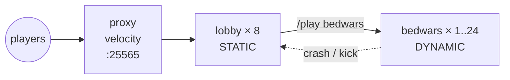

A working BedWars network end-to-end: a Velocity proxy on the public
port, eight lobby instances for queue + cosmetics, and a BedWars game
group that scales from 1 to 24 instances on player demand. Players land
in the lobby, run `/play bedwars`, and the proxy plugin places them
into a free game instance. Crashes and full instances bounce back to
the lobby through the fallback chain.

## What you'll build



End state: three groups, one Network Composition, dynamic scaling on
the game group, anti-affinity spread across nodes, fallback redirects
on crash.

## Prerequisites

- PrexorCloud v1.0+ controller with two or more daemon nodes (for
  meaningful spread). One node works; spread is just less interesting.
- A BedWars plugin or datapack you maintain (this recipe doesn't ship
  one). Drop it into `templates/bedwars/plugins/`.
- About 60 GiB of free RAM across the cluster for the peak case
  (24 × 2 GiB game + 8 × 1 GiB lobby + 1 × 512 MiB proxy ≈ 56.5 GiB).

## 1. Define the three groups

Save as `proxy.yml`, `lobby.yml`, `bedwars.yml`:

```yaml
# proxy.yml
name: proxy
platform: velocity
version: "3.4.0"
scaling: { mode: STATIC, min: 1, max: 1 }
ports: { from: 25565, to: 25565 }
resources: { memoryMB: 512 }
exposeOnHost: true
templates: [base-velocity, proxy]
```

```yaml
# lobby.yml
name: lobby
platform: paper
version: "1.21.4"
scaling: { mode: STATIC, min: 8, max: 8 }
ports: { from: 25600, to: 25699 }
resources: { memoryMB: 1024 }
templates: [base-paper, lobby]
placement:
  spreadConstraint: { topologyKey: nodeId, maxSkew: 1 }
```

```yaml
# bedwars.yml
name: bedwars
platform: paper
version: "1.21.4"
scaling:
  mode: DYNAMIC
  metric: players
  min: 1
  max: 24
  target: 0.7
  scaleUpStep: 4
  scaleDownStep: 1
  scaleDownAt: 0.2
  cooldownSeconds: 60
ports: { from: 25800, to: 25899 }
resources: { memoryMB: 2048 }
templates: [base-paper, bedwars]
dependsOn: [lobby]
placement:
  spreadConstraint: { topologyKey: nodeId, maxSkew: 2 }
  preferLessLoaded: true
```

Apply:

```bash
prexorctl group apply -f proxy.yml -f lobby.yml -f bedwars.yml
prexorctl group list
```

`dependsOn: [lobby]` ensures the topological-sorted scheduler brings
the lobby up before bedwars; `spreadConstraint` keeps replicas spread
across nodes (at most 1 lobby per node, at most 2 bedwars per node).

## 2. Apply the Network Composition

This is what makes the proxy route players. Save as `network.yml`:

```yaml
name: main
proxyGroup: proxy
lobbyGroup: lobby
fallbackGroups: [lobby]
gameGroups: [bedwars]
motd: "<gold>BedWars</gold> <gray>•</gray> <yellow>now playing"
maxPlayers: 1000
kickMessage: "<red>Lobby is full, try again in a minute."
```

```bash
prexorctl network apply -f network.yml
```

The proxy plugin caches this from `/api/proxy/networks` and uses it
both for initial-server routing (`onChooseInitialServer` walks
`[lobbyGroup] ++ fallbackGroups`) and post-kick fallback
(`KickedFromServerEvent` walks the same chain). No proxy restart is
required when the composition changes — the plugin polls the
controller for the current revision.

## 3. Wire `/play bedwars` in the lobby

The bundled cloud-plugin's `/play <group>` command routes a player to
the named group through the proxy. Enable in the lobby template:

```yaml
# templates/lobby/plugins/cloud-plugin/config.yml
commands:
  play:
    enabled: true
    permission: minecraft.command.play
```

Push and roll:

```bash
prexorctl template push templates/lobby/
prexorctl deploy lobby --strategy rolling --batch-size 2
```

The proxy plugin resolves `/play bedwars`, picks the bedwars instance
with the most free slots, and `Connect`s the player.

## 4. Add a peak-hours overlay (optional)

Pre-warm the game group before peak. Add to
`/etc/prexorcloud/controller.yml`:

```yaml
events:
  - id: peak-hours
    cron: "0 19 * * 5,6"
    duration: "PT5H"
    targetGroup: bedwars
    overlay:
      minInstances: 8
      maxInstances: 24
```

Reload the controller config:

```bash
sudo systemctl reload prexorcloud-controller
```

`bedwars` will hold ≥8 warm instances Friday and Saturday evenings
between 19:00 and 24:00 UTC, regardless of utilisation.

## How to verify it works

Connect a Minecraft 1.21 client to the proxy's public IP on `:25565`.
Steps to verify each piece:

```bash
# Proxy is exposed and lobby is reachable behind it
prexorctl instance describe proxy-1
# NODE  node-1  (203.0.113.10)
# PORT  25565

# Eight lobbies, one per node (or as many as available)
prexorctl instance list --group lobby
# lobby-1  node-1  RUNNING
# lobby-2  node-2  RUNNING
# … (8 rows)

# One initial bedwars instance (min=1)
prexorctl instance list --group bedwars
# bedwars-1  node-2  RUNNING  players=0/16
```

In-game, run `/play bedwars`. You should land on `bedwars-1`. Trigger
a scale-up by connecting a few players (or use a load-test client):

```bash
prexorctl events follow --filter scaling
# SCALING_EVALUATED  bedwars  utilisation=0.81 desired=4 actual=1  scaleUp
# INSTANCE_SCHEDULED bedwars-2 node-1
# INSTANCE_SCHEDULED bedwars-3 node-3
# INSTANCE_SCHEDULED bedwars-4 node-2
```

Force-kill a game instance to test fallback:

```bash
prexorctl instance stop bedwars-1 --force --no-graceful
prexorctl player journey <your-uuid> --limit 5
# INSTANCE_CRASHED  bedwars-1  exit=137
# PLAYER_TRANSFER   bedwars-1 -> lobby-3   (fallback)
```

## Where to go next

- [Recipes → Multi-Game Network](/recipes/multi-game-network/) — add
  more game-modes (skywars, survival) to the same proxy.
- [Recipes → Reverse Proxy](/recipes/reverse-proxy/) — front the
  Velocity proxy with nginx + Cloudflare for real-IP forwarding.
- [Guides → Custom Scaling Rules](/guides/custom-scaling-rules/) —
  tune `target`, `scaleUpStep`, and overlays for your own player
  curve.
- [Guides → Crash Recovery](/guides/crash-recovery/) — what happens
  when a game instance crashes mid-match.
