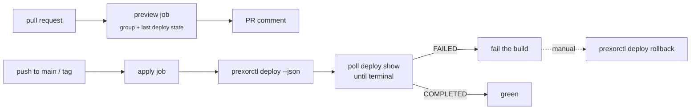

This recipe wires GitHub Actions to `prexorctl deploy` so a merge to `main` (or a
release tag) rolls a group's running instances onto its current template chain.
Pull requests get a read-only preview comment; the apply job triggers the rollout
and fails the build if it does not complete; a manual job rolls a bad revision
back.

Read [Rolling deployments](/guides/rolling-deployments/) first for what each
rollout flag means. This page is the pipeline around that one command.

## What the pipeline does, and what it does not

`prexorctl deploy <group>` propagates the group's **current** template chain and
module composition to the group's running instances. It does not upload files and
it does not create groups. So the pipeline assumes the source of truth for
templates and group config already lives on the controller — set up through the
dashboard, `prexorctl group create` / `prexorctl group update`, or a separate
provisioning step.

Concretely, the CLI has no `template push`, no `group apply -f <dir>`, and no
`network` subcommand. Do not build a pipeline around those — they do not exist.
A controller-side `POST /api/v1/templates/{name}/files/upload` endpoint exists,
but `prexorctl` ships no command that calls it, so template content is not part
of this pipeline.

What the pipeline *does* own:



## Authentication: there are no long-lived API tokens

PrexorCloud authenticates REST calls with a **JWT bearer token**. `prexorctl`
obtains one by logging in with a username and password against
`POST /api/v1/auth/login`; every subsequent request carries
`Authorization: Bearer <jwt>`.

That JWT is short-lived. The default lifetime is **1440 minutes (24 hours)**, set
by `security.jwtExpirationMinutes` in the controller config, and the controller
rejects a configured lifetime above `43200` (30 days). There is no separate
"API key" or "service token" type for the REST API. (`prexorctl token` manages
*node join tokens* — the credential a daemon uses to join the cluster — which is
a different thing and not what CI needs.)

The consequence for CI: do **not** mint a token once and store it. Store a
service-account **username and password** as GitHub secrets, and log in at the
start of each job. The job-scoped JWT then lives only for that run.

Create the service account once, from an operator machine:

```bash
# Interactive: prompts for the password, which is read from stdin.
prexorctl user create --username ci-deployer --role OPERATOR
```

The built-in roles are `ADMIN`, `OPERATOR`, and `VIEWER` (see
`prexorctl role list`). `prexorctl deploy` requires the `groups.update`
permission and reads group state with `groups.view`; the built-in `OPERATOR`
role carries both. If you want a tighter custom role, create one with exactly
those two permissions:

```bash
prexorctl role create --name deployer \
  --permissions groups.view,groups.update
prexorctl user create --username ci-deployer --role deployer
```

Then store three repository secrets:

| Secret | Value |
|---|---|
| `PREXOR_CONTROLLER` | Controller URL, e.g. `https://controller.example.net` |
| `PREXOR_USERNAME` | `ci-deployer` |
| `PREXOR_PASSWORD` | the password you set for that user |

The controller must be reachable from the runner. For a GitHub-hosted runner that
means a public (TLS-terminated) controller endpoint; otherwise use a self-hosted
runner inside your network.

## How prexorctl reads credentials in CI

`prexorctl` resolves the controller URL from `--controller`, then the
`PREXOR_CONTROLLER` environment variable, then the active config context — in
that order. It resolves the auth token from `--token`, then `PREXOR_TOKEN`, then
the context. So two patterns work in CI:

- **Log in and persist a context** (what the jobs below do): set
  `PREXOR_CONTROLLER`, run `prexorctl login`, and the JWT is written to
  `~/.prexorcloud/config.yml` (mode `0600`) for the rest of the job.
- **Pass the JWT as an env var**: if you already hold a JWT, export it as
  `PREXOR_TOKEN` and skip `login`. Every command picks it up.

`prexorctl login` runs an interactive form by default. To keep it non-interactive
on a runner, pipe the answers in. The form asks for username then password (and
controller URL only when it is not already resolvable); with `PREXOR_CONTROLLER`
set, two lines suffice:

```bash
printf '%s\n%s\n' "$PREXOR_USERNAME" "$PREXOR_PASSWORD" | prexorctl login
```

If your runner has no TTY and `huh` refuses to read piped input, call the login
endpoint directly and export the token instead:

```bash
TOKEN=$(curl -fsS -X POST "$PREXOR_CONTROLLER/api/v1/auth/login" \
  -H 'Content-Type: application/json' \
  -d "{\"username\":\"$PREXOR_USERNAME\",\"password\":\"$PREXOR_PASSWORD\"}" \
  | jq -r '.token')
echo "PREXOR_TOKEN=$TOKEN" >> "$GITHUB_ENV"
```

`POST /api/v1/auth/login` returns `200` with `{"token": "...", "user": {...}}`,
`401` on bad credentials, and `429` with a `Retry-After` header when the account
is temporarily locked after repeated failures.

## Install prexorctl on the runner

There is no install action; download the release binary directly. Pin a version
rather than tracking `latest` so a controller upgrade and a CLI upgrade do not
surprise you on the same run.

```yaml
- name: Install prexorctl
  run: |
    VERSION="v1.1.0"
    curl -fsSL "https://github.com/prexorjustin/prexorcloud/releases/download/${VERSION}/prexorctl-linux-amd64" \
      -o /usr/local/bin/prexorctl
    chmod +x /usr/local/bin/prexorctl
    prexorctl version
```

## The preview job (pull requests)

`prexorctl` has no server-side dry-run or plan-diff endpoint for deployments, so
a PR cannot show "what would change" the way a Terraform plan does. What it *can*
do — and what is genuinely useful before a merge — is prove the runner can reach
and authenticate against the controller, and show the group's current state and
last deployment. That catches an unreachable controller, an expired or wrong
credential, and a renamed group before the apply job runs for real.

```yaml
# .github/workflows/preview.yml
name: deploy-preview
on:
  pull_request:

permissions:
  pull-requests: write

env:
  GROUP: lobby
  PREXOR_CONTROLLER: ${{ secrets.PREXOR_CONTROLLER }}
  PREXOR_USERNAME: ${{ secrets.PREXOR_USERNAME }}
  PREXOR_PASSWORD: ${{ secrets.PREXOR_PASSWORD }}

jobs:
  preview:
    runs-on: ubuntu-latest
    steps:
      - name: Install prexorctl
        run: |
          VERSION="v1.1.0"
          curl -fsSL "https://github.com/prexorjustin/prexorcloud/releases/download/${VERSION}/prexorctl-linux-amd64" \
            -o /usr/local/bin/prexorctl
          chmod +x /usr/local/bin/prexorctl

      - name: Log in
        run: printf '%s\n%s\n' "$PREXOR_USERNAME" "$PREXOR_PASSWORD" | prexorctl login

      - name: Collect current state
        run: |
          {
            echo "## Deploy preview for \`$GROUP\`"
            echo
            echo "Controller: \`$PREXOR_CONTROLLER\`"
            echo
            echo '### Group'
            echo '```json'
            prexorctl group info "$GROUP" --json
            echo '```'
            echo
            echo '### Last 5 deployments'
            echo '```json'
            prexorctl deploy list "$GROUP" --page-size 5 --json
            echo '```'
          } > preview.md

      - name: Comment
        uses: marocchino/sticky-pull-request-comment@v2
        with:
          path: preview.md
```

`group info --json` and `deploy list --json` are read-only — they need only
`groups.view`. The JSON shape is the controller's REST response verbatim; the
deployment list is the standard pagination envelope (`data`, `page`, `pageSize`,
`total`).

## The apply job (push to main or tag)

This job triggers the rollout and then waits for it to finish, because
`prexorctl deploy` itself does **not** block — the controller returns `202` and
runs the rolling restart on a background virtual thread. The CLI's default mode
opens a live TUI that polls the deployment, but a TUI is useless in CI. Use
`--json` instead: it triggers the deploy and prints the deployment record (with
its `revision`) without any prompt or TUI, then poll `deploy show` until the
state is terminal.

```yaml
# .github/workflows/apply.yml
name: deploy-apply
on:
  push:
    branches: [main]
    tags: ['v*']

# Never let two apply runs race the same group.
concurrency:
  group: deploy-apply-${{ github.ref }}
  cancel-in-progress: false

env:
  GROUP: lobby
  PREXOR_CONTROLLER: ${{ secrets.PREXOR_CONTROLLER }}
  PREXOR_USERNAME: ${{ secrets.PREXOR_USERNAME }}
  PREXOR_PASSWORD: ${{ secrets.PREXOR_PASSWORD }}

jobs:
  apply:
    runs-on: ubuntu-latest
    timeout-minutes: 30
    steps:
      - name: Install prexorctl + jq
        run: |
          VERSION="v1.1.0"
          curl -fsSL "https://github.com/prexorjustin/prexorcloud/releases/download/${VERSION}/prexorctl-linux-amd64" \
            -o /usr/local/bin/prexorctl
          chmod +x /usr/local/bin/prexorctl
          sudo apt-get update && sudo apt-get install -y jq

      - name: Log in
        run: printf '%s\n%s\n' "$PREXOR_USERNAME" "$PREXOR_PASSWORD" | prexorctl login

      - name: Trigger rollout
        id: deploy
        run: |
          REV=$(prexorctl deploy "$GROUP" \
            --strategy ROLLING \
            --canary-instances 1 \
            --health-gate \
            --min-healthy 30 \
            --auto-rollback \
            --json | jq -r '.revision')
          echo "revision=$REV" >> "$GITHUB_OUTPUT"
          echo "Triggered $GROUP revision r$REV"

      - name: Wait for completion
        env:
          REV: ${{ steps.deploy.outputs.revision }}
        run: |
          for _ in $(seq 1 180); do          # 180 * 10s = 30 min ceiling
            STATE=$(prexorctl deploy show "$GROUP" "$REV" --json | jq -r '.state')
            echo "r$REV state=$STATE"
            case "$STATE" in
              COMPLETED)          exit 0 ;;
              FAILED|ROLLED_BACK) echo "rollout did not succeed: $STATE"; exit 1 ;;
            esac
            sleep 10
          done
          echo "timed out waiting for r$REV"; exit 1
```

### What the deploy flags do

These map one-to-one onto the deployment trigger body the controller validates.
Omit a flag and the group's `updateStrategy` default applies for that field.

| Flag | Body field | Notes |
|---|---|---|
| `--strategy` | `strategy` | e.g. `ROLLING`, `CANARY`; falls back to the group default |
| `--batch-size` | `batchSize` | instances per batch; must be `>= 1` |
| `--canary-instances` | `canaryInstances` | must be `>= 0`; mutually exclusive with `--canary-percent` |
| `--canary-percent` | `canaryPercent` | `0`–`100`; mutually exclusive with `--canary-instances` |
| `--health-gate` | `healthGateEnabled` | require the canary to pass health before promoting |
| `--auto-rollback` | `autoRollbackOnFailure` | controller rolls the revision back on rollout failure |
| `--promotion-timeout` | `promotionTimeoutSeconds` | seconds; must be `>= 1` |
| `--min-healthy` | `minHealthySeconds` | seconds a batch must stay healthy before advancing; `>= 0` |
| `-y`, `--yes` | — | skip the confirmation prompt (irrelevant under `--json`, which never prompts) |

`--min-healthy` is **seconds**, not a percentage. If a value here looks like a
ratio (`60`), it is being read as sixty seconds. Passing an invalid combination —
both canary flags, or a negative timeout — makes the controller reject the
trigger with `400 BAD_REQUEST` and the flag's validation message.

## Rolling back

`prexorctl deploy rollback <group> <rev>` marks the deployment `ROLLED_BACK` in
the controller's deployment history. Be precise about what that does: it is a
**state transition on the deployment record**, not an automatic restore of the
previous template or module state. Restoring the actual content is operator-driven.
The same is true of `pause` and `resume` — `resume` re-runs the rolling restart
from where it left off, `pause` and `rollback` only change recorded state.

So a rollback is a two-part action:

```bash
# 1. Mark the bad revision rolled back (audit + history).
prexorctl deploy rollback lobby 44

# 2. Restore the content. If the regression was a template change, revert it to
#    the previous version, then re-deploy so instances pick it up.
prexorctl template rollback lobby-config   # template -> previous version
prexorctl deploy lobby --strategy ROLLING --health-gate -y
```

`prexorctl template rollback <name>` is the genuine content-restoring verb: it
flips the named template back to its previous version
(`POST /api/v1/templates/{name}/rollback`). After that, a fresh deploy propagates
the reverted chain to the running instances.

If you set `--auto-rollback` on the apply job (as above), a rollout that fails its
health gate is rolled back by the controller before your wait loop ever sees a
terminal `FAILED`/`ROLLED_BACK` — at which point the job fails and you investigate
rather than the pipeline limping forward.

A manual rollback workflow, dispatched by hand against a known-bad revision:

```yaml
# .github/workflows/rollback.yml
name: deploy-rollback
on:
  workflow_dispatch:
    inputs:
      group:    { description: 'Group name',  required: true }
      revision: { description: 'Revision (r#)', required: true }

env:
  PREXOR_CONTROLLER: ${{ secrets.PREXOR_CONTROLLER }}
  PREXOR_USERNAME: ${{ secrets.PREXOR_USERNAME }}
  PREXOR_PASSWORD: ${{ secrets.PREXOR_PASSWORD }}

jobs:
  rollback:
    runs-on: ubuntu-latest
    steps:
      - name: Install prexorctl
        run: |
          VERSION="v1.1.0"
          curl -fsSL "https://github.com/prexorjustin/prexorcloud/releases/download/${VERSION}/prexorctl-linux-amd64" \
            -o /usr/local/bin/prexorctl
          chmod +x /usr/local/bin/prexorctl
      - name: Log in
        run: printf '%s\n%s\n' "$PREXOR_USERNAME" "$PREXOR_PASSWORD" | prexorctl login
      - name: Mark rolled back
        run: prexorctl deploy rollback "${{ inputs.group }}" "${{ inputs.revision }}"
```

## Verify it works

Trigger the apply workflow (or push a change that feeds the group's templates) and
check:

- The apply job logs `Triggered <group> revision r<N>`.
- The wait loop prints a state line every ten seconds and exits `0` on
  `COMPLETED`.
- `prexorctl deploy list <group>` (or the JSON in the PR comment) shows the new
  revision with `trigger=manual` — every API-triggered deploy is recorded as a
  `manual` trigger, distinct from the controller's own automatic rollouts.
- `prexorctl deploy show <group> <rev>` shows the rollout block with the flags you
  passed (`Health Gate`, `Auto-Rollback`, `Min Healthy`, and so on).

To confirm the rollback path, run the rollback workflow against that revision and
check `deploy show` reports `State: ROLLED_BACK`.

## Common pitfalls

| Symptom | Cause |
|---|---|
| Job fails partway with `401` | The JWT expired mid-run. Default lifetime is 24h; long jobs that sit idle past `security.jwtExpirationMinutes` lose auth. Re-`login` (or `POST /api/v1/auth/refresh`) before the deploy step, not just at job start. |
| `prexorctl login` hangs on the runner | The interactive form has no TTY. Pipe answers with `printf '%s\n%s\n'`, or use the `curl` + `PREXOR_TOKEN` path. |
| `429` on login | The account is rate-limited after repeated failures. Honor the `Retry-After` header; check the password secret is current. |
| Deploy "succeeds" instantly but nothing changed | `prexorctl deploy` returns `202` immediately. Without the wait loop the job is green before the rollout runs. Always poll `deploy show`. |
| Two merges roll the same group at once | Add the `concurrency` block; without it, parallel apply runs race the same group. |
| `--min-healthy 60` advances too slowly | It is sixty *seconds* per batch, not a percentage. |
| Rollback "did not restore" the config | `deploy rollback` only sets state. Use `template rollback` then re-deploy to restore content. |
| `template push` / `group apply -f` "not found" | Those commands do not exist. Manage templates and group config through the dashboard or `group create`/`group update`; `deploy` only propagates what is already on the controller. |

## Where to go next

- [Rolling deployments](/guides/rolling-deployments/) — the health-gate and canary
  semantics behind each flag.
- [Production checklist](/operations/production-checklist/) — what to confirm
  before pointing this pipeline at production.
